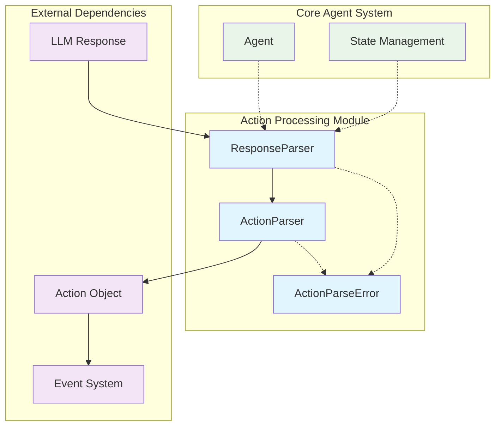
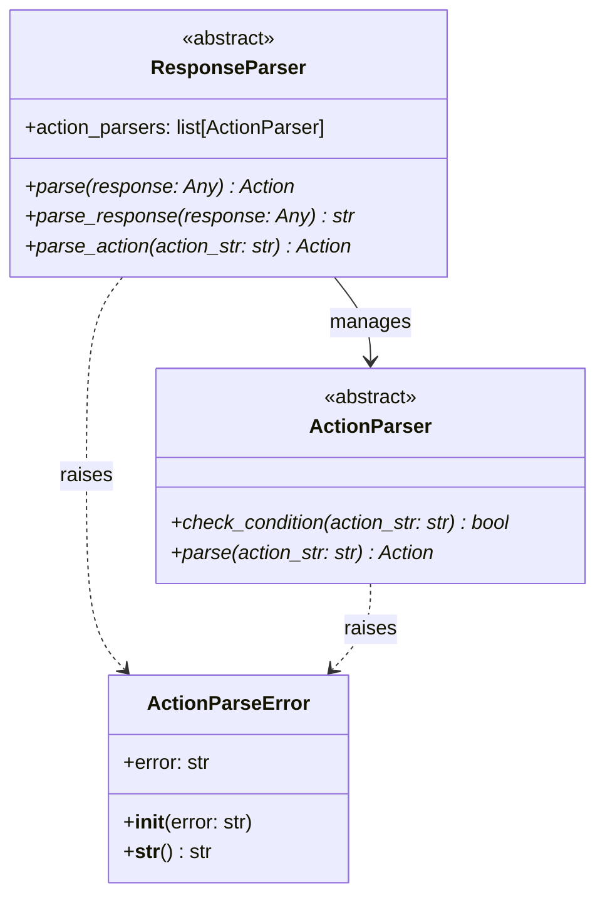
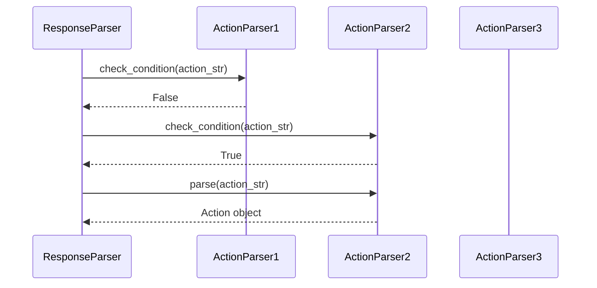
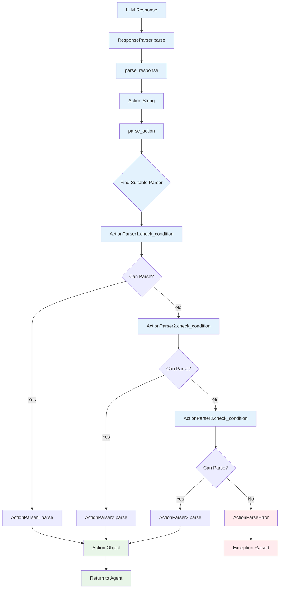
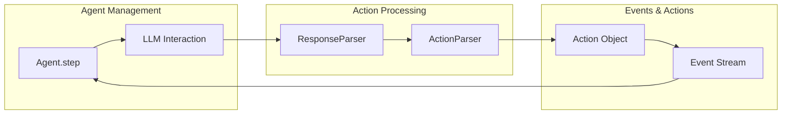
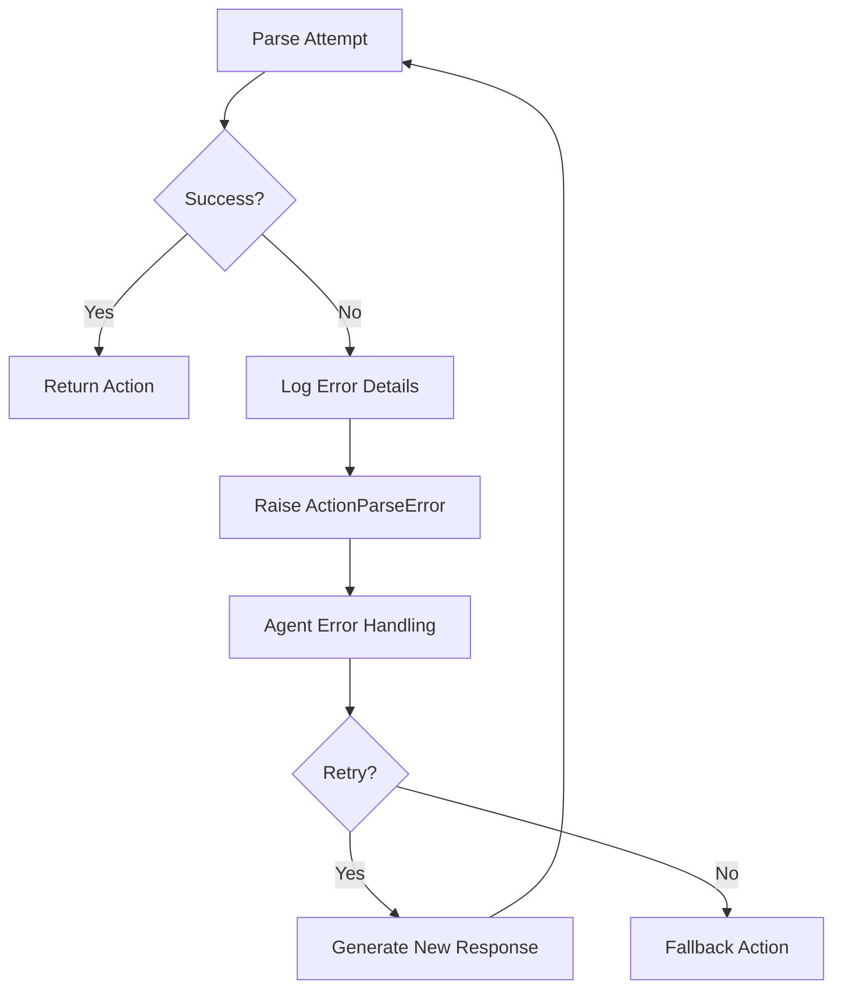

# Action Processing Module

The action_processing module is a critical component of the OpenHands system responsible for parsing and interpreting responses from Large Language Models (LLMs) into executable actions. This module serves as the bridge between raw LLM outputs and structured action objects that can be executed by the system.

## Overview

The action_processing module provides a flexible, extensible framework for converting LLM responses into structured Action objects. It implements a chain-of-responsibility pattern through abstract base classes that allow for multiple parsing strategies and response formats.

### Key Responsibilities

- **Response Parsing**: Convert raw LLM responses into structured action strings
- **Action Parsing**: Transform action strings into executable Action objects
- **Error Handling**: Provide robust error handling for unparseable responses
- **Extensibility**: Support multiple parsing strategies through a plugin-like architecture

## Architecture



## Core Components

### ResponseParser (Abstract Base Class)

The `ResponseParser` is the primary interface for parsing LLM responses into actions. It orchestrates the parsing process by managing a collection of `ActionParser` instances.



#### Key Methods

- **`parse(response: Any) -> Action`**: Main entry point that converts a raw LLM response into an Action object
- **`parse_response(response: Any) -> str`**: Extracts the action string from the raw response
- **`parse_action(action_str: str) -> Action`**: Converts an action string into an Action object using registered parsers

#### Design Pattern

The ResponseParser implements a **Template Method Pattern** where the parsing process is broken down into discrete steps:

1. Parse the raw response to extract action string
2. Iterate through registered ActionParsers to find a suitable parser
3. Use the selected parser to create the Action object

### ActionParser (Abstract Base Class)

The `ActionParser` provides a contract for specific action parsing implementations. Each parser is responsible for handling a specific type or format of action.

#### Key Methods

- **`check_condition(action_str: str) -> bool`**: Determines if this parser can handle the given action string
- **`parse(action_str: str) -> Action`**: Converts the action string into a concrete Action object

#### Chain of Responsibility



### ActionParseError

A specialized exception class for handling parsing failures, providing detailed error information for debugging and logging purposes.

## Data Flow



## Integration with Core System

### Relationship with Agent Management

The action_processing module is tightly integrated with the [agent_management](agent_management.md) module:



### Relationship with Events and Actions

The module produces Action objects that are part of the [events_and_actions](events_and_actions.md) system:

- **Input**: Raw LLM responses (strings, dictionaries, or other formats)
- **Output**: Structured Action objects that inherit from the Event base class
- **Error Handling**: ActionParseError exceptions for unparseable responses

### Relationship with State Management

The parsing process may depend on current system state from [state_management](state_management.md):

- Parsers may need access to current state to determine parsing context
- State information can influence which parser is selected
- Parsed actions may affect subsequent state transitions

## Implementation Patterns

### Extensibility Pattern

The module uses a **Strategy Pattern** combined with **Chain of Responsibility**:

```python
# Example implementation pattern
class ConcreteResponseParser(ResponseParser):
    def __init__(self):
        super().__init__()
        # Register specific parsers in order of priority
        self.action_parsers = [
            HighPriorityActionParser(),
            MediumPriorityActionParser(),
            FallbackActionParser()
        ]
    
    def parse_response(self, response: Any) -> str:
        # Extract action string from response
        pass
    
    def parse_action(self, action_str: str) -> Action:
        for parser in self.action_parsers:
            if parser.check_condition(action_str):
                return parser.parse(action_str)
        raise ActionParseError("No suitable parser found")
```

### Error Handling Pattern



## Configuration and Customization

### Parser Registration

Concrete implementations can customize parsing behavior by:

1. **Parser Selection**: Choosing which ActionParser implementations to include
2. **Parser Ordering**: Arranging parsers by priority or specificity
3. **Custom Parsers**: Implementing domain-specific ActionParser subclasses

### Response Format Support

The abstract design allows support for various LLM response formats:

- **Text-based responses**: Simple string parsing
- **Structured responses**: JSON or XML parsing
- **Multi-modal responses**: Handling images, code blocks, etc.

## Error Handling and Debugging

### Common Error Scenarios

1. **Malformed Responses**: LLM returns unparseable content
2. **Unknown Action Types**: Response contains unrecognized action formats
3. **Missing Parameters**: Action string lacks required parameters
4. **Type Conversion Errors**: Parameter values cannot be converted to expected types

### Debugging Support

The ActionParseError provides detailed error information:

```python
try:
    action = parser.parse(response)
except ActionParseError as e:
    logger.error(f"Failed to parse action: {e.error}")
    # Error contains specific details about parsing failure
```

## Performance Considerations

### Parser Efficiency

- **Early Termination**: Chain of responsibility stops at first successful parser
- **Condition Checking**: Lightweight `check_condition` methods for fast filtering
- **Parser Ordering**: Most common parsers should be registered first

### Memory Management

- **Stateless Parsers**: ActionParser instances should be stateless for reusability
- **Response Caching**: Consider caching parsed responses for repeated use

## Future Extensions

### Potential Enhancements

1. **Parallel Parsing**: Support for concurrent parser evaluation
2. **Machine Learning Integration**: AI-powered parser selection
3. **Dynamic Parser Registration**: Runtime parser addition/removal
4. **Validation Framework**: Built-in action validation before execution
5. **Metrics Collection**: Parsing performance and success rate tracking

### Integration Opportunities

- **Security Integration**: Connect with [security_system](security_system.md) for action validation
- **LLM Integration**: Enhanced integration with [llm_integration](llm_integration.md) for response preprocessing
- **Runtime Integration**: Direct connection with [runtime_system](runtime_system.md) for action execution

## Related Documentation

- [core_agent_system](core_agent_system.md) - Parent system architecture
- [agent_management](agent_management.md) - Agent implementation details
- [events_and_actions](events_and_actions.md) - Action and Event system
- [state_management](state_management.md) - System state handling
- [llm_integration](llm_integration.md) - LLM interaction patterns

---

*This documentation covers the action_processing module as part of the OpenHands system. For implementation details and specific parser examples, refer to the source code and related module documentation.*