# Agent Controller

## Purpose

The `agent_controller` module is the **engine room** of OpenHands. It is the piece that
takes an agent (an LLM-driven decision maker) and actually *runs* it: it feeds the agent
events, asks it for the next action, publishes that action, waits for the result, and
decides when to stop.

Everything else in the system either produces events for the controller or consumes the
events it produces. The controller itself does not talk to an LLM, does not run shell
commands, and does not read files. It only decides **when** the agent may act, **whether**
that action is allowed, and **what** the agent is allowed to remember.

In one sentence: *the agent controller turns a stateless `step(state) -> action` function
into a long-running, resumable, safe, budget-limited conversation.*

### Responsibilities at a glance

| Responsibility | Meaning |
| --- | --- |
| Event loop | Subscribe to the event stream, react to each event, call the agent when it is the agent's turn |
| State machine | Own the `AgentState` transitions (`LOADING` → `RUNNING` → `FINISHED` / `ERROR` / …) |
| Limits | Stop the agent when it runs out of iterations or money |
| Loop safety | Detect a stuck agent that repeats itself forever |
| Confirmation | Hold risky actions until a human (or a policy) approves them |
| Delegation | Spawn a child controller so one agent can hand a subtask to another agent |
| Persistence | Save and restore the whole run so a conversation survives a restart |
| Replay | Re-run a recorded trajectory step by step |
| Error handling | Turn LLM/provider failures into user-readable statuses instead of crashes |

---

## Where it sits in the system

The controller is the middle of a three-way sandwich. Above it is the session/server
layer that creates it; beside it is the agent that decides; below it is the runtime that
executes.

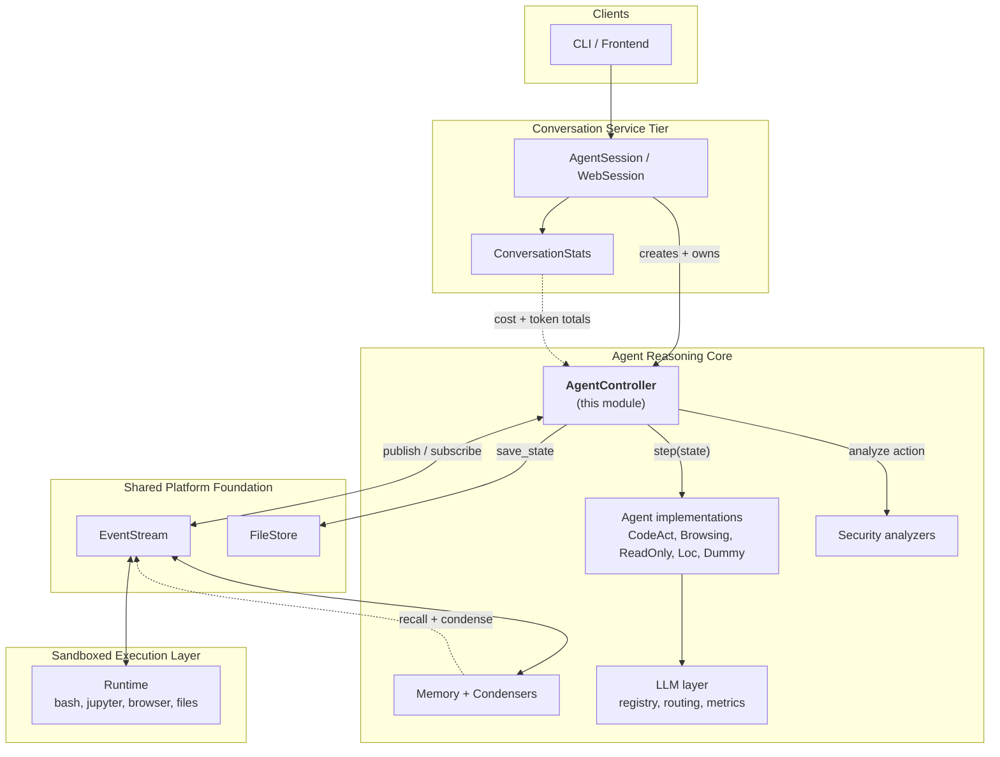

Key point: **the controller and the runtime never call each other directly.** They only
meet through the [event stream](event_system.md). The controller adds an `Action`; the
runtime notices it, executes it, and adds an `Observation`; the controller notices that and
lets the agent take another step.

---

## Architecture of the module

The module is small in file count but dense in behaviour. It splits cleanly into three
concerns: **orchestration**, **state**, and **execution safeguards**.

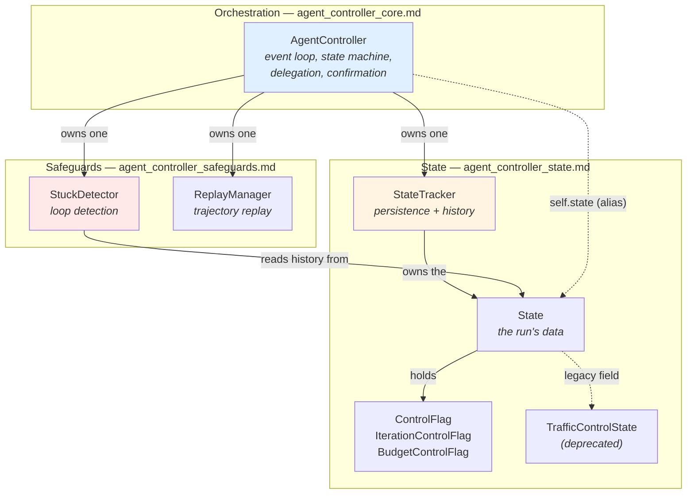

### Component roles

| Component | File | Role |
| --- | --- | --- |
| `AgentController` | `controller/agent_controller.py` | The orchestrator. Subscribes to events, drives the agent step, manages state transitions, delegation, confirmation, and error mapping. |
| `StateTracker` | `controller/state/state_tracker.py` | Owns the `State` object. Rebuilds history from the event stream, saves/loads it, steps the control flags, and syncs budget with real spend. |
| `State` / `TrafficControlState` | `controller/state/state.py` | The serializable record of a run: history, iteration/budget flags, metrics, delegate level, outputs, last error. `TrafficControlState` is a deprecated leftover. |
| `ControlFlag` | `controller/state/control_flags.py` | Generic limit guard. `IterationControlFlag` counts steps; `BudgetControlFlag` watches accumulated cost. Both raise when the ceiling is hit. |
| `StuckDetector` | `controller/stuck.py` | Pattern-matches recent history for five kinds of infinite loop. |
| `ReplayManager` | `controller/replay.py` | Replaces the agent's decision with a pre-recorded action while replaying a trajectory. |

---

## The core loop

This is the single most important flow in the module. Every turn of the agent goes through it.

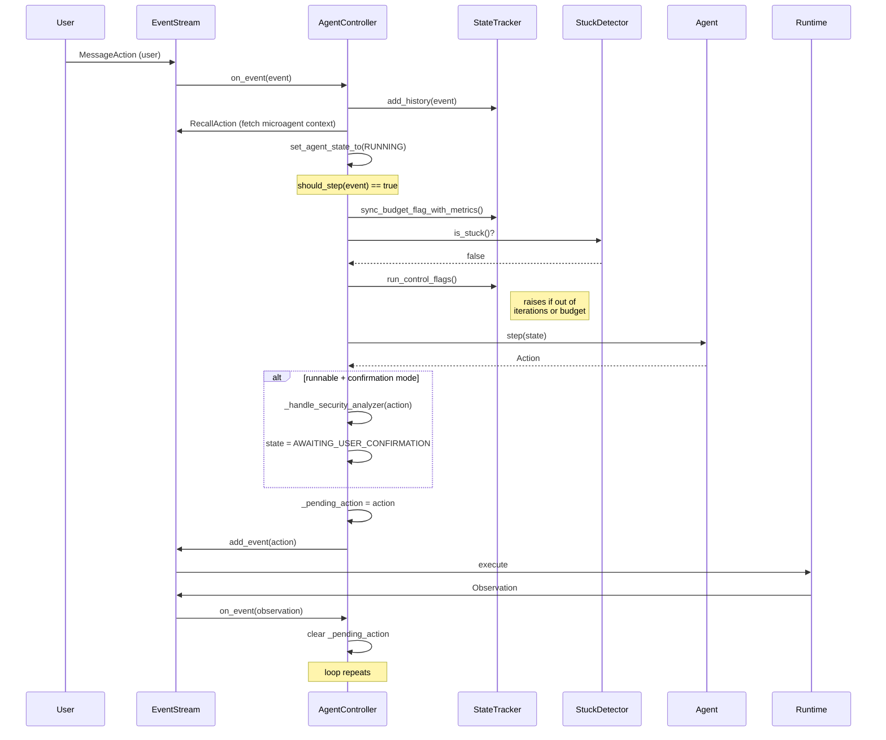

### The three gates before every step

`_step()` refuses to run unless all three gates are open:

1. **State gate** — the agent state must be `RUNNING`.
2. **Pending-action gate** — no action may be in flight (`_pending_action is None`).
   This is what makes the loop turn-based: one action out, one observation back.
3. **Limit gate** — the iteration and budget flags must not be at their ceiling, and the
   stuck detector must say the agent is making progress.

---

## Agent state machine

The controller owns `AgentState` transitions. Every transition emits an
`AgentStateChangedObservation` and triggers a state save, so the UI and the disk are
always in sync with reality.

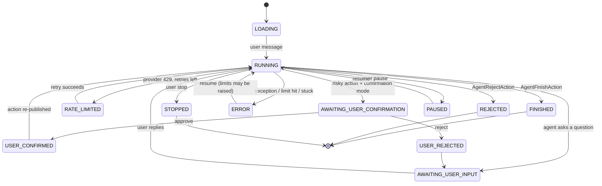

Two transitions deserve attention:

* **`STOPPED` / `ERROR` triggers `_reset()`.** If an action was in flight and it carried
  tool-call metadata, the controller synthesizes an `ErrorObservation` for it. Without
  this, the conversation history would contain a tool call with no result — which most LLM
  APIs reject outright.
* **`ERROR` → `RUNNING` may raise the limits.** In interactive (non-headless) mode,
  resuming from an error calls `maybe_increase_control_flags_limits`, so clicking "resume"
  grants the agent another batch of iterations or budget.

---

## Delegation: controllers inside controllers

OpenHands is multi-agent. When an agent emits an `AgentDelegateAction`, the parent
controller builds a **child controller** with a different agent class, and forwards every
event to it until it finishes.

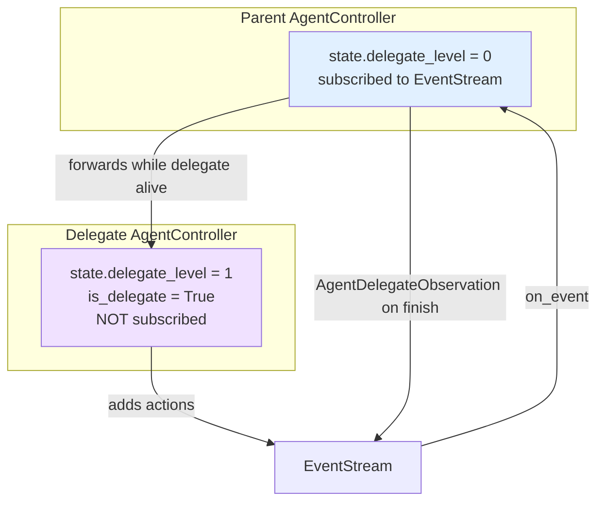

Rules that make this work:

* **Only the root controller subscribes** to the event stream. Delegates get events
  hand-delivered by their parent (`is_delegate=True` skips the subscription). This avoids
  double processing.
* **Shared counters, separate accounting.** The child reuses the parent's
  `iteration_flag`, `budget_flag`, and `Metrics` object, so global limits apply across the
  whole tree. It also stores a `parent_metrics_snapshot` and `parent_iteration`, which let
  `get_local_metrics()` / `get_local_step()` report *only* the delegate's own share.
* **The child starts on top of the stream** (`start_id = latest_event_id + 1`), so it
  never sees the parent's earlier history.
* **On finish the parent emits an `AgentDelegateObservation`** carrying the child's
  outputs, and copies the delegate action's `tool_call_metadata` onto it so the parent's
  LLM sees a proper tool result.

---

## Data flow: what the agent is allowed to see

The controller does not hand the agent the raw event stream. There are three filtering
layers between the stream and the LLM prompt.

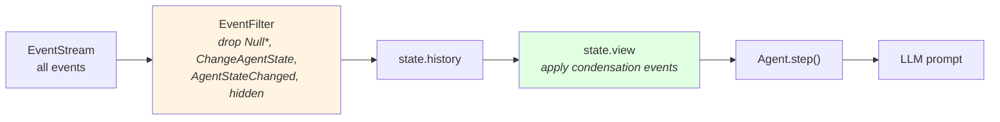

1. **`EventFilter`** (in `StateTracker`) removes bookkeeping noise. Delegate *internals*
   are also collapsed away — only the delegate action and its observation survive, so the
   parent never re-reads its child's work.
2. **`State.view`** applies condensation semantics: events marked forgotten by a
   `CondensationAction` are dropped and a summary is spliced in at the recorded offset.
   The view is cached against a cheap `len(history)` checksum. Condensation strategies
   themselves live in [memory_and_condensers](memory_and_condensers.md).
3. **`truncate_content`** caps individual observation text at
   `llm.config.max_message_chars` for logging.

### Context-window overflow is a feedback loop, not a crash

When the LLM rejects a prompt as too long, the controller does not fail the run. It emits
a `CondensationRequestAction` back into the stream. The condenser reacts, produces a
`CondensationAction`, the view shrinks, and the agent steps again with a smaller prompt.

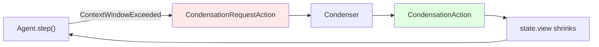

This only happens if `agent.config.enable_history_truncation` is on; otherwise the
controller raises `LLMContextWindowExceedError`. If the loop itself starts spinning, the
`StuckDetector`'s context-window scenario catches it.

---

## Safety layers

Three independent mechanisms keep a run from going wrong in three different ways.

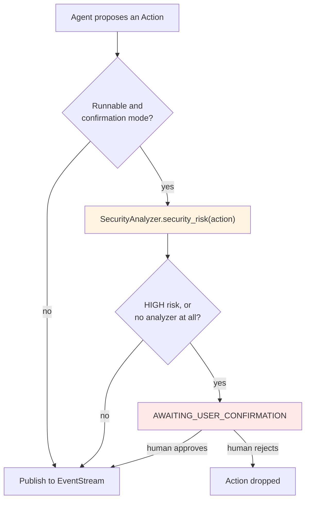

| Layer | Guards against | Failure mode |
| --- | --- | --- |
| `ControlFlag` | Runaway cost and endless iteration | `RuntimeError` → `ERROR` state, resumable with raised limits |
| `StuckDetector` | Semantic loops (same action forever) | `AgentStuckInLoopError` → `ERROR` state |
| Security analyzer + confirmation | Dangerous side effects | Action parked in `AWAITING_USER_CONFIRMATION` |

The confirmation path is deliberately **fail-safe**: with no analyzer configured, every
runnable action is labelled `UNKNOWN` risk, which in confirmation mode means *ask the
human*. Analyzer implementations live in [security_analyzers](security_analyzers.md).

---

## Error handling

`_step_with_exception_handling` wraps every step. Known provider errors are passed through
so `_react_to_exception` can map them to a specific `RuntimeStatus`; unknown ones are
wrapped in a generic, user-friendly `RuntimeError`.

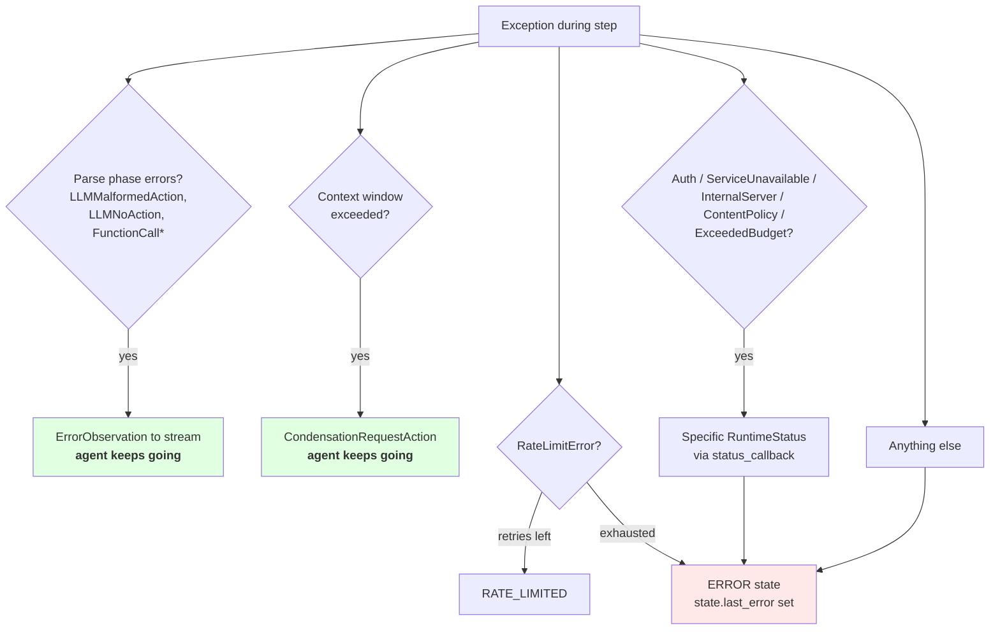

Note the split: **parse errors and context overflow are recoverable** — they go back into
the stream as events and the agent tries again. Everything else ends the run in `ERROR`,
from which the user can resume.

---

## Persistence and resume

A conversation must survive a process restart. The controller saves on **every** state
transition, not just at the end.

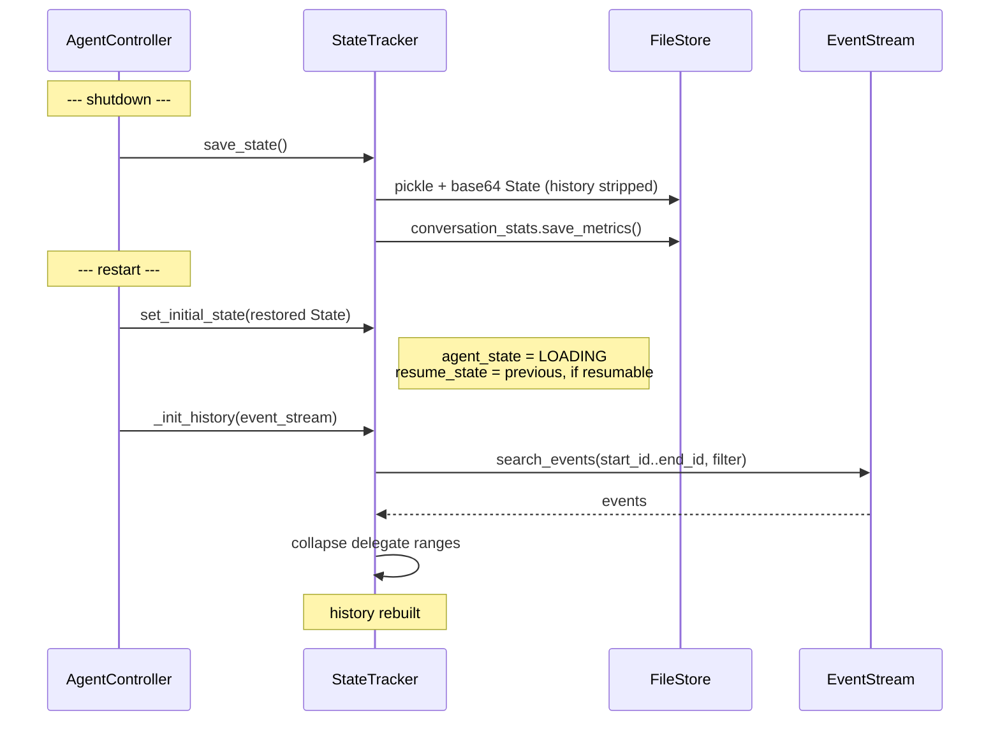

The important design choice: **history is never pickled.** `State.__getstate__` blanks it
out, along with cached views and deprecated fields. The event stream is the single source
of truth, and history is always reconstructed from it. This keeps saved state small and
prevents the two from drifting apart.

---

## Sub-modules

The module's detail is documented in three focused pages.

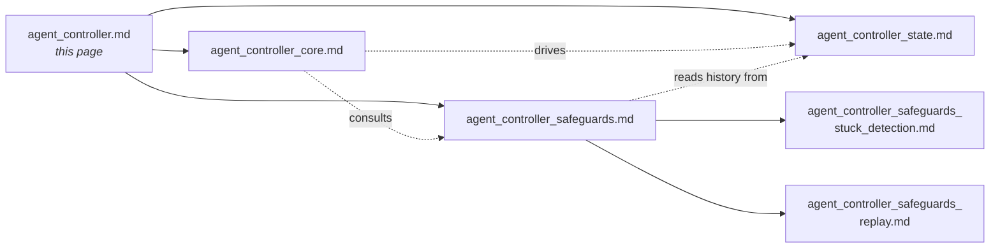

### [agent_controller_core](agent_controller_core.md)

The `AgentController` itself — the event loop, the `AgentState` machine, delegation,
confirmation flow, pending-action tracking, and the error-to-status mapping. Read this
first if you want to know *when* and *why* the agent acts.

*Covers:* `AgentController`

### [agent_controller_state](agent_controller_state.md)

Everything about the run's data: the `State` dataclass, its pickle/base64 session format
and backward-compatibility shims, the `StateTracker` that owns it and rebuilds history
from the event stream, and the `ControlFlag` family that enforces iteration and budget
ceilings.

*Covers:* `StateTracker`, `State`, `TrafficControlState`, `ControlFlag`,
`IterationControlFlag`, `BudgetControlFlag`

### [agent_controller_safeguards](agent_controller_safeguards.md)

The two helpers that watch the agent rather than drive it: `StuckDetector` (five loop
patterns, from identical action/observation pairs to context-window thrash) and
`ReplayManager` (deterministic re-execution of a recorded trajectory).

*Covers:* `StuckDetector`, `ReplayManager`

---

## Related modules

| Module | Relationship |
| --- | --- |
| [agents](agents.md) | Supplies the `Agent` implementations the controller drives, plus the `AgentFinishedCritic`. |
| [event_system](event_system.md) | The `EventStream` the controller subscribes to and publishes on — the only channel between the controller and the runtime. |
| [memory_and_condensers](memory_and_condensers.md) | Answers `RecallAction`s and produces the `CondensationAction`s that shape `State.view`. |
| [llm_layer](llm_layer.md) | The `LLMRegistry` the controller passes to delegate agents, and the `Metrics` objects the budget flag reads. |
| [security_analyzers](security_analyzers.md) | Implements the `SecurityAnalyzer` interface the controller calls before risky actions. |
| [server_sessions](server_sessions.md) | `AgentSession` builds and owns the controller; `ConversationStats` supplies combined cost/token totals. |
| [core_schema_and_runtime_support](core_schema_and_runtime_support.md) | Defines `AgentState`, `ActionType`, `ObservationType`, and `RuntimeStatus`. |
| [storage_backends](storage_backends.md) | The `FileStore` implementations the state is pickled into. |
| [runtime_implementations](runtime_implementations.md) | Executes the actions the controller publishes and returns observations. |
| [core_configuration](core_configuration.md) | `AgentConfig`, `LLMConfig`, and `SecurityConfig` shape controller behaviour. |
