# agent_controller_core

## Introduction

`agent_controller_core` holds a single class: **`AgentController`** (`openhands/controller/agent_controller.py`). It is the engine that drives one conversation in OpenHands.

An agent by itself only knows how to look at a state and return one action (see [agents](agents.md)). It does not know when to run, when to stop, how to talk to the runtime, or what to do when the LLM fails. `AgentController` fills that gap. It is the loop that:

1. Listens to the [event stream](event_system.md) for new events.
2. Decides whether the agent should take a step.
3. Calls `agent.step(state)` and publishes the returned action back to the event stream.
4. Watches the agent for loops, budget overruns, iteration limits, and errors.
5. Runs the agent's state machine (`LOADING → RUNNING → FINISHED`, and so on).
6. Spawns and reaps child controllers when an agent delegates a subtask.

Everything else in the reasoning stack — memory, condensers, LLMs, runtimes — is reached indirectly, through the event stream or through the agent object. That makes the controller the narrow waist of the whole system.

---

## Where it sits in the system

The controller never calls the runtime directly. It writes an `Action` to the event stream; the runtime picks it up, executes it, and writes back an `Observation`. The controller wakes up on that observation and steps again. This is the core OpenHands loop.

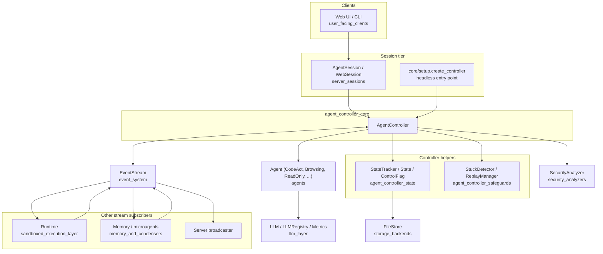

Related module docs:

- [agent_controller](agent_controller.md) — the parent module that groups the controller with its state and safeguards.
- [agent_controller_state](agent_controller_state.md) — `StateTracker`, `State`, `ControlFlag`, `TrafficControlState`.
- [agent_controller_safeguards](agent_controller_safeguards.md) — `StuckDetector`, `ReplayManager`.
- [agents](agents.md) — the `Agent` implementations the controller drives.
- [event_system](event_system.md) — `EventStream`, actions, observations.
- [server_sessions](server_sessions.md) — how a controller is created and torn down for a web conversation.

---

## Construction

`AgentController.__init__` wires up everything the loop needs. Note the important asymmetry: **only a non-delegate controller subscribes to the event stream.** A delegate is fed events by its parent.

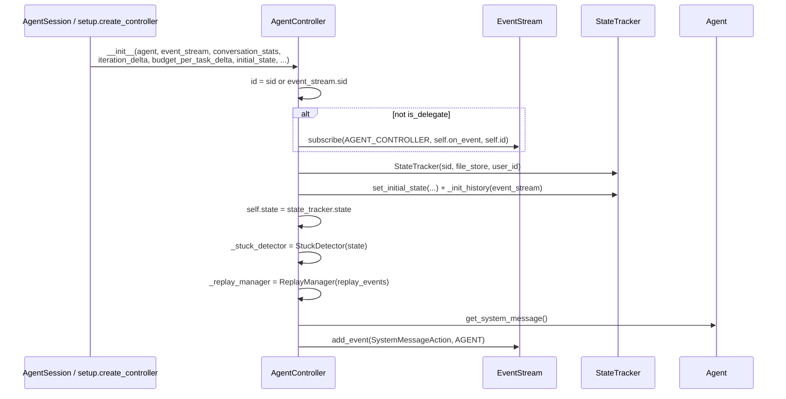

### Key constructor arguments

| Argument | Meaning |
| --- | --- |
| `agent` | The `Agent` instance to drive. Owns the LLM and the prompt manager. |
| `event_stream` | The shared bus. All input and output flows through it. |
| `conversation_stats` | Aggregated metrics across every LLM in the conversation; used for budget checks and frontend display. |
| `iteration_delta` | Max iterations, and also the amount added when the limit is raised. |
| `budget_per_task_delta` | Max USD spend, and the amount added on raise. `None` disables budget control. |
| `initial_state` | Restored session state, a state handed down from a parent, or `None` for fresh. |
| `is_delegate` | `True` means "do not subscribe; my parent forwards events to me". |
| `headless_mode` | `True` = automated run (limits are hard, stuck detection sees full history). `False` = interactive (limits can be raised, stuck detection only looks after the last user message). |
| `confirmation_mode` | Ask the user before running risky actions. |
| `status_callback` | Hook back to the server so errors surface as `RuntimeStatus` in the UI. |
| `replay_events` | A trajectory to replay instead of calling the LLM. |
| `security_analyzer` | Optional risk scorer, see [security_analyzers](security_analyzers.md). |

### The system message

`_add_system_message` scans forward from `state.start_id` and does nothing if it finds either an existing `SystemMessageAction` (already added) or a user `MessageAction` first (an old conversation from before system messages existed). Otherwise it publishes the agent's system message as the first agent event. Delegates do this too, so each delegate's window starts with its own system prompt.

---

## Event handling

### Two entry points

`on_event` is the synchronous callback registered with the event stream. `_on_event` is the async body. The split exists because of delegation: `on_event` first decides *who* should handle the event.

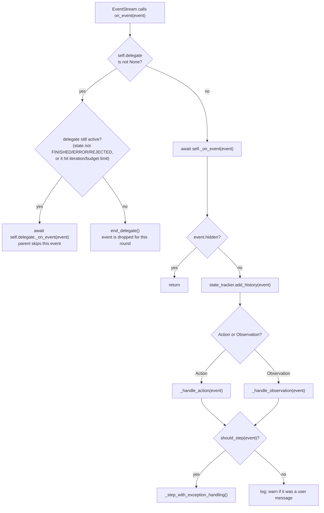

### `should_step` rules

`should_step` is the gate that keeps the loop from spinning. It answers: "did something happen that the agent needs to react to?"

| Event | Steps? |
| --- | --- |
| Any event while a delegate is active | No — the delegate owns the turn. |
| `MessageAction` from the user | Yes. |
| `MessageAction` from anyone else, when state is not `AWAITING_USER_INPUT` | Yes. |
| `AgentDelegateAction` | Yes. |
| `CondensationAction` / `CondensationRequestAction` | Yes — the history changed, retry the step. |
| Any other `Action` | No — actions the agent itself just emitted must not re-trigger it. |
| `NullObservation` with `cause > 0` | Yes — this is the reply to a `RecallAction`. |
| `NullObservation` with `cause == 0`, `AgentStateChangedObservation` | No. |
| Any other `Observation` | Yes — the environment answered. |

### Action and observation handlers

`_handle_action` dispatches on type:

- `ChangeAgentStateAction` → `set_agent_state_to(...)`. This is how the UI pauses, resumes, and stops the agent.
- `MessageAction` → `_handle_message_action`.
- `AgentDelegateAction` → `start_delegate(...)`, then post the subtask as a user message and set the delegate to `RUNNING`.
- `AgentFinishAction` → store `outputs`, go to `FINISHED`.
- `AgentRejectAction` → store `outputs`, go to `REJECTED`.

`_handle_message_action` handles the microagent recall handshake for user messages:

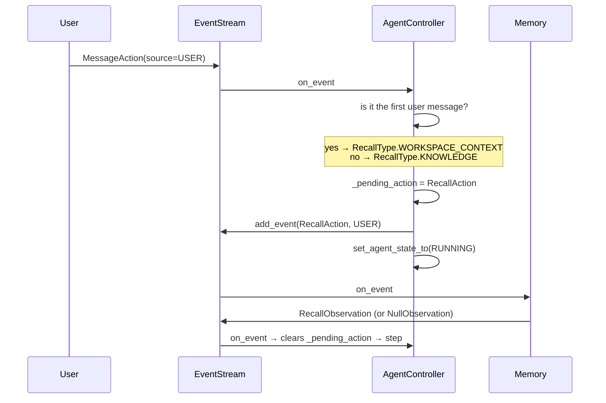

For agent messages, the only side effect is: if `wait_for_response` is set, go to `AWAITING_USER_INPUT`.

`_handle_observation` truncates the content for logging, then clears `_pending_action` when the observation's `cause` matches the pending action's id. It also resolves the confirmation dance: `USER_CONFIRMED → RUNNING`, `USER_REJECTED → AWAITING_USER_INPUT`. While in `AWAITING_USER_CONFIRMATION` it returns early and keeps the pending action.

---

## The step

`_step` is the heart of the module. It is guarded on both ends: preconditions before calling the agent, and post-processing of the returned action.

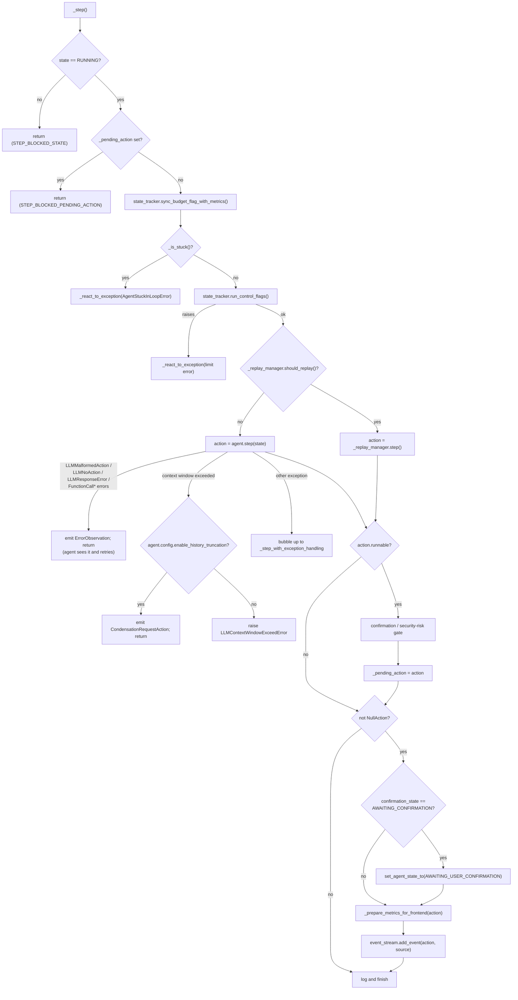

### Context window recovery

Context overflow is detected in two ways: a real `ContextWindowExceededError`, or string matching on `BadRequestError` / `OpenAIError` messages (LiteLLM is not consistent about wrapping). When `enable_history_truncation` is on, the controller does not fail — it emits a `CondensationRequestAction`. A condenser picks that up (see [memory_and_condensers](memory_and_condensers.md)), emits a `CondensationAction`, and `should_step` returns `True` for it, so the agent retries with a shorter view. This is a self-healing loop that goes through the event stream rather than a direct call.

### Confirmation and security risk

Only runnable actions of a specific set of types are gated: `CmdRunAction`, `IPythonRunCellAction`, `BrowseInteractiveAction`, `FileEditAction`, `FileReadAction`.

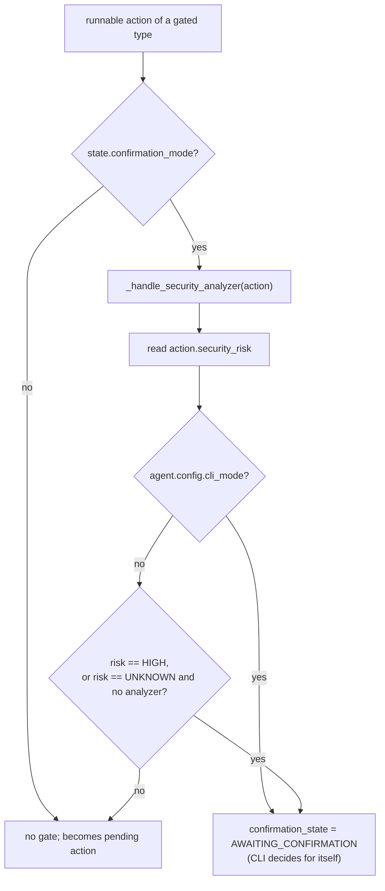

`_handle_security_analyzer` is deliberately fail-safe:

- With an analyzer: overwrite `action.security_risk` with the analyzer's verdict. If the analyzer throws, set `UNKNOWN`.
- Without an analyzer: set `UNKNOWN`, which combined with `confirmation_mode` means "ask about everything".

### The pending action

`_pending_action` is a property backed by `_pending_action_info: tuple[Action, float]`, so every set and clear is timestamped and logged. A pending action means "one action is out for execution; do not step". It is never auto-expired — a stale pending action older than 60 seconds only produces a log line. It is cleared by:

- A matching observation in `_handle_observation`.
- `_reset()` on `STOPPED` or `ERROR`.

---

## Agent state machine

`set_agent_state_to` is the only place the state changes. It is idempotent (no-op if the state is unchanged) and always publishes an `AgentStateChangedObservation` plus saves state.

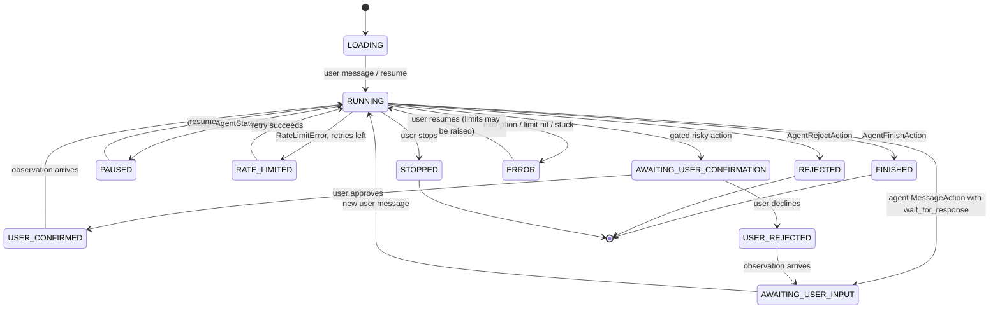

Side effects inside `set_agent_state_to`, in order:

1. Set `state.agent_state` **before** calling `_reset()`, so `_reset` can tell "stopped by user" from "crashed".
2. On `STOPPED` or `ERROR`: `_reset()`.
3. On `ERROR → RUNNING`: `state_tracker.maybe_increase_control_flags_limits(headless_mode)` — this is how "click resume" grants more iterations or budget (interactive only for iterations).
4. On `USER_CONFIRMED` / `USER_REJECTED` with a pending action: blank the action's `thought`, stamp `confirmation_state`, clear its `_id`, and re-publish it so the runtime executes or skips it.
5. Publish `AgentStateChangedObservation` (with `last_error` as the reason for `ERROR`).
6. `save_state()`.

### `_reset` and the tool-call invariant

An LLM tool call must be answered. If the agent is stopped or crashes while an action with `tool_call_metadata` is pending, the history would contain a call with no result — which most providers reject on the next request. `_reset` prevents that by synthesizing an `ErrorObservation` carrying the same `tool_call_metadata` and `_cause`:

| Stop reason | Content | Error id |
| --- | --- | --- |
| `STOPPED` | `ERROR_ACTION_NOT_EXECUTED_STOPPED` — "Stop button pressed…" | `AGENT_ERROR$ERROR_ACTION_NOT_EXECUTED_STOPPED` |
| `ERROR` | `ERROR_ACTION_NOT_EXECUTED_ERROR` — runtime may have crashed and lost state | `AGENT_ERROR$ERROR_ACTION_NOT_EXECUTED_ERROR` |

It skips this if a matching observation already exists. `RecallAction`s need no filler because they carry no tool call. Finally it clears the pending action and calls `agent.reset()`.

---

## Delegation

OpenHands is multi-agent. A `task` is the whole conversation; a `subtask` is one agent's slice of it. `AgentDelegateAction` starts a subtask handled by a child `AgentController`.

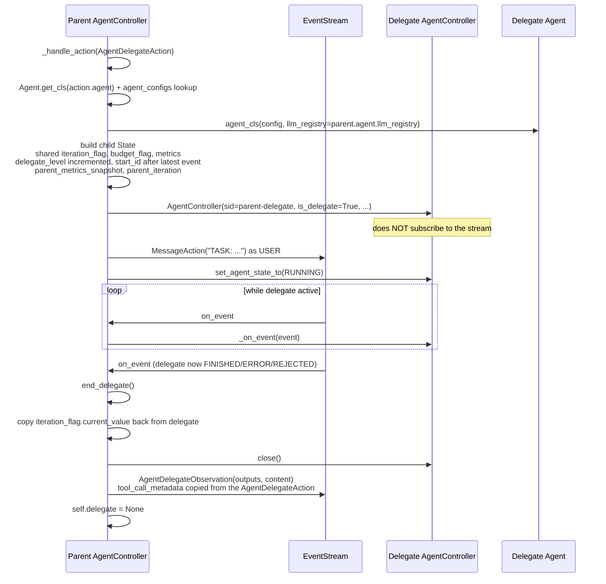

What is shared and what is not:

| Shared with the delegate | Private to the delegate |
| --- | --- |
| `event_stream`, `conversation_stats`, `llm_registry` | Its own `State`, `StateTracker`, and history window (`start_id`) |
| `iteration_flag`, `budget_flag`, `metrics` objects | `parent_metrics_snapshot`, `parent_iteration` for local accounting |
| `agent_configs`, `agent_to_llm_config`, `security_analyzer` | Its own `Agent` instance and system message |

`end_delegate` treats "hit maximum iteration" and "hit maximum budget" delegates as still-active in `on_event`, so those messages keep flowing rather than being swallowed. On a `FINISHED`/`REJECTED` delegate it formats the outputs into a readable summary (dropping the `metrics` key to reduce clutter); on `ERROR` it emits a short error sentence. Either way the observation inherits the original delegate action's `tool_call_metadata` so the parent's LLM sees a proper tool result.

`_is_stuck` recurses into the delegate first, so a looping child stops the whole tree.

---

## Error handling

Two layers. `_step_with_exception_handling` wraps `_step` and decides *what* to report; `_react_to_exception` decides *how* to surface it.

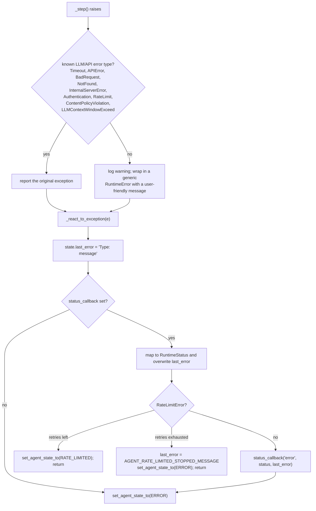

Exception → `RuntimeStatus` mapping:

| Exception | `RuntimeStatus` |
| --- | --- |
| `AuthenticationError` | `ERROR_LLM_AUTHENTICATION` |
| `ServiceUnavailableError`, `APIConnectionError`, `APIError` | `ERROR_LLM_SERVICE_UNAVAILABLE` |
| `InternalServerError` | `ERROR_LLM_INTERNAL_SERVER_ERROR` |
| `BadRequestError` containing `ExceededBudget` | `ERROR_LLM_OUT_OF_CREDITS` |
| `ContentPolicyViolationError` (or `BadRequestError` mentioning it) | `ERROR_LLM_CONTENT_POLICY_VIOLATION` |
| `RateLimitError` | `RATE_LIMITED` state, or `ERROR` when retries are exhausted |
| anything else | `ERROR` |

Not every failure becomes an error state. Malformed-action and function-call errors are turned into an `ErrorObservation` on the stream, which the agent reads on the next step and can recover from. That keeps small LLM mistakes cheap.

---

## Limits, budget, and stuck detection

The controller does not own the counters — it owns the *moment they are checked*, which is once per step, before calling the agent.

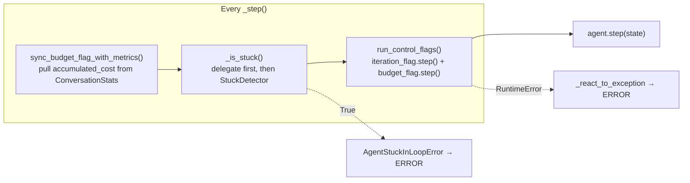

- `IterationControlFlag.step()` raises `RuntimeError('Agent reached maximum iteration…')` and otherwise increments.
- `BudgetControlFlag.step()` only checks; its value comes from the sync above.
- On resume from `ERROR`, `maybe_increase_control_flags_limits` bumps `max_value` by `limit_increase_amount`. For iterations this only happens outside headless mode; for budget it always happens. This is the "click resume to keep going" behaviour, and it is why `TRAFFIC_CONTROL_REMINDER` mentions the resume button (web GUI only).

Details of the flags and the loop-detection heuristics live in [agent_controller_state](agent_controller_state.md) and [agent_controller_safeguards](agent_controller_safeguards.md).

---

## Metrics for the frontend

Attaching the full `Metrics` object to every action would grow the payload without bound on long conversations. `_prepare_metrics_for_frontend` builds a minimal copy instead:

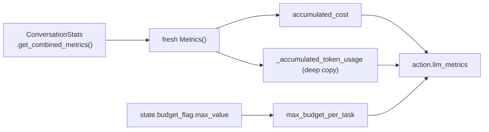

The combined metrics include the agent's LLM *and* the condenser's LLM, so cost shown in the UI covers the whole conversation. See [llm_layer](llm_layer.md) for `Metrics` itself.

---

## Persistence, trajectory, shutdown

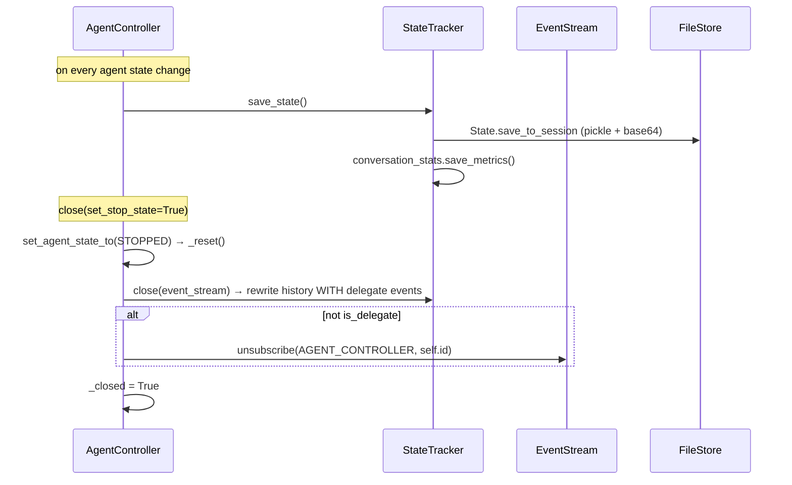

`get_trajectory` asserts `self._closed`. Before close, the in-memory history is the agent's filtered view (delegate internals collapsed); after close, `StateTracker.close` rewrites it to the full event range so evaluation harnesses and tests see everything.

---

## Small but important helpers

| Member | Purpose |
| --- | --- |
| `log(level, message, extra)` | Prefixes `[Agent Controller <id>]` and always attaches `session_id`. Many calls add `msg_type` (`STEP`, `ACTION`, `OBSERVATION`, `METRICS`, `PENDING_ACTION_SET`, …) so logs can be filtered by phase. See [logging](logging.md). |
| `step()` | Fire-and-forget wrapper: `asyncio.create_task(self._step_with_exception_handling())`. |
| `get_agent_state()` / `get_state()` | Read-only accessors for the current state. |
| `set_initial_state(...)` | Delegates to `StateTracker.set_initial_state` and then **always** re-reads history from the event stream, so nothing is lost on restore. |
| `_first_user_message(events=None)` | Finds the first user message from `state.start_id` onward and caches it. Used to pick `WORKSPACE_CONTEXT` vs `KNOWLEDGE` recall. For delegates the `start_id` offset means each delegate has its own "first" message. |
| `_is_awaiting_observation()` | Scans the stream backwards for the newest `AgentStateChangedObservation` and reports whether it said `RUNNING`. |
| `__repr__` | Includes the pending action's type, id, and elapsed time — the first thing to look at when a conversation appears frozen. |

---

## Notes for maintainers

- **Nested event loops.** `on_event` and `end_delegate` use `asyncio.get_event_loop().run_until_complete(...)` from inside a sync callback. Any new blocking work here is risky; prefer to keep async work inside `_on_event` / `_step`.
- **State-then-reset ordering.** `set_agent_state_to` assigns `state.agent_state` before `_reset()` on purpose. Swapping those lines silently changes which "action not executed" message users see.
- **One subscription per tree.** If a delegate ever subscribed to the stream, every event would be handled twice. `is_delegate` guards both `subscribe` and `unsubscribe`.
- **`should_step` is the throttle.** Adding a new action type without deciding its `should_step` answer either stalls the agent or spins it.
- **Shared mutable flags.** Delegates share the parent's `iteration_flag`, `budget_flag`, and `metrics` *objects*. Global limits therefore apply across the whole delegate tree; local views come from `parent_iteration` and `parent_metrics_snapshot`.
- **Pending actions never time out.** The 60-second check is a log line only. A runtime that never replies leaves the controller idle by design, waiting for the observation.
- **Fail-safe security.** "No analyzer" means `UNKNOWN` risk, not "safe". Combined with `confirmation_mode`, that means confirm everything. Keep that direction when editing `_handle_security_analyzer`.

---

## See also

- [agent_controller](agent_controller.md) · [agent_controller_state](agent_controller_state.md) · [agent_controller_safeguards](agent_controller_safeguards.md)
- [agent_reasoning_core](agent_reasoning_core.md) — the whole reasoning stack this module anchors.
- [agents](agents.md) · [llm_layer](llm_layer.md) · [memory_and_condensers](memory_and_condensers.md) · [microagents](microagents.md) · [security_analyzers](security_analyzers.md)
- [event_system](event_system.md) · [core_schema_and_runtime_support](core_schema_and_runtime_support.md) · [storage_backends](storage_backends.md) · [logging](logging.md)
- [server_sessions](server_sessions.md) — web lifecycle · [sandboxed_execution_layer](sandboxed_execution_layer.md) — who executes the actions
