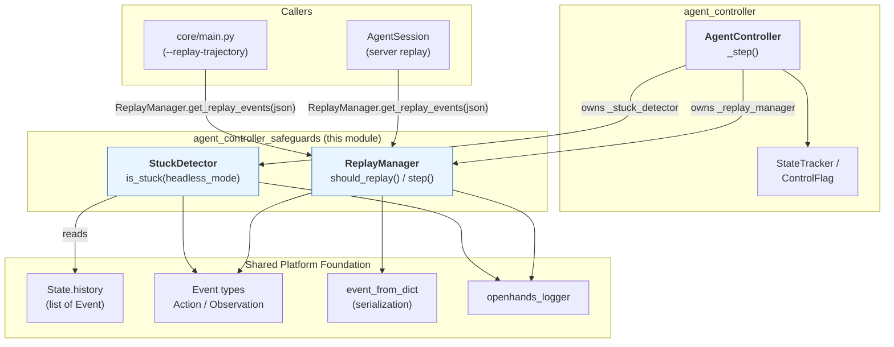
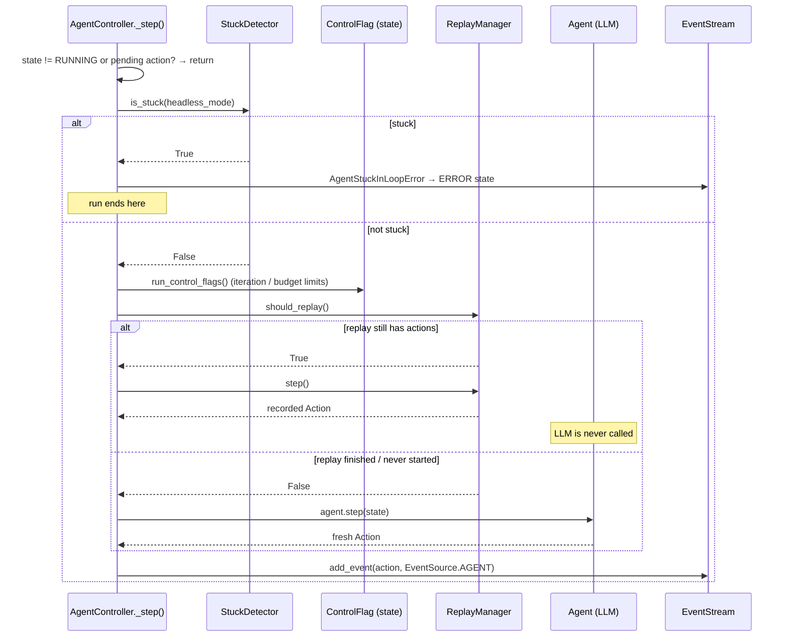
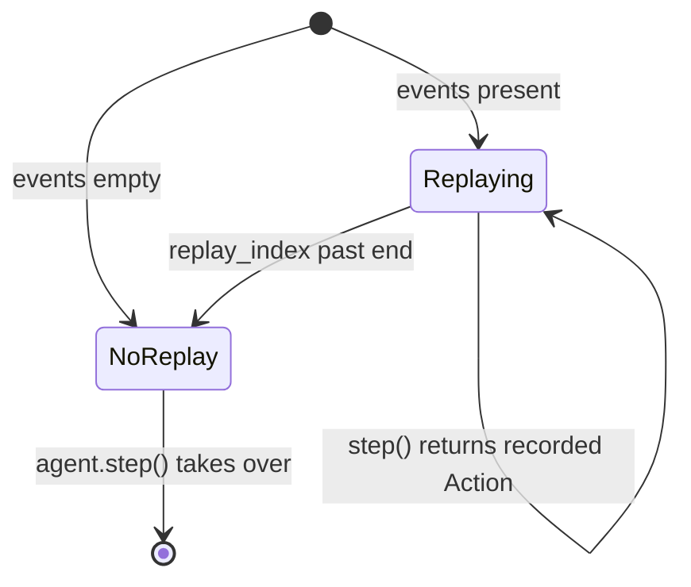

# Agent Controller Safeguards

## Purpose

The `agent_controller_safeguards` module holds the two **guard rails** that sit around the
agent's main step loop:

| Component | File | One-line job |
| --- | --- | --- |
| `StuckDetector` | `openhands/controller/stuck.py` | Look at the recent history and say "this agent is going in circles — stop it" |
| `ReplayManager` | `openhands/controller/replay.py` | Feed a pre-recorded list of actions to the controller instead of asking the LLM |

Both are small, **passive helpers**. They own no event stream, they send no events, they
never talk to an LLM, and they never touch the runtime. The
[`AgentController`](agent_controller_core.md) creates one of each in its constructor and
calls into them on every step. That makes both of them cheap to test and easy to reason
about: give them a history (or a trajectory) and they answer a question.

Why these two live together: they are the two places where the controller **overrides the
agent's own judgement**. The stuck detector overrides it by refusing to let a hopeless run
continue. The replay manager overrides it by substituting a recorded decision for a fresh
one. Everything else in the controller trusts the agent; these two do not.

---

## Where this module sits

Notice the arrow directions. The safeguards **read** from the shared event model
(see [event_system](event_system.md)) but nothing reads from them except the controller.
There is no dependency between `StuckDetector` and `ReplayManager` — they are siblings that
happen to be wired into the same method.

---

## How the controller uses them

Both hooks live inside `AgentController._step()`, in a fixed order. Order matters: the
stuck check runs **before** the replay/agent decision, so a stuck run is stopped even while
a trajectory is being replayed.

Two consequences of this shape worth remembering:

1. **The stuck detector can stop a replay.** If a recorded trajectory itself contains a
   loop, the controller still aborts. Replay is not a bypass for loop safety.
2. **Replay ends silently.** Once `replay_index` walks past the last recorded action,
   `should_replay()` simply returns `False` and the agent takes over mid-conversation. The
   user and the agent can keep going normally — replay is a *prefix*, not a whole session.

Delegation adds one more wrinkle: `AgentController._is_stuck()` first asks its delegate
(`self.delegate._is_stuck()`) before asking its own detector, so a stuck child stops the
whole tree. Each controller in the tree has its own independent `StuckDetector` and
`ReplayManager`.

---

## Sub-modules

This module is documented across three files:

| File | Covers | Core components |
| --- | --- | --- |
| `agent_controller_safeguards.md` (this file) | Overview, architecture, how the controller wires both helpers together | — |
| [agent_controller_safeguards_stuck_detection.md](agent_controller_safeguards_stuck_detection.md) | Loop detection in depth: history scoping, all five scenarios, comparison helpers | `StuckDetector` (`openhands/controller/stuck.py`) |
| [agent_controller_safeguards_replay.md](agent_controller_safeguards_replay.md) | Trajectory loading, filtering rules, cursor stepping, hand-off to the live agent | `ReplayManager` (`openhands/controller/replay.py`) |

### Stuck Detection — [agent_controller_safeguards_stuck_detection.md](agent_controller_safeguards_stuck_detection.md)

`StuckDetector` answers one boolean question — *is this agent repeating itself?* — by
pattern-matching the tail of `State.history`.

It first **scopes** the history. In interactive mode (`headless_mode=False`) it only looks
at events after the last user message, because a new human instruction means the agent has
a fresh problem and old repetition no longer counts. In headless mode it looks at
everything. Then it strips user messages and null events and runs five independent
scenario checks:

| # | Scenario | Window needed | What it catches |
| --- | --- | --- | --- |
| 1 | Same action, same observation | 4 pairs | A perfectly frozen loop |
| 2 | Same action, repeated errors | 3 pairs | Retrying a command that always fails, including Jupyter `SyntaxError` loops |
| 3 | Agent monologue | 3 agent messages | Agent talking to itself with no observation in between |
| 4 | Alternating A-B-A-B pattern | 6 pairs | Two-step ping-pong loops |
| 5 | Condensation loop | 10 events | Context-window errors where trimming never helps |

The sub-module doc covers the comparison helper `_eq_no_pid` (which deliberately ignores
process ids and edit-action thoughts so cosmetically-different-but-really-identical steps
still match) and the two Jupyter syntax-error heuristics.

The condensation scenario is the direct link to
[memory_and_condensers](memory_and_condensers.md): repeated
`AgentCondensationObservation` events with nothing in between mean the condenser pipeline
cannot shrink the context enough, and the run must stop rather than burn budget.

### Trajectory Replay — [agent_controller_safeguards_replay.md](agent_controller_safeguards_replay.md)

`ReplayManager` turns a saved JSON trajectory into a deterministic sequence of actions.

Its lifecycle has two phases. **Loading** happens once, either through the static
`get_replay_events(trajectory)` (raw JSON dicts → `Event` objects, dropping
`EventSource.ENVIRONMENT` events and clearing `_id` so events can be re-added to a fresh
stream) or in the constructor (dropping environment events and `NullObservation`, and
forcing `wait_for_response=False` on every non-final message action so replay never blocks
on a human). **Stepping** happens per controller step: `should_replay()` skips forward over
non-action events and reports whether an action is available, then `step()` returns it and
advances the cursor.

The doc also records the manager's own caveat: replay is only faithful if every action is
deterministic and the starting state matches the recording. Non-deterministic tools or a
different workspace will silently drift.

---

## Design notes

**Why history-pattern matching instead of an LLM judge?** The stuck detector must be
cheap and must work when the LLM is exactly the thing failing (context-window loops,
malformed output loops). A pure-Python check over the last handful of events costs nothing
and cannot itself get stuck. The trade-off is accepted false negatives: the thresholds
(3, 4, 6, 10) are tuned to be conservative, so a real loop is caught within a few steps
while legitimate repetition — running the same test twice, editing two similar files — is
left alone.

**Why is replay a controller concern at all?** Because the controller is the only place
that decides where an action comes from. By intercepting at `_step()`, replay gets every
other controller behaviour for free: events are still published to the
[event stream](event_system.md), observations are still produced by the
[runtime](sandboxed_execution_layer.md), limits from
[agent_controller_state](agent_controller_state.md) still apply, and the stuck detector
still watches. Nothing downstream knows or cares that the action was recorded rather than
generated.

**Statelessness of the detector, statefulness of the replayer.** `StuckDetector` keeps only
a reference to `State` and derives everything on each call, so it is always consistent with
the (possibly condensed, possibly restored) history. `ReplayManager` keeps a real cursor
(`replay_index`), which is why it is created once per controller and lives for the whole
run.

---

## Related documentation

| Doc | Relationship |
| --- | --- |
| [agent_controller.md](agent_controller.md) | Parent module — the full controller subsystem |
| [agent_controller_core.md](agent_controller_core.md) | `AgentController`, the only caller of both safeguards |
| [agent_controller_state.md](agent_controller_state.md) | `State.history` that the detector reads; iteration and budget limits that run alongside it |
| [event_system.md](event_system.md) | `Event`, `Action`, `Observation`, `EventSource`, and event serialization |
| [memory_and_condensers.md](memory_and_condensers.md) | Produces the `AgentCondensationObservation` events behind stuck scenario 5 |
| [server_sessions.md](server_sessions.md) | `AgentSession`, which loads replay trajectories in the server path |
| [core_schema_and_runtime_support.md](core_schema_and_runtime_support.md) | `core/main.py` entry point and the `AgentState` / error schema |
