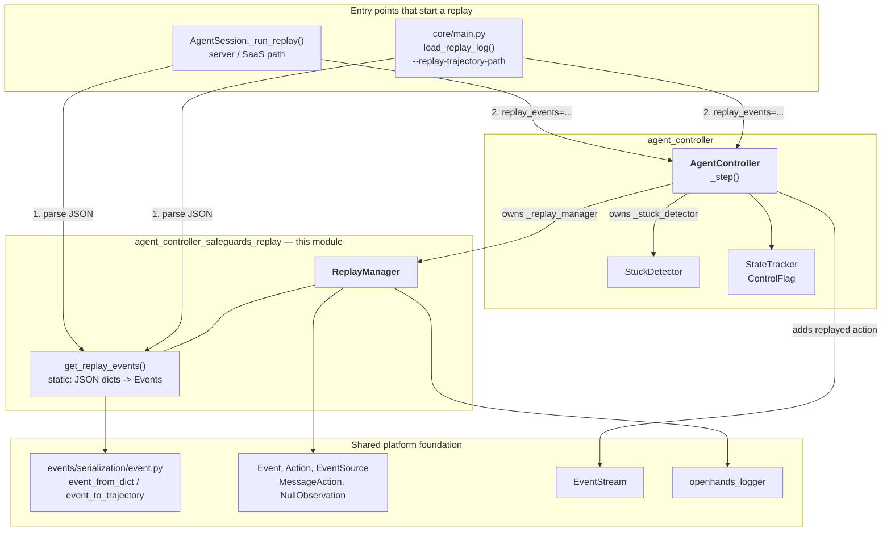
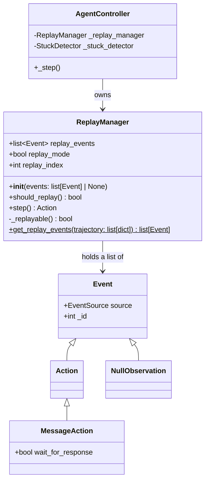
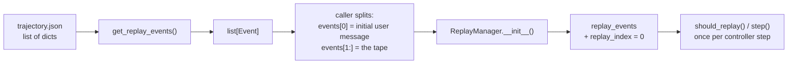
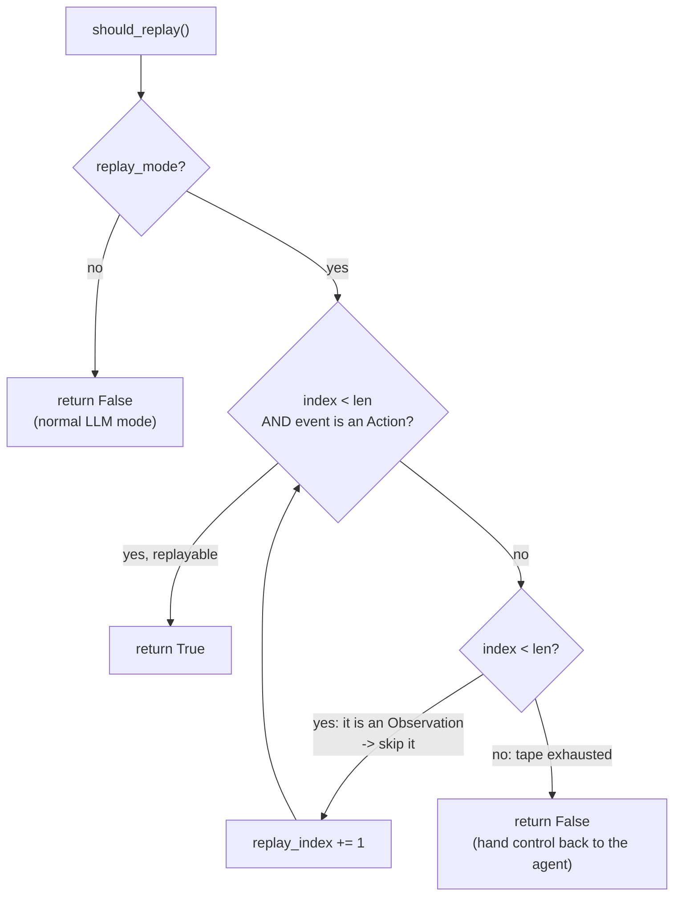
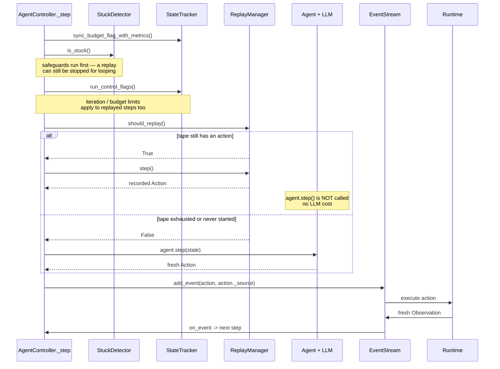
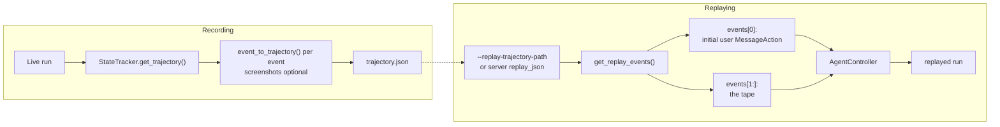

# Agent Controller Safeguards — Replay

## Purpose

This module contains one class: **`ReplayManager`** (`openhands/controller/replay.py`).

Its job is simple to state: **play back a recorded run instead of asking the LLM what to do.**

A finished OpenHands run can be saved to disk as a *trajectory* — a JSON list of every
event that happened. `ReplayManager` takes that list back in, keeps only the parts that can
be re-executed, and hands them to the [`AgentController`](agent_controller_core.md) one
action at a time. While a replay is running, the agent's `step()` method is never called,
so no LLM tokens are spent and no money is charged.

Why this is useful:

| Use case | What replay gives you |
| --- | --- |
| Debugging | Re-run a failed session against new runtime or tool code, without paying for LLM calls |
| Regression tests | Fixed inputs, so you can see whether *your* change broke something |
| Demos | Reproduce a run exactly, on demand |
| Continuing a run | When the tape ends, the agent and the user simply take over from that point |

`ReplayManager` is a **passive helper**. It owns no event stream, publishes no events, has
no LLM, and never touches the runtime. It holds a list and a cursor, and answers two
questions: *"is there another recorded action?"* and *"give me the next one."* Its sibling
safeguard, [`StuckDetector`](agent_controller_safeguards_stuck_detection.md), is built the
same way. Both are described together in
[agent_controller_safeguards](agent_controller_safeguards.md).

---

## Where this module sits



Two things to notice in this picture:

1. The callers use the **static** method `get_replay_events()` *before* the controller
   exists — it is a pure JSON-to-`Event` converter.
2. The **instance** is created inside the controller's constructor and lives as long as the
   controller does.

---

## Component structure



### Public surface

| Member | Kind | What it does |
| --- | --- | --- |
| `__init__(events)` | constructor | Filters the incoming events, fixes up `wait_for_response`, sets the cursor to `0` |
| `replay_events` | field | The cleaned list that will be played back |
| `replay_mode` | field | `True` if there is anything to replay at all. `bool(replay_events)` — so an empty or `None` input means "normal mode" |
| `replay_index` | field | Cursor into `replay_events`. Only ever moves forward |
| `should_replay()` | method | `True` if the next replayable action is ready. **Has a side effect**: skips the cursor forward over non-actions |
| `step()` | method | Returns the action at the cursor and advances it by one |
| `_replayable()` | private | `True` if the cursor is in range *and* points at an `Action` |
| `get_replay_events(trajectory)` | static | Turns a list of JSON dicts into a list of `Event` objects, ready to hand to the controller |

---

## The two-stage pipeline

Getting from a file on disk to a replayed action goes through two filters. They are
deliberately separate, because the first one runs before the controller is built and the
second one runs inside it.



### Stage 1 — `get_replay_events()` (static, load time)

```python
for item in trajectory:
    event = event_from_dict(item)
    if event.source == EventSource.ENVIRONMENT:
        continue          # not issued by user or agent -> never replay
    event._id = None      # so it can be re-added to a fresh EventStream
    replay_events.append(event)
```

| Step | Reason |
| --- | --- |
| `isinstance(trajectory, list)` check | Fails loudly with a clear `ValueError` on a malformed file, instead of crashing deeper in |
| `event_from_dict(item)` | Rebuilds a real `Action`/`Observation` object from the recorded dict. See the [event system](event_system.md) |
| Drop `EventSource.ENVIRONMENT` events | These were produced by the sandbox, not decided by a person or the agent. They will be produced again naturally by the new runtime |
| `event._id = None` | The recorded IDs belong to the *old* event stream. `EventStream` refuses an event that already carries an id, so the id has to be cleared before the event can be re-added |

### Stage 2 — `__init__()` (construction time)

The constructor filters again, on slightly different rules, and then does one rewrite:

| Rule | Effect |
| --- | --- |
| Skip `EventSource.ENVIRONMENT` | Same rule as stage 1. Repeated here because the constructor also accepts events that did **not** come through `get_replay_events()` |
| Skip `NullObservation` | Placeholder observations carry no information |
| Rewrite `wait_for_response` | For every `MessageAction` that is **not the last event**, force `wait_for_response = False` |

The `wait_for_response` rewrite is the subtlest part of the class, and it is worth spelling
out.

When the agent sends a message with `wait_for_response=True`, the controller moves to
`AgentState.AWAITING_USER_INPUT` and stops until a human types something
(`agent_controller.py`, around the `action.wait_for_response` branch). During a replay that
would be wrong twice over: the answer the human gave is *already in the tape* as the next
event, and pausing for fresh human input would let the user derail the run halfway through.
So every mid-tape question is quietly demoted to a plain message.

The **last** event keeps its flag. That is intentional: if the recording ended with the
agent asking a question, the replay ends in `AWAITING_USER_INPUT` and the live user picks
up the conversation exactly where the recording stopped.

---

## The cursor: `should_replay()` and `step()`

The tape contains both actions and observations, but only **actions** can be replayed — an
observation is whatever the real runtime says it is this time round. So the cursor has to
be able to skip.



`step()` is then trivial — and safe *only* because `should_replay()` was called first and
returned `True`:

```python
def step(self) -> Action:
    event = self.replay_events[self.replay_index]
    assert isinstance(event, Action)
    self.replay_index += 1
    return event
```

Two consequences of this design worth keeping in mind:

- **`should_replay()` is not a pure predicate.** It moves `replay_index`. Calling it twice
  in a row is harmless (the second call finds the same action and does nothing), but it is
  not a read-only query.
- **The contract is call-order dependent.** `step()` asserts rather than checks; calling it
  without a preceding `True` from `should_replay()` can raise `IndexError` or fail the
  assert.

---

## Interaction with `AgentController._step()`

Replay plugs into exactly one place in the controller's step loop:

```python
if self._replay_manager.should_replay():
    # in replay mode, we don't let the agent to proceed
    # instead, we replay the action from the replay trajectory
    action = self._replay_manager.step()
else:
    action = self.agent.step(self.state)
    ...
    action._source = EventSource.AGENT
```



Key points about this hand-off:

| Point | Detail |
| --- | --- |
| Ordering | The stuck check and the control flags run **before** the replay branch. A replay is still subject to the iteration cap and the stuck detector |
| Cost | On a replayed step, `agent.step()` never runs, so no LLM request is made. Budget and token metrics stay flat |
| Source | In the LLM branch the controller overwrites `action._source = EventSource.AGENT`. In the replay branch it does **not** — the recorded source is preserved. A recorded *user* message is therefore re-added with `EventSource.USER` and flows through the normal user-message path in `on_event`, including microagent recall |
| Observations | Recorded observations are never re-injected. The action is executed for real by the [runtime](sandboxed_execution_layer.md), and the *new* observation goes into the stream. This is what makes replay useful for testing runtime changes |
| After the tape | `should_replay()` returns `False` forever after. Nothing is reset, no event is emitted — the controller silently continues in normal mode |

---

## Full lifecycle: record then replay



### Recording side

Controlled by [core configuration](core_configuration.md) on `OpenHandsConfig`:

| Setting | Meaning |
| --- | --- |
| `save_trajectory_path` | A file, or a folder in which the file is named after the session id |
| `save_screenshots_in_trajectory` | Whether to keep encoded browser screenshots. Off by default — they make files huge |
| `replay_trajectory_path` | Load this trajectory and replay it before any live instruction |

The write path is `AgentController.get_trajectory()` → `StateTracker.get_trajectory()` →
`event_to_trajectory()` per event. See
[agent_controller_state](agent_controller_state.md).

### Replay side — two callers, one shape

Both callers do the same three things: parse the JSON, peel off the first event as the
initial user message, and pass the rest to the controller.

**Headless / CLI** — `openhands/core/main.py::load_replay_log`:

```python
events = ReplayManager.get_replay_events(json.load(file))
assert isinstance(events[0], MessageAction)
return events[1:], events[0]      # (tape, initial task)
```

`main.py` also refuses a user-supplied task in replay mode — the task *is* the first event
of the trajectory:

> `'User-specified task is not supported under trajectory replay mode'`

**Server** — `AgentSession._run_replay` in [server_sessions](server_sessions.md) does the
same split, builds the controller with `replay_events=replay_events[1:]`, and returns
`replay_events[0]` as the session's initial message. Its docstring records the reason the
LLM config still has to be passed even though replay costs nothing:

> once the replay session finishes, the controller will continue to run with further user
> instructions

---

## Correctness limits

The class docstring is explicit that replay is best-effort, not a guarantee. Unexpected or
wrong results can happen if:

1. **Any action is non-deterministic.** Re-running `curl`, a test suite with timing
   dependence, or anything touching the network can produce a different observation than
   the recording did.
2. **The starting state differs.** The tape assumes the world it was recorded in. If the
   repository is on a different commit, or a file that was created in step 3 is already
   there, later actions may fail.

There is also a structural mismatch to be aware of: the agent's own history is rebuilt from
the *new* observations, not the recorded ones. So once the tape ends and the live agent
takes over, it reasons about what actually happened this time — which is the desired
behaviour, but it means a diverging replay hands the agent a history that no longer matches
the trajectory it came from.

---

## Edge cases and behaviour table

| Input | Result |
| --- | --- |
| `ReplayManager(None)` | `replay_events = []`, `replay_mode = False`. Controller behaves completely normally. This is the default for every non-replay run |
| `ReplayManager([])` | Same as `None` |
| Trajectory with only environment events / null observations | Everything is filtered out, `replay_mode = False` — the run proceeds live |
| Trajectory that is not a JSON list | `get_replay_events` raises `ValueError` with the offending type named |
| Trajectory whose first event is not a `MessageAction` | The **caller's** `assert` fails, in `main.py` or `AgentSession`. `ReplayManager` itself does not enforce this |
| Tape ends on an observation | `should_replay()` skips to the end, returns `False`, agent takes over |
| Tape ends on a message with `wait_for_response=True` | Flag is preserved → controller enters `AWAITING_USER_INPUT` and waits for the live user |
| `step()` called without `should_replay()` | Assertion error or `IndexError` — the two methods are a pair |

---

## Related modules

| Module | Relationship |
| --- | --- |
| [agent_controller_safeguards](agent_controller_safeguards.md) | Parent module — the pair of controller guard rails |
| [agent_controller_safeguards_stuck_detection](agent_controller_safeguards_stuck_detection.md) | Sibling safeguard; runs earlier in the same step |
| [agent_controller_core](agent_controller_core.md) | Owns the `ReplayManager` instance and contains the one call site in `_step()` |
| [agent_controller_state](agent_controller_state.md) | Produces trajectories via `get_trajectory()`; enforces the flags that also bound a replay |
| [event_system](event_system.md) | `Event`, `Action`, `EventSource`, `EventStream`, and the `event_from_dict` / `event_to_trajectory` serialization used on both ends |
| [core_configuration](core_configuration.md) | `save_trajectory_path`, `replay_trajectory_path`, `save_screenshots_in_trajectory` |
| [server_sessions](server_sessions.md) | `AgentSession._run_replay` — the server-side entry point |
| [sandboxed_execution_layer](sandboxed_execution_layer.md) | Executes replayed actions for real and supplies the fresh observations |
| [logging](logging.md) | `openhands_logger` — the two informational messages this module emits |
