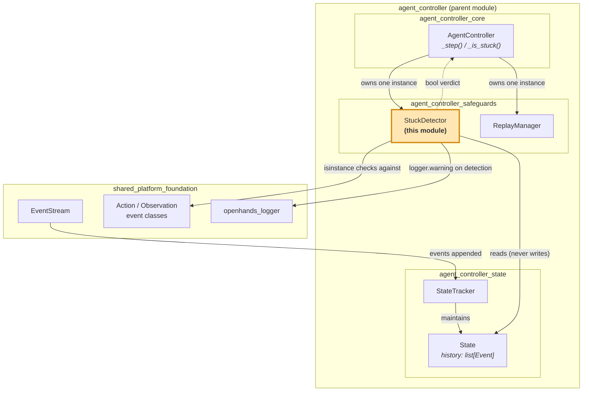
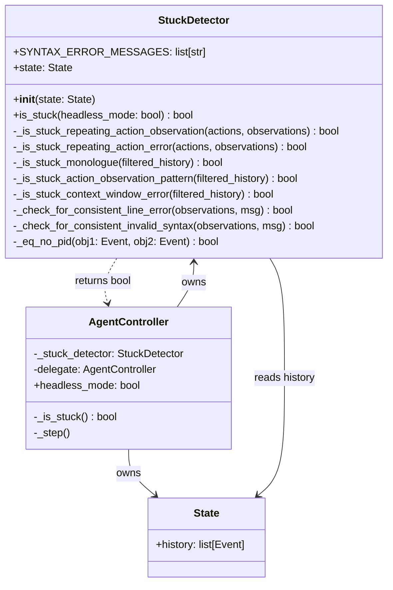
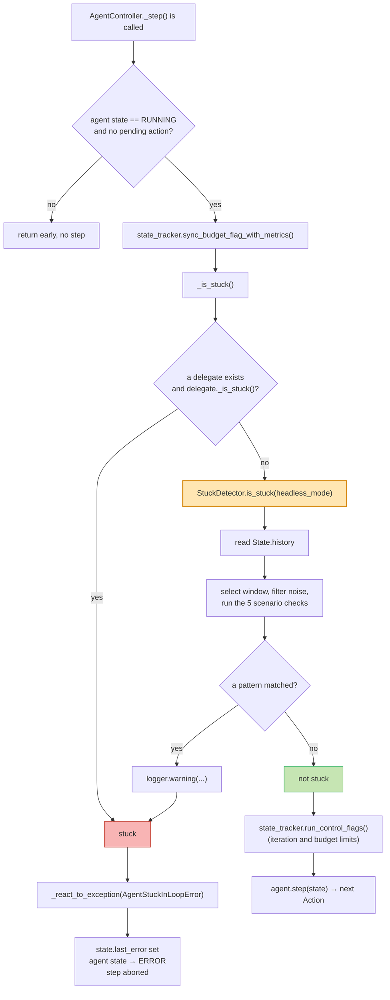
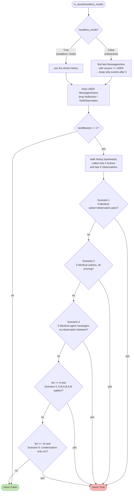
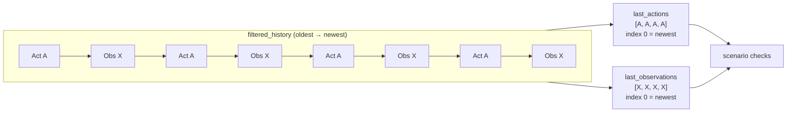
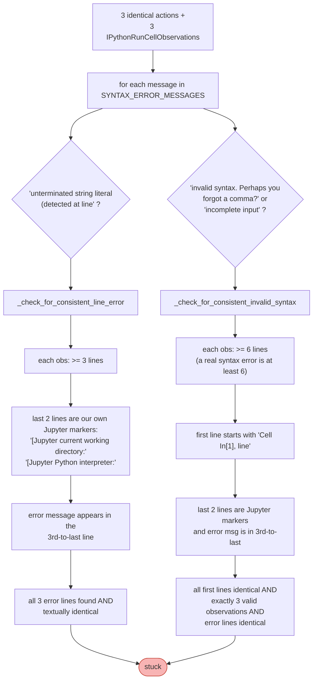
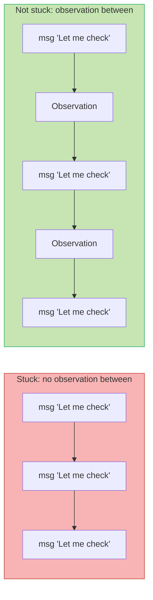
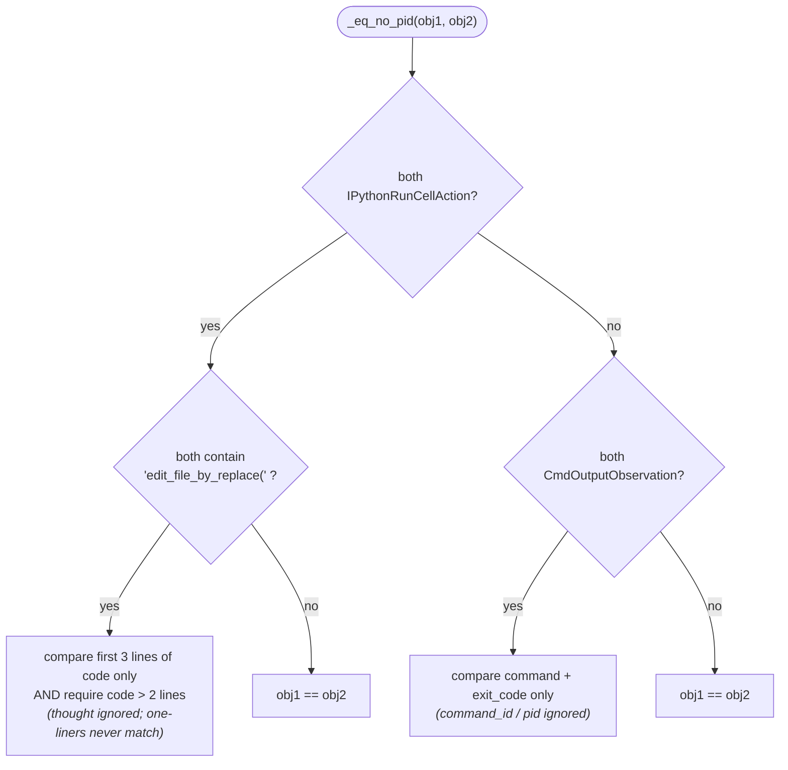
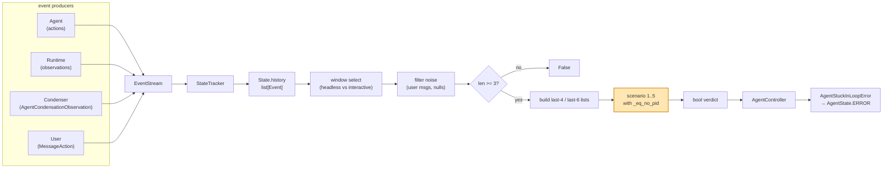

# Agent Controller Safeguards — Stuck Detection

## Introduction

An LLM agent can get trapped. It runs the same command again and again, retries a broken
edit forever, or talks to itself in circles. Nothing crashes, so no error stops it. It just
burns iterations, tokens, and money until a hard limit kicks in.

The **stuck detection** module is the guard against that. It holds one class,
`StuckDetector` (`openhands/controller/stuck.py`), which looks at the agent's event history
and answers a single question: *is this agent repeating itself instead of making progress?*

It is a **pure, read-only predicate**. It never sends events, never changes state, never
calls an LLM. It just reads the history list and returns `True` or `False`. The
[`AgentController`](agent_controller_core.md) decides what to do with that answer — it raises
`AgentStuckInLoopError` and moves the agent into the `ERROR` state.

Together with its sibling [`ReplayManager`](agent_controller_safeguards_replay.md), this
module makes up the [safeguards layer](agent_controller.md) of the controller.

---

## Where this module sits

`StuckDetector` is a small leaf. It is owned by one object (`AgentController`), reads one
piece of data (`State.history`), and is consulted at one point (the start of every step).

Related module docs:

| Module | Why it matters here |
| --- | --- |
| [agent_controller_core](agent_controller_core.md) | The only caller. Owns the detector and reacts to its verdict. |
| [agent_controller_state](agent_controller_state.md) | Owns `State.history`, the sole input. Also owns the iteration/budget `ControlFlag`s, the *other* kind of limit. |
| [agent_controller_safeguards_replay](agent_controller_safeguards_replay.md) | Sibling safeguard in the same layer. |
| [event_system](event_system.md) | Defines `Event`, `EventSource`, `Action`, `Observation`, `CmdOutputObservation`. |
| [memory_and_condensers](memory_and_condensers.md) | Produces the `AgentCondensationObservation` events that scenario 5 watches. |
| [core_schema_and_runtime_support](core_schema_and_runtime_support.md) | `AgentState`, `ActionType`, `ObservationType`. |
| [logging](logging.md) | The logger used to announce every detection. |

---

## Component structure

`StuckDetector` has one public method and a set of private scenario checkers. Each checker
owns exactly one loop pattern, so patterns can be added or tuned in isolation.

Only three names cross the module boundary:

- **In:** a `State` object at construction time; a `headless_mode` flag per call.
- **Out:** a `bool`, plus warning log lines.

That narrow surface is deliberate. The detector can be unit-tested by handing it a fake
`State` with a hand-built list of events — no runtime, no LLM, no event stream needed.

---

## The one integration point

`AgentController._step()` asks the question **before every agent step**, right after budget
sync and right before the iteration/budget control flags are run.

Read top to bottom, the controller checks its own preconditions, then the delegate, then
this module, and only reaches the agent if every check passes.

Two details are worth remembering:

- **Delegates are checked first, and recursively.** `AgentController._is_stuck()` calls
  `self.delegate._is_stuck()` before checking itself. A child agent spinning in a loop
  stops the whole chain, because the parent is blocked while the delegate runs.
- **A stuck verdict is terminal, not corrective.** The module does not nudge the agent or
  inject a hint. It hands the controller an exception, and the conversation stops with an
  error. The user (or an outer harness) decides what happens next.

---

## How a verdict is reached

`is_stuck()` runs a fixed pipeline: pick a window of history, clean it, bail out if it is
too short, build the last-N action/observation lists, then try each scenario in order. The
first scenario that matches wins and short-circuits.

### Step 1 — choosing the window (headless vs interactive)

`headless_mode` mirrors the same flag on `AgentController`.

| Mode | Window | Reasoning |
| --- | --- | --- |
| `headless_mode=True` (scripted runs, benchmarks, tests) | The entire history | Nobody is watching. Any repetition anywhere is worth catching. |
| `headless_mode=False` (interactive chat / UI) | Only events **after the last user message** | A new user message means new intent. Repetition from before it should not count against the agent now. |

This matters in practice: a user often asks the agent to redo something similar. In
interactive mode, that fresh instruction resets the detector's view of the world.

### Step 2 — cleaning the window

Two kinds of noise are removed:

- **User `MessageAction`s** — the human is not the one looping.
- **`NullAction` / `NullObservation`** — placeholder events that would break the
  action/observation alternation the later scenarios rely on.

The filter is written to be correct in both modes. In headless mode it actively strips user
messages out of the full history; in interactive mode it is a no-op for user messages,
because the slice already cut them away.

If fewer than **3** events survive, the answer is `False`. Three steps is the floor for
saying anything about a loop.

### Step 3 — building the comparison windows

The detector walks the cleaned history **backwards** and collects up to 4 `Action`s and up
to 4 `Observation`s into two separate lists. Because of the reverse walk, **index 0 is the
most recent event**. The two lists are independent — the detector does not require actions
and observations to strictly alternate, and it does not care how far apart they are in the
raw history.

---

## The five loop patterns

| # | Name | Needs | Window | What it catches | Log line |
| --- | --- | --- | --- | --- | --- |
| 1 | Repeating action + observation | 4 actions **and** 4 observations | last 4 | Perfect standstill: same action, same result, four times | `Action, Observation loop detected` |
| 2 | Repeating action + error | 3 actions and 3 observations | last 3 | Same action failing repeatedly (`ErrorObservation`, or Jupyter `SyntaxError`) | `Action, ErrorObservation loop detected` / `Action, IPythonRunCellObservation loop detected` |
| 3 | Monologue | 3 agent messages | all filtered | Agent repeating the same message to itself with no observation in between | `Repeated MessageAction with source=AGENT detected` |
| 4 | Alternating pattern | 6 actions **and** 6 observations, ≥6 filtered events | last 6 | A→B→A→B→A→B ping-pong (e.g. edit, test, edit, test, unchanged) | `Action, Observation pattern detected` |
| 5 | Context-window error loop | ≥10 condensation observations, ≥10 filtered events | all filtered | Condenser firing over and over without the agent doing anything in between | `Context window error loop detected - repeated condensation events` |

The order is cheapest-and-most-obvious first. Every check is a pure comparison over a small
list, so running all five on every step is inexpensive relative to an LLM call.

### Scenario 1 — dead standstill

All four recent actions equal each other, **and** all four recent observations equal each
other. This is the clearest signal: the agent tried the identical thing four times and got
the identical answer four times. Comparison uses `_eq_no_pid` (see below), so cosmetic
differences like process IDs do not save the agent.

### Scenario 2 — same action, repeated failure

Three identical recent actions plus three failing observations. "Failing" means one of:

- All three observations are `ErrorObservation`, **or**
- All three are `IPythonRunCellObservation` carrying the *same* Python syntax error.

The syntax-error branch exists because a broken code cell does not produce an
`ErrorObservation` — it produces normal Jupyter output that happens to contain a traceback.
The detector therefore parses the observation text. Three specific messages are tracked in
`SYNTAX_ERROR_MESSAGES`, and they are checked by two different helpers:

Both helpers insist that the *same* error appears at the *same* place. That is the point:
an agent that keeps hitting `SyntaxError` on **different** lines is at least moving. One
that hits the identical error at the identical line three times is not.

The structural checks (Jupyter marker lines, the `Cell In[1], line` prefix, the minimum
line counts) tie this scenario to the exact output format of the
[Jupyter plugin](runtime_plugins.md). If that format changes, these two helpers go quiet —
they fail closed, reporting "not stuck" rather than a false positive.

### Scenario 3 — monologue

Collect every `MessageAction` whose source is `AGENT`, keeping its index. If the last three
are all equal, look at the raw slice between the first and last of them. If **no
`Observation` appears in that gap**, the agent is talking to itself with no new input, and
it is declared stuck.

The observation check is the escape hatch. If something happened between the repeated
messages, the agent still has new information and might recover, so no verdict is issued.

Note that this scenario compares messages with plain `==`, not `_eq_no_pid` — messages have
no process IDs to ignore.

### Scenario 4 — alternating ping-pong

Guarded by `len(filtered_history) >= 6`. It rebuilds a larger window (last 6 actions, last
6 observations) and looks for a two-step cycle:

- actions: `a[0] == a[2] == a[4]` and `a[1] == a[3] == a[5]`
- observations: `o[0] == o[2] == o[4]` and `o[1] == o[3] == o[5]`

Both conditions must hold. This is the "alternating between two useless moves" case — for
example: run tests, edit the same line back, run tests, edit it back. Scenario 1 misses this
because no single action repeats consecutively.

### Scenario 5 — condensation loop

Guarded by `len(filtered_history) >= 10`. It collects all `AgentCondensationObservation`
events (with indices) and needs at least **10** of them. It then walks the last 10 pairwise
and asks whether any two adjacent condensation events have **nothing but condensation
events** between them.

This catches a specific failure in the [condenser pipeline](memory_and_condensers.md): the
prompt exceeds the context window, the condenser trims history, the trimmed history is
*still* too large, so it trims again — forever, with the agent never getting to act. Because
no real agent step happens, none of the other four scenarios see anything to compare.

---

## Noise-tolerant equality: `_eq_no_pid`

Raw `==` on events is too strict for loop detection. Two runs of the same shell command
produce observations that differ only by process ID; two attempts at the same file edit
produce actions that differ only by the agent's thought text. `_eq_no_pid` normalises that
away.

| Event pair | Compared on | Ignored |
| --- | --- | --- |
| Two `IPythonRunCellAction`s that both call `edit_file_by_replace(` | First 3 lines of `code`, and only if the code has more than 2 lines | The agent's `thought`, and anything past line 3 |
| Two `CmdOutputObservation`s | `command` and `exit_code` | `command_id` (the PID) |
| Anything else | Full `==` | — |

The `len(code.split('\n')) > 2` guard is there so short one-line edits are never treated as
equal. Trivial one-liners repeat legitimately far too often to use as loop evidence.

---

## Data flow end to end

Note that `State.history` is not pickled when a conversation is saved — it is rebuilt from
the [`EventStream`](event_system.md) on restore. The detector therefore has no persistence
concerns of its own; it always reads whatever history the
[state layer](agent_controller_state.md) currently holds.

---

## Design notes

**Heuristic, not a proof.** Every threshold (3, 4, 6, 10) is a tuned guess balancing two
costs: stopping an agent that was about to succeed, versus letting one burn budget on
nothing. The code leans toward *not* firing — many checks return `False` the moment
something does not line up exactly.

**Stateless between calls.** `StuckDetector` keeps only a reference to `State`. There are no
counters, no memory of past verdicts, no cached windows. Each call recomputes from scratch,
which makes behaviour easy to reason about and easy to test.

**Complementary to control flags.** This module answers "is the agent going in circles?"
The `ControlFlag`s in [agent_controller_state](agent_controller_state.md) answer "has the
agent used too many iterations or too much money?" Both are checked in `_step()`, one right
after the other. Loop detection usually trips first, because a loop wastes the budget that
a flag would otherwise have to wait for.

**Detect, do not repair.** The module deliberately stops short of intervention. It does not
inject hints, force a different action, or ask the condenser to try harder. Escalation
policy lives in the controller, so a stuck verdict means the same thing everywhere while
different front ends ([CLI](cli.md), [server sessions](server_sessions.md)) can present it
however they like.

**Where the blind spots are.** Semantic loops slip through — an agent making cosmetically
different but equally useless moves (different file names, different phrasing, slightly
different commands) will not match any scenario. Detection is structural, based on event
equality, not on understanding intent.

## Extending the module

Adding a new pattern is a contained change:

1. Write a `_is_stuck_<pattern>(self, ...) -> bool` method. Read only from the arguments it
   is given; call `logger.warning(...)` with a distinct message when it fires.
2. Add the call to the scenario chain in `is_stuck()`, behind a `len(filtered_history) >= N`
   guard if it needs a long window. Put cheap and high-confidence checks earlier.
3. If the pattern needs a tolerant comparison, extend `_eq_no_pid` rather than comparing
   inline — that keeps "what counts as the same event" in one place.
4. Cover it with a unit test that builds a fake `State` with a hand-written event list. No
   runtime or LLM is required, which is the main practical benefit of keeping this module
   pure.
