# agent_controller_state

## Introduction

`agent_controller_state` is the memory of one running conversation. It answers three questions that the rest of the reasoning stack keeps asking:

1. **What has happened so far?** — the ordered list of events the agent is allowed to see.
2. **Where are we in the run?** — agent state (`LOADING`, `RUNNING`, `FINISHED`, …), iteration count, spend, delegate depth.
3. **Are we allowed to keep going?** — iteration and budget limits, and what happens when they are hit.

The module has three files and three ideas:

| File | Component | Idea |
| --- | --- | --- |
| `openhands/controller/state/state.py` | `State` (+ deprecated `TrafficControlState`) | The **data**. A pickled, resumable snapshot of a conversation. |
| `openhands/controller/state/state_tracker.py` | `StateTracker` | The **manager**. Builds, updates, and persists that data. |
| `openhands/controller/state/control_flags.py` | `ControlFlag`, `IterationControlFlag`, `BudgetControlFlag` | The **limits**. Small objects that count and raise when a ceiling is crossed. |

[`AgentController`](agent_controller_core.md) owns a `StateTracker` and never touches the file store or the event stream for state purposes itself. Agents ([agents](agents.md)) and condensers ([memory_and_condensers](memory_and_condensers.md)) receive the `State` object read-only and read `state.view` from it.

---

## Where it sits in the system

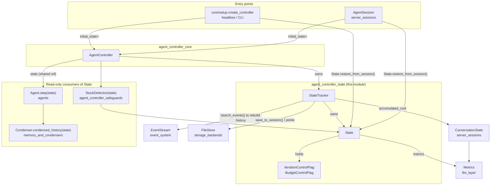

Two things are worth noticing in that picture:

- **History is never persisted.** `State.__getstate__` blanks `history` before pickling. On restore, `StateTracker._init_history()` replays the event stream between `start_id` and `end_id`. The event stream is the single source of truth; `State` only stores the *pointers* into it.
- **Cost is never owned here.** `BudgetControlFlag.current_value` is copied from `ConversationStats.get_combined_metrics().accumulated_cost` on every step. The flag is a *watcher*, not an accountant.

---

## `State` — the conversation snapshot

`State` is a plain `@dataclass`. Its fields fall into six groups.

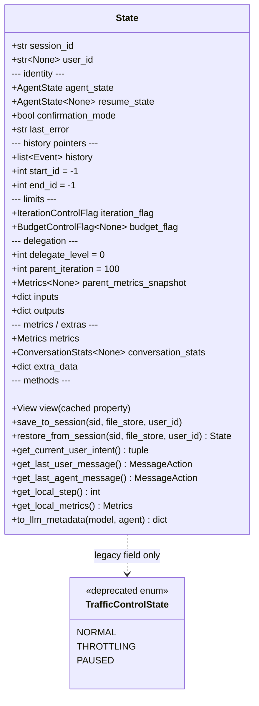

### The `view` property

`state.history` is the *raw* filtered event list. `state.view` is what an LLM should actually see. The property builds a [`View`](memory_and_condensers.md) via `View.from_events(self.history)`, which drops events that a `CondensationAction` marked as forgotten and splices in the summary.

The result is cached against a cheap checksum — `len(self.history)`:

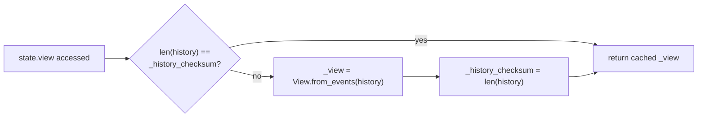

Because history is append-only during a run, length is a sufficient checksum. Both cache attributes (`_history_checksum`, `_view`) are stripped in `__getstate__` so they are rebuilt after a restore.

Every agent and condenser reads `state.view`, not `state.history` — for example `BrowsingAgent` iterates `state.view` and `VisualBrowsingAgent` checks `len(state.view) == 1` to detect the first step. `get_current_user_intent()`, `get_last_user_message()`, and `get_last_agent_message()` all scan `reversed(self.view)`.

### Persistence

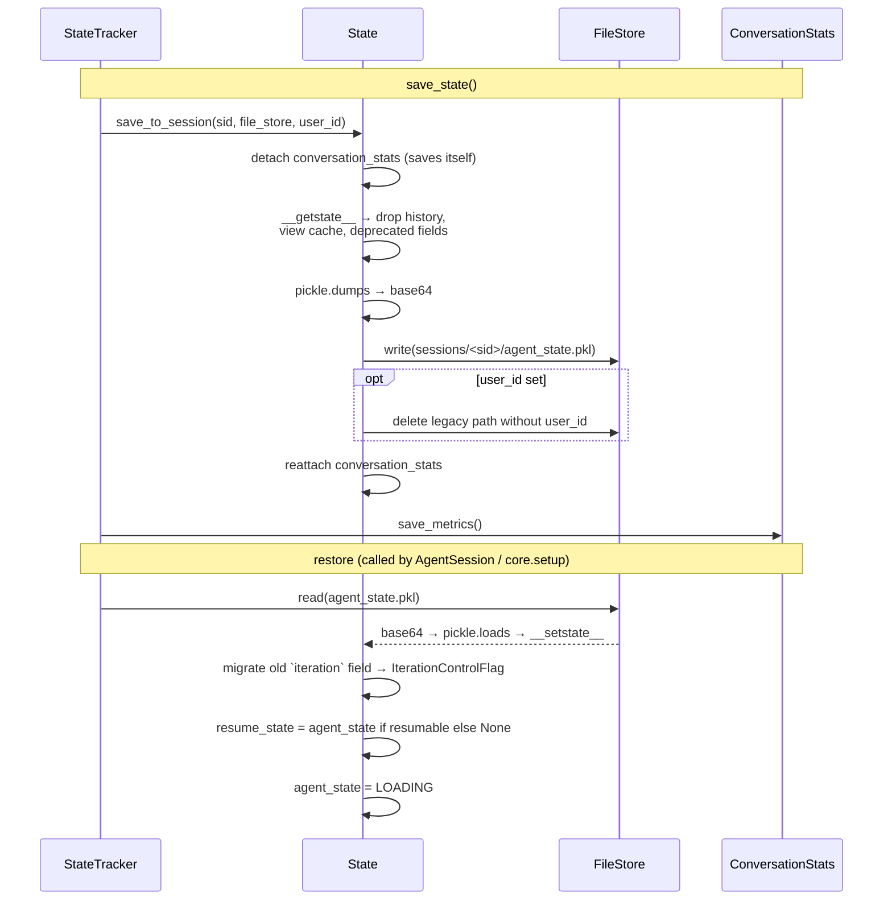

Notes on the restore path:

- The read falls back to the **legacy path without `user_id`** when the new path is missing, which keeps hosted (SaaS) conversations readable after the path change. See [enterprise_storage](enterprise_storage.md) for the hosted storage layout.
- `RESUMABLE_STATES = [RUNNING, PAUSED, AWAITING_USER_INPUT, FINISHED]`. If the saved `agent_state` is one of these it is copied to `resume_state`; the controller uses that to decide whether to resume automatically. Everything else (`ERROR`, `STOPPED`, `REJECTED`, …) resumes as a fresh idle conversation.
- `__setstate__` performs a **schema migration**: if the pickle has the old `iteration` / `max_iterations` fields, it synthesizes an `IterationControlFlag` from them. It also fills in defaults for `iteration_flag`, `budget_flag`, and `history` when absent, so old pickles never crash on load.
- `__getstate__` **drops** the deprecated fields (`iteration`, `local_iteration`, `max_iterations`, `traffic_control_state`, `local_metrics`, `delegates`), so each save/load cycle cleans the record a little.

`TrafficControlState` is one of those deprecated leftovers. It once described rate limiting (`NORMAL` / `THROTTLING` / `PAUSED`); that job now belongs to the control flags, and the enum survives only so old pickles deserialize.

### Delegation fields

When an agent delegates a subtask, [`AgentController.start_delegate`](agent_controller_core.md) builds a child `State` that **shares** the parent's control flags and `Metrics` object, but records where the parent left off:

| Field | Meaning |
| --- | --- |
| `delegate_level` | Parent + 1. Root is 0. |
| `iteration_flag`, `budget_flag` | **Same objects** as the parent — limits are global across the whole delegate tree. |
| `metrics` | **Same object** as the parent — cost accumulates globally. |
| `parent_iteration` | Parent's `iteration_flag.current_value` at delegation time. |
| `parent_metrics_snapshot` | Deep copy of the parent's `Metrics` at delegation time (`StateTracker.get_metrics_snapshot()`). |
| `start_id` | `event_stream.get_latest_event_id() + 1` — the delegate's history starts on top of the stream. |
| `inputs` / `outputs` | The subtask arguments in, and the subtask result out (read back by `end_delegate`). |

Because the counters are global, "how much did *this* delegate use?" needs subtraction. That is exactly what the two helpers do:

```
get_local_step()    = iteration_flag.current_value - parent_iteration
get_local_metrics() = metrics.diff(parent_metrics_snapshot)
```

---

## `ControlFlag` — limits as objects

`ControlFlag[T]` is a generic dataclass with three abstract methods and four fields: `limit_increase_amount`, `current_value`, `max_value`, plus a private `_hit_limit` latch (and a `headless_mode` field kept for compatibility — the real mode is passed in per call).

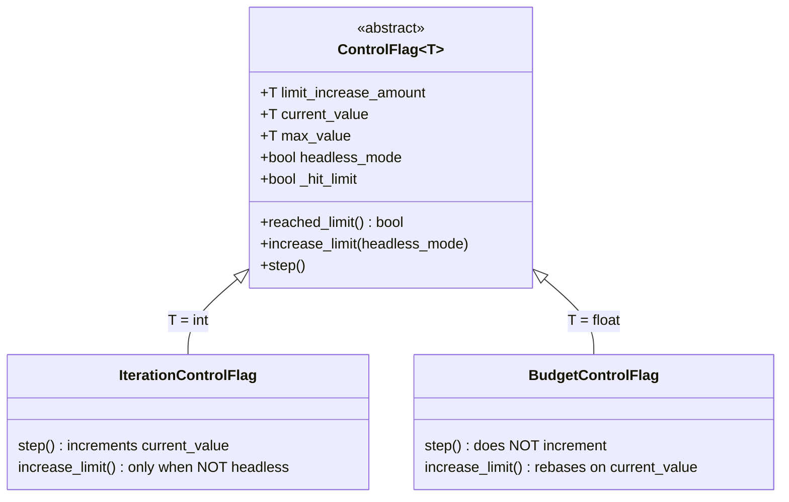

The two subclasses share the shape but differ in three meaningful ways:

| | `IterationControlFlag` (int) | `BudgetControlFlag` (float) |
| --- | --- | --- |
| Who moves `current_value` | `step()` itself, `+= 1` | External — synced from `ConversationStats` |
| New ceiling on extension | `max_value += limit_increase_amount` | `max_value = current_value + limit_increase_amount` |
| Extension in headless mode | **Blocked** — a script must not silently run forever | **Allowed** |
| On limit | `RuntimeError('Agent reached maximum iteration…')` | `RuntimeError('Agent reached maximum budget…')` |

The budget flag rebases on `current_value` rather than adding to `max_value` because spend can overshoot the ceiling between checks (a single LLM call may cost more than the remaining headroom); adding to `max_value` could leave the flag already over the new limit.

### The check → error → extend cycle

`step()` raises **before** doing work, and only a user action clears the latch. This is how "the agent stopped, click continue" works:

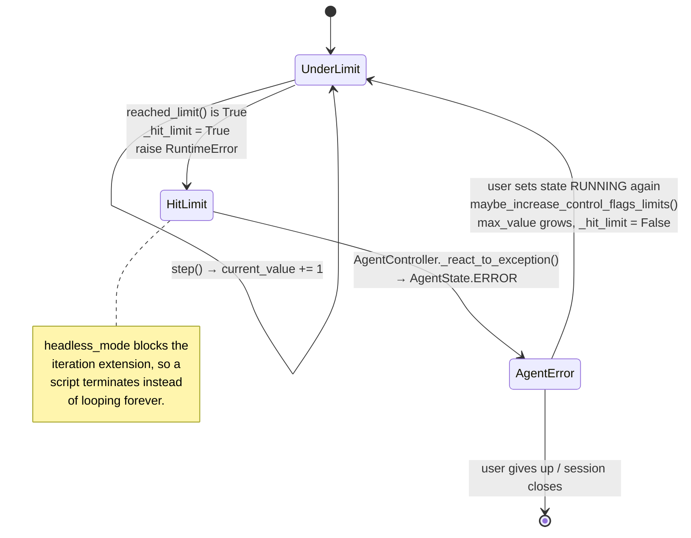

`increase_limit()` is a no-op unless `_hit_limit` is set, so repeatedly toggling the agent back to `RUNNING` cannot inflate the ceiling.

---

## `StateTracker` — the manager

`StateTracker` is constructed with only `(sid, file_store, user_id)`. Everything else arrives through method arguments, which keeps it free of a reference to the controller.

Its one piece of configuration is the history filter:

```python
self.agent_history_filter = EventFilter(
    exclude_types=(NullAction, NullObservation,
                   ChangeAgentStateAction, AgentStateChangedObservation),
    exclude_hidden=True,
)
```

Those four types are bookkeeping noise: they are how the controller talks to itself and to the UI, and they carry nothing an LLM should reason about. See [event_system](event_system.md) for `EventFilter` and the event taxonomy.

### Responsibilities

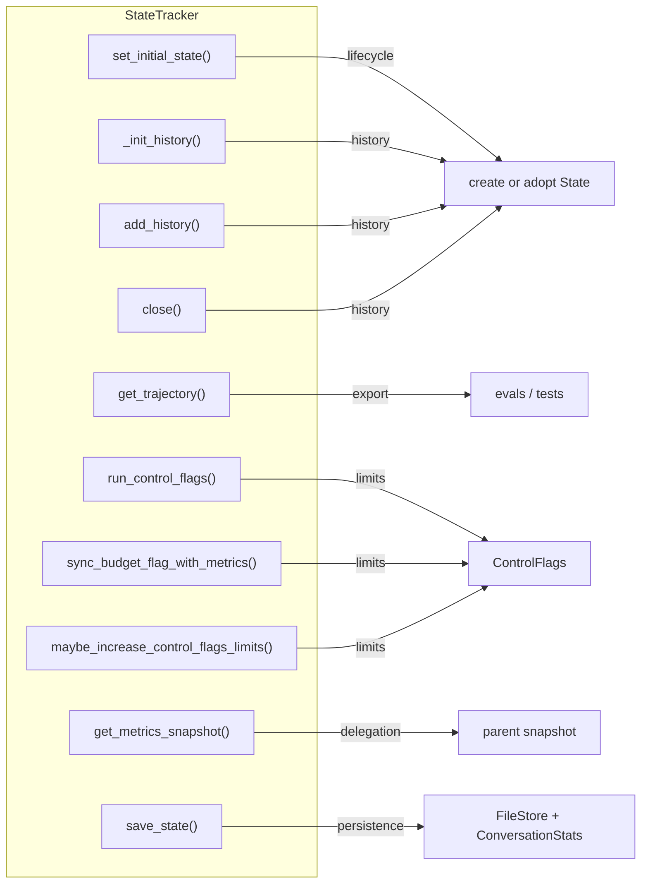

### `set_initial_state` — three sources of state

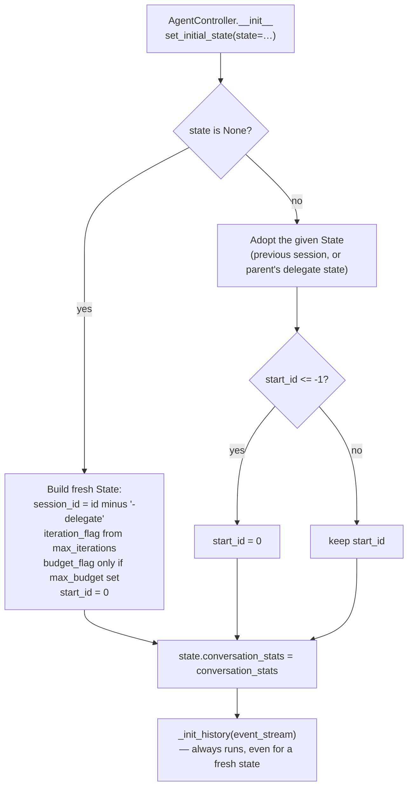

Two details matter here:

- `budget_flag` is `None` when no budget was configured. Every read site therefore guards with `if self.state.budget_flag:` — an unlimited conversation has no flag at all rather than an infinite one.
- `_init_history()` is called unconditionally by the controller, *including* for brand-new states. A "new" state may still sit on top of an event stream that already has events (a reconnect where the pickle was lost), so history is always rebuilt from the stream.

### `_init_history` — rebuilding history, collapsing delegates

This is the most intricate method in the module. It fetches events in `[start_id, end_id]` through the filter, then **collapses delegate subtrees**: everything a child agent did is replaced by the `AgentDelegateAction` that started it and the `AgentDelegateObservation` that summarized it.

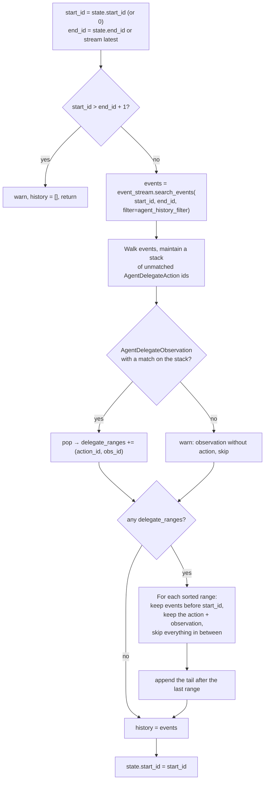

Why collapse? A delegate's internal reasoning is not the parent's business — including it would blow up the parent's context and confuse the parent agent about which actions were its own. A stack is used rather than a simple pair-match so nested delegations resolve to the outermost pair.

### `add_history` vs `close` — two views of the same run

The two methods differ on purpose:

| | `add_history(event)` (during the run) | `close(event_stream)` (at shutdown) |
| --- | --- | --- |
| Trigger | Every event the controller observes | `AgentController.close()` |
| Delegates | **Collapsed** (delegate internals were never appended to this controller's history) | **Expanded** — a full re-read of `[start_id, end_id]` through the filter |
| Purpose | The agent's working context | The complete record for evals, tests, and trajectory export |

So `close()` deliberately *rewrites* history to be wider than what the agent saw. `get_trajectory()` then serializes it via `event_to_trajectory`; `AgentController.get_trajectory()` asserts the controller is closed first, precisely because the pre-close history is the narrow, delegate-collapsed one.

### Per-step limit handling

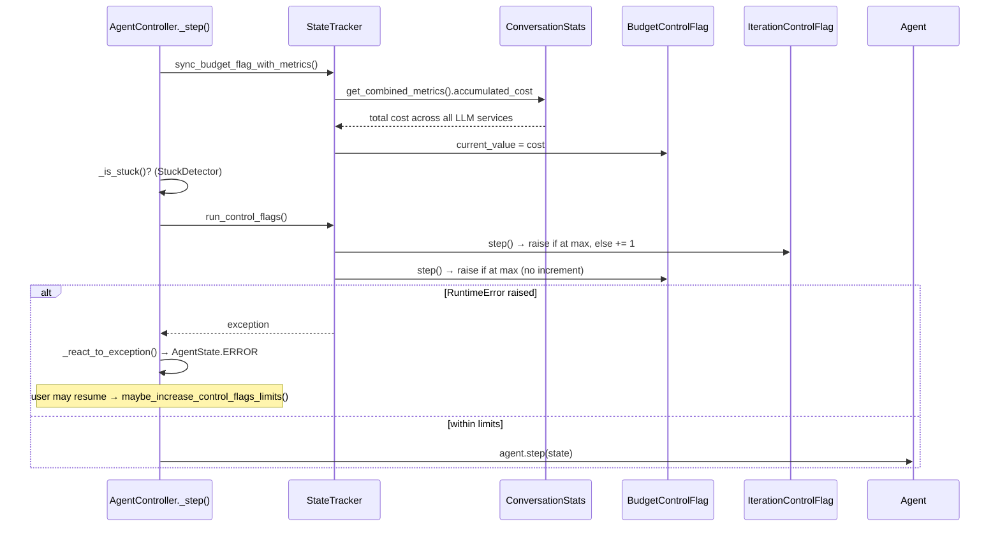

`sync_budget_flag_with_metrics()` pulls from `ConversationStats`, not from `state.metrics`, because a conversation can run several LLM services at once — the agent's model, a condenser's model, a router's models (see [llm_layer](llm_layer.md) and [memory_and_condensers](memory_and_condensers.md)). `ConversationStats` is the only place that sums them all.

### `save_state`

```python
if self.sid and self.file_store:
    self.state.save_to_session(self.sid, self.file_store, self.user_id)
if self.state.conversation_stats:
    self.state.conversation_stats.save_metrics()
```

Two independent stores: the pickled `State` and the pickled per-service `Metrics` map. `State.save_to_session` detaches `conversation_stats` before pickling exactly so the two do not duplicate each other. `AgentController` calls `save_state()` on every `set_agent_state_to()` transition, so a crash loses at most one step.

---

## Lifecycle end to end

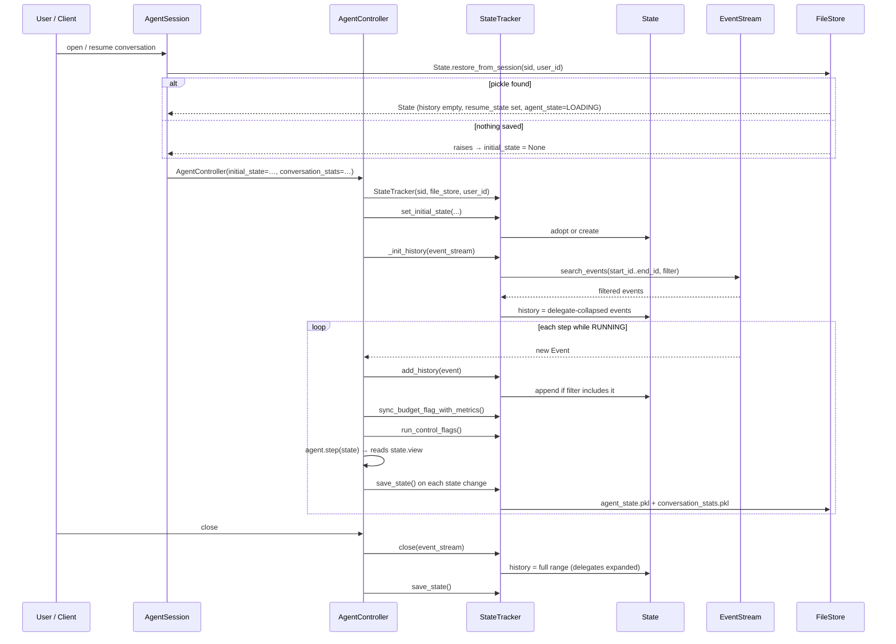

---

## Design notes and gotchas

- **The event stream is the source of truth; `State` is an index into it.** Any bug where history looks wrong is usually a `start_id` / `end_id` bug, not a lost-data bug.
- **`AgentController.state` is the same object as `StateTracker.state`.** The controller keeps a direct alias (with a `TODO` acknowledging it) so older code paths keep working. Mutating either mutates both.
- **Limits are shared down the delegate tree, metrics are shared globally, and only the *snapshots* are per-delegate.** Read `get_local_step()` / `get_local_metrics()` for per-subtask numbers; read the flags for the whole task.
- **Pickle is the persistence format.** That makes `State` sensitive to class renames and field removals, which is why `__getstate__` / `__setstate__` carry explicit migration logic. Adding a field is safe (`__setstate__` fills defaults); renaming or removing one needs a migration branch.
- **`headless_mode` changes the meaning of a hit limit.** Interactively, hitting the iteration cap is a pause the user can extend. In headless/eval runs, it is a hard stop. The budget flag intentionally does *not* make this distinction.
- **`TrafficControlState`, `iteration`, `local_iteration`, `max_iterations`, `local_metrics`, `delegates`** are all deprecated. Do not read them; they are stripped on the next save.

## Related modules

- [agent_controller_core](agent_controller_core.md) — `AgentController`, the only writer of this state.
- [agent_controller_safeguards](agent_controller_safeguards.md) — `StuckDetector` (reads `state.view`) and `ReplayManager`.
- [agent_controller](agent_controller.md) — parent module overview.
- [event_system](event_system.md) — `EventStream`, `EventFilter`, event types.
- [memory_and_condensers](memory_and_condensers.md) — `View`, condensers, and `state.extra_data` metadata.
- [llm_layer](llm_layer.md) — `Metrics`, `LLMRegistry`.
- [server_sessions](server_sessions.md) — `AgentSession`, `ConversationStats`.
- [storage_backends](storage_backends.md) — `FileStore` implementations behind `save_to_session`.
- [core_schema_and_runtime_support](core_schema_and_runtime_support.md) — the `AgentState` enum.
- [agents](agents.md) — consumers of `State` inside `agent.step()`.
