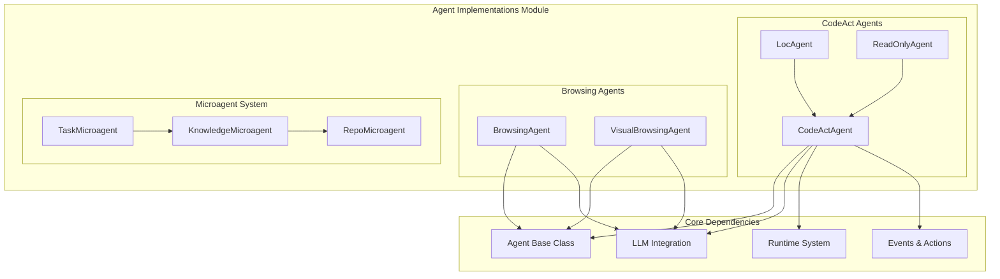
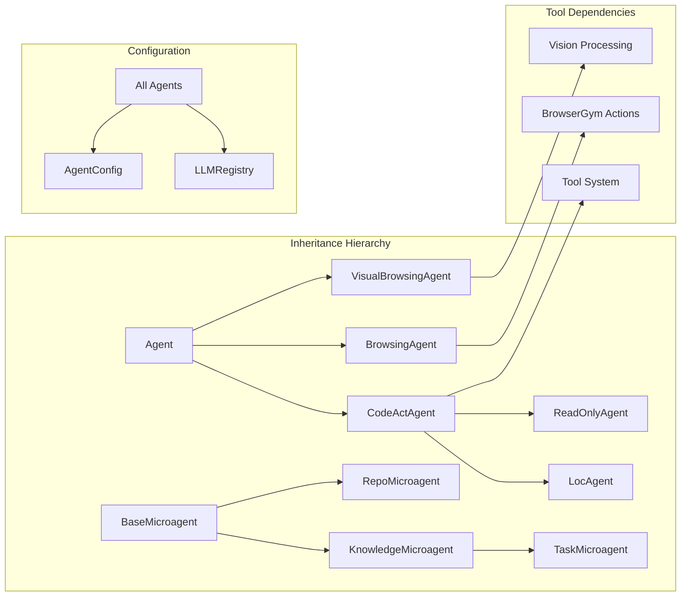
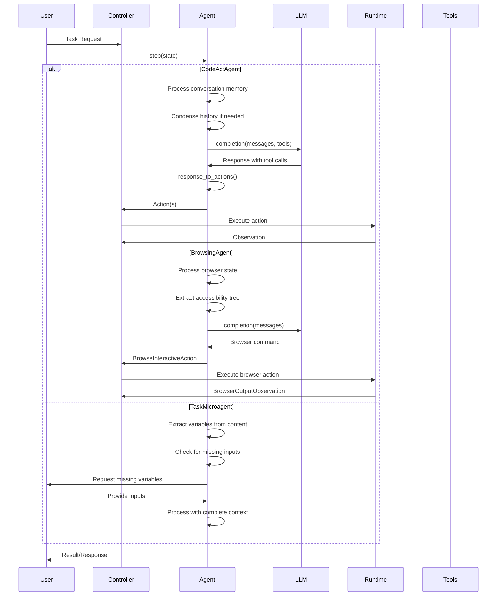

# Agent Implementations Module

The agent_implementations module provides concrete implementations of specialized AI agents that extend the base [core_agent_system](core_agent_system.md) functionality. This module contains five distinct agent types, each optimized for specific task domains and interaction patterns.

## Overview

This module implements the strategy pattern for agent specialization, where each agent inherits from the base `Agent` class but provides domain-specific capabilities, tools, and behaviors. The agents range from general-purpose code execution to specialized web browsing and read-only exploration.

## Architecture



## Core Components

### CodeAct Agent Family

#### CodeActAgent
The flagship general-purpose agent implementing the CodeAct paradigm that consolidates actions into a unified code execution space.

**Key Features:**
- **Unified Action Space**: Combines conversation, bash commands, and Python execution
- **Tool Integration**: Supports 10+ specialized tools (Jupyter, browser, editor, etc.)
- **Memory Management**: Advanced conversation memory with condensation capabilities
- **Function Calling**: Native support for structured tool interactions
- **Plugin System**: Extensible sandbox plugin architecture

**Core Capabilities:**
```python
# Available tools based on configuration
tools = [
    'cmd_run',      # Bash command execution
    'think',        # Reasoning and planning
    'finish',       # Task completion
    'browser',      # Web browsing
    'jupyter',      # Python code execution
    'editor',       # File editing
    'task_tracker'  # Task management
]
```

#### LocAgent
A specialized CodeActAgent optimized for location-aware and context-sensitive tasks.

**Specializations:**
- Custom tool set for location-based operations
- Enhanced function calling for spatial reasoning
- Inherits all CodeActAgent capabilities with domain-specific extensions

#### ReadOnlyAgent
A safety-focused variant that provides exploration capabilities without modification permissions.

**Safety Features:**
- **Read-Only Tools**: Only grep, glob, view, think, finish, web_read
- **No MCP Support**: Explicitly disables MCP tools for security
- **Codebase Exploration**: Safe for understanding existing systems
- **Research Mode**: Ideal for analysis without side effects

### Browsing Agent Family

#### BrowsingAgent
Specialized for web interaction using BrowserGym's high-level action space.

**Web Capabilities:**
- **Action Subsets**: Chat, BID (Browser Interaction Description), Navigation
- **Accessibility Tree**: Full webpage structure understanding
- **Error Recovery**: Automatic error handling with retry logic
- **Multi-Action**: Can perform multiple browser actions simultaneously

**Browser Actions:**
```python
action_subsets = ['chat', 'bid']
if USE_NAV:
    action_subsets.append('nav')
```

#### VisualBrowsingAgent
Enhanced browsing agent with visual understanding capabilities through webpage screenshots.

**Visual Features:**
- **Screenshot Analysis**: Processes webpage visual content
- **Set of Marks (SOM)**: Visual element identification system
- **Enhanced Action Space**: Includes tabs, infeasibility detection
- **Coordinate-Based Interaction**: Precise element targeting
- **Multi-Modal Prompting**: Combines text and visual information

### Microagent System

#### TaskMicroagent
Specialized microagents that require user input and are triggered by specific commands.

**Task Features:**
- **Variable Extraction**: Parses `${variable_name}` patterns
- **Input Validation**: Ensures required parameters are provided
- **Trigger System**: Activated by `/{agent_name}` format
- **Dynamic Prompting**: Automatically requests missing variables

#### KnowledgeMicroagent
Provides specialized expertise triggered by keywords in conversations.

**Knowledge Features:**
- **Trigger Matching**: Keyword-based activation system
- **Domain Expertise**: Language best practices, framework guidelines
- **Pattern Recognition**: Common development patterns and tool usage

#### RepoMicroagent
Repository-specific knowledge and guidelines automatically loaded from project files.

**Repository Integration:**
- **Auto-Discovery**: Loads from `.openhands/microagents/repo.md`
- **Third-Party Support**: Handles `.cursorrules`, `agents.md` files
- **Legacy Support**: Processes `.openhands_instructions` files
- **Project Context**: Repository-specific workflows and conventions

## Component Relationships



## Data Flow



## Integration Points

### Core Agent System Integration
- **Base Agent Class**: All implementations extend `openhands.controller.agent.Agent`
- **Action Processing**: Leverages [action_processing](action_processing.md) for command parsing
- **State Management**: Integrates with [state_management](state_management.md) for conversation flow

### LLM Integration
- **Model Support**: Compatible with all models in [llm_integration](llm_integration.md)
- **Function Calling**: Native support for structured tool interactions
- **Vision Models**: VisualBrowsingAgent requires vision-capable models
- **Caching**: Supports prompt caching for efficiency

### Runtime System Integration
- **Sandbox Plugins**: CodeActAgent uses [runtime_system](runtime_system.md) plugins
- **Browser Runtime**: Browsing agents require browser-enabled runtimes
- **Security**: ReadOnlyAgent provides safe runtime interaction

### Events and Actions
- **Action Types**: Generates actions defined in [events_and_actions](events_and_actions.md)
- **Observation Processing**: Handles all observation types from runtime
- **Event Streaming**: Supports real-time event processing

## Configuration

### Agent Selection
```python
# Agent configuration mapping
AGENT_CLASSES = {
    'CodeActAgent': CodeActAgent,
    'BrowsingAgent': BrowsingAgent,
    'VisualBrowsingAgent': VisualBrowsingAgent,
    'LocAgent': LocAgent,
    'ReadOnlyAgent': ReadOnlyAgent,
}
```

### Tool Configuration
```python
# CodeActAgent tool configuration
config = AgentConfig(
    enable_cmd=True,           # Bash commands
    enable_jupyter=True,       # Python execution
    enable_browsing=True,      # Web browsing
    enable_editor=True,        # File editing
    enable_think=True,         # Reasoning
    enable_finish=True,        # Task completion
    enable_plan_mode=False,    # Task tracking
    enable_llm_editor=False,   # LLM-based editing
)
```

### Microagent Configuration
```yaml
# Microagent metadata structure
name: "example-task"
type: "task"
version: "1.0"
triggers: ["/example"]
inputs:
  - name: "target"
    description: "Target to process"
    required: true
```

## Usage Patterns

### General Purpose Development
```python
# Use CodeActAgent for comprehensive development tasks
agent = CodeActAgent(config, llm_registry)
# Supports: coding, debugging, file operations, web research
```

### Safe Exploration
```python
# Use ReadOnlyAgent for codebase analysis
agent = ReadOnlyAgent(config, llm_registry)
# Supports: code reading, pattern searching, documentation
```

### Web Automation
```python
# Use BrowsingAgent for web tasks
agent = BrowsingAgent(config, llm_registry)
# Supports: form filling, navigation, data extraction

# Use VisualBrowsingAgent for complex visual web tasks
agent = VisualBrowsingAgent(config, llm_registry)
# Supports: screenshot analysis, visual element interaction
```

### Specialized Tasks
```python
# Use LocAgent for location-aware tasks
agent = LocAgent(config, llm_registry)
# Supports: spatial reasoning, location-based operations

# Use TaskMicroagent for parameterized workflows
microagent = TaskMicroagent.load("task.md")
# Supports: templated tasks, user input collection
```

## Error Handling

### Browser Error Recovery
```python
# BrowsingAgent error handling
if last_obs.error:
    error_prefix = get_error_prefix(last_obs.last_browser_action)
    self.error_accumulator += 1
    if self.error_accumulator > 5:
        return MessageAction('Too many errors encountered. Task failed.')
```

### Microagent Validation
```python
# Microagent loading with validation
try:
    agent = BaseMicroagent.load(file_path)
except MicroagentValidationError as e:
    logger.error(f'Validation error: {e}')
except Exception as e:
    logger.error(f'Loading error: {e}')
```

## Performance Considerations

### Memory Management
- **Conversation Condensation**: CodeActAgent automatically condenses long conversations
- **Event Filtering**: Browsing agents filter relevant observations
- **Tool Caching**: Reuses tool definitions across requests

### Model Optimization
- **Short Descriptions**: Uses concise tool descriptions for token-limited models
- **Prompt Caching**: Leverages model-specific caching when available
- **Vision Processing**: Optimizes image handling for visual agents

## Security Features

### ReadOnlyAgent Safety
- **Tool Restriction**: Only allows non-modifying operations
- **MCP Blocking**: Explicitly prevents MCP tool usage
- **Sandbox Isolation**: Runs in restricted runtime environment

### Input Validation
- **Microagent Validation**: Strict metadata validation
- **Tool Parameter Checking**: Validates all tool inputs
- **Action Sanitization**: Cleans potentially harmful commands

## Future Extensions

### Planned Enhancements
- **Multi-Agent Coordination**: Agent collaboration frameworks
- **Custom Tool Integration**: User-defined tool plugins
- **Advanced Memory**: Persistent knowledge across sessions
- **Performance Metrics**: Detailed agent performance tracking

### Integration Opportunities
- **Enterprise Features**: Integration with [enterprise_integrations](enterprise_integrations.md)
- **Security Analysis**: Enhanced [security_system](security_system.md) integration
- **Storage Optimization**: Advanced [storage_system](storage_system.md) usage

This module represents the core execution layer of the OpenHands system, providing specialized agents for diverse automation and development tasks while maintaining safety, extensibility, and performance.