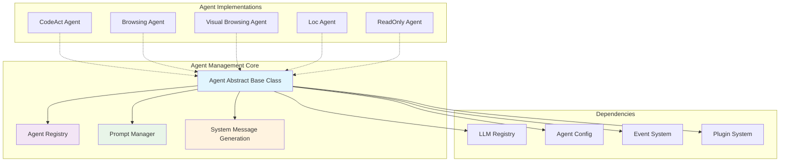
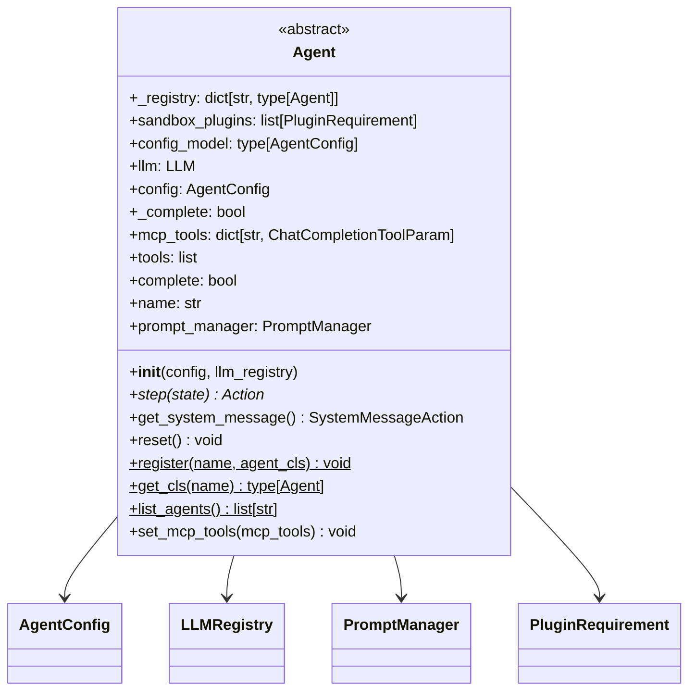
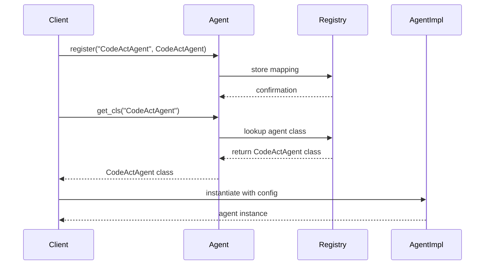
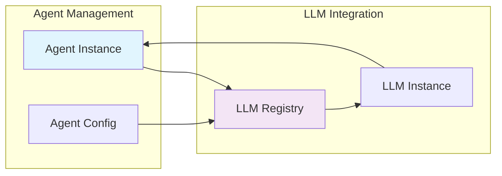
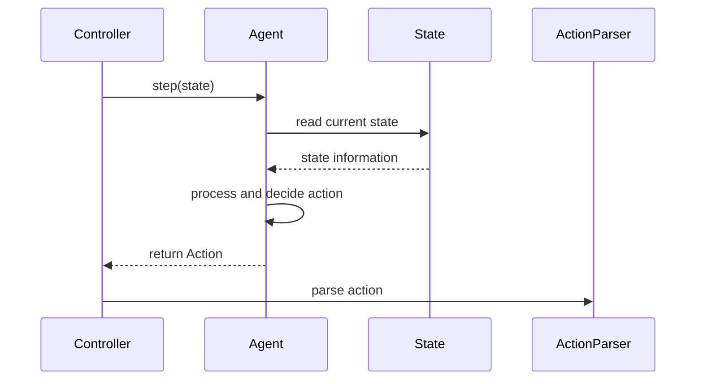
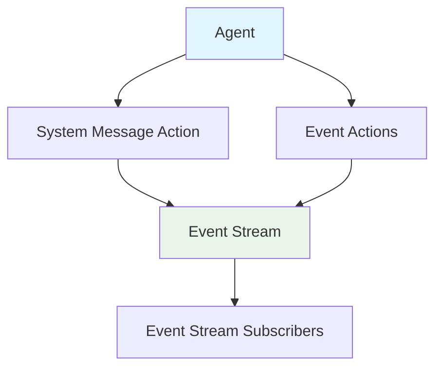
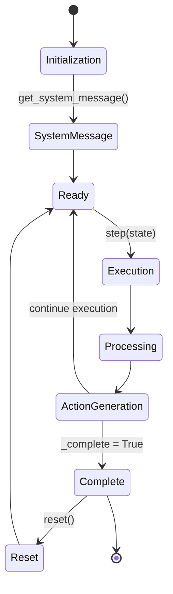
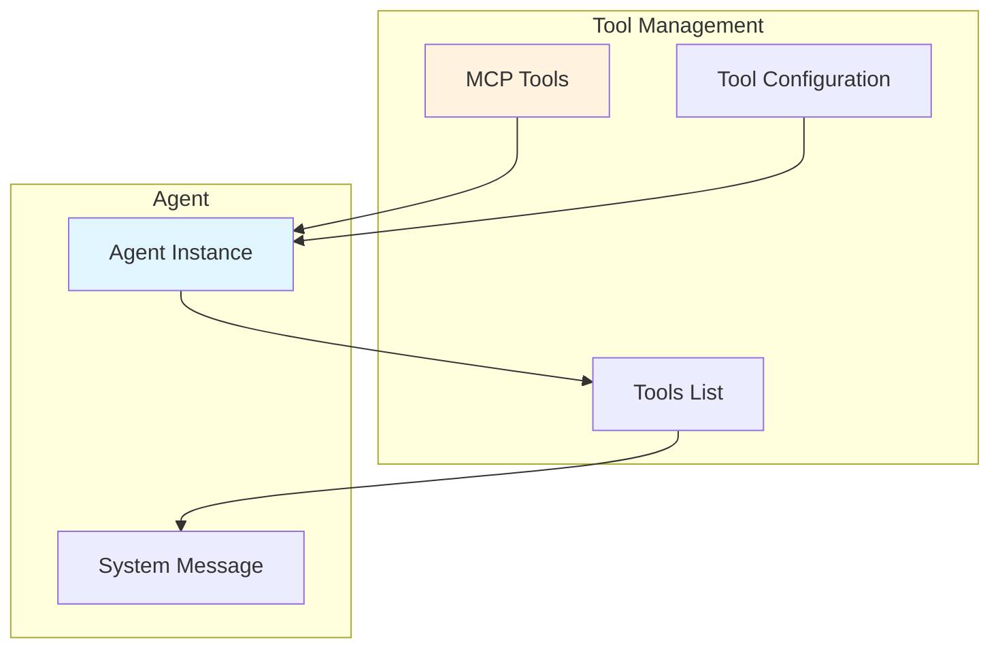
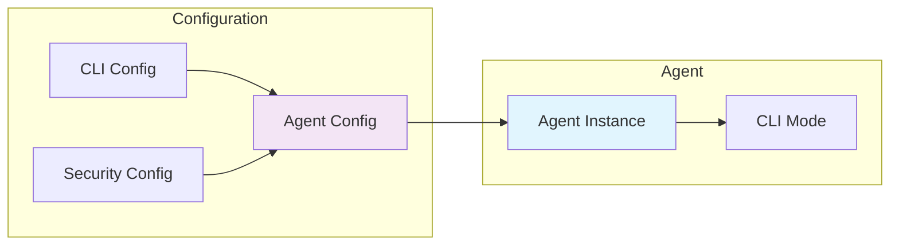

# Agent Management Module

The agent_management module provides the foundational framework for managing AI agents within the OpenHands system. It defines the core Agent abstract base class that serves as the blueprint for all specialized agent implementations.

## Overview

The agent_management module is a critical component of the [core_agent_system](core_agent_system.md) that establishes the contract and lifecycle management for AI agents. It provides:

- **Agent Registry**: A centralized system for registering and retrieving agent classes
- **Agent Lifecycle**: Methods for initialization, execution, and reset operations
- **LLM Integration**: Seamless integration with the [llm_integration](llm_integration.md) system
- **Tool Management**: Support for MCP (Model Context Protocol) tools and function calling
- **System Message Generation**: Automated system message creation with prompt management

## Architecture



## Core Components

### Agent Abstract Base Class

The `Agent` class serves as the foundation for all agent implementations in the OpenHands system.



#### Key Responsibilities

1. **Abstract Interface**: Defines the contract that all agent implementations must follow
2. **Registry Management**: Maintains a centralized registry of available agent types
3. **LLM Integration**: Manages LLM instances through the registry system
4. **Tool Management**: Handles MCP tools and function calling capabilities
5. **Lifecycle Management**: Controls agent execution state and reset operations

#### Core Methods

- **`step(state: State) -> Action`**: Abstract method that must be implemented by subclasses to define agent behavior
- **`get_system_message() -> SystemMessageAction`**: Generates system messages with tools for agent initialization
- **`reset()`**: Resets agent execution state while preserving LLM metrics
- **`set_mcp_tools(mcp_tools)`**: Configures MCP tools for the agent

## Agent Registry System

The agent registry provides a centralized mechanism for managing agent types within the system.



### Registry Operations

- **Registration**: `Agent.register(name, agent_cls)` adds new agent types
- **Retrieval**: `Agent.get_cls(name)` gets agent classes by name
- **Listing**: `Agent.list_agents()` returns all registered agent names

## Integration with Other Modules

### LLM Integration

The agent management module integrates closely with the [llm_integration](llm_integration.md) system:



### State Management

Agents interact with the [state_management](state_management.md) system through the `step` method:



### Event System

Agents generate events through the [events_and_actions](events_and_actions.md) system:



## Agent Lifecycle

The agent lifecycle consists of several key phases:



### Lifecycle Phases

1. **Initialization**: Agent is created with configuration and LLM registry
2. **System Message**: Initial system message is generated with tools
3. **Execution Loop**: Agent processes states and generates actions
4. **Completion**: Agent marks task as complete
5. **Reset**: Agent state is reset for new tasks

## Tool Management

The agent management system supports MCP (Model Context Protocol) tools for enhanced capabilities:



### Tool Integration Process

1. **Tool Registration**: MCP tools are registered with the agent
2. **Tool Validation**: Duplicate tools are detected and skipped
3. **Tool Integration**: Tools are added to the agent's tool list
4. **System Message**: Tools are included in system messages for LLM context

## Configuration

Agents are configured through the `AgentConfig` class from the [core_configuration](core_configuration.md) module:



## Error Handling

The module defines specific exceptions for agent management:

- **`AgentAlreadyRegisteredError`**: Thrown when attempting to register a duplicate agent name
- **`AgentNotRegisteredError`**: Thrown when attempting to retrieve an unregistered agent

## Usage Examples

### Registering a New Agent

```python
from openhands.controller.agent import Agent
from openhands.core.config import AgentConfig

class CustomAgent(Agent):
    def step(self, state):
        # Implementation logic
        pass

# Register the agent
Agent.register("CustomAgent", CustomAgent)

# Retrieve and instantiate
agent_cls = Agent.get_cls("CustomAgent")
agent = agent_cls(config, llm_registry)
```

### Agent Execution

```python
# Initialize agent
agent = Agent.get_cls("CodeActAgent")(config, llm_registry)

# Get system message
system_msg = agent.get_system_message()

# Execute agent step
action = agent.step(current_state)

# Check completion
if agent.complete:
    print("Task completed")
```

## Related Modules

- **[core_agent_system](core_agent_system.md)**: Parent module containing the complete agent system
- **[agent_implementations](agent_implementations.md)**: Concrete agent implementations
- **[llm_integration](llm_integration.md)**: LLM management and integration
- **[state_management](state_management.md)**: State tracking and control
- **[events_and_actions](events_and_actions.md)**: Event system for agent communication
- **[core_configuration](core_configuration.md)**: Configuration management

## Best Practices

1. **Agent Implementation**: Always implement the abstract `step` method in subclasses
2. **Registry Usage**: Use descriptive names when registering agents
3. **Tool Management**: Validate MCP tools before setting them on agents
4. **Error Handling**: Handle agent registration and retrieval errors appropriately
5. **State Management**: Ensure proper state handling in the `step` method
6. **Resource Cleanup**: Use the `reset` method to clean up agent state between tasks

The agent_management module provides the essential foundation for the OpenHands agent system, enabling flexible and extensible AI agent implementations while maintaining consistent interfaces and lifecycle management.