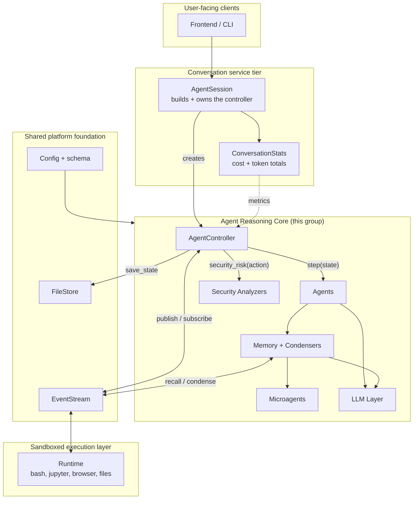
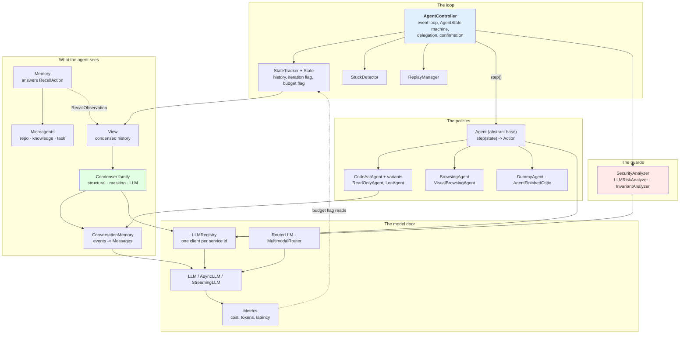
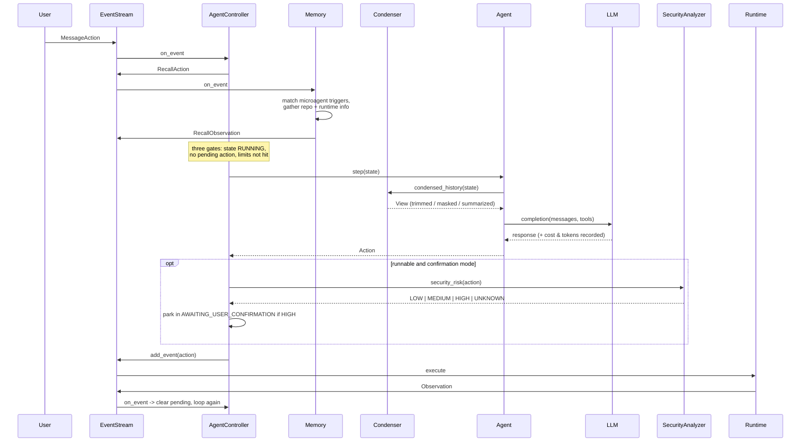
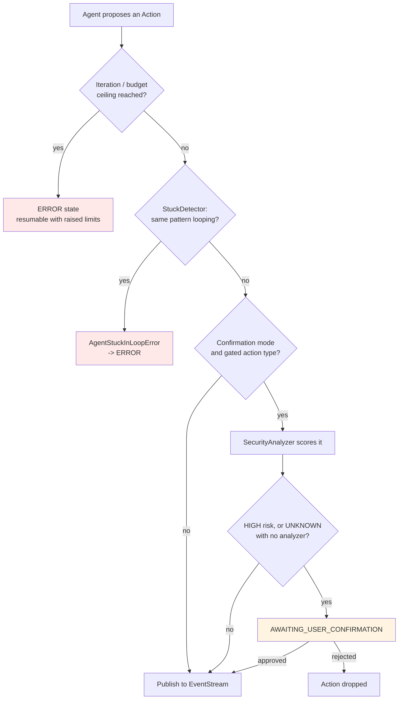
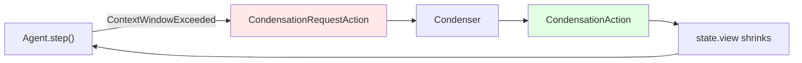
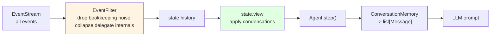
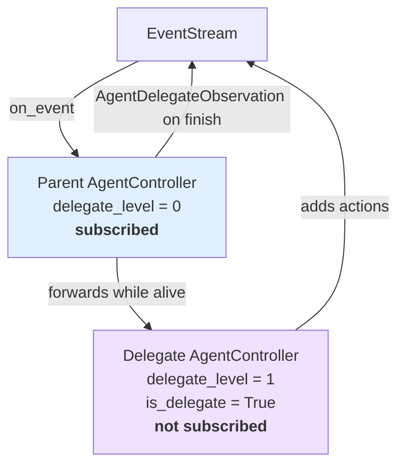

# Agent Reasoning Core

## 1. Purpose

The `agent_reasoning_core` is the **brain** of OpenHands. It is the part of the system that
decides *what to do next*.

Everything in this group answers one question, over and over:

> Given everything that has happened so far, what is the next single action?

It does **not** execute anything. It does not open a shell, write a file, or click a
button. Those jobs belong to the [sandboxed execution layer](sandboxed_execution_layer.md).
This group only reasons, and it hands its decision to the event stream.

The whole group is one loop with six supporting parts:

| Sub-module | Path | Job in one line |
|---|---|---|
| [Agent Controller](agent_controller.md) | `openhands/controller` | Runs the loop: when may the agent act, and is it allowed to? |
| [Agents](agents.md) | `openhands/agenthub` | The policies: `State` in, one `Action` out |
| [LLM Layer](llm_layer.md) | `openhands/llm` | The single door to every model provider; also cost and token accounting |
| [Memory and Condensers](memory_and_condensers.md) | `openhands/memory` | Decides what the agent remembers, and shrinks it when it stops fitting |
| [Microagents](microagents.md) | `openhands/microagent` | Extra instructions loaded from Markdown files |
| [Security Analyzers](security_analyzers.md) | `openhands/security` | Scores how dangerous a proposed action is |

### The one-line summary

The controller turns a stateless `step(state) -> action` function into a long-running,
resumable, budget-limited, safety-gated conversation. Everything else in the group feeds
that function or guards it.

---

## 2. Where the group sits

The important boundary: **the controller and the runtime never call each other.** They
only meet through the [event stream](event_system.md). The controller adds an `Action`,
the runtime notices it and adds an `Observation`, and the controller lets the agent step
again. That indirection is what makes the whole group testable without a sandbox.

---

## 3. Internal architecture

### Three layers of responsibility

1. **Orchestration** — only `AgentController` has authority. It owns the `AgentState`
   machine, the pending-action gate, delegation, and the mapping from provider errors to
   user-readable statuses.
2. **Decision** — agents are deliberately passive. They receive a read-only `State` and
   return one `Action`. They never touch the event stream or start anything.
3. **Support** — memory, microagents, the LLM layer, and the analyzers are all called
   *into*. None of them drives the loop.

---

## 4. One turn, end to end

This is the single most important flow in the repository.

### The three gates before any step

`_step()` refuses to run unless all three are open:

1. **State gate** — the agent state must be `RUNNING`.
2. **Pending-action gate** — no action may be in flight. One action out, one observation
   back. This is what makes the loop strictly turn-based.
3. **Limit gate** — iteration and budget flags below their ceiling, and the stuck detector
   reporting progress.

---

## 5. The safety net

Four independent mechanisms fail in four different ways, on purpose.

| Guard | Stops | Lives in |
|---|---|---|
| `IterationControlFlag` / `BudgetControlFlag` | Runaway cost and endless stepping | [agent_controller](agent_controller.md) |
| `StuckDetector` | Semantic loops — the same action forever | [agent_controller](agent_controller.md) |
| Security analyzer + confirmation mode | Dangerous side effects | [security_analyzers](security_analyzers.md) |
| Condensers | Prompts that outgrow the context window | [memory_and_condensers](memory_and_condensers.md) |

The confirmation path is **fail-safe**: with no analyzer configured every runnable action
scores `UNKNOWN`, and in confirmation mode `UNKNOWN` means *ask the human*.

### Context overflow is a feedback loop, not a crash

The controller does not fail the run when a prompt is too long. It puts a request back
into the stream, the condenser answers with a `CondensationAction`, the view shrinks, and
the agent steps again. If that loop itself starts spinning, the stuck detector catches it.

---

## 6. Two design ideas that repeat everywhere

### 6.1 Append-only history, derived views

Nothing in this group ever deletes an event. History is rebuilt from the event stream on
every restart, and `State.__getstate__` deliberately blanks history out before pickling so
the two can never drift apart. Condensers add a `CondensationAction` saying what *should*
be forgotten; the `View` is recomputed from that. Result: condensation is replayable and
auditable.

### 6.2 Registries instead of switch statements

Every extension point in this group is a registry, so adding a piece never means editing a
dispatcher:

| Thing you add | How it is registered | Selected by |
|---|---|---|
| A new agent | `Agent.register(name, cls)` | `AgentConfig.agent` name |
| A new condenser | `register_config(SomeCondenserConfig)` | the config object's type |
| A new router | `ROUTER_LLM_REGISTRY` | `model_routing.router_name` |
| A new analyzer | `SecurityAnalyzers['name']` | `[security] security_analyzer` |
| A new microagent | drop a `.md` file in a microagents directory | trigger word or `/name` |

---

## 7. Multi-agent delegation

OpenHands agents can hand a subtask to another agent. The parent controller builds a
**child controller** with a different agent class and forwards events to it.

Three rules make this work: only the root subscribes to the stream (delegates get events
hand-delivered, so nothing is processed twice); iteration, budget, and `Metrics` objects
are **shared** so global limits apply across the whole tree, while snapshots let each
delegate report its own share; and the child starts above the parent's history so it never
re-reads it.

---

## 8. Sub-module reference

```mermaid
graph TB
    ROOT["agent_reasoning_core<br/><i>this page</i>"]

    ROOT --> AC["agent_controller.md"]
    ROOT --> AG["agents.md"]
    ROOT --> LL["llm_layer.md"]
    ROOT --> MC["memory_and_condensers.md"]
    ROOT --> MA["microagents.md"]
    ROOT --> SA["security_analyzers.md"]

    AC --> AC1["agent_controller_core.md"]
    AC --> AC2["agent_controller_state.md"]
    AC --> AC3["agent_controller_safeguards.md"]

    AG --> AG1["agents_browsing.md"]
    AG --> AG2["agents_codeact_variants.md"]
    AG --> AG3["agents_testing_and_critics.md"]

    LL --> LL1["llm_layer_registry.md"]
    LL --> LL2["llm_layer_clients.md"]
    LL --> LL3["llm_layer_routing.md"]
    LL --> LL4["llm_layer_metrics.md"]

    MC --> MC1["memory_and_condensers_recall.md"]
    MC --> MC2["..._conversation_memory.md"]
    MC --> MC3["..._condenser_framework.md"]
    MC --> MC4["..._structural_condensers.md"]
    MC --> MC5["..._masking_condensers.md"]
    MC --> MC6["..._llm_condensers.md"]
```

### [Agent Controller](agent_controller.md) — `openhands/controller`

The engine room. The event loop, the `AgentState` machine, delegation, the confirmation
flow, error-to-status mapping, and persistence.

- [agent_controller_core](agent_controller_core.md) — `AgentController`: *when* and *why*
  the agent acts.
- [agent_controller_state](agent_controller_state.md) — `State`, `StateTracker`,
  `ControlFlag` / `IterationControlFlag` / `BudgetControlFlag`, and the pickle session
  format.
- [agent_controller_safeguards](agent_controller_safeguards.md) — `StuckDetector` (five
  loop patterns) and `ReplayManager` (deterministic trajectory re-runs).

### [Agents](agents.md) — `openhands/agenthub`

The agent zoo, plus the `openhands/critic/` run scorers. Two families, split by how an LLM
reply becomes an `Action`: **text parsing** (browsing agents, BrowserGym's Python-code
DSL) and **native function calling** (CodeAct variants). A third family makes no LLM call
at all.

- [agents_browsing](agents_browsing.md) — `BrowsingAgent`, `VisualBrowsingAgent`,
  `BrowsingResponseParser`.
- [agents_codeact_variants](agents_codeact_variants.md) — `ReadOnlyAgent`, `LocAgent`:
  inherit the loop, narrow the tool list.
- [agents_testing_and_critics](agents_testing_and_critics.md) — `DummyAgent`,
  `AgentFinishedCritic`.

### [LLM Layer](llm_layer.md) — `openhands/llm`

The single door to every provider, built on LiteLLM. One client per *service id*, so cost
counters stay coherent.

- [llm_layer_registry](llm_layer_registry.md) — `LLMRegistry`: create, cache, announce.
- [llm_layer_clients](llm_layer_clients.md) — `LLM` / `AsyncLLM` / `StreamingLLM`,
  retries, logging, every provider quirk, non-native tool-call emulation.
- [llm_layer_routing](llm_layer_routing.md) — `RouterLLM`, `MultimodalRouter`: several
  models pretending to be one.
- [llm_layer_metrics](llm_layer_metrics.md) — `Metrics`, `Cost`, `TokenUsage`,
  `ResponseLatency`; the numbers the budget flag reads.

### [Memory and Condensers](memory_and_condensers.md) — `openhands/memory`

Everything between "raw events" and "what the LLM actually sees."

- [memory_and_condensers_recall](memory_and_condensers_recall.md) — `Memory`, the
  `RecallAction` responder.
- [memory_and_condensers_conversation_memory](memory_and_condensers_conversation_memory.md) —
  `ConversationMemory`: events to `Message`s, tool-call pairing, prompt caching.
- [memory_and_condensers_condenser_framework](memory_and_condensers_condenser_framework.md) —
  the `Condenser` contract, `View`, `CondenserPipeline`.
- [memory_and_condensers_structural_condensers](memory_and_condensers_structural_condensers.md) —
  trimming by size and position, no LLM call.
- [memory_and_condensers_masking_condensers](memory_and_condensers_masking_condensers.md) —
  redacting bulky content outside a recent window.
- [memory_and_condensers_llm_condensers](memory_and_condensers_llm_condensers.md) —
  summarizing and importance ranking.

### [Microagents](microagents.md) — `openhands/microagent`

The prompt extension system: a Markdown file with YAML frontmatter becomes a
`RepoMicroagent` (always active), `KnowledgeMicroagent` (keyword triggered), or
`TaskMicroagent` (`/slash` command with inputs). Type is inferred from *shape*, not from
the declared `type:` field. A leaf module — it parses and describes, nothing else.

### [Security Analyzers](security_analyzers.md) — `openhands/security`

Pull-based risk scoring. `LLMRiskAnalyzer` (the default) reads the risk tag the agent's own
LLM already produced — free, but self-assessment. `InvariantAnalyzer` sends the trace to an
independent policy engine in Docker — semgrep and secret detection the agent cannot talk
its way past. Both only *score*; the controller decides what to do with the score.

---

## 9. Boundaries with the rest of the system

| Module | Direction | What crosses |
|---|---|---|
| [event_system](event_system.md) | both | `Action`, `Observation`, `EventStream` — the only channel to the runtime |
| [core_configuration](core_configuration.md) | in | `AgentConfig`, `LLMConfig`, `SecurityConfig`, condenser configs |
| [core_schema_and_runtime_support](core_schema_and_runtime_support.md) | in | `AgentState`, `ActionType`, `RuntimeStatus`, `PromptManager` |
| [storage_backends](storage_backends.md) | out | `FileStore` the state is pickled into |
| [server_sessions](server_sessions.md) | in | `AgentSession` builds the controller; `ConversationStats` restores metrics |
| [sandboxed_execution_layer](sandboxed_execution_layer.md) | via stream | executes actions, owns the security analyzer instance, supplies microagent files |
| [cli](cli.md) / [frontend_state](frontend_state.md) | out | agent state, cost, and risk levels shown to users |

---

## 10. Reading order

1. [agent_controller](agent_controller.md) — the loop that drives everything.
2. [agents](agents.md) — what `step()` actually does.
3. [llm_layer](llm_layer.md) — how a model call is made and paid for.
4. [memory_and_condensers](memory_and_condensers.md) — how the prompt stays in budget.
5. [microagents](microagents.md) — where extra instructions come from.
6. [security_analyzers](security_analyzers.md) — the last gate before an action runs.