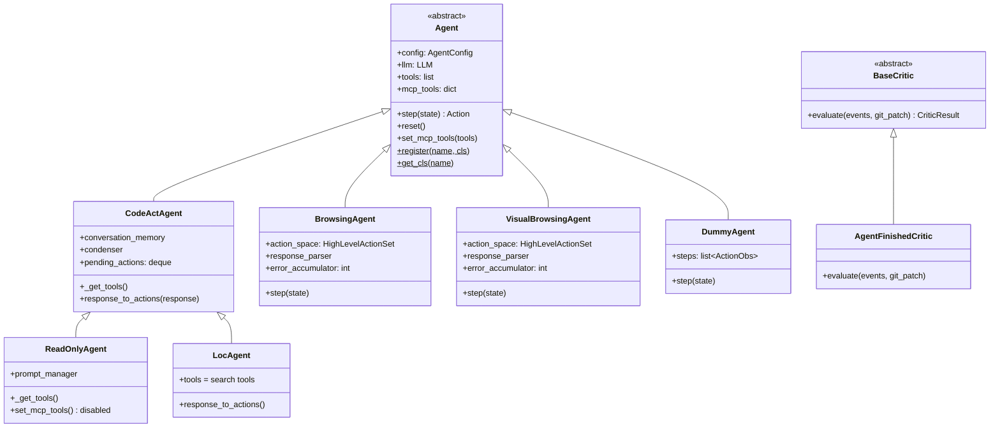
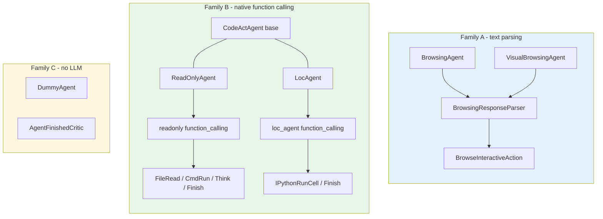
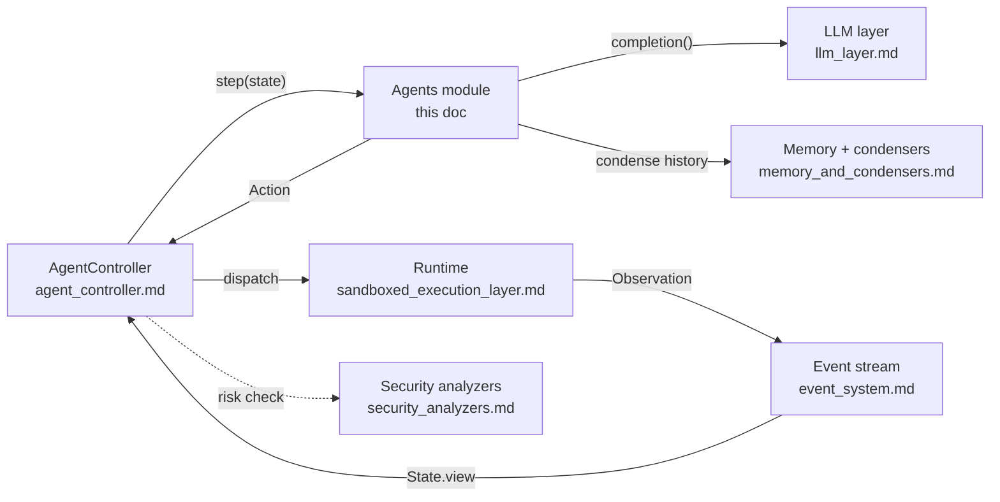
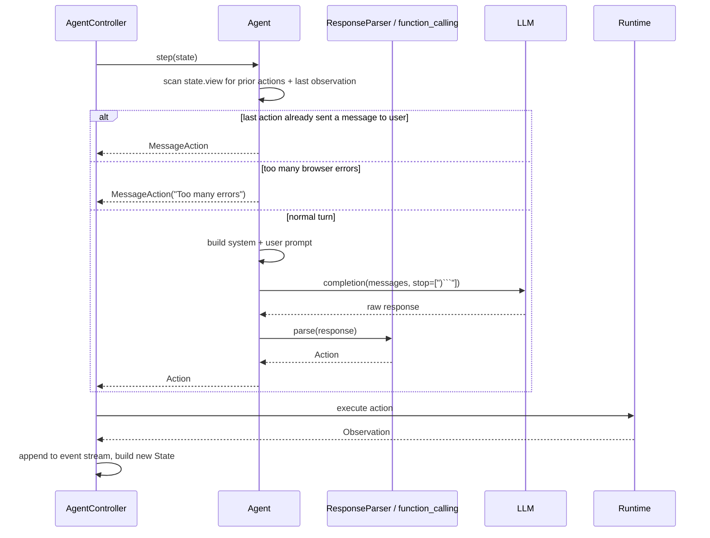
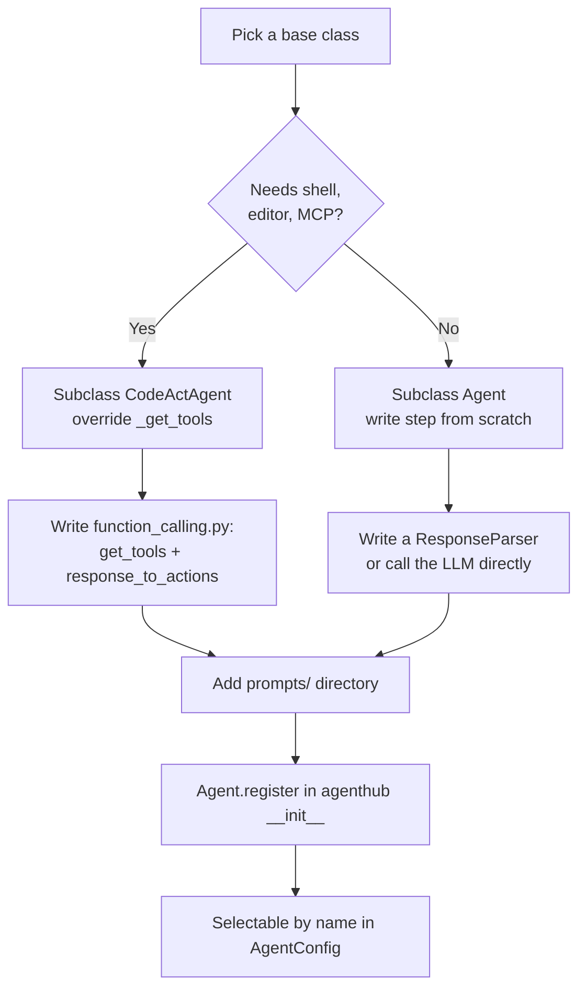

# Agents Module

## 1. Purpose

The `agents` module is the **agent zoo** of OpenHands. It holds the concrete agent
implementations that live under `openhands/agenthub/`, plus the small `openhands/critic/`
package that scores whether an agent run actually succeeded.

An *agent* in OpenHands is a policy. It looks at the conversation so far (the `State`)
and returns exactly one `Action`. It does not run anything itself. The
[agent controller](agent_controller.md) drives the loop, sends the action to the
[runtime](sandboxed_execution_layer.md), and feeds the resulting `Observation` back.

So the whole job of this module is one function, repeated:

```
State  ──►  Agent.step()  ──►  Action
```

Everything else in the module — prompt building, response parsing, tool lists —
exists to make that one function work for a particular kind of task.

### What lives here

| Agent | What it is good at | Talks to LLM? |
|---|---|---|
| `BrowsingAgent` | Text-only web browsing via the accessibility tree | Yes |
| `VisualBrowsingAgent` | Web browsing with screenshots ("set of marks") | Yes (vision) |
| `ReadOnlyAgent` | Exploring a codebase without changing anything | Yes |
| `LocAgent` | Finding *where* code lives (fault localization) | Yes |
| `DummyAgent` | Fixed script of actions for end-to-end tests | No |
| `AgentFinishedCritic` | Scoring a finished run 0 or 1 | No |

### Sub-module index

| Sub-module | Covers | Document |
|---|---|---|
| Browsing agents | `BrowsingAgent`, `VisualBrowsingAgent`, `BrowsingResponseParser`, `BrowsingActionParserMessage`, `BrowsingActionParserBrowseInteractive` | [agents_browsing.md](agents_browsing.md) |
| CodeAct variants | `ReadOnlyAgent`, `LocAgent` | [agents_codeact_variants.md](agents_codeact_variants.md) |
| Test agent and critics | `DummyAgent`, `AgentFinishedCritic` | [agents_testing_and_critics.md](agents_testing_and_critics.md) |

---

## 2. Architecture Overview

Every agent here descends from the abstract `Agent` base class in
`openhands/controller/agent.py`. That base class is *not* part of this module — it is
owned by [agent_controller](agent_controller.md) — but it is the contract everything
here implements.



### Two families of agents

The agents split cleanly into two families, and the split matters because they use
completely different ways of turning an LLM reply into an `Action`.



**Family A** asks the model for free text wrapped in triple backticks, then parses it
with a chain of `ActionParser` objects. **Family B** uses the LLM provider's native
tool-calling API and maps each `tool_call` to an `Action`. Family B is the modern path;
Family A survives because BrowserGym's action space is a Python-code DSL, not a JSON
schema.

### Where the module sits in the system



The agents module is deliberately **passive**. It never touches the event stream, never
starts a sandbox, never persists anything. It is handed a read-only `State` and returns
an `Action`. That keeps agents easy to test and easy to swap.

---

## 3. The Step Loop in Detail

This is the sequence for one turn of a browsing agent. The shape is the same for all
agents; only the middle box changes.



Two details are worth calling out because they repeat across agents:

- **Self-termination.** An agent ends its own run by returning `AgentFinishAction`.
  Both browsing agents do this when they spot an agent-sourced `MessageAction` already
  in the history — that means the model already answered the user.
- **Error budget.** `error_accumulator` counts consecutive browser failures. Past five,
  the agent gives up with a plain message instead of looping forever. This is an
  agent-local guard and is separate from the controller's global
  [stuck detection](agent_controller_safeguards_stuck_detection.md).

---

## 4. Sub-modules

The module is documented in three parts, grouped by how each agent turns an LLM reply
into an action.

### 4.1 Browsing Agents — [`agents_browsing.md`](agents_browsing.md)

`BrowsingAgent`, `VisualBrowsingAgent`, and the shared `BrowsingResponseParser` with its
two action parsers.

These agents wrap **BrowserGym**. They build a prompt out of the page URL, a flattened
accessibility tree, the list of open tabs, and the history of previous browser commands.
The model replies with a short chain of thought plus a Python-ish command in backticks,
such as `click("12")` or `goto('https://...')`. The parser splits thought from command
and emits a `BrowseInteractiveAction`.

`VisualBrowsingAgent` adds vision: it attaches the page screenshot (annotated with a
"set of marks") and any goal images as `ImageContent`, and uses a richer action space
that includes tab control and an "infeasible" signal.

The actions produced here are executed by the
[browser environment](browser_environment.md).

### 4.2 CodeAct Variants — [`agents_codeact_variants.md`](agents_codeact_variants.md)

`ReadOnlyAgent` and `LocAgent`.

Both subclass `CodeActAgent` and change almost nothing except **which tools the model is
allowed to call**. This is the cheapest and most common way to make a new agent in
OpenHands: inherit the loop, narrow the tool list, swap the prompt directory.

- `ReadOnlyAgent` exposes only `grep`, `glob`, `view`, `think`, and `finish`. It cannot
  write, run arbitrary commands, or use MCP tools — `set_mcp_tools` is overridden to log
  a warning and drop them. Use it to explore a repo with a hard safety guarantee.
- `LocAgent` exposes only repo-search tools (`search_code_snippets`,
  `get_entity_contents`, `explore_tree_structure`) plus `finish`. Its tool calls are
  turned into `IPythonRunCellAction`, so the searches actually run inside the Jupyter
  plugin in the sandbox.

Both rely on the parent's `ConversationMemory` and condenser wiring, described in
[memory_and_condensers.md](memory_and_condensers.md).

### 4.3 Test Agent and Critics — [`agents_testing_and_critics.md`](agents_testing_and_critics.md)

`DummyAgent` and `AgentFinishedCritic`.

`DummyAgent` is a fixed script. It returns a hard-coded action per iteration — a message,
an echo command, a file write, a file read, a bash run, a reject, a finish — and compares
the observations it got back against the ones it expected, printing warnings on mismatch.
No LLM call is ever made, so it is used to smoke-test the controller-runtime pipeline end
to end.

`AgentFinishedCritic` is the simplest possible run scorer: score 1 if the last action was
`AgentFinishAction` and the git patch is non-empty, otherwise 0. It is used by evaluation
harnesses to decide whether a trajectory counts as a success.

---

## 5. How to Add a New Agent



The registry lives on the base class: `Agent.register(name, cls)` and
`Agent.get_cls(name)`. Config picks an agent by string name, so a new agent becomes
usable the moment it is registered — no controller changes needed.

---

## 6. Key Design Points

**Agents are stateless between runs.** `reset()` clears agent-local counters
(`error_accumulator`, `pending_actions`) but deliberately leaves LLM metrics alone, so
token accounting survives a reset. See [llm_layer.md](llm_layer.md) for how `Metrics` is
tracked.

**History comes from `state.view`, not `state.history`.** `view` is the *condensed*
history produced by the condenser pipeline. Long conversations get trimmed or summarized
before the agent ever sees them, which is what keeps agents inside the context window on
long tasks.

**One LLM per agent, resolved from the registry.** The base `Agent.__init__` calls
`llm_registry.get_llm_from_agent_config(...)`. `CodeActAgent` then optionally swaps in a
router (for example `MultimodalRouter`), so a single agent can dispatch to different
models per turn.

**Multiple actions per response.** Function-calling agents can get several `tool_calls`
back at once. `CodeActAgent` queues them in `pending_actions` and drains one per `step()`
call, keeping the one-action-per-step contract with the controller intact.

---

## 7. Related Documentation

| Topic | Document |
|---|---|
| The loop that calls `step()` | [agent_controller.md](agent_controller.md) |
| `State`, `View`, iteration flags | [agent_controller_state.md](agent_controller_state.md) |
| Stuck detection and replay | [agent_controller_safeguards.md](agent_controller_safeguards.md) |
| LLM registry, routers, metrics | [llm_layer.md](llm_layer.md) |
| Condensers and conversation memory | [memory_and_condensers.md](memory_and_condensers.md) |
| Microagent knowledge injection | [microagents.md](microagents.md) |
| Risk analysis on agent actions | [security_analyzers.md](security_analyzers.md) |
| Where actions get executed | [sandboxed_execution_layer.md](sandboxed_execution_layer.md) |
| Browser env behind browsing agents | [browser_environment.md](browser_environment.md) |
| Action and Observation event types | [event_system.md](event_system.md) |
| `AgentConfig`, condenser config | [core_configuration.md](core_configuration.md) |
| `PromptManager`, `AgentState` enum | [core_schema_and_runtime_support.md](core_schema_and_runtime_support.md) |
