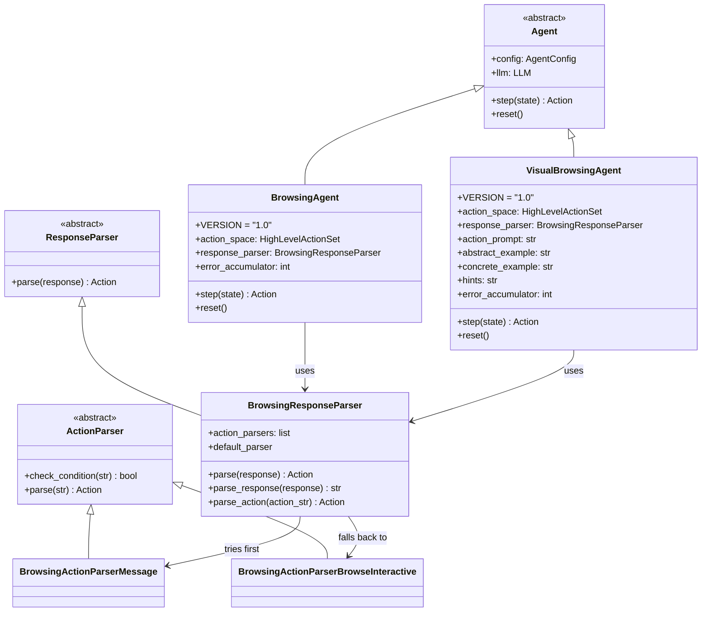
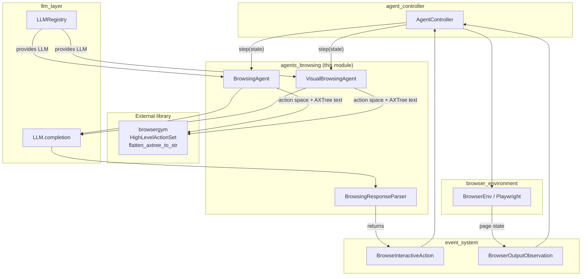
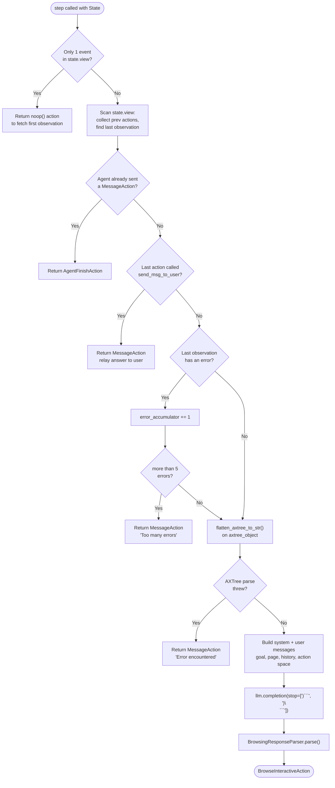
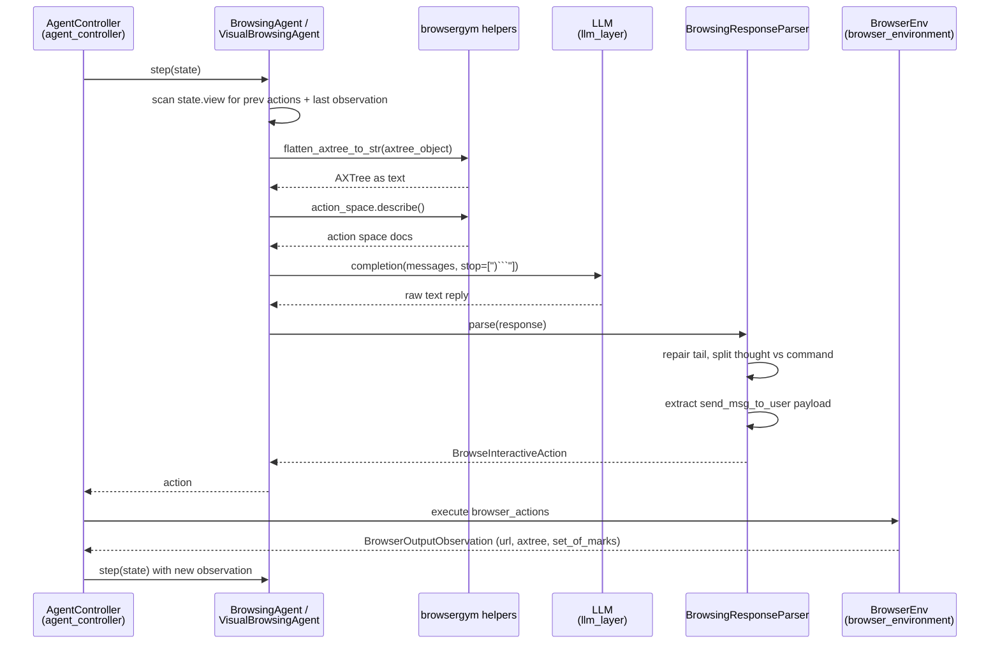

# Agents Browsing Module

## 1. Purpose

The `agents_browsing` module holds the two OpenHands agents whose whole job is to
**drive a web browser**: `BrowsingAgent` (text-only) and `VisualBrowsingAgent`
(text plus screenshots). It also holds the small parser package that turns the raw
LLM reply back into a real OpenHands action.

These agents do not touch the browser themselves. They only *decide* what the next
browser command should be. The command travels as a `BrowseInteractiveAction` event
through the [event system](event_system.md), the
[agent controller](agent_controller.md) hands it to the
[browser environment](browser_environment.md), and the resulting page comes back as a
`BrowserOutputObservation`.

So the module is one small loop, repeated until the task is done:

```
page observation  ──►  build prompt  ──►  LLM  ──►  parse reply  ──►  browser command
```

### Why two agents?

| | `BrowsingAgent` | `VisualBrowsingAgent` |
|---|---|---|
| What the LLM sees | Accessibility tree (AXTree) text only | AXTree text **and** a marked-up screenshot |
| Needs a vision model? | No | Yes |
| Action subsets | `chat`, `bid`, `nav`*  | `chat`, `bid`, `nav`, `tab`, `infeas` |
| Many actions per step | Yes (`multiaction=True`) | No (one action per step) |
| AXTree filtering | Visible elements only | Full tree, visibility shown as a tag |
| History given to LLM | Action strings only | Action strings **and** the thought behind each |
| Benchmark switches | `USE_NAV`, `USE_CONCISE_ANSWER` env vars | None (always full action set) |

\* `nav` is dropped when the `USE_NAV` env var is `false`.

Both agents share the exact same response parser, so the LLM output format is
identical for both.

---

## 2. Architecture Overview

Both agents subclass the abstract `Agent` base class owned by
[agent_controller](agent_controller.md). That base class gives them an `llm` (pulled
from the [LLM registry](llm_layer.md)) and demands one method: `step(state) -> Action`.



### Where the module sits in the system



The module never imports the runtime or the controller loop directly. It only reads
`State` and writes `Action` objects, which keeps browsing swappable and testable.

---

## 3. The Step Cycle

Both agents follow the same seven stages inside `step()`. The differences are in what
goes into the prompt, not in the shape of the loop.



### Exit paths

`step()` can return four different things, and only one of them keeps the loop going:

| Return value | Meaning |
|---|---|
| `BrowseInteractiveAction` | Normal case — run this browser command next |
| `MessageAction` | Talk to the user (answer found, or give up) |
| `AgentFinishAction` | Task is over, close the delegate |
| `BrowseInteractiveAction('noop()')` | Cold start — kick the browser so a first observation exists |

### Shared safety valves

- **Error budget.** Each agent counts failed browser actions in `error_accumulator`.
  Past five, it stops instead of looping forever. The counter is cleared by `reset()`,
  which deliberately does *not* clear LLM metrics.
- **Stop sequences.** Both calls pass `stop=[')```', ')\n```']`, so the LLM is cut off
  right after it closes the action. The parser then repairs the truncated tail.
- **First-action trim.** The bootstrap `noop()` is dropped from the history before the
  prompt is built, so the LLM never sees it.

Note that stuck-detection and iteration limits are *not* handled here — those belong to
[agent_controller_safeguards](agent_controller_safeguards.md).

---

## 4. Sub-modules

The module splits into three parts: one per agent, plus the shared parser.

### 4.1 Text Browsing Agent — [`agents_browsing_text_agent.md`](agents_browsing_text_agent.md)

`BrowsingAgent` is the lightweight, text-only browser driver. It flattens the page
accessibility tree to a string (visible elements only), pastes it into a compact
prompt together with the goal and the list of previous action strings, and asks the
LLM for the next command. It supports `multiaction`, so one reply can contain several
browser commands.

It is also the agent used for the WebArena and MiniWoB++ benchmarks, which is why it
reads two environment variables (`USE_NAV`, `USE_CONCISE_ANSWER`) that together flip
it into a stricter `EVAL_MODE`.

Covers: `BrowsingAgent`, its prompt builders (`get_system_message`, `get_prompt`,
`get_error_prefix`) and the `EVAL_MODE` behaviour.

### 4.2 Visual Browsing Agent — [`agents_browsing_visual_agent.md`](agents_browsing_visual_agent.md)

`VisualBrowsingAgent` does the same job with a multimodal model. On top of the AXTree
it sends the *set-of-marks* screenshot — a picture of the page with element ids drawn
on it — plus any images the user attached to the goal. Its prompt is much richer:
open-tab list, focused element, full (unfiltered) AXTree with `visible`/`clickable`
tags, a full interaction history including each past thought, hints about tricky
widgets, and both an abstract and a concrete formatting example.

It restricts itself to one action per step and adds the `tab` and `infeas` action
subsets, so it can switch tabs and declare a task impossible.

Covers: `VisualBrowsingAgent` and its prompt builders (`create_goal_prompt`,
`create_observation_prompt`, `get_tabs`, `get_axtree`, `get_action_prompt`,
`get_history_prompt`).

### 4.3 Response Parsing — [`agents_browsing_response_parsing.md`](agents_browsing_response_parsing.md)

The parser package converts a free-text LLM reply into a `BrowseInteractiveAction`. It
repairs the truncated tail left by the stop sequences, splits the reply into *thought*
and *browser command* around the triple-backtick fence, and — when the command is
`send_msg_to_user(...)` — pulls the message text out with `ast.parse`, falling back to a
regex when the LLM produced invalid Python.

Covers: `BrowsingResponseParser`, `BrowsingActionParserMessage`,
`BrowsingActionParserBrowseInteractive`.

---

## 5. Data Flow Across the Sub-modules



---

## 6. Related Modules

| Module | Relationship |
|---|---|
| [agents](agents.md) | Parent module — the full agent zoo this one belongs to |
| [agent_controller](agent_controller.md) | Owns the `Agent` base class, `State`, and the loop that calls `step()` |
| [agent_controller_safeguards](agent_controller_safeguards.md) | Stuck detection and replay, layered above these agents |
| [browser_environment](browser_environment.md) | `BrowserEnv` — actually runs the browser commands |
| [llm_layer](llm_layer.md) | `LLMRegistry` supplies the `LLM`; `Metrics` tracks token cost |
| [event_system](event_system.md) | `BrowseInteractiveAction` / `BrowserOutputObservation` event types |
| [memory_and_condensers](memory_and_condensers.md) | `BrowserOutputCondenser` trims old page dumps out of the history |
| [core_schema_and_runtime_support](core_schema_and_runtime_support.md) | `Message`, `TextContent`, `ImageContent`, `ActionType` |
| [agents_codeact_variants](agents_codeact_variants.md) | Sibling agents built on the tool-calling `CodeActAgent` instead |
