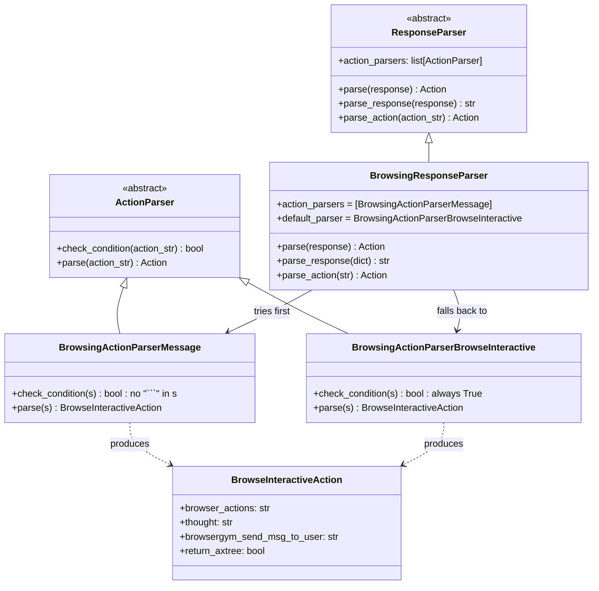
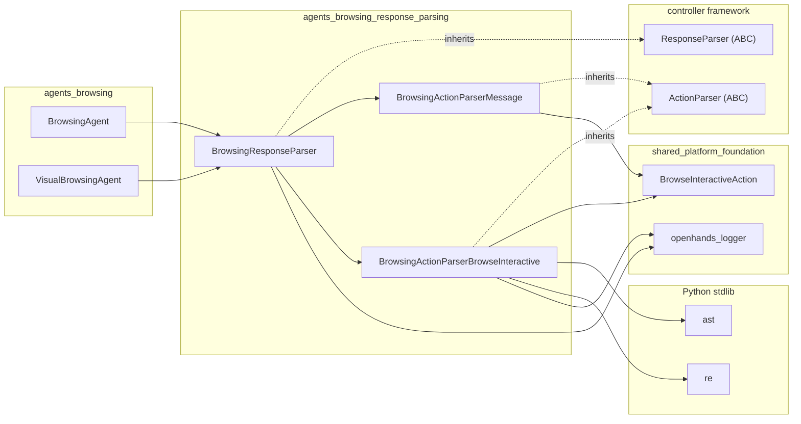
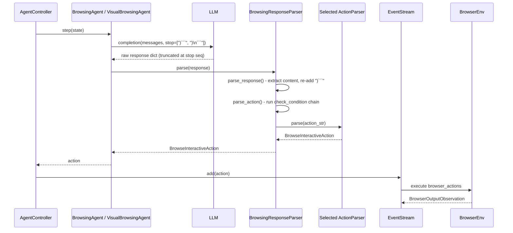
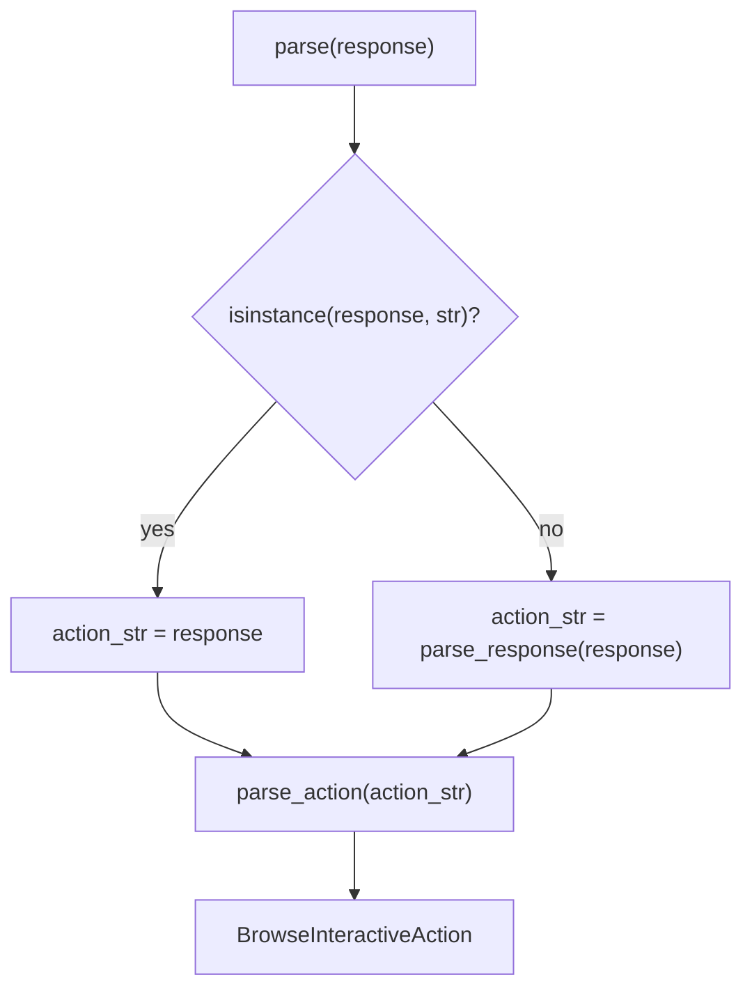
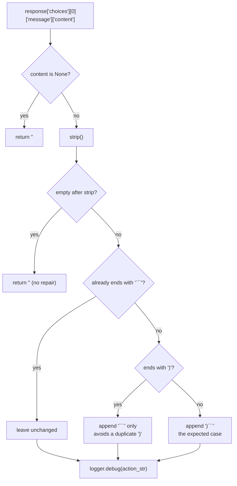
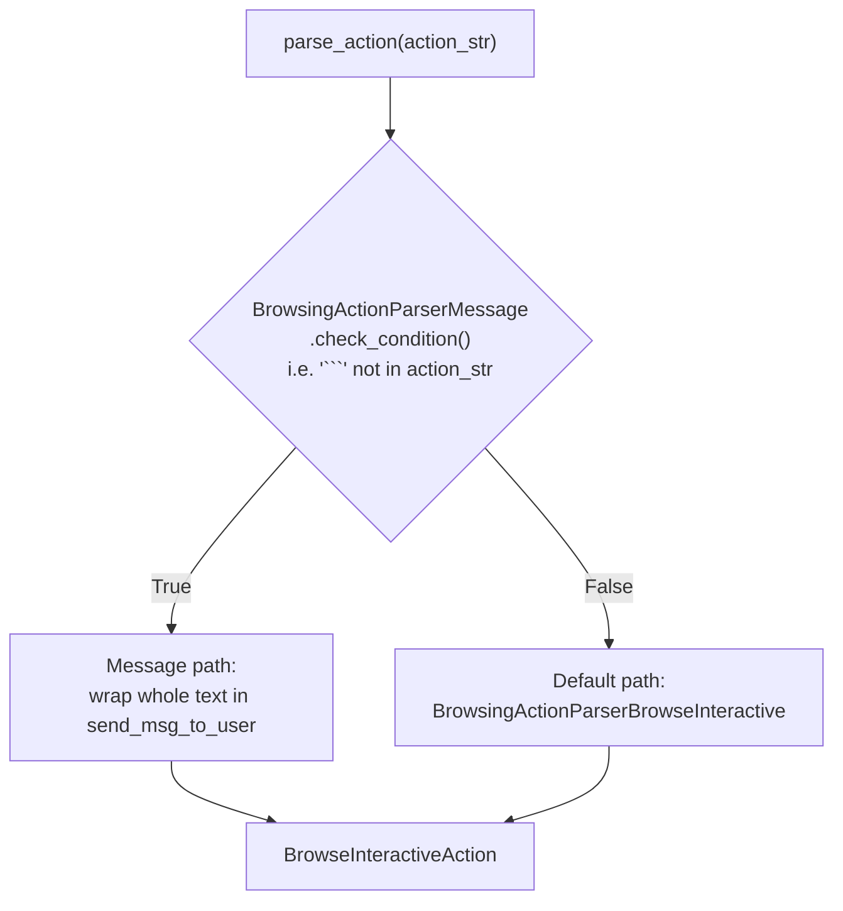
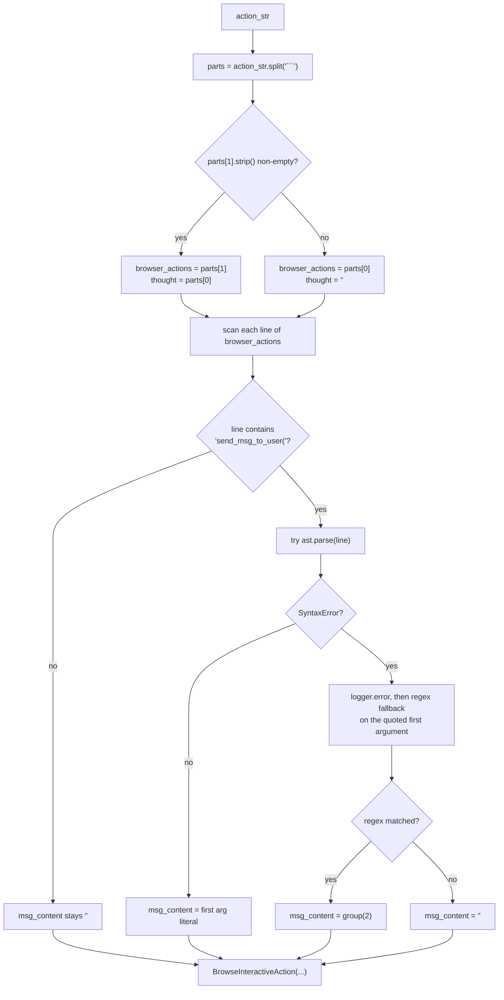
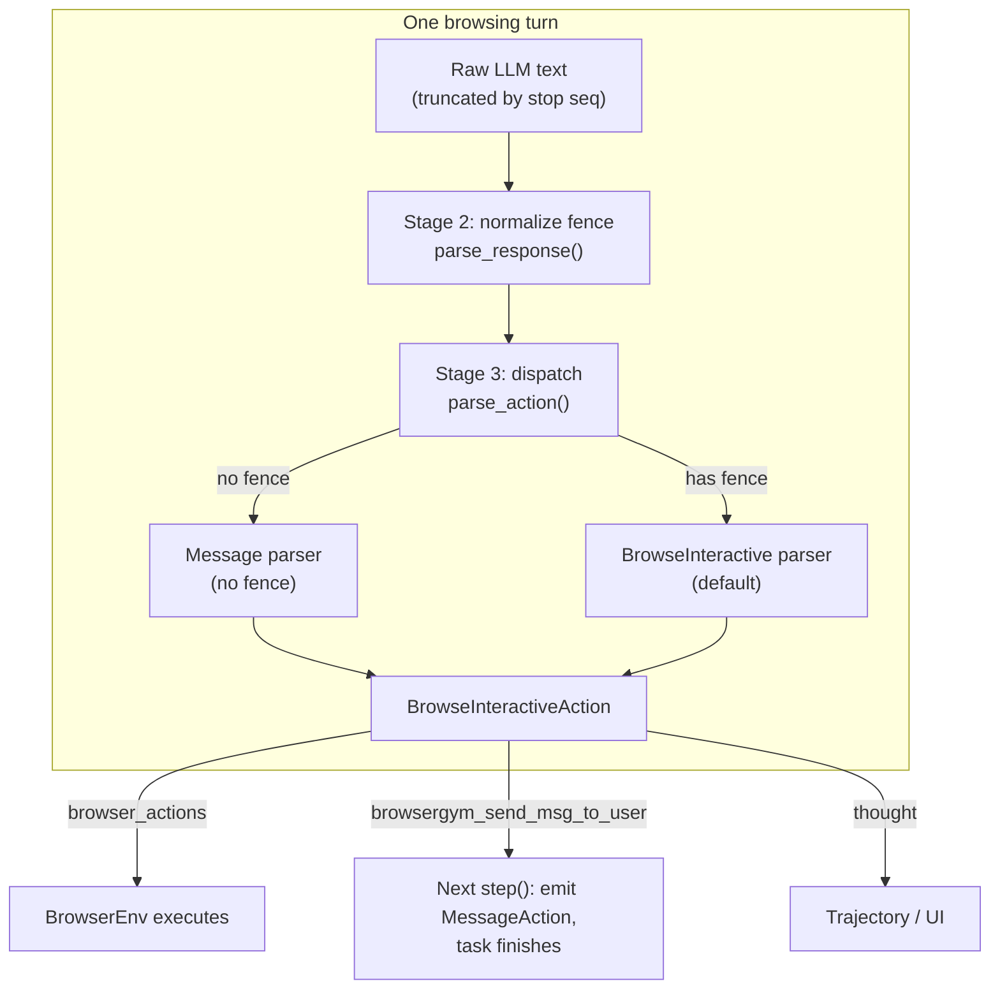

# Browsing Response Parsing

## Introduction

The `agents_browsing_response_parsing` module is a small but critical translation layer. It sits between the LLM and the browser. The LLM writes free-form text. The browser needs a clean, runnable command. This module turns the first into the second.

It is used by both browsing agents in OpenHands:

- [`BrowsingAgent`](agents_browsing_text_agent.md) — the text (accessibility-tree) browsing agent
- [`VisualBrowsingAgent`](agents_browsing_visual_agent.md) — the screenshot-based browsing agent

Both agents hold the exact same parser instance type as a class attribute (`response_parser = BrowsingResponseParser()`) and call `self.response_parser.parse(response)` as the last line of their `step()` method. So this module is the single, shared exit point for every browsing LLM turn.

**Source file:** `openhands/agenthub/browsing_agent/response_parser.py`

**Core components:**

| Component | Role |
| --- | --- |
| `BrowsingResponseParser` | Entry point. Cleans up the raw LLM response, then picks a parser to run. |
| `BrowsingActionParserMessage` | Fallback for text-only replies (no code fence). Wraps the text as a message to the user. |
| `BrowsingActionParserBrowseInteractive` | Default parser. Splits thought from browser code and pulls out any `send_msg_to_user(...)` text. |

---

## Why this module exists

The browsing agents ask the LLM for a [BrowserGym](browser_environment.md) command, in a very specific shape:

```
<optional free-text reasoning>
```
click('81')
```

Two things make this messy in practice:

1. **The completion is cut short on purpose.** Both agents pass `stop=[')```', ')\n```']` to `llm.completion()`. The stop sequence is consumed, so the text that comes back is *missing* its own closing `)` and closing fence. Someone has to put them back.
2. **LLMs do not always follow the format.** Sometimes there is no fence at all. Sometimes there is a stray extra `)`. Sometimes the "action" is really just a sentence meant for the user.

This module absorbs all of that. Its contract is simple and total: **it always returns a valid `BrowseInteractiveAction`, never an error.** Downstream code — the [agent controller](agent_controller_core.md) and the [browser environment](browser_environment.md) — never has to handle a parse failure.

---

## Architecture

The module plugs into the generic parser framework declared in `openhands/controller/action_parser.py`.



The design is a **chain-of-responsibility with a guaranteed terminal handler**:

- `action_parsers` is an ordered list of candidate parsers. Each is asked `check_condition(action_str)`; the first one that says yes wins.
- `default_parser` runs when nobody in the list matched. Because `BrowsingActionParserBrowseInteractive.check_condition()` returns `True` unconditionally, it works equally well as a default — it can never reject input.

> **Note on ordering.** The comment in `__init__` (`"Need to pay attention to the item order"`) matters. `BrowsingActionParserMessage` is the *narrow* case (no fence) and must be checked before the catch-all. Adding a new parser means deciding where in the list it belongs.

---

## Dependencies



The dependency set is deliberately tiny — two abstract base classes, one event dataclass, a logger, and two stdlib modules. There is no LLM call, no I/O, and no state. That makes the module pure and easy to unit test (see `tests/unit/agenthub/browsing_agent/test_browsing_agent_parser.py`).

Related module documentation:

- `BrowseInteractiveAction` and the rest of the action/observation model: [event_system](event_system.md)
- Where the produced action is executed: [browser_environment](browser_environment.md)
- Who consumes the returned action: [agent_controller_core](agent_controller_core.md)
- Logging behavior: [logging](logging.md)

---

## Data flow

End-to-end path of one browsing turn:



Note the loop-closing detail: on the *next* `step()`, the agent inspects the last `BrowseInteractiveAction`. If its `browsergym_send_msg_to_user` field is non-empty, the agent emits a `MessageAction` and the task is considered done. That means the `browsergym_send_msg_to_user` field this module populates is the agent's **termination signal**. Getting it right is what lets a browsing task finish.

---

## Processing pipeline

### Stage 1 — `parse(response)`

Accepts either a raw string or a full LLM response dict, so the parser can be driven directly in tests or from a live completion.



### Stage 2 — `parse_response(response)`: normalize the fence

This stage repairs the damage done by the stop sequence.



The two-branch repair is the subtle part:

| Input from LLM | Why | Output |
| --- | --- | --- |
| `click('81'` | stop seq ate `)` and the fence | `click('81')```  |
| `click('81')` | model already closed the paren | `click('81')```  |
| ``` ```click('81')``` ``` | model already closed the fence | unchanged |

Without the `endswith(')')` check you would get `send_msg_to_user('Done'))` — a stray paren that breaks the downstream `ast.parse`.

### Stage 3 — `parse_action(action_str)`: dispatch



---

## The two leaf parsers

### `BrowsingActionParserMessage` — the "LLM ignored the format" path

Triggered when the response contains **no backtick fence at all**. In practice that means the model replied in prose instead of emitting a command. Rather than error out, the parser treats the whole reply as something to say to the user:

```python
msg = f'send_msg_to_user("""{action_str}""")'
return BrowseInteractiveAction(
    browser_actions=msg,          # a valid BrowserGym call
    thought=action_str,           # the raw prose, kept as the thought
    browsergym_send_msg_to_user=action_str,   # triggers task completion
)
```

Triple-quoting is what makes this safe — the prose can contain single quotes, double quotes, and newlines without breaking the synthesized call.

Because `browsergym_send_msg_to_user` is set, this path effectively ends the browsing task on the next step. A format violation is turned into a graceful hand-back to the user instead of a crash.

### `BrowsingActionParserBrowseInteractive` — the normal path

This handles everything with a fence. It does three jobs.



**Job 1 — split thought from code.** `split('```')` gives at least two parts because stage 2 guaranteed a trailing fence.

- `parts[1]` non-empty → the model wrote reasoning *then* a fenced block. `parts[0]` is the thought.
- `parts[1]` empty → there was no leading prose; the whole thing before the fence is the command, and there is no thought.

This handles both `` click('81')``` `` (bare command) and ``` ```click('81')``` ``` (leading fence) correctly, since a leading fence makes `parts[0]` empty and pushes the code into `parts[1]`.

**Job 2 — extract the user message.** Each line of `browser_actions` is checked for `send_msg_to_user(`. The primary strategy is `ast.parse` — a real Python parse, which correctly handles quoting, escapes, and nesting. The extracted value is `tree.body[0].value.args[0].value`, i.e. the first positional argument's literal.

**Job 3 — degrade gracefully.** If `ast.parse` raises `SyntaxError` (which happens with real inputs like the surplus-paren case `send_msg_to_user('...'))`), the parser logs the error and falls back to a regex that pulls the quoted string out anyway. If even that fails, `msg_content` is `''` — a missing message, not an exception.

This two-tier strategy is why the failing test case `send_msg_to_user('The server might not be running...'))```  ` still yields the correct message text.

> **Multi-line caveat.** The loop assigns `msg_content` on every match without breaking, so if the LLM emits several `send_msg_to_user(...)` calls (BrowserGym multi-action is enabled in `BrowsingAgent`), the **last** one wins. Also, an `ast.parse` failure that isn't a `SyntaxError` — e.g. an `IndexError` from a call with no arguments, or an `AttributeError` from a non-call expression — is not caught here.

---

## Output contract

Every path returns a `BrowseInteractiveAction` with these fields:

| Field | Meaning | Consumer |
| --- | --- | --- |
| `browser_actions` | BrowserGym code to execute | [`BrowserEnv`](browser_environment.md) |
| `thought` | The model's free-text reasoning, or `''` | UI / trajectory logs |
| `browsergym_send_msg_to_user` | Text to relay to the user; non-empty ends the task | agent `step()` on the next turn |
| `return_axtree` | Left at its `False` default by this module | `BrowserEnv` |

`return_axtree` is worth calling out: this module never sets it, so it stays `False`. Accessibility-tree retrieval is decided elsewhere, not by the parser.

---

## Component interaction summary



---

## Extending the module

To support a new response shape, add an `ActionParser` subclass and insert it into `self.action_parsers` at the right position:

```python
class MyNewParser(ActionParser):
    def check_condition(self, action_str: str) -> bool:
        return action_str.startswith('SPECIAL:')

    def parse(self, action_str: str) -> Action:
        ...

# in BrowsingResponseParser.__init__ — order matters
self.action_parsers = [MyNewParser(), BrowsingActionParserMessage()]
```

Two rules to keep the module's guarantees intact:

1. **Order from narrow to broad.** A parser with a loose `check_condition` placed early will shadow every parser after it.
2. **Never raise from `parse()`.** The whole value of this layer is that the controller never sees a parse error. Failures should degrade to a sensible `BrowseInteractiveAction` — ideally one that sets `browsergym_send_msg_to_user` so the user learns what went wrong.

## Related modules

- [agents_browsing_text_agent](agents_browsing_text_agent.md) — the `BrowsingAgent` that owns this parser
- [agents_browsing_visual_agent](agents_browsing_visual_agent.md) — the `VisualBrowsingAgent` that reuses it
- [agents_browsing](agents_browsing.md) — parent module overview
- [browser_environment](browser_environment.md) — executes the parsed `browser_actions`
- [event_system](event_system.md) — the action/observation types and event stream
- [agent_controller_core](agent_controller_core.md) — drives `step()` and consumes the returned action
