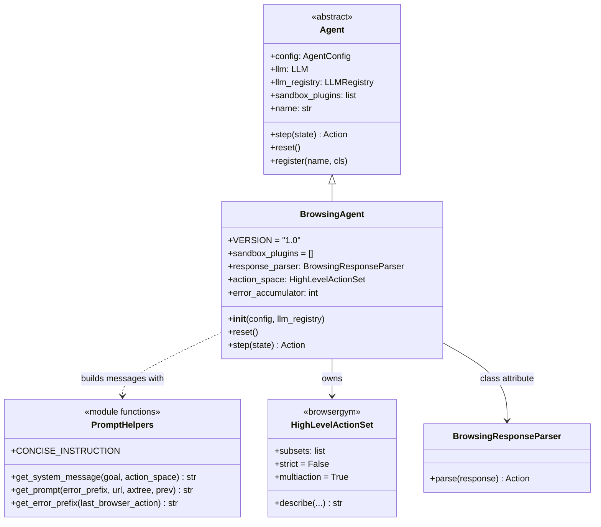
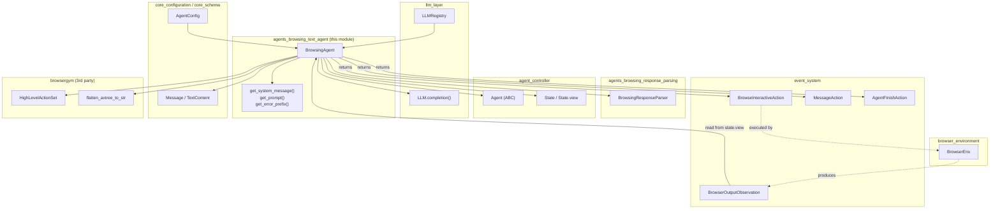
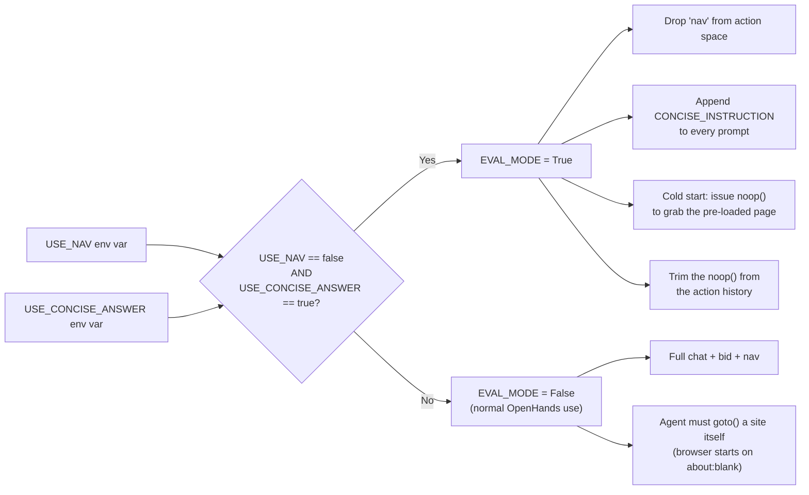
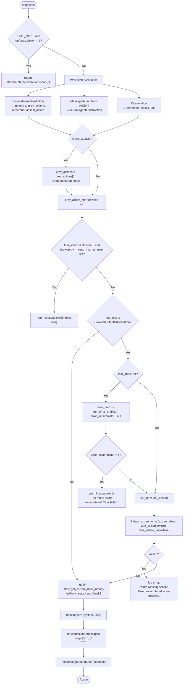
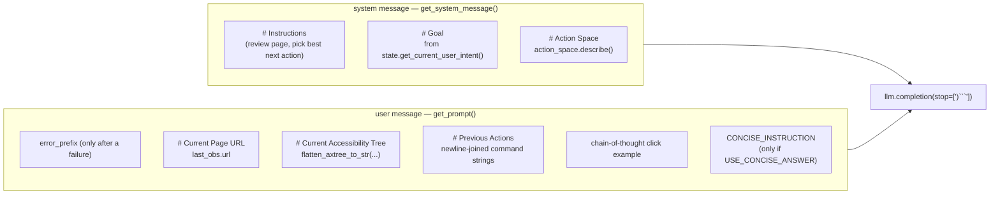
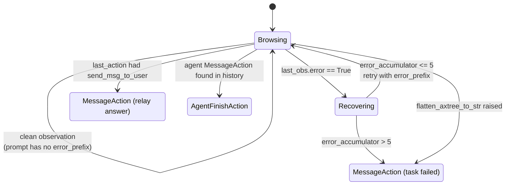
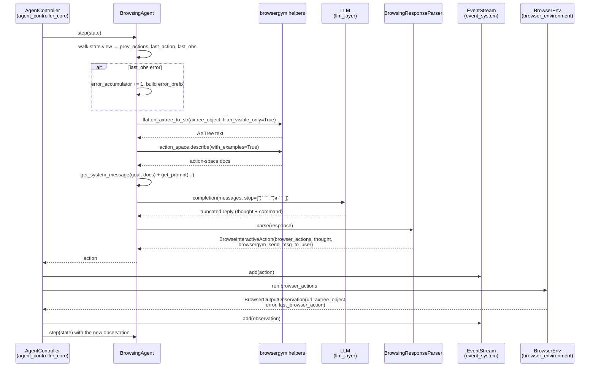
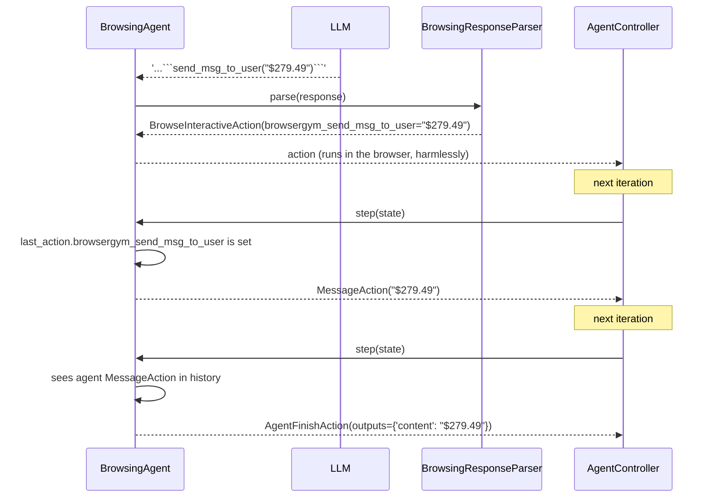

# Agents Browsing — Text Agent Module

## 1. Purpose

The `agents_browsing_text_agent` module contains a single class: **`BrowsingAgent`**
(`openhands/agenthub/browsing_agent/browsing_agent.py`). It is the *text-only* web
browsing agent of OpenHands — a port of the BrowserGym
[demo agent](https://github.com/ServiceNow/BrowserGym/tree/main/demo_agent).

Its job is narrow and stateless-by-design:

> Look at the current web page as **text**, look at what was clicked before, and decide
> the next browser command.

It never touches a real browser. It reads a `State`, builds a prompt, calls an LLM, and
returns an `Action`. Everything else — running Playwright, retrying, counting
iterations — belongs to other modules.

```
BrowserOutputObservation ──► flatten AXTree ──► prompt ──► LLM ──► parser ──► BrowseInteractiveAction
```

The parent module doc, [agents_browsing](agents_browsing.md), compares this agent with
its multimodal sibling [agents_browsing_visual_agent](agents_browsing_visual_agent.md).
This page focuses only on how `BrowsingAgent` itself works.

### Key facts at a glance

| Property | Value |
|---|---|
| Class | `BrowsingAgent(Agent)` |
| `VERSION` | `'1.0'` |
| Registered as | `'BrowsingAgent'` (in `browsing_agent/__init__.py`) |
| Page representation | Accessibility tree (AXTree) flattened to text, **visible elements only** |
| Screenshots used? | No — text model is enough |
| Action subsets | `chat`, `bid`, and `nav` (unless disabled) |
| Multiple actions per reply | Yes (`multiaction=True`) |
| `sandbox_plugins` | Empty list — needs no Jupyter/VSCode/AgentSkills plugin |
| Own mutable state | `error_accumulator` (an int) |
| Env vars read | `USE_NAV`, `USE_CONCISE_ANSWER` |

---

## 2. Architecture

### 2.1 Class and collaborators

`BrowsingAgent` is thin. Most of the file is actually free functions that build prompt
strings; the class itself only wires them together.



The base `Agent` class (owned by [agent_controller](agent_controller.md)) does two
important things in `__init__`, which `BrowsingAgent` inherits via `super().__init__`:

1. Pulls the LLM out of the registry — `llm_registry.get_llm_from_agent_config('agent', config)`.
2. Stores `config` (an `AgentConfig`, see [core_configuration](core_configuration.md)).

`BrowsingAgent` deliberately ignores the base class's `prompt_manager`, `tools`, and
`mcp_tools` machinery. It writes its prompt by hand and exposes no tool schema, so it
also gets no `SystemMessageAction` in the event stream the way tool-calling agents do.

### 2.2 Dependency map



Note the dashed arrows: the agent never calls `BrowserEnv`. The controller does that on
its behalf, which is what keeps this module free of runtime imports and easy to unit
test with a fake `State`.

---

## 3. Construction and Action Space

```python
action_subsets = ['chat', 'bid']
if USE_NAV:
    action_subsets.append('nav')
self.action_space = HighLevelActionSet(
    subsets=action_subsets,
    strict=False,      # tolerate sloppy LLM formatting
    multiaction=True,  # allow several commands in one reply
)
```

| Subset | What it unlocks |
|---|---|
| `chat` | `send_msg_to_user(...)` — the only way this agent talks to a human |
| `bid` | Element-level interaction by browser id: `click`, `fill`, `select_option`, `hover`, … |
| `nav` | Page-level navigation: `goto`, `go_back`, `go_forward` |

Two settings matter a lot in practice:

- **`strict=False`** — BrowserGym will still accept a command with a small syntax slip.
  This pairs with the parser's repair logic (see
  [agents_browsing_response_parsing](agents_browsing_response_parsing.md)).
- **`multiaction=True`** — one LLM reply may contain several newline-separated commands,
  e.g. `fill("32", "openhands")` followed by `click("35")`. This is the biggest
  behavioural difference from the visual agent, which allows only one action per step.

`action_space.describe(with_long_description=False, with_examples=True)` is called on
every step and pasted into the system message. The description is short-form plus
examples, which keeps the prompt small while still showing the exact call syntax.

---

## 4. Benchmark Mode (`EVAL_MODE`)

Two environment variables are read **once at import time** — not per instance — so they
apply process-wide:

```python
USE_NAV            = os.environ.get('USE_NAV', 'true') == 'true'
USE_CONCISE_ANSWER = os.environ.get('USE_CONCISE_ANSWER', 'false') == 'true'
EVAL_MODE = (not USE_NAV) and USE_CONCISE_ANSWER
```



Why this exists: WebArena and MiniWoB++ start the browser **already on the task page**
and score a short final answer string.

- Dropping `nav` stops the agent from wandering off the benchmark site.
- `CONCISE_INSTRUCTION` adds a worked example showing a bare value
  (`send_msg_to_user("$279.49")`) rather than a chatty sentence, so the graded answer
  matches the expected string.
- The `noop()` cold start exists because the benchmark's first observation only appears
  after one environment step. In normal OpenHands use the browser starts blank, so the
  agent is expected to navigate somewhere first and no `noop()` is needed.

Note the asymmetry: `USE_CONCISE_ANSWER` alone does **not** turn on `EVAL_MODE`, but it
*does* still append `CONCISE_INSTRUCTION` (that check is on `USE_CONCISE_ANSWER`, inside
`get_prompt`). So you can ask for concise answers without the rest of eval behaviour.

---

## 5. The `step()` Method in Detail

`step(state) -> Action` is the whole agent. It is pure with respect to `state` apart
from bumping `error_accumulator`.

### 5.1 Control flow



### 5.2 What the history scan collects

The loop over `state.view` is the agent's entire memory model — there is no persistent
conversation buffer. Note it reads `state.view`, not `state.history`, so any
condensation already applied by [memory_and_condensers](memory_and_condensers.md) is
respected automatically.

| Event kind seen in `state.view` | Effect |
|---|---|
| `BrowseInteractiveAction` | Its `browser_actions` string is appended to `prev_actions`; the event becomes `last_action` |
| `MessageAction` with `source == EventSource.AGENT` | **Immediate return** of `AgentFinishAction(outputs={'content': ...})` |
| Any `Observation` | Becomes `last_obs` (overwritten each time, so only the newest survives) |

Two consequences worth knowing:

- Only the **last** observation is used. Older page dumps are ignored, which is why the
  prompt stays small even after twenty steps. The
  `BrowserOutputCondenser` in [memory_and_condensers](memory_and_condensers.md) exists
  to also keep them out of *storage*.
- `last_obs` is assigned for *any* `Observation`, but only a
  `BrowserOutputObservation` is actually unpacked. If the newest observation is some
  other type, the agent proceeds with an empty URL and empty AXTree.

### 5.3 The two-message prompt



Both are plain `Message` objects carrying a single `TextContent` — see
[core_schema_and_runtime_support](core_schema_and_runtime_support.md). No image content
is ever attached; that is the visual agent's job.

The **goal** is resolved with a two-step fallback:

1. `state.get_current_user_intent()` — the newest user `MessageAction` after the last
   `AgentFinishAction`.
2. If that returns `None`, `state.inputs['task']`. This is the delegation path:
   `CodeActAgent` creates `AgentDelegateAction(agent='BrowsingAgent', inputs=arguments)`,
   and those `inputs` land in `state.inputs`. Note this is a bare dict access, so a
   delegate created without a `task` key will raise `KeyError`.

The **stop sequences** `[')```', ')\n```']` cut the LLM off the moment it closes the
action's parenthesis and opens the fence. This saves tokens and stops the model from
inventing a fake observation, but it means the reply arrives *truncated* — repairing it
is the parser's first job.

---

## 6. Error Handling and Resilience

`BrowsingAgent` guards against three distinct failure modes, each in its own way.



| Failure | Detection | Response |
|---|---|---|
| Browser command failed | `last_obs.error` is `True` | Prepend `get_error_prefix(last_obs.last_browser_action)` — literally *"IMPORTANT! Last action is incorrect"* — and let the LLM retry with the current page in view |
| Repeated failures | `error_accumulator > 5` | `MessageAction('Too many errors encountered. Task failed.')` |
| Unparseable accessibility tree | `flatten_axtree_to_str` raises | Log via `openhands_logger` and return `MessageAction('Error encountered when browsing.')` |

Important details:

- The counter is **cumulative across the whole run**, not consecutive. Six failures
  spread over fifty otherwise-successful steps still ends the task. There is no decay.
- `reset()` clears `error_accumulator` and calls `super().reset()` (which clears
  `_complete`). It deliberately does **not** clear LLM metrics — those live on the
  `LLM`/`Metrics` objects in [llm_layer](llm_layer.md) so cost accounting survives a
  reset.
- Returning a `MessageAction` rather than raising is a deliberate choice: it becomes a
  normal event, so the user (or the delegating `CodeActAgent`) sees a readable
  explanation instead of a stack trace.
- Loop-level protections are **not** here. Iteration caps, budget caps, and repetition
  detection all live in
  [agent_controller_safeguards](agent_controller_safeguards.md) and
  [agent_controller_state](agent_controller_state.md).

---

## 7. End-to-End Sequence

A single successful step, from controller to browser and back:



And the termination step, when the LLM decides it has the answer:



The answer therefore takes **three** steps to fully land: the browser command, the relay
to the user, then the finish. This staging is what lets a delegating `CodeActAgent` read
the answer out of the delegate's outputs.

---

## 8. Running and Configuring the Agent

Direct headless run:

```bash
poetry run python ./openhands/core/main.py \
    -i 10 \
    -t "tell me the usa's president using google search" \
    -c BrowsingAgent \
    -m claude-3-5-sonnet-20241022
```

Per-agent config in `config.toml` (resolved by
[core_configuration](core_configuration.md)):

```toml
[agent.BrowsingAgent]
llm_config = "some-strong-model"
enable_prompt_extensions = false
```

Benchmark mode:

```bash
export USE_NAV=false
export USE_CONCISE_ANSWER=true   # both needed for EVAL_MODE
```

As a delegate — `CodeActAgent` emits
`AgentDelegateAction(agent='BrowsingAgent', inputs={'task': ...})` via its
`delegate_to_browsing_agent` tool, and the controller spins up a child `BrowsingAgent`
whose `state.inputs` carries that task.

Practical notes:

- Web pages are structurally messy, so a strong model (GPT-4 class, Claude 3.5+) is
  effectively required; small models tend to emit malformed commands and burn the
  five-error budget.
- Because `sandbox_plugins` is empty, this agent starts faster than the CodeAct family —
  it needs no Jupyter kernel or AgentSkills setup. See
  [runtime_plugins](runtime_plugins.md).

---

## 9. Design Notes and Limits

**Why so little state?** Everything the agent needs is recomputed from `state.view` each
step. The only instance field is `error_accumulator`. This makes the agent trivially
replayable (see [agent_controller_safeguards_replay](agent_controller_safeguards_replay.md))
and safe to restore from a pickled `State`.

**Visible-only AXTree.** `filter_visible_only=True` keeps the prompt short and steers
the model away from clicking hidden elements — but it also means an element behind a
collapsed menu is simply invisible to the agent. It must scroll or expand first. The
visual agent takes the opposite approach: full tree, visibility as a tag.

**No tool calling.** The agent talks in fenced Python-ish command strings, not
structured tool calls. That is why it needs a dedicated response parser and stop
sequences, whereas `CodeActAgent` and its variants
([agents_codeact_variants](agents_codeact_variants.md)) get structured output for free.

**Known sharp edges**

- `state.inputs['task']` will `KeyError` if the goal is missing and no user message
  exists.
- `USE_NAV` / `USE_CONCISE_ANSWER` are module-level, read at import. Changing them at
  runtime has no effect, and they apply to every `BrowsingAgent` in the process.
- The error budget of 5 is hard-coded, not configurable through `AgentConfig`.
- The bootstrap `noop()` trim (`prev_actions[1:]`) assumes the first recorded action
  really was the noop — true only because the same `EVAL_MODE` flag guards both.

---

## 10. Related Modules

| Module | Relationship |
|---|---|
| [agents_browsing](agents_browsing.md) | Parent module — side-by-side comparison of the two browsing agents |
| [agents_browsing_response_parsing](agents_browsing_response_parsing.md) | Turns this agent's raw LLM reply into a `BrowseInteractiveAction` |
| [agents_browsing_visual_agent](agents_browsing_visual_agent.md) | Multimodal sibling — same loop, screenshot-aware prompt |
| [agents](agents.md) | The full agent registry this class registers into |
| [agent_controller](agent_controller.md) | Owns the `Agent` base class, `State`, and the loop calling `step()` |
| [agent_controller_core](agent_controller_core.md) | `AgentController` — executes returned actions, handles delegation |
| [agent_controller_state](agent_controller_state.md) | `State`, `state.view`, iteration and budget flags |
| [agent_controller_safeguards](agent_controller_safeguards.md) | Stuck detection and replay, above this agent |
| [llm_layer](llm_layer.md) | `LLMRegistry` supplies the `LLM`; `Metrics` tracks token spend |
| [event_system](event_system.md) | `BrowseInteractiveAction`, `BrowserOutputObservation`, `MessageAction` |
| [browser_environment](browser_environment.md) | `BrowserEnv` — the Playwright process that runs the commands |
| [memory_and_condensers](memory_and_condensers.md) | `BrowserOutputCondenser` keeps old page dumps out of history |
| [core_configuration](core_configuration.md) | `AgentConfig` and the `[agent.BrowsingAgent]` TOML section |
| [core_schema_and_runtime_support](core_schema_and_runtime_support.md) | `Message`, `TextContent`, `ActionType` |
| [runtime_plugins](runtime_plugins.md) | Plugins this agent explicitly does *not* require |
