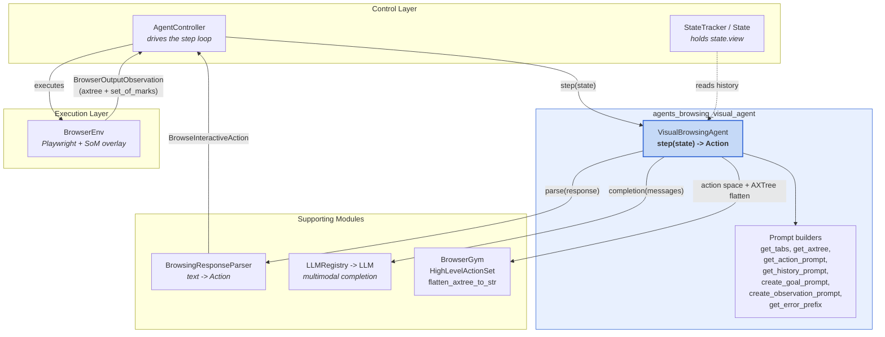
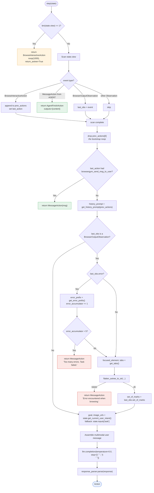
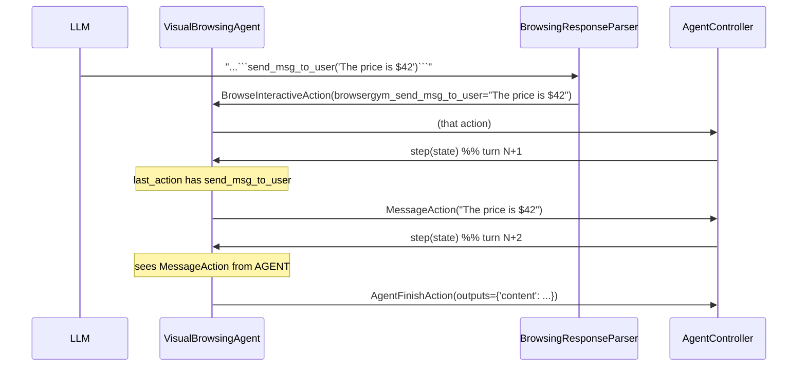
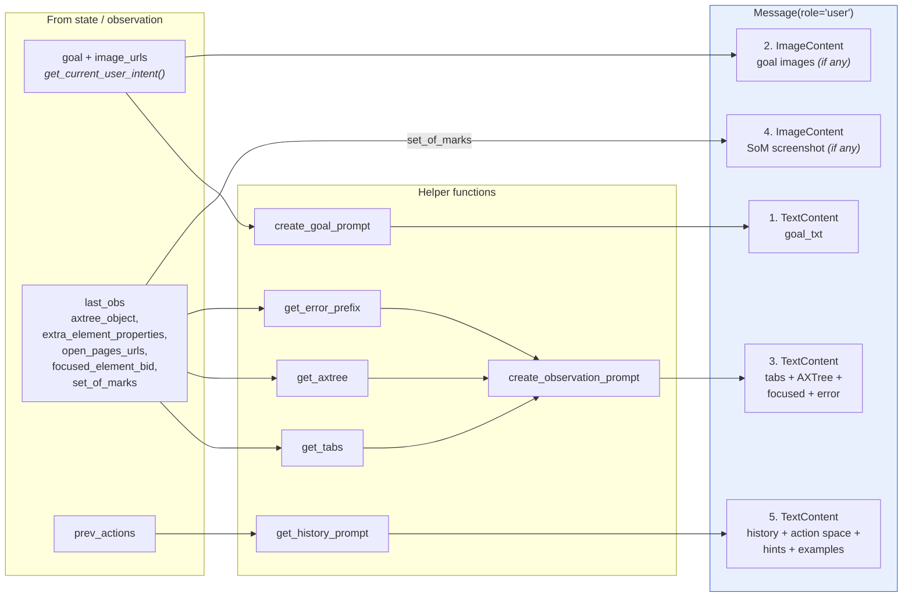
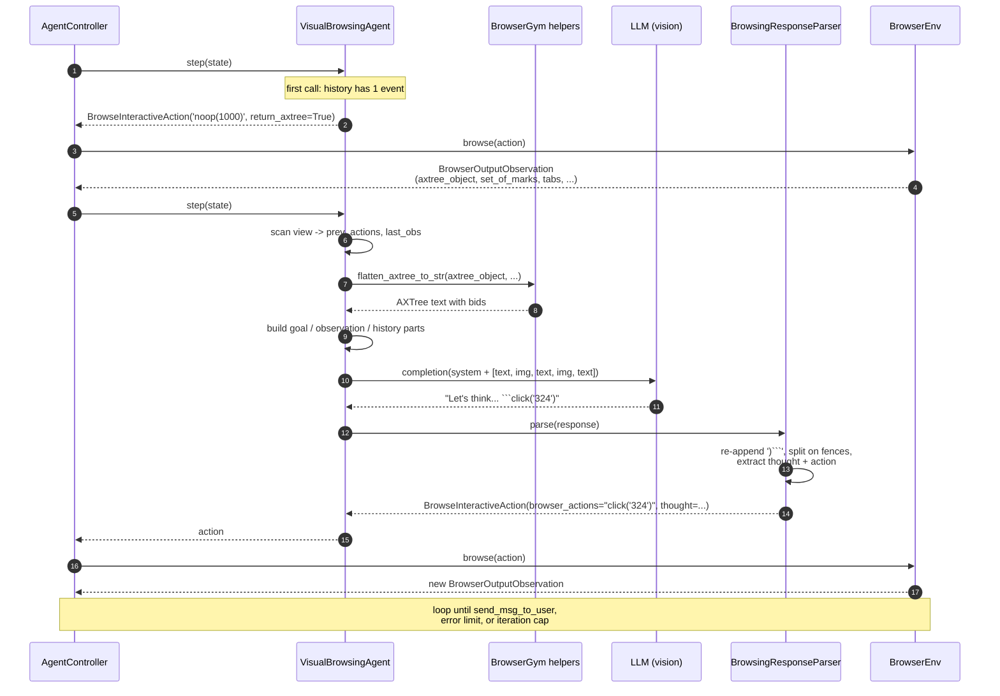
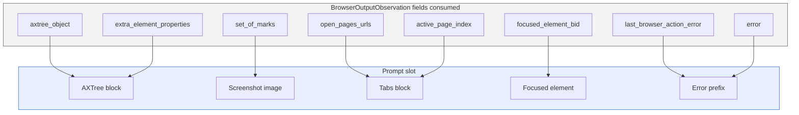

# Visual Browsing Agent

## Introduction

The `agents_browsing_visual_agent` module holds a single class: `VisualBrowsingAgent`. It is an agent that browses the web the way a person does — by **looking at the page**.

Most agents in OpenHands read a web page as text. This one reads text *and* pictures. Each turn it sends the LLM two things:

1. A text view of the page (the accessibility tree, or "AXTree").
2. A screenshot with numbered boxes drawn on top of every element (a "Set-of-Marks" image).

The LLM then replies with one browser command, such as `click('324')` or `goto('https://example.com')`. The agent runs it, gets a new page, and repeats.

Because it can see the page, this agent handles tasks that pure-text agents struggle with: reading charts, finding a button by its color or position, or answering a question about an image on the page. It is the agent used for the **VisualWebArena** benchmark.

- **Source file:** `openhands/agenthub/visualbrowsing_agent/visualbrowsing_agent.py`
- **Core class:** `VisualBrowsingAgent`
- **Sibling agent:** [Text Browsing Agent](agents_browsing_text_agent.md)
- **Parent module:** [Browsing Agents](agents_browsing.md)

---

## Where This Module Sits

The agent itself is small and stateless. It is one replaceable part inside a much bigger loop. It never touches the browser directly — it only returns an `Action` object and waits to be handed an `Observation` back.



Related module docs:

| Concern | Module |
|---|---|
| The loop that calls `step()` | [agent_controller_core](agent_controller_core.md) |
| `State`, `state.view`, control flags | [agent_controller_state](agent_controller_state.md) |
| Turning LLM text into an `Action` | [agents_browsing_response_parsing](agents_browsing_response_parsing.md) |
| The text-only counterpart | [agents_browsing_text_agent](agents_browsing_text_agent.md) |
| Real browser process, screenshots, SoM overlay | [browser_environment](browser_environment.md) |
| LLM selection, multimodal routing, metrics | [llm_layer](llm_layer.md) |
| Trimming old screenshots from history | [memory_and_condensers](memory_and_condensers.md) |
| `Action` / `Observation` event types | [event_system](event_system.md) |
| `Message`, `TextContent`, `ImageContent` | [core_schema_and_runtime_support](core_schema_and_runtime_support.md) |

---

## Core Functionality

### The class contract

```python
class VisualBrowsingAgent(Agent):
    VERSION = '1.0'
    sandbox_plugins: list[PluginRequirement] = []
    response_parser = BrowsingResponseParser()
```

| Member | Meaning |
|---|---|
| `VERSION` | Prompt/behaviour version, used in eval reporting. |
| `sandbox_plugins` | Empty — this agent needs no Jupyter, no AgentSkills, no VSCode. Only a browser. |
| `response_parser` | Shared with the text browsing agent. Converts the raw LLM reply into an `Action`. |
| `action_space` | A BrowserGym `HighLevelActionSet`. Defines which commands are legal. |
| `error_accumulator` | Counts consecutive browser errors. Aborts the task past 5. |

### Action space

Set up once in `__init__`:

```python
action_subsets = ['chat', 'bid', 'nav', 'tab', 'infeas']
self.action_space = HighLevelActionSet(
    subsets=action_subsets,
    strict=False,        # tolerant parsing
    multiaction=False,   # exactly one action per turn
)
```

| Subset | What it unlocks |
|---|---|
| `chat` | `send_msg_to_user(...)` — talk to the user, report an answer |
| `bid` | `click`, `fill`, `select_option`, `hover`, ... on elements addressed by `bid` |
| `nav` | `goto`, `go_back`, `go_forward` |
| `tab` | `new_tab`, `tab_close`, `tab_focus` |
| `infeas` | `report_infeasible(...)` — declare the task impossible |

**Contrast with the text agent** ([agents_browsing_text_agent](agents_browsing_text_agent.md)), which uses only `['chat', 'bid']` plus optional `nav`, and sets `multiaction=True`:

| | `VisualBrowsingAgent` | `BrowsingAgent` |
|---|---|---|
| Screenshots | Yes (Set-of-Marks) | No |
| Goal images | Yes | No |
| Action subsets | chat, bid, nav, tab, infeas | chat, bid, (nav) |
| Actions per turn | 1 | many |
| AXTree filtering | Full tree, `visible`/`clickable` tags kept | Visible-only |
| History in prompt | Thought **and** action, per step | Action strings only |
| System prompt | Short, generic | Contains the goal |
| Temperature | `0.0` (pinned) | LLM default |
| Bootstrap `noop` | Always, with `return_axtree=True` | Only in eval mode |

The wider action space plus single-action-per-turn is a deliberate trade: more ways to move around, but one careful move at a time, since a screenshot only tells you about the state *before* the action.

### Static prompt blocks

Three text blocks are built once in `__init__` and reused every turn, so they cost nothing per step:

- **`action_prompt`** — from `get_action_prompt(action_space)`. Lists every legal command using `action_set.describe(with_long_description=False, with_examples=False)`. Short descriptions keep the prompt small, since the screenshot already eats many tokens.
- **`abstract_example`** — the required answer shape, ending with `` ```<action>``` ``.
- **`concrete_example`** — a worked example (a dropdown that needed `click` instead of `select_option`).
- **`hints`** — two reminders: always address elements by `bid`; comboboxes and autocompletes are fiddly.

---

## The Step Cycle

`step(state)` is the whole agent. It is pure: read `state`, build a prompt, call the LLM, parse, return.



### The bootstrap `noop`

```python
if len(state.view) == 1:
    return BrowseInteractiveAction(browser_actions='noop(1000)', return_axtree=True)
```

On the very first call the history holds only the user's task. The agent has no page to look at. Rather than guess, it issues a do-nothing action that waits 1000 ms and asks for the AXTree back.

Two reasons this matters:

- **Benchmarks.** In VisualWebArena, WebArena and MiniWoB++, `BrowserEnv` already sits on the task's starting page. The `noop` is how the agent *fetches* that page without changing it.
- **`return_axtree=True`.** In `openhands/runtime/browser/utils.py::browse`, the AXTree, DOM and element properties are **stripped from the observation unless `return_axtree` is set**. This agent needs the full tree, so it must always ask.

The bootstrap action is later removed from the prompt history (`prev_actions = prev_actions[1:]`) so the LLM never sees a pointless `noop` as step 1.

Note the difference from the text agent, which gates its `noop` behind an `EVAL_MODE` flag. The visual agent always does it — a screenshot-driven agent is useless without a first screenshot.

### Reading history

The scan over `state.view` is a small state machine with three exits:

| Event seen | Effect |
|---|---|
| `BrowseInteractiveAction` | Recorded in `prev_actions`; tracked as `last_action` |
| `MessageAction` with `source == EventSource.AGENT` | **Terminate.** The agent already answered; return `AgentFinishAction` |
| `BrowserOutputObservation` | Overwrite `last_obs` — only the newest page matters |
| Any other `Observation` | Skipped explicitly |

That last row is a defensive guard. In a delegation setup, or when microagents inject `RecallObservation`s, unrelated observations land in the view. Skipping them (instead of assigning them to `last_obs`, which the text agent does) stops the agent from mistaking a non-browser event for the current page.

Only `last_obs` is used for the page snapshot — the agent shows the LLM **one** screenshot and **one** AXTree, never a stack of them. Old screenshots survive only as text in the history block. This is what keeps token use bounded without a condenser, though [BrowserOutputCondenser](memory_and_condensers.md) can trim further.

### Early exit via `send_msg_to_user`

```python
if isinstance(last_action, BrowseInteractiveAction) and last_action.browsergym_send_msg_to_user:
    return MessageAction(last_action.browsergym_send_msg_to_user)
```

BrowserGym's `send_msg_to_user` is a *browser* command, so its message would otherwise be trapped inside the browser layer. `BrowsingResponseParser` extracts it into `browsergym_send_msg_to_user` when parsing; here the agent lifts it into a real OpenHands `MessageAction` so the user actually sees it.

On the following turn, that `MessageAction` (source `AGENT`) is what triggers `AgentFinishAction`. So finishing takes two hops:



### Error handling

Two independent guards:

**1. Browser errors — counted, with an exception.**

```python
def get_error_prefix(obs):
    if 'timeout' in obs.last_browser_action_error:
        return ''                      # swallowed on purpose
    return f'## Error from previous action:\n{obs.last_browser_action_error}\n'
```

Timeouts return an empty prefix. Since `error_accumulator` only increments when `len(error_prefix) > 0`, **timeouts are not counted at all** — a documented workaround for the OneStopMarket site in WebArena, which times out routinely while still rendering a usable page. Real errors are surfaced to the LLM and counted; past 5 the agent gives up with a `MessageAction`.

**2. AXTree parse failure — fatal immediately.**

`flatten_axtree_to_str` is wrapped in `try/except`. If the tree cannot be flattened there is no observation to reason about, so the agent bails with `MessageAction('Error encountered when browsing.')` rather than prompting on an empty page.

---

## Prompt Construction

This is the heart of the module. The user message is a **list** of alternating text and image parts, which is what makes the agent multimodal.



### Part 1 — Goal (`create_goal_prompt`)

Instructions plus the user's task. If the user attached images, a line `Images: Goal input image (N)` is appended per image so the LLM can tell which picture is which. The URLs are returned separately and become part 2.

This is how a task like *"find the product in this photo"* works: the photo rides along as `image_urls` on the user's `MessageAction`, is surfaced by `state.get_current_user_intent()`, and is placed right next to its label.

### Part 3 — Observation (`create_observation_prompt`)

Concatenates, in order: tabs, AXTree, focused element, error prefix. Then, if a Set-of-Marks screenshot exists, appends a caption that includes a critical warning:

> *only visible portion of webpage is present in the screenshot. You may need to scroll to view the remaining portion*

Without this, the LLM tends to assume the screenshot is the whole page and declares items missing when they are merely below the fold.

If `set_of_marks` is empty, the function logs `SOM Screenshot not present in observation!` and returns `None` — the agent then runs **text-only** for that turn instead of failing. Graceful degradation.

**Tabs** (`get_tabs`) lists every open page with its URL and marks the active one — needed because the `tab` action subset is enabled.

**AXTree** (`get_axtree`) prefixes the tree with two notes: `bid` is the element handle, and only elements tagged `visible` can be interacted with. The flatten call is deliberately permissive:

```python
flatten_axtree_to_str(
    last_obs.axtree_object,
    extra_properties=last_obs.extra_element_properties,
    with_visible=True,          # tag visibility
    with_clickable=True,        # tag clickability
    with_center_coords=False,   # screenshot carries position
    with_bounding_box_coords=False,
    filter_visible_only=False,  # keep the WHOLE page
    filter_with_bid_only=False,
    filter_som_only=False,
)
```

The design here is the key insight of the module. The **full** tree is kept (nothing filtered out) so the agent knows what exists off-screen, while `with_visible` tags tell it what it can act on *right now*. Coordinates are dropped because the screenshot conveys layout better than numbers. The text agent does the opposite — `filter_visible_only=True` — because with no screenshot, off-screen nodes are just noise it can never act on.

### Part 5 — History and guidance (`get_history_prompt`)

Every prior step is rendered as:

```
## step N

Ouput thought and action: <thought> ```<browser_actions>```
```

Including the **thought**, not just the action, is another visual-agent-specific choice. Since the old screenshots are gone from the context, the recorded reasoning is the only surviving trace of *why* a step was taken and what the agent believed it saw.

Appended after the history: the action space, hints, and the two examples.

### System message

Short and fixed:

> *You are an agent trying to solve a web task based on the content of the page and user instructions. You can interact with the page and explore, and send messages to the user when you finish the task. Each time you submit an action it will be sent to the browser and you will receive a new page.*

The goal deliberately lives in the **user** message, not here — so a changing goal (multi-turn conversation) never invalidates the cacheable system prefix. The text agent bakes the goal into its system message instead.

### LLM call

```python
response = self.llm.completion(
    messages=messages,
    temperature=0.0,
    stop=[')```', ')\n```'],
)
```

- `temperature=0.0` — pinned for reproducible benchmark runs.
- `stop=[')```', ')\n```']` — cuts generation the moment the action's closing fence appears, so the model cannot ramble past its own action. Note this **strips the terminator**, which is exactly why `BrowsingResponseParser.parse_response` re-appends `)``` ` before parsing.

The `self.llm` handle comes from `LLMRegistry.get_llm_from_agent_config` in the base `Agent`. Because this agent sends images, a vision-capable model is required; see [llm_layer](llm_layer.md) for `MultimodalRouter`, which routes multimodal turns to a capable model.

---

## Component Interaction



### Data dependencies



Note what is **not** used: `content` (the html2text rendering), `screenshot` (the raw, unannotated image), `screenshot_path`, and `dom_object`. The agent prefers the AXTree over flattened HTML, and the marked-up `set_of_marks` image over the plain screenshot — because the marks are what let the LLM name an element by `bid`.

`set_of_marks` is produced in `BrowserEnv.browser_process` by `overlay_som(...)` over the raw Playwright screenshot, then base64-encoded as a data URL. See [browser_environment](browser_environment.md).

---

## Design Notes

**Stateless by design.** The only mutable field is `error_accumulator`, and `reset()` clears it while leaving LLM metrics alone (metrics live in [llm_layer](llm_layer.md) and must survive across a delegation). Everything else is recomputed from `state.view` each turn, which makes the agent safe to replay — see [agent_controller_safeguards_replay](agent_controller_safeguards_replay.md).

**No prompt templates.** Unlike CodeAct-family agents, this agent builds prompts with plain Python f-strings, not `PromptManager` Jinja templates. It also does not define `_prompt_manager`, so `get_system_message()` from the base `Agent` would raise; the system message is inlined in `step()` instead.

**No tool calling.** The agent uses free-text output with fenced actions plus a regex/AST parser, not the LLM function-calling API. This keeps it compatible with BrowserGym's action grammar and with the shared parser used by the text agent.

**Single screenshot per turn.** The most important cost control in the module. Screenshots are large; keeping only the latest one bounds context growth. When even that is too much, wire in a condenser from [memory_and_condensers](memory_and_condensers.md).

**Known rough edges.**

- `state.inputs['task']` is used as the goal fallback and will `KeyError` if no user message and no `task` input exist.
- `'timeout' in obs.last_browser_action_error` is a substring match — any error text containing "timeout" bypasses the error counter.
- A typo, `Ouput thought and action`, appears in every history entry; harmless, but it is part of the prompt the model sees.
- `prev_actions[1:]` assumes the first recorded action was the bootstrap `noop`. In a resumed or delegated conversation whose view starts mid-task, this drops a real action.

---

## Registration and Selection

The agent registers itself with the `Agent` class registry (`Agent.register`) at import of `openhands/agenthub`, and is chosen by name through `AgentConfig`. Set the agent to `VisualBrowsingAgent` — for example in `config.toml`:

```toml
[core]
default_agent = "VisualBrowsingAgent"
```

Because `sandbox_plugins` is empty, no runtime plugins are installed; the runtime only needs a working `BrowserEnv`. See [runtime_plugins](runtime_plugins.md) and [runtime_implementations](runtime_implementations.md).

---

## Summary

| Aspect | Detail |
|---|---|
| Purpose | Web browsing driven by screenshots plus accessibility tree |
| Public surface | `VisualBrowsingAgent.__init__`, `.reset()`, `.step(state)` |
| Inputs | `State` (history) and `BrowserOutputObservation` (page snapshot) |
| Outputs | `BrowseInteractiveAction`, `MessageAction`, or `AgentFinishAction` |
| Key dependency | BrowserGym `HighLevelActionSet` + `flatten_axtree_to_str` |
| Multimodal parts | Goal images, and one Set-of-Marks screenshot per turn |
| Termination | `send_msg_to_user` → `MessageAction` → `AgentFinishAction`; or 5 errors; or AXTree failure |
| Best suited for | VisualWebArena, image-grounded tasks, visually complex pages |
