# agents_codeact_variants

## Introduction

The `agents_codeact_variants` module holds two **narrow-purpose subclasses of `CodeActAgent`**: `ReadOnlyAgent` and `LocAgent`. Neither one writes its own reasoning loop. Both inherit the whole CodeAct machinery — the LLM call, the condenser, conversation memory, the pending-action queue — and change only **which tools the model is offered** and **how tool calls are turned into OpenHands actions**.

That is the core idea of this module: *an agent variant is a tool surface, not a new brain.*

- **`ReadOnlyAgent`** — a safe explorer. It can look at code but cannot change anything. Useful for answering "how does this work?" without any risk of touching files.
- **`LocAgent`** — a code *localizer*. It walks a pre-built graph of the repository to find the exact functions, classes, and files that matter for a task.

Both agents live in `openhands/agenthub/` and register themselves into the shared agent registry at import time, so the rest of the system can pick them by name.

---

## 1. Where this module sits

These agents are plugged into the same slot as any other agent: the [`AgentController`](agent_controller_core.md) drives them, the [event system](event_system.md) carries what they produce, and a [runtime](runtime_implementations.md) actually executes the actions.

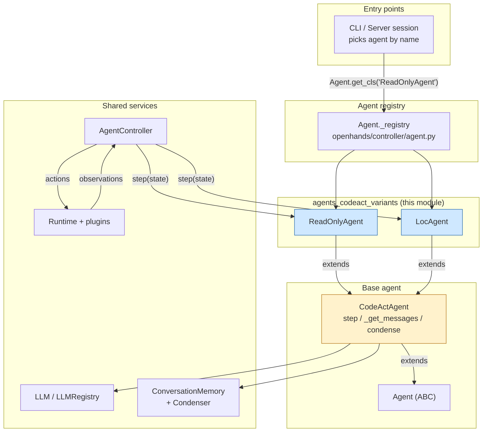

Related module docs:

| Concern | Document |
|---|---|
| The loop that calls `step()` | [agent_controller_core.md](agent_controller_core.md) |
| Stuck detection, replay | [agent_controller_safeguards.md](agent_controller_safeguards.md) |
| Sibling agents (browsing, visual, dummy, critic) | [agents.md](agents.md), [agents_browsing.md](agents_browsing.md), [agents_testing_and_critics.md](agents_testing_and_critics.md) |
| LLM access, routing, metrics | [llm_layer.md](llm_layer.md) |
| History trimming used by the inherited `step()` | [memory_and_condensers.md](memory_and_condensers.md) |
| `PromptManager`, `ActionType`, `FileReadSource` | [core_schema_and_runtime_support.md](core_schema_and_runtime_support.md), [event_system.md](event_system.md) |
| Where `IPythonRunCellAction` / `CmdRunAction` actually run | [runtime_plugins.md](runtime_plugins.md), [runtime_implementations.md](runtime_implementations.md) |

---

## 2. Registration and discovery

Each agent package registers itself in its `__init__.py`, and `openhands/agenthub/__init__.py` imports every package. So simply importing `openhands.agenthub` makes both names available.

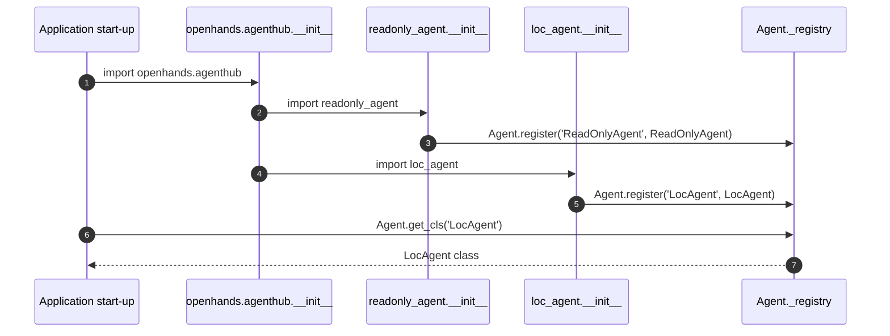

`Agent.register` raises `AgentAlreadyRegisteredError` on a duplicate name, and `Agent.get_cls` raises `AgentNotRegisteredError` for an unknown name — so agent names are unique and typos fail loudly.

---

## 3. What each variant overrides

Both classes are small on purpose. This table is the whole story:

| Hook | `CodeActAgent` (base) | `ReadOnlyAgent` | `LocAgent` |
|---|---|---|---|
| `VERSION` | `'2.2'` | `'1.0'` | `'1.0'` |
| `_get_tools()` | config-driven: bash, editor, jupyter, browser, think, finish… | **overridden** → 5 read-only tools | *not overridden* — instead `self.tools` is **reassigned** after `super().__init__` |
| `prompt_manager` | `codeact_agent/prompts` + configured system prompt file | **overridden** → `readonly_agent/prompts` | inherited (uses CodeAct prompts) |
| `set_mcp_tools()` | appends MCP tools to `self.tools` | **overridden → no-op + warning** | inherited (appends), but see caveat §7 |
| `response_to_actions()` | `codeact_agent.function_calling` | **overridden** → `readonly_agent.function_calling` | **overridden** → `loc_agent.function_calling` |
| `step()`, `_get_messages()`, condenser, `reset()` | defined here | inherited | inherited |
| `sandbox_plugins` | `AgentSkillsRequirement`, `JupyterRequirement` | inherited | inherited (**required** — see §6) |

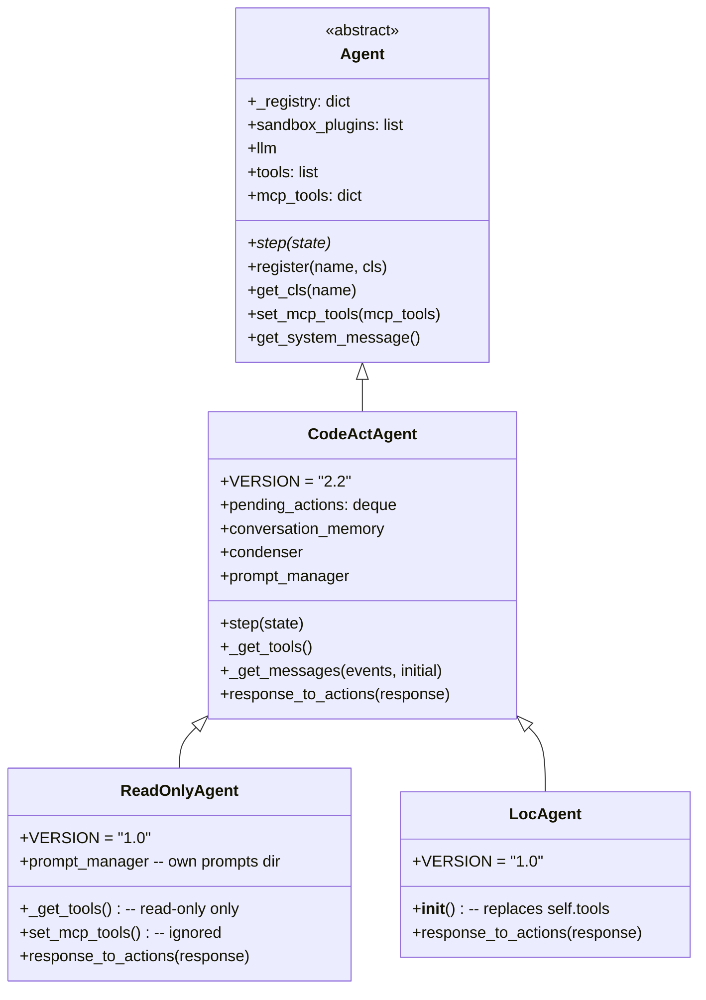

### A note on *how* the two override tools

This difference is subtle but matters:

- `ReadOnlyAgent` overrides the **`_get_tools()` method**. `CodeActAgent.__init__` calls `self._get_tools()`, so Python dispatches to the subclass and the read-only list is used from the very first moment. The `AgentConfig` `enable_*` flags are therefore fully bypassed.
- `LocAgent` lets `super().__init__()` build the normal CodeAct tool list first, then **reassigns `self.tools`** on the next line. The end state is the same set of tools, but the CodeAct list is briefly constructed and thrown away.

One visible consequence: `get_system_message()` (in the base `Agent`) reads `self.tools`, and it is called by the controller *after* construction — so both agents advertise the correct, narrowed tool list in their system message.

---

## 4. `ReadOnlyAgent` — safe exploration

### 4.1 Purpose

`ReadOnlyAgent` exists for the case where you want the agent to *understand* without any chance of it *changing*. Its docstring lists the intended uses: explore a codebase, search for patterns, research — then switch to `CodeActAgent` when it is time to edit.

The safety comes from **two layers**, not one:

1. **Only read-only tools are offered.** The model never sees `bash`, `str_replace_editor`, or `execute_ipython`.
2. **`response_to_actions` is a whitelist.** Even if a model hallucinates a tool name, the parser raises `FunctionCallNotExistsError` rather than passing anything through.

### 4.2 The tool surface

`readonly_agent/function_calling.get_tools()` returns exactly five tools:

| Tool | Produced action | Notes |
|---|---|---|
| `think` | `AgentThinkAction(thought)` | pure reasoning, no side effect |
| `finish` | `AgentFinishAction(final_thought)` | ends the task |
| `view` | `FileReadAction(path, impl_source=OH_ACI, view_range)` | file read or 2-level directory listing |
| `grep` | `CmdRunAction(<ripgrep command>)` | content search by regex |
| `glob` | `CmdRunAction(<ripgrep command>)` | file listing by glob pattern |

### 4.3 Tool-call → action mapping

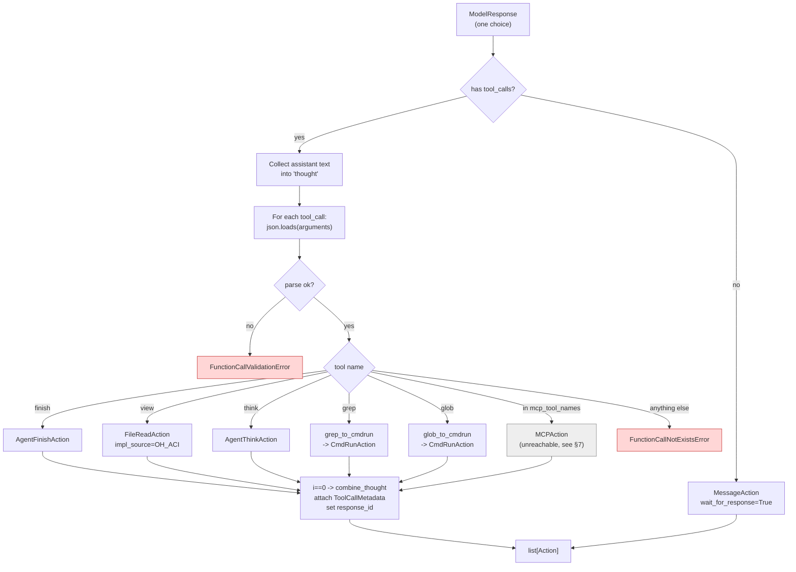

Missing required arguments are also caught early: `view` without `path`, and `grep`/`glob` without `pattern`, each raise `FunctionCallValidationError`.

### 4.4 How `grep` and `glob` stay read-only

Both are translated into **ripgrep shell commands** and shipped as a `CmdRunAction`. Every user-supplied string goes through `shlex.quote`, which is what stops a crafted pattern from turning into shell injection.

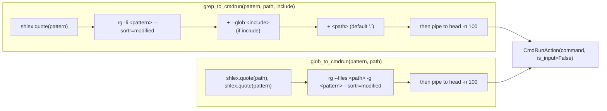

Design points worth knowing:

- **`rg -li`** → `-l` lists only file names, `-i` is case-insensitive. The agent gets *paths*, not raw match text, keeping the observation small.
- **`--sortr=modified`** → most recently changed files first, which is usually the most relevant ordering when investigating a bug.
- **`head -n 100`** → a hard cap on output size, matching what the tool descriptions promise the model.
- **Known limitation, flagged in the source:** these helpers assume `rg` (ripgrep) is installed. Under [`CLIRuntime` or `LocalRuntime`](runtime_implementations.md) it may not be, and there is a `TODO` to fall back to plain `grep` / `find`.

Because grep and glob become `CmdRunAction`, they are *executed as shell commands* by the runtime. The read-only guarantee rests on the fact that the agent can only ever build these two fixed `rg` command shapes — it cannot supply free-form shell text.

### 4.5 Prompts

`ReadOnlyAgent` points `PromptManager` at its own `readonly_agent/prompts` directory and — unlike `CodeActAgent` — passes **no `system_prompt_filename`**, so the default `system_prompt.j2` is always used. The config-driven system-prompt selection of CodeAct does not apply here.

The prompt directory contains `system_prompt.j2`, `user_prompt.j2`, `additional_info.j2`, `microagent_info.j2`, and in-context-learning examples. The system prompt states the capabilities, the restrictions ("cannot modify any files", "cannot execute state-changing commands"), and instructs the agent to recommend `CodeActAgent` if asked to make changes.

> **Documentation drift to be aware of:** `system_prompt.j2` advertises a `web_read` tool, but `get_tools()` does not include one. The prompt over-promises; the parser is the source of truth.

---

## 5. `LocAgent` — graph-based code localization

### 5.1 Purpose

`LocAgent` implements the [LocAgent paper](https://arxiv.org/abs/2503.09089) approach: parse the codebase into a **directed heterogeneous graph** and let the LLM do multi-hop reasoning over that graph to locate relevant code. Instead of grepping text, the agent navigates structure.

The graph model (from the detailed tool description):

- **Entity types:** `directory`, `file`, `class`, `function`
- **Dependency types:** `contains`, `imports`, `invokes`, `inherits`
- **Entity ID format:** `file_path:QualifiedName`, e.g. `interface/C.py:C.method_a.inner_func`

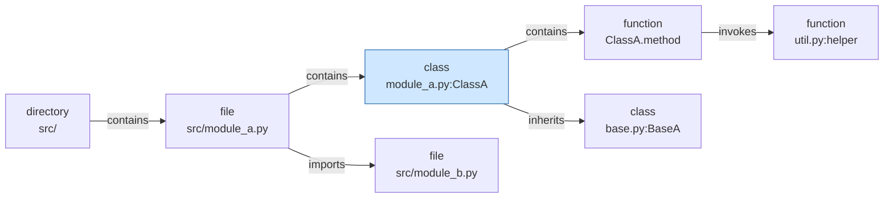

### 5.2 The tool surface

`loc_agent/function_calling.get_tools()` returns four tools:

| Tool | Purpose | Key parameters |
|---|---|---|
| `finish` | end the task | `message` |
| `search_code_snippets` | find snippets by keyword **or** by line number | `search_terms[]`, `line_nums[]`, `file_path_or_pattern` (default `**/*.py`) |
| `get_entity_contents` | fetch full source of named entities | `entity_names[]` as `file_path:QualifiedName` or just `file_path` |
| `explore_tree_structure` | traverse the code graph | `start_entities[]`, `direction` (`upstream`/`downstream`/`both`), `traversal_depth` (`-1` = unlimited), `entity_type_filter`, `dependency_type_filter` |

`explore_tree_structure` is built by a **factory**, `create_explore_tree_structure_tool(use_simplified_description=...)`. `LocAgent` calls it with `use_simplified_description=True`, i.e. the short description plus short examples. The detailed variant (full graph schema, four worked examples) also exists and costs many more prompt tokens — a deliberate token-budget trade-off, related to the same concern behind CodeAct's `use_short_description` logic.

Notice there is **no separate tool** for the three graph functions each having its own action type. All three are executed the same way — as Python.

### 5.3 Tool-call → action mapping

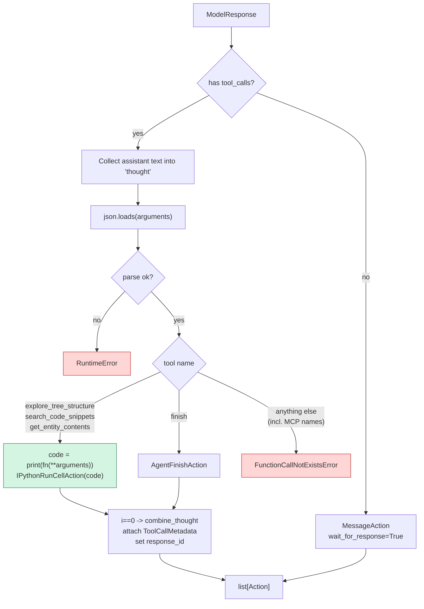

### 5.4 The "tool as generated Python" pattern

This is the most distinctive thing in the module. A `LocAgent` tool call does not map to a purpose-built action class. Instead the parser **synthesises a line of Python**:

```python
code = f'print({func_name}(**{arguments}))'
action = IPythonRunCellAction(code=code)
```

The named function is then resolved inside the sandbox's Jupyter kernel, because the `AgentSkills` plugin exports it.

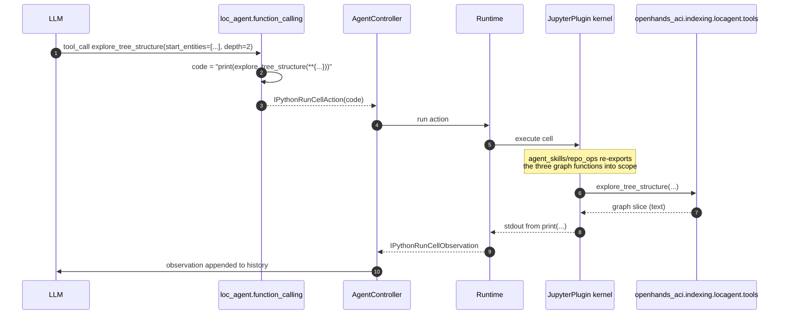

Consequences of this design:

- **Zero glue code per tool.** Adding a graph capability means exporting one more function from `agent_skills`; no new action or observation type is needed.
- **`JupyterRequirement` is mandatory.** `LocAgent` inherits `sandbox_plugins` from `CodeActAgent`, which includes both `AgentSkillsRequirement` and `JupyterRequirement` — in that order, precisely so the skill functions exist before the kernel starts. A runtime without the Jupyter plugin cannot run `LocAgent` at all. See [runtime_plugins.md](runtime_plugins.md).
- **Arguments are interpolated via `repr`.** `f'...(**{arguments})'` embeds the parsed dict's Python literal form. This works because the dict came from `json.loads` (so it holds only JSON-safe types), but it is string-level code generation, not a typed call.
- **Results arrive as stdout text.** The `print(...)` wrapper is what makes the return value visible to the agent.
- **The dependency chain is external.** The actual graph indexing lives in the `openhands_aci` package (`openhands_aci.indexing.locagent.tools`), surfaced through `openhands/runtime/plugins/agent_skills/repo_ops/repo_ops.py`.

---

## 6. The shared step loop (inherited, not re-implemented)

Neither variant defines `step()`. Both use `CodeActAgent.step()` unchanged. Understanding this loop is how you understand what the variants actually do at runtime.

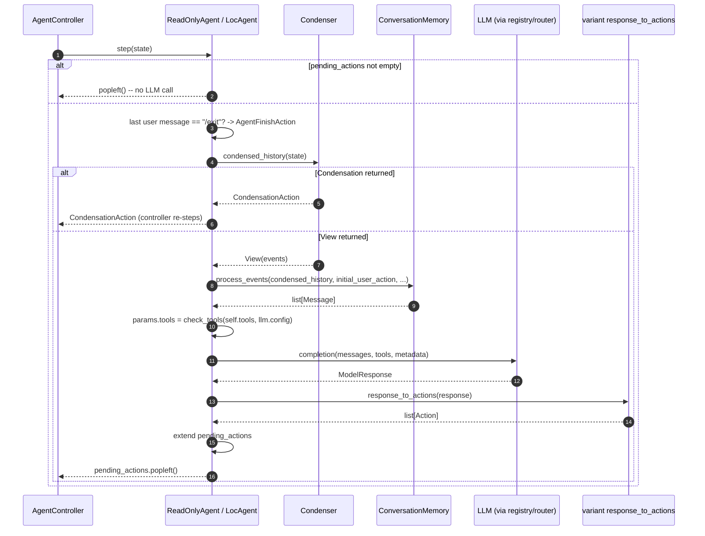

Key inherited behaviours the variants get for free:

- **Multi-action batching.** One model response may contain several tool calls; all become actions and are queued in `pending_actions`, returned one per `step()`.
- **Condensation.** History trimming comes from `Condenser.from_config(self.config.condenser, llm_registry)` — see [memory_and_condensers.md](memory_and_condensers.md). This matters for both variants, since exploration produces long, noisy histories.
- **LLM routing.** `self.llm = self.llm_registry.get_router(self.config)` in `CodeActAgent.__init__` applies to both variants — see [llm_layer.md](llm_layer.md).
- **Prompt caching.** `apply_prompt_caching` is applied when the LLM supports it.
- **Thought attachment.** Both parsers call `combine_thought(action, thought)` **only for `i == 0`**, so the assistant's free text lands on the first action of a batch.
- **Traceability.** Every action gets `ToolCallMetadata` (tool call id, function name, model response, total calls) and a `response_id`, which is how token usage is later matched back to actions — including for `MessageAction`s that carry no tool call.

---

## 7. Comparison, and the MCP caveat

### Side-by-side

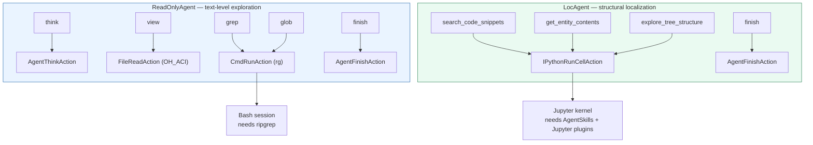

| Dimension | `ReadOnlyAgent` | `LocAgent` |
|---|---|---|
| Mental model | text search + file reading | graph traversal over code structure |
| Runtime dependency | `rg` in the sandbox | `AgentSkills` + `Jupyter` plugins, `openhands_aci` |
| Own prompts? | yes | no (reuses CodeAct prompts) |
| Write access | structurally impossible | structurally impossible (no editor/bash tool) |
| MCP tools | explicitly refused, with a warning | silently accepted then rejected at parse time |
| Typical use | "explain this codebase", safe Q&A | "which files must change for this issue?" |
| Related to | [agents_browsing.md](agents_browsing.md) for web-side exploration | [issue_resolver.md](issue_resolver.md) for the downstream fix workflow |

### The MCP asymmetry — a real inconsistency

Both variants effectively **do not support MCP tools**, but they arrive there differently, and one path is cleaner than the other:

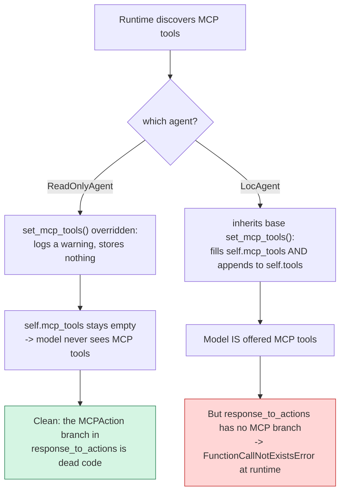

- **`ReadOnlyAgent`** is coherent: it never accepts MCP tools, so its parser's `MCPAction` branch can never fire. Slightly odd (dead code), but harmless.
- **`LocAgent`** is the sharper edge: if MCP tools are configured, the base `set_mcp_tools` appends them to `self.tools`, so they are advertised to the model — but `loc_agent.function_calling.response_to_actions` only recognises the three graph functions plus `finish`. Any MCP tool call raises `FunctionCallNotExistsError`. Note that `response_to_actions` even accepts an `mcp_tool_names` parameter and `LocAgent` dutifully passes `list(self.mcp_tools.keys())` — but the parameter is never read.

**Practical guidance:** do not enable MCP tools for `LocAgent`. If MCP support is wanted, the fix would mirror `ReadOnlyAgent` (override `set_mcp_tools` to refuse) or add an `MCPAction` branch to the parser. See [runtime_utils.md](runtime_utils.md) for the MCP proxy side.

---

## 8. Extending: how to add another CodeAct variant

The module is effectively a template. To add a new variant:

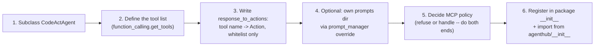

Conventions to follow, drawn from these two agents:

1. **Override `_get_tools()` rather than reassigning `self.tools`.** The `ReadOnlyAgent` approach is the cleaner of the two, because `CodeActAgent.__init__` already calls the hook.
2. **Always raise `FunctionCallNotExistsError` in the `else` branch.** The whitelist is the real safety boundary, not the tool list.
3. **Validate required arguments explicitly** and raise `FunctionCallValidationError` — `ReadOnlyAgent` does this for `path` and `pattern`; `LocAgent` does not, and relies on the sandbox call failing instead.
4. **Preserve the metadata tail** of `response_to_actions`: `combine_thought` for `i == 0`, `ToolCallMetadata` on every action, `response_id` on every action, and the no-tool-calls fallback to `MessageAction(wait_for_response=True)`.
5. **Handle MCP at both ends** — the `set_mcp_tools` side and the parser side must agree.
6. **Keep `VERSION` on the class**; it is reported in telemetry alongside the agent name.

---

## 9. Summary

`agents_codeact_variants` demonstrates a clean specialisation pattern: keep one well-tested reasoning loop in `CodeActAgent` and vary only the tool surface and the tool-call parser.

- **`ReadOnlyAgent`** narrows CodeAct to five read-only tools (`think`, `finish`, `view`, `grep`, `glob`), swaps in its own prompts, and refuses MCP tools outright. Safety is enforced twice — by omission from the tool list, and by a strict whitelist parser. `grep`/`glob` become carefully quoted ripgrep commands capped at 100 results.
- **`LocAgent`** narrows CodeAct to graph-localization tools (`search_code_snippets`, `get_entity_contents`, `explore_tree_structure`, `finish`) and implements them all through a single generated-Python pattern that runs in the sandbox's Jupyter kernel via the `AgentSkills` plugin.

Both are registered by import side-effect and are interchangeable with any other agent from the [`AgentController`](agent_controller_core.md)'s point of view. The one rough edge to keep in mind is `LocAgent`'s MCP handling (§7).
