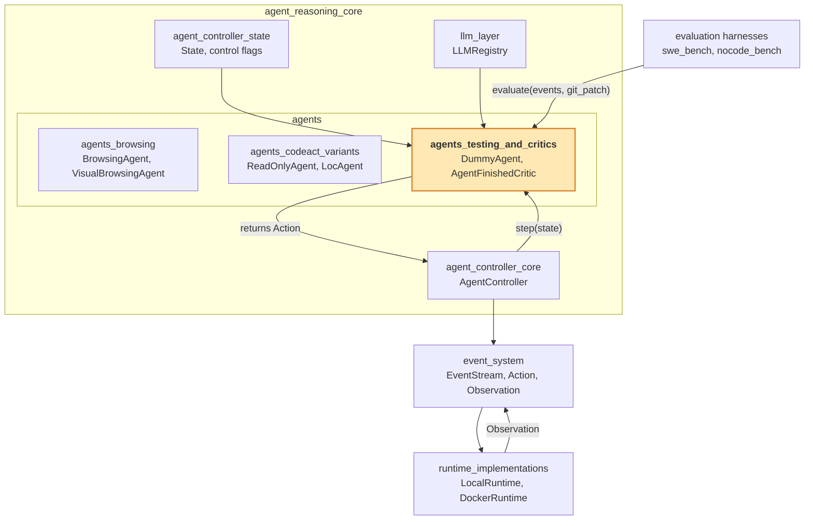
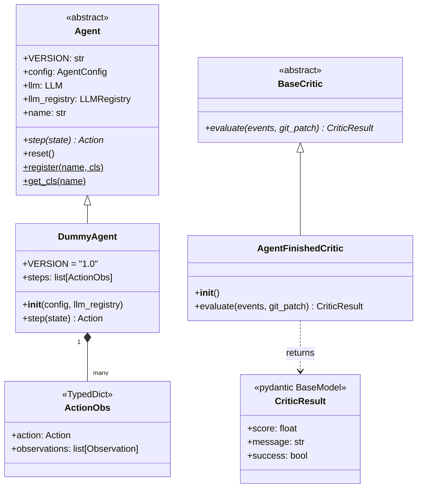
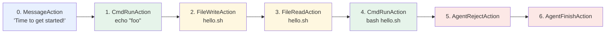
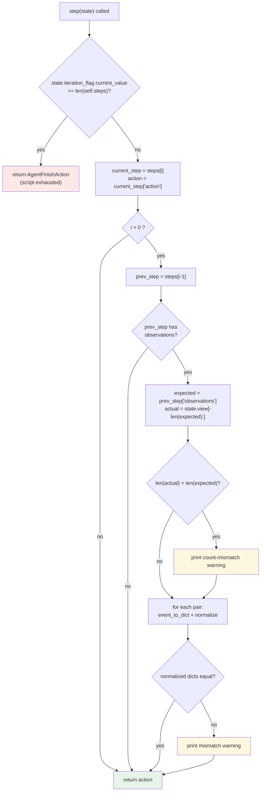
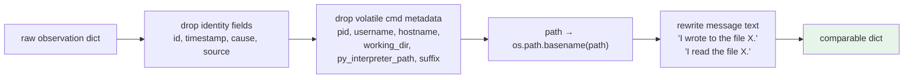
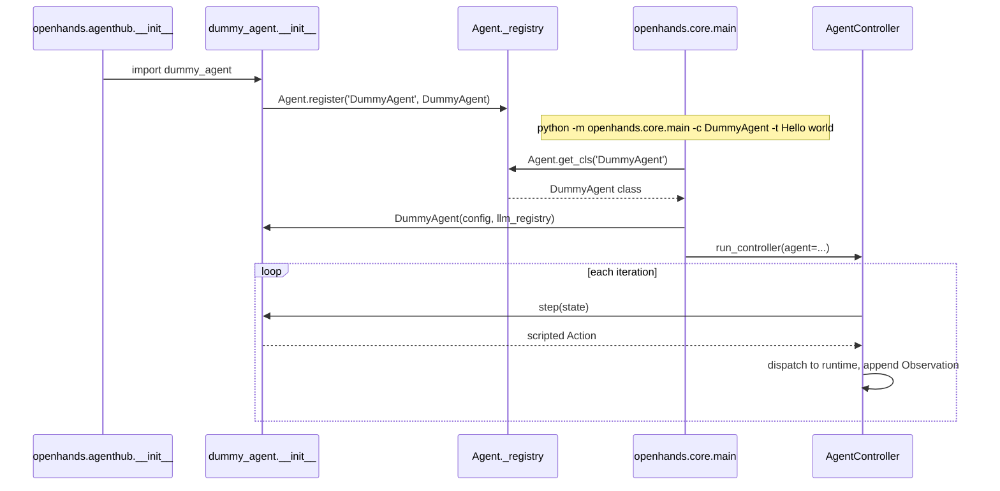
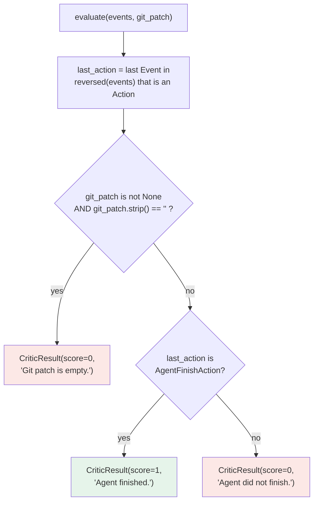
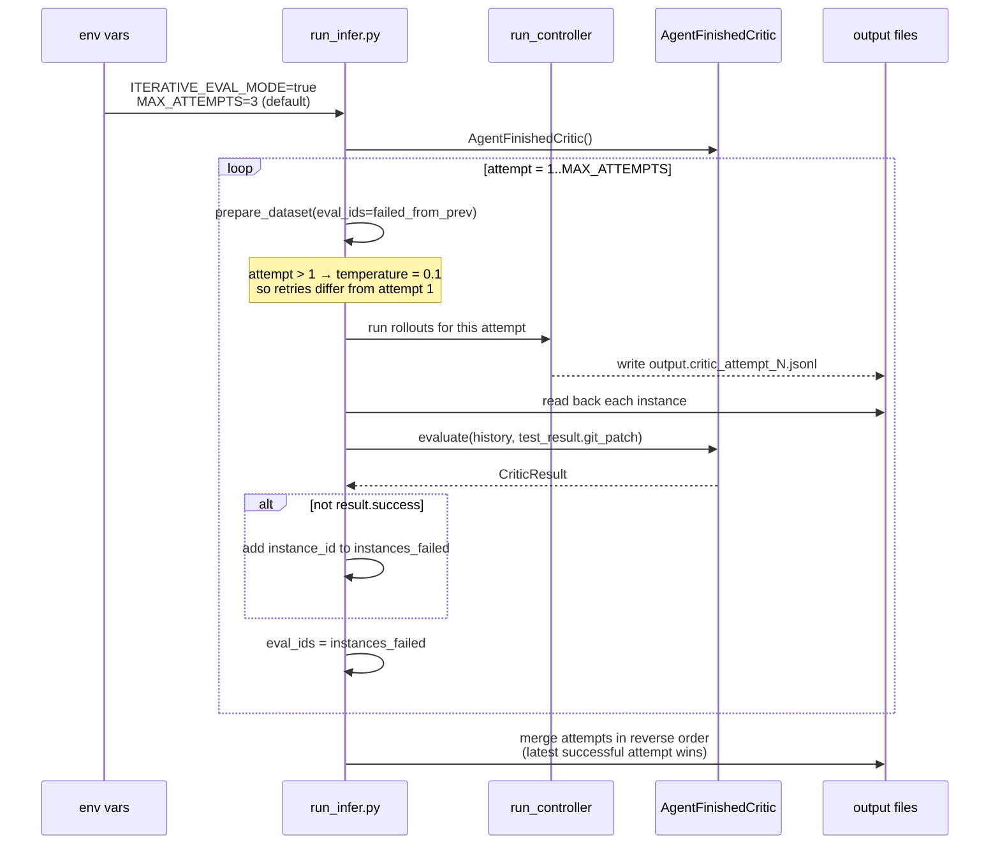
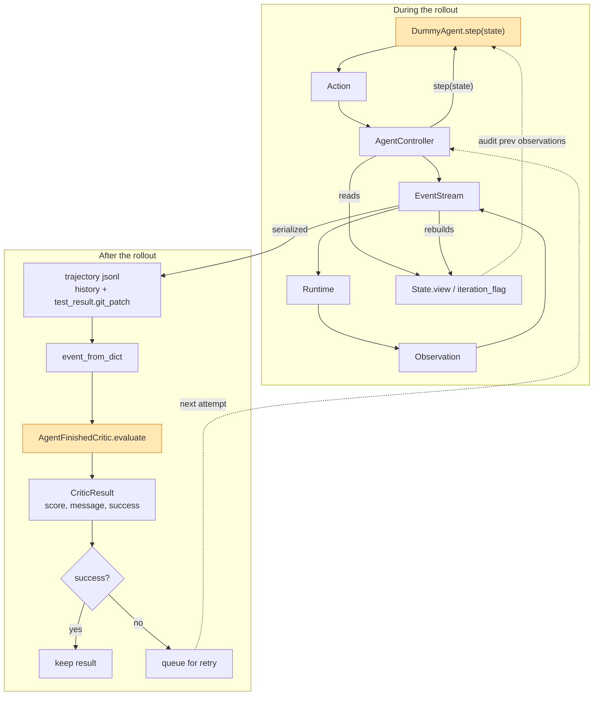

# agents_testing_and_critics

## Introduction

Most agents in OpenHands try to solve a user task. The two components in this module do
something different: **they check the system itself.**

- **`DummyAgent`** — a scripted agent that replays a fixed list of actions. It never calls
  an LLM. It is used in end-to-end tests to prove that the whole pipeline
  (controller → event stream → runtime → observations) is wired up and working.
- **`AgentFinishedCritic`** — a small rule-based judge. It looks at a finished trajectory
  and answers one question: *did the agent actually finish and produce a change?*
  It is used by benchmark runners to decide which runs must be retried.

Both are tiny in code size but they sit at important seams of the system. `DummyAgent`
is the cheapest possible probe of the runtime path. `AgentFinishedCritic` is the entry
point of the critic abstraction, which lets any scoring logic be plugged into an
evaluation loop.

| Component | File | Role |
| --- | --- | --- |
| `DummyAgent` | `openhands/agenthub/dummy_agent/agent.py` | Deterministic, LLM-free agent for e2e testing |
| `AgentFinishedCritic` | `openhands/critic/finish_critic.py` | Rule-based trajectory scorer |

---

## 1. Where this module sits

This module is a leaf of the [`agents`](agents.md) group, which itself lives inside
`agent_reasoning_core`. Unlike its sibling groups
([`agents_browsing`](agents_browsing.md),
[`agents_codeact_variants`](agents_codeact_variants.md)), it holds no prompts, no tool
definitions, and no LLM calls at all.



Key relationships:

- `DummyAgent` is a normal `Agent` subclass, so the
  [controller](agent_controller_core.md) drives it exactly like a real agent.
- It reads iteration count and history from `State`, described in
  [agent_controller_state](agent_controller_state.md).
- `AgentFinishedCritic` is *not* driven by the controller. It runs **after** a rollout
  finishes, inside a benchmark script, over a saved event list.

---

## 2. Class structure



Two independent hierarchies live here. They do not talk to each other directly — they
only share the same event vocabulary from [event_system](event_system.md)
(`Action`, `Observation`, `AgentFinishAction`, …).

---

## 3. `DummyAgent`

### 3.1 Purpose

`DummyAgent` answers the question: *is the plumbing working?*

A real agent failure could come from the model, the prompt, the tool schema, the runtime,
or the event stream. `DummyAgent` removes the first three from the picture. If a run with
`DummyAgent` fails, the problem is in the infrastructure, not in the reasoning.

Because it makes zero LLM calls, it needs no API key and costs nothing, so it can run on
every CI push.

### 3.2 The script

The agent holds a fixed list of seven `ActionObs` entries. Each entry pairs an action to
emit with the observations that action is *expected* to produce.



The script deliberately touches every major capability class:

| Step | Action | Expected observation | Capability under test |
| --- | --- | --- | --- |
| 0 | `MessageAction` | *(none)* | Agent → user messaging |
| 1 | `CmdRunAction('echo "foo"')` | `CmdOutputObservation` exit 0 | Shell execution |
| 2 | `FileWriteAction(path='hello.sh')` | `FileWriteObservation` | File write |
| 3 | `FileReadAction(path='hello.sh')` | `FileReadObservation` | File read, write/read round-trip |
| 4 | `CmdRunAction('bash hello.sh')` | `CmdOutputObservation` `Hello, World!` | Running a file it just wrote |
| 5 | `AgentRejectAction` | `AgentStateChangedObservation(REJECTED)` | Reject path / state transition |
| 6 | `AgentFinishAction` | `AgentStateChangedObservation(FINISHED)` | Finish path / state transition |

Steps 2→3→4 form a chain: write a shell script, read it back, then execute it. That
single chain covers the file store, the path handling, and the bash session in the active
[runtime](runtime_implementations.md).

### 3.3 `step()` control flow

Each call does two things: pick the next action, and audit the previous one.



Two things are worth stressing:

1. **The audit is advisory.** A mismatch only calls `print(...)`. It never raises and
   never changes the returned action. The check is a diagnostic breadcrumb for whoever
   reads the CI log — the pass/fail signal comes from the outer e2e test, not from here.
2. **The index is the program counter.** `state.iteration_flag.current_value` is the only
   state the agent needs. The controller bumps that counter each step (see
   [agent_controller_state](agent_controller_state.md)), so `DummyAgent` is fully
   stateless between calls and safe to resume or replay.

### 3.4 Observation normalization

Raw observations carry fields that change every run. Comparing them directly would always
fail. Before comparing, both sides are pushed through `event_to_dict` and then stripped:



Each layer removes one source of run-to-run noise:

| Layer | Removes | Why it varies |
| --- | --- | --- |
| Identity fields | `id`, `timestamp`, `cause`, `source` | Assigned by the event stream at append time |
| Command metadata | `pid`, `username`, `hostname`, `working_dir`, `py_interpreter_path`, `suffix` | Depends on the container and shell session |
| Path basename | `extras.path` | Workspace root differs between local, Docker, and remote runtimes |
| Message rewrite | `message` | Human-readable messages embed the full path |

The message rewrite is the subtlest part: it splits on the literal prefixes
`'I wrote to the file '` and `'I read the file '`, takes the basename of the remainder,
and rebuilds the sentence. This makes the expected `hello.sh` match an actual
`/workspace/hello.sh`, but it is tied to the exact wording of those observation messages.
If those message templates change, the normalization silently stops matching and only
prints a warning.

### 3.5 Registration and invocation

`DummyAgent` reaches the controller through the standard agent registry:



Note that `DummyAgent.__init__` still calls `super().__init__`, which asks the
[`LLMRegistry`](llm_layer.md) for an LLM handle via
`get_llm_from_agent_config('agent', config)`. The handle is created but never used for a
completion. In practice this means an LLM **config** must still be resolvable, even
though no network call is made and no tokens are spent.

The e2e test in `tests/e2e/test_local_runtime.py` builds a slim `python:3.13` image,
installs OpenHands from source, and runs exactly the command shown above with
`RUNTIME=local`, `ENABLE_BROWSER=false`. That single container run exercises headless
mode, the [local runtime](runtime_implementations.md), the bash session, and file I/O
with no model dependency.

### 3.6 Known quirks

The source file carries an explicit `FIXME` comment listing two known issues:

- `FileWrite` appears to append an unintended newline at the end of the file.
- The browser path is not working, so no browsing action is in the script.

A third quirk follows from the script itself: step 5 emits `AgentRejectAction`, which
drives the agent to `AgentState.REJECTED`. In a real controller loop that usually ends
the run, so step 6 (`AgentFinishAction`) is typically never reached. The two terminal
actions are best read as declarations of the expected state transitions rather than a
sequence that always executes end to end.

---

## 4. `AgentFinishedCritic`

### 4.1 The critic abstraction

A critic scores a finished trajectory. The contract is deliberately minimal:

```python
class BaseCritic(abc.ABC):
    @abc.abstractmethod
    def evaluate(
        self, events: list[Event], git_patch: str | None = None
    ) -> CriticResult: ...
```

`CriticResult` is a Pydantic model with `score: float`, `message: str`, and a derived
`success` property defined as `score >= 0.5`. Because the score is a float, the interface
supports graded or learned critics later; `AgentFinishedCritic` simply uses the two
endpoints `0` and `1`.

Keeping `success` on the result — rather than on the critic — means callers can compare
critics without knowing each one's threshold convention.

### 4.2 Decision logic



The two rules encode two distinct failure modes of a coding rollout:

| Rule | Failure it catches |
| --- | --- |
| Empty git patch | The agent talked but changed nothing — no diff to grade |
| Last action is not `AgentFinishAction` | The agent ran out of iterations, got stuck, errored, or was rejected |

Ordering matters and is easy to miss: **the patch check runs first**. A rollout that
finished cleanly but produced an empty diff still scores `0`. This is intentional for
SWE-bench-style benchmarks, where an empty patch can never pass the hidden tests.

Two more details:

- `git_patch=None` (the default) *skips* the patch rule entirely. Passing `None` and
  passing `''` are very different: `None` means "not checked", `''` means "checked and
  empty". Callers that read a possibly-missing field with `.get('git_patch', '')` are
  therefore opting *into* the strict check.
- Only `Action` events are scanned for the terminal check. Trailing observations,
  state-change events, and other event types are skipped, so a run ending in
  `AgentFinishAction` + `AgentStateChangedObservation` still scores `1`.

### 4.3 Iterative evaluation loop

The main consumer is the benchmark inference driver
(`evaluation/benchmarks/swe_bench/run_infer.py`, and the parallel
`nocode_bench/run_infer_nc.py`). When `ITERATIVE_EVAL_MODE=true`, the critic decides
which instances get another try.



How the pieces fit:

1. **Attempt 1** runs every instance and writes `…​.critic_attempt_1.jsonl`.
2. The critic re-reads each line, rebuilds the event history with `event_from_dict`, and
   scores it. Anything with `success == False` goes on the retry list.
3. **Attempt N+1** re-runs only the failed instances. Temperature is nudged to `0.1` for
   attempts after the first, so an otherwise-deterministic config can produce a different
   trajectory instead of repeating the same failure.
4. After the loop, attempt files are merged **in reverse attempt order** with an
   `added_instance_ids` set, so the newest result for each instance wins and earlier
   failures are not double-counted.
5. Exceptions while rebuilding a history are logged, not fatal — one corrupt line does
   not kill a long benchmark run.

The important architectural point: the critic is a **cheap pre-filter**, not the grader.
Real grading means applying the patch and running the hidden tests, which is expensive.
The critic uses two nearly free signals to discard runs that cannot possibly pass, so
compute is spent retrying them instead.

---

## 5. End-to-end data flow

The two components sit on opposite sides of a single rollout: one produces events while
the run is live, the other consumes them after the run is over.



The shared contract is the event list. `DummyAgent` compares serialized observations to
its expectations; `AgentFinishedCritic` inspects deserialized actions for a terminal
marker. Both depend only on the serialization layer described in
[event_system](event_system.md) and the schema constants in
[core_schema_and_runtime_support](core_schema_and_runtime_support.md) — never on any
particular runtime or model.

---

## 6. Design notes and extension points

**Why a scripted agent instead of a mocked LLM?** A mock would still exercise the prompt
builder, the response parser, and the tool schema — all of which can fail for reasons
unrelated to infrastructure. `DummyAgent` returns `Action` objects directly, so a failure
points squarely at the controller, the event stream, or the runtime.

**Why not assert in `DummyAgent`?** Raising inside `step()` would abort the run at the
first difference and hide every later problem. Printing warnings lets a single run report
*all* mismatches, which is more useful when diagnosing a new runtime backend.

**Adding a step to the script.** Append an `ActionObs` entry to `self.steps`. The
observation you list is compared on the *next* call, so the pairing is
"action at index `i`, observations checked at index `i+1`". If a new observation type
carries volatile fields, extend the normalization block or the check will warn on every
run.

**Adding a critic.** Subclass `BaseCritic`, implement `evaluate`, and export it from
`openhands/critic/__init__.py`. Benchmark runners construct a critic once and call
`evaluate` per instance, so any drop-in replacement works. Natural next steps would be an
LLM-as-judge critic (would need the [`LLMRegistry`](llm_layer.md)) or a patch-heuristic
critic scoring diff size and touched files. Because `CriticResult.score` is a float and
`success` is thresholded at `0.5`, graded critics fit the existing interface without
changing any caller.

**Not a security or risk check.** Critics score *quality after the fact*. Blocking unsafe
actions *before* they run is a different concern, handled by
[security_analyzers](security_analyzers.md). Detecting a looping agent *during* a run is
handled by `StuckDetector` in
[agent_controller_safeguards_stuck_detection](agent_controller_safeguards_stuck_detection.md).

---

## 7. Related documentation

| Topic | Document |
| --- | --- |
| Agent base class, registry, sibling agents | [agents](agents.md) |
| Controller loop that calls `step()` | [agent_controller_core](agent_controller_core.md) |
| `State`, `view`, `iteration_flag` | [agent_controller_state](agent_controller_state.md) |
| Stuck detection and replay during a run | [agent_controller_safeguards](agent_controller_safeguards.md) |
| Real task-solving agents | [agents_codeact_variants](agents_codeact_variants.md), [agents_browsing](agents_browsing.md) |
| `LLMRegistry` and LLM handles | [llm_layer](llm_layer.md) |
| `Action`, `Observation`, serialization, `EventStream` | [event_system](event_system.md) |
| `AgentState`, `ActionType`, `ObservationType` | [core_schema_and_runtime_support](core_schema_and_runtime_support.md) |
| `AgentConfig` and related config models | [core_configuration](core_configuration.md) |
| Runtimes that execute the scripted commands | [runtime_implementations](runtime_implementations.md) |
| Pre-execution risk analysis | [security_analyzers](security_analyzers.md) |
