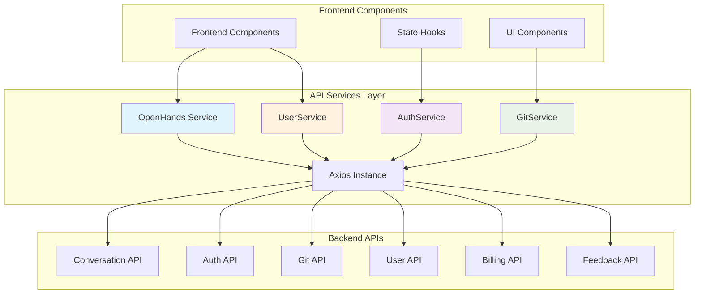
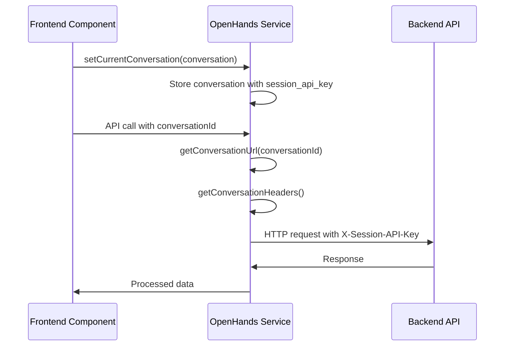
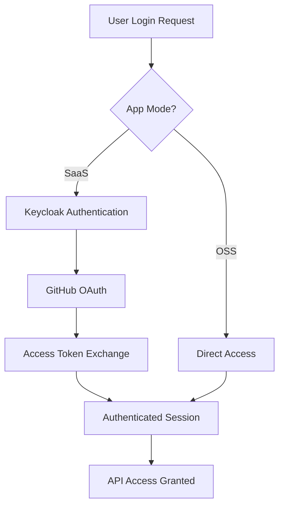
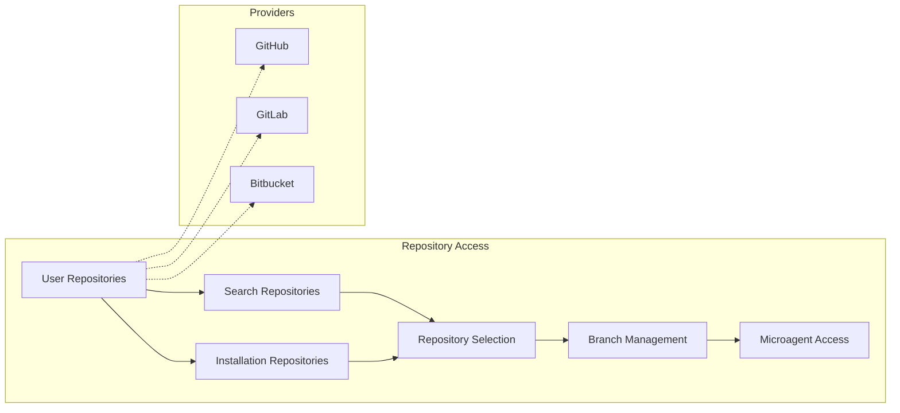
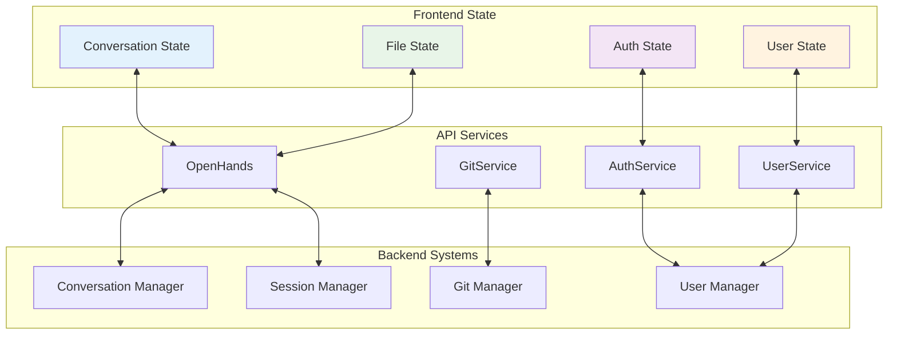
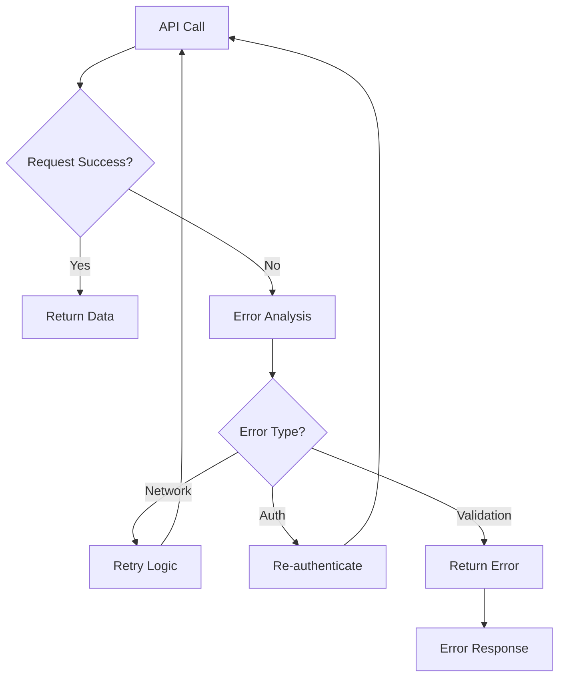
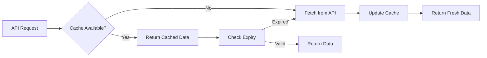

# API Services Module

## Overview

The API Services module serves as the frontend's primary interface layer for communicating with the OpenHands backend system. This module provides a comprehensive set of TypeScript service classes that encapsulate all HTTP API interactions, offering a clean abstraction layer between the frontend components and backend endpoints.

The module consists of four core service classes that handle different aspects of the system:
- **OpenHands**: Main service for conversation management, workspace operations, and core functionality
- **AuthService**: Authentication and authorization operations
- **GitService**: Git repository and version control operations  
- **UserService**: User profile and account management

## Architecture Overview



## Core Components

### OpenHands Service

The primary service class that handles the majority of application functionality including conversation management, workspace operations, and system integrations.

**Key Responsibilities:**
- Conversation lifecycle management (create, start, stop, delete)
- Workspace file operations and downloads
- Feedback and rating systems
- Billing and subscription management
- Git change tracking and diff operations
- Microagent management
- Development environment integration (VSCode, web hosts)

**Session Management:**
The service implements a sophisticated session management system with conversation-specific URLs and API keys:



### AuthService

Handles authentication flows for both SaaS and OSS deployment modes.

**Key Features:**
- Multi-mode authentication (SaaS vs OSS)
- GitHub OAuth integration via Keycloak
- Session management and logout functionality

**Authentication Flow:**


### GitService

Comprehensive Git integration service supporting multiple providers (GitHub, GitLab, Bitbucket).

**Core Capabilities:**
- Repository search and browsing
- Branch management and search
- Installation-based repository access
- Microagent repository integration
- Multi-provider support with unified interface

**Repository Access Patterns:**


### UserService

Simple service for user profile management and account information retrieval.

**Functionality:**
- User profile data retrieval
- Git user information management
- Account details access

## Data Flow Architecture



## Integration Points

### Server and API Integration
The API Services module integrates closely with the [server_and_api](server_and_api.md) module, particularly:
- **ConversationManager**: For conversation lifecycle operations
- **WebSession**: For session management and authentication
- **UserAuth**: For authentication and authorization flows

### Storage System Integration
Connects with the [storage_system](storage_system.md) for:
- **ConversationStore**: Conversation persistence and retrieval
- **FileStore**: Workspace file management
- **SecretsStore**: Secure credential storage

### Git Integrations
Leverages the [git_integrations](git_integrations.md) module for:
- **GitService**: Multi-provider Git operations
- **BaseGitService**: Common Git functionality
- Provider-specific implementations (GitHub, GitLab, Bitbucket)

## Error Handling and Resilience

The API services implement comprehensive error handling patterns:



**Error Handling Features:**
- Automatic retry mechanisms for network failures
- Authentication token refresh handling
- Graceful degradation for optional features
- Comprehensive error reporting to frontend components

## Security Considerations

### Authentication Security
- Session-based API key management
- Secure token storage and transmission
- Multi-provider OAuth integration
- Automatic session cleanup on logout

### Data Protection
- Secure file upload handling
- Protected conversation data access
- Provider-specific credential management
- CORS and request validation

## Performance Optimizations

### Request Optimization
- Pagination support for large datasets
- Efficient search implementations
- Batch operations for feedback and data retrieval
- Streaming support for large file operations

### Caching Strategy


## Usage Patterns

### Conversation Management
```typescript
// Create and start a conversation
const conversation = await OpenHands.createConversation(
  selectedRepository,
  gitProvider,
  initialMessage
);

await OpenHands.startConversation(conversation.conversation_id, providers);
```

### File Operations
```typescript
// Upload files to workspace
const result = await OpenHands.uploadFiles(conversationId, files);

// Download workspace
const zipBlob = await OpenHands.getWorkspaceZip(conversationId);
```

### Git Operations
```typescript
// Search repositories
const repos = await GitService.searchGitRepositories(query, perPage, provider);

// Get branches
const branches = await GitService.getRepositoryBranches(repository, page);
```

## Future Enhancements

### Planned Improvements
- WebSocket integration for real-time updates
- Enhanced caching mechanisms
- Improved error recovery strategies
- Extended microagent management capabilities
- Advanced search and filtering options

### Scalability Considerations
- Connection pooling optimization
- Request batching improvements
- Progressive loading implementations
- Enhanced pagination strategies

## Dependencies

### Internal Dependencies
- [frontend_state_management](frontend_state_management.md): State synchronization
- [server_and_api](server_and_api.md): Backend API endpoints
- [storage_system](storage_system.md): Data persistence
- [git_integrations](git_integrations.md): Version control operations

### External Dependencies
- **Axios**: HTTP client library
- **TypeScript**: Type safety and development experience
- **Browser APIs**: File handling and blob operations

## Conclusion

The API Services module provides a robust, type-safe, and comprehensive interface layer that abstracts the complexity of backend communications while providing a clean, consistent API for frontend components. Its modular design, comprehensive error handling, and integration with the broader OpenHands ecosystem make it a critical component for the application's functionality and user experience.