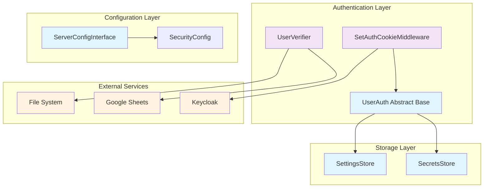
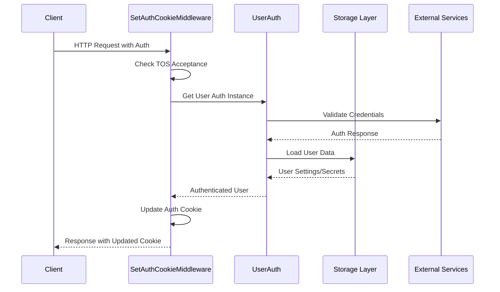
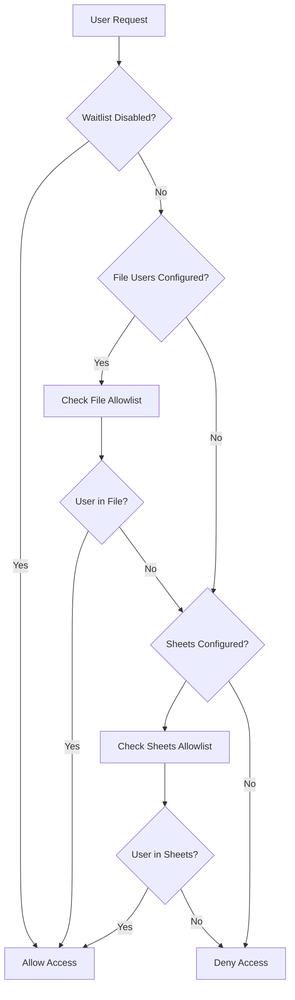
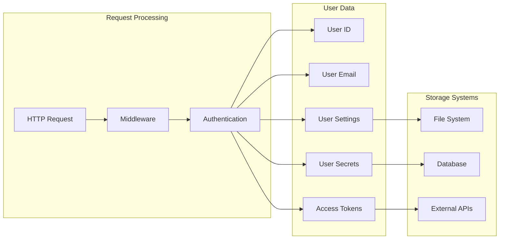
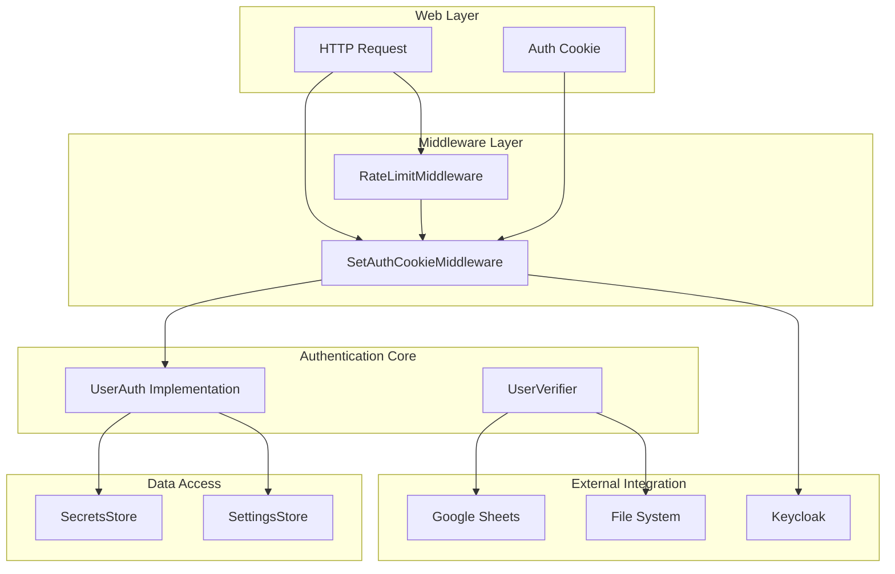

# Authentication System

The authentication system module provides comprehensive user authentication, authorization, and access control mechanisms for the OpenHands platform. It supports both open-source and enterprise deployments with flexible authentication strategies, user verification, and secure session management.

## Overview

The authentication system is designed as a pluggable architecture that allows different authentication implementations while maintaining a consistent interface. It handles user identity verification, access token management, user settings and secrets storage, and enterprise-grade access control features.

## Architecture



## Core Components

### UserAuth (Abstract Base Class)

The `UserAuth` class serves as the foundation for all authentication implementations in OpenHands. It defines the contract that all authentication providers must implement.

**Key Responsibilities:**
- User identity management (ID, email)
- Access token handling
- Provider token management
- User settings and secrets access
- Authentication type identification

**Extension Point:**
Applications can provide custom authentication by:
1. Inheriting from `UserAuth`
2. Implementing all abstract methods
3. Setting `server_config.user_auth_class` to the implementation class name

### UserVerifier (Enterprise)

The `UserVerifier` class provides enterprise-grade user access control through allowlist management.

**Features:**
- File-based user allowlists
- Google Sheets integration for dynamic user management
- Environment-based configuration
- Flexible user verification strategies

**Configuration:**
- `GITHUB_USER_LIST_FILE`: Path to text file containing allowed usernames
- `GITHUB_USERS_SHEET_ID`: Google Sheets ID for dynamic user management
- `DISABLE_WAITLIST`: Flag to disable user verification entirely

## Authentication Flow



## User Verification Process



## Data Flow



## Component Interactions



## Key Features

### Flexible Authentication Architecture
- Abstract base class allows multiple authentication implementations
- Pluggable design supports various authentication providers
- Consistent interface across different authentication strategies

### Enterprise Access Control
- File-based and Google Sheets-based user allowlists
- Dynamic user verification with real-time updates
- Environment-based configuration for different deployment scenarios

### Secure Session Management
- JWT-based authentication with secure cookie handling
- Automatic token refresh and session management
- Terms of Service (TOS) acceptance tracking and enforcement

### User Data Management
- Secure storage of user secrets and settings
- Abstract storage interfaces for flexible data persistence
- User-specific data isolation and access control

### Middleware Integration
- Authentication middleware for request processing
- Rate limiting integration for security
- Cookie management and security headers

## Security Features

### Token Management
- Secure JWT token handling with signature verification
- Automatic token refresh and expiration management
- Secure cookie attributes (HttpOnly, Secure, SameSite)

### Access Control
- User allowlist verification for enterprise deployments
- Terms of Service acceptance enforcement
- Email verification requirements

### Error Handling
- Comprehensive authentication error handling
- Secure error responses without information leakage
- Automatic logout on authentication failures

## Configuration

### Environment Variables

**User Verification:**
- `GITHUB_USER_LIST_FILE`: Path to file containing allowed GitHub usernames
- `GITHUB_USERS_SHEET_ID`: Google Sheets ID for dynamic user management
- `DISABLE_WAITLIST`: Set to 'true' to disable user verification

**Security:**
- `JWT_SECRET`: Secret key for JWT token signing
- Cookie security settings based on deployment environment

### Server Configuration
The authentication system integrates with the broader server configuration through the `ServerConfigInterface`, allowing for:
- Authentication provider configuration
- Security policy settings
- Integration with external services

## Integration Points

### Storage System Integration
The authentication system integrates closely with the [storage_system](storage_system.md) module:
- **SecretsStore**: Manages user API keys, tokens, and sensitive data
- **SettingsStore**: Handles user preferences and configuration settings

### Configuration Management
Integration with [core_configuration](core_configuration.md) module:
- **SecurityConfig**: Authentication and security policy configuration
- **ServerConfig**: Server-wide authentication settings

### Session Management
Coordination with [session_management](session_management.md) module:
- User session lifecycle management
- Session-based authentication state
- Multi-session support for enterprise users

## Implementation Examples

### Custom Authentication Provider
```python
class CustomUserAuth(UserAuth):
    async def get_user_id(self) -> str | None:
        # Custom user ID retrieval logic
        pass
    
    async def get_user_email(self) -> str | None:
        # Custom email retrieval logic
        pass
    
    # Implement other abstract methods...
```

### User Verification Setup
```python
# File-based user verification
user_verifier = UserVerifier()
is_allowed = user_verifier.is_user_allowed("github_username")

# Check if verification is active
if user_verifier.is_active():
    # Apply user verification logic
    pass
```

## Error Handling

The authentication system provides comprehensive error handling for various scenarios:

- **NoCredentialsError**: Missing or invalid authentication credentials
- **AuthError**: General authentication failures
- **EmailNotVerifiedError**: Unverified email addresses
- **TosNotAcceptedError**: Terms of Service not accepted
- **CookieError**: Invalid or expired authentication cookies

## Best Practices

### Security
1. Always use HTTPS in production environments
2. Implement proper JWT secret rotation
3. Set appropriate cookie security attributes
4. Regularly audit user access lists

### Performance
1. Cache user verification results when appropriate
2. Implement efficient token refresh strategies
3. Use connection pooling for external service integrations

### Monitoring
1. Log authentication events for security auditing
2. Monitor failed authentication attempts
3. Track user verification patterns
4. Alert on suspicious authentication activities

## Future Enhancements

### Planned Features
- Multi-factor authentication (MFA) support
- OAuth 2.0 provider integration
- Advanced user role and permission management
- Audit logging and compliance features

### Extensibility
The modular design allows for easy extension with:
- Additional authentication providers
- Custom user verification strategies
- Enhanced security features
- Integration with enterprise identity systems

## Related Documentation

- [server_and_api](server_and_api.md) - Overall server architecture and API design
- [storage_system](storage_system.md) - User data storage and management
- [core_configuration](core_configuration.md) - System configuration and security settings
- [session_management](session_management.md) - Session lifecycle and management