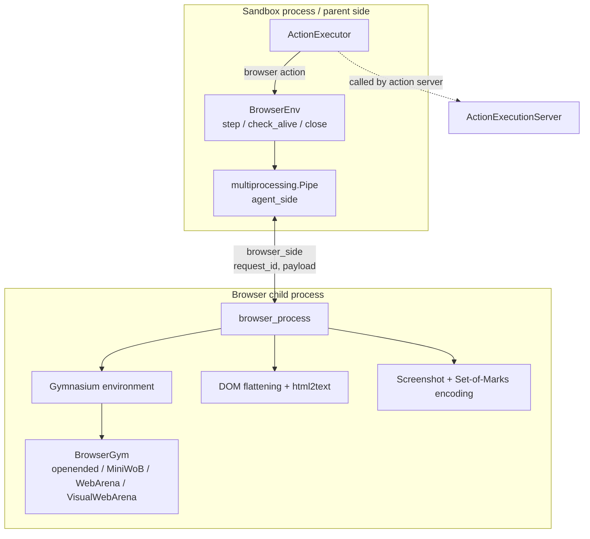
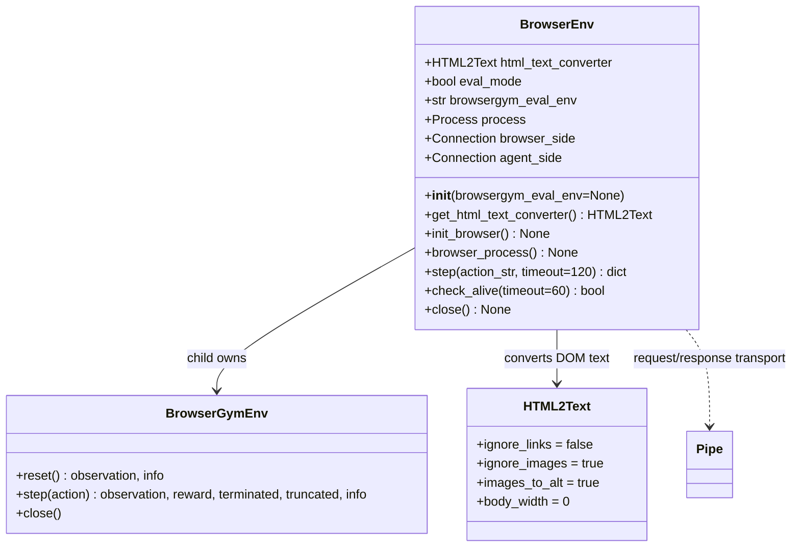
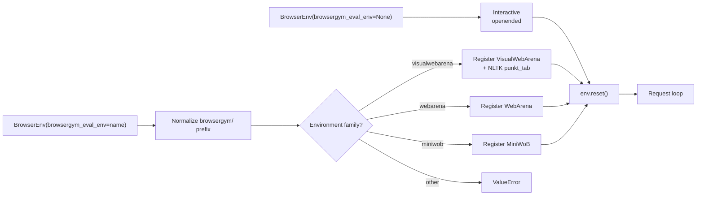
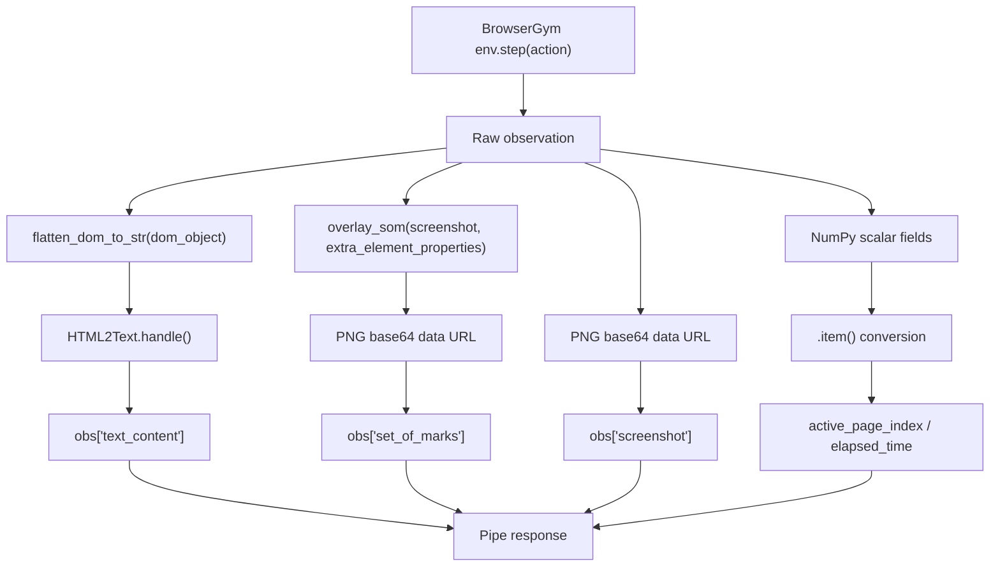
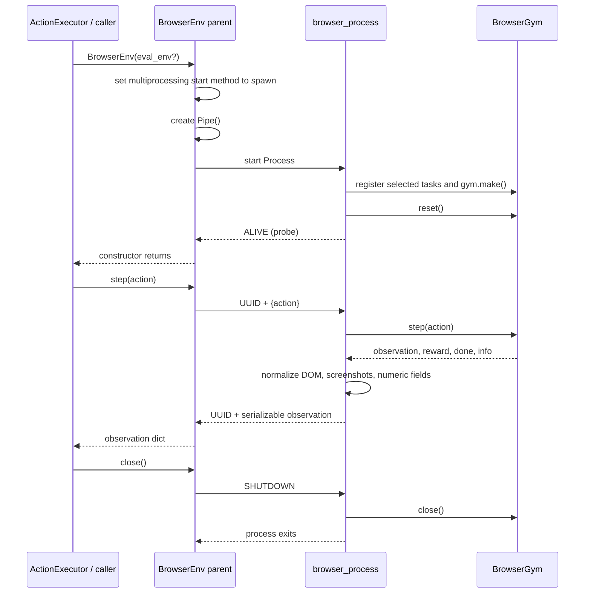

# Browser Environment

## Introduction

`BrowserEnv` (`openhands/runtime/browser/browser_env.py`) is OpenHands' process-isolated adapter for [BrowserGym](https://github.com/ServiceNow/browsergym). It gives the sandbox action-execution layer a small synchronous interface for sending browser action strings and receiving JSON-compatible page observations.

The browser itself is deliberately kept in a child process. The parent process exposes `step`, `check_alive`, and `close`; the child process creates and owns the Gym environment, converts DOM and screenshots into agent-readable data, and responds to requests over a private pipe. This isolates browser libraries and browser state from the action server while preserving a simple request/response contract.

In the overall runtime, `BrowserEnv` is a leaf service owned lazily by `ActionExecutor`; see [runtime_implementations_action_execution_server](runtime_implementations_action_execution_server.md) for the HTTP action server that invokes it and [runtime_implementations](runtime_implementations.md) for the sandbox lifecycle.

## Responsibilities and boundaries

| Responsibility | Implementation |
| --- | --- |
| Start and supervise a browser process | `init_browser`, `check_alive`, `close` |
| Create an interactive or evaluation Gym environment | `browser_process` |
| Send one browser action and await its observation | `step` |
| Convert DOM to readable text | `flatten_dom_to_str` + `html2text.HTML2Text` |
| Mark interactive elements in an image | `overlay_som` |
| Make screenshots and numeric fields serializable | `image_to_png_base64_url`, `.item()` |
| Expose evaluation goal and accumulated rewards | `GET_EVAL_GOAL`, `GET_EVAL_REWARDS` control actions |

It does not decide which action to take, interpret an LLM response, or publish OpenHands events. Those responsibilities belong to the agent/controller and action-execution layers documented by [agents](agents.md), [agent_controller](agent_controller.md), and [runtime_implementations_action_execution_server](runtime_implementations_action_execution_server.md).

## Architecture



The pipe has two endpoints with role-specific names:

- `agent_side` is used by parent methods (`step`, `check_alive`, `close`).
- `browser_side` is used by the child loop to receive requests and send responses.

The request ID is a UUID for normal actions. It prevents a delayed response from being mistaken for the response to a later request. Lifecycle messages use fixed IDs (`IS_ALIVE` and `SHUTDOWN`).

## Component model



`BrowserEnv` is intentionally not a Gym `Env` subclass. It is a supervisory façade whose public `step` returns a dictionary after the child has already called Gym's `step` and normalized the result.

## Modes and environment creation

### Interactive mode

Constructing `BrowserEnv()` selects `browsergym/openended` with:

- `about:blank` as the starting URL;
- a placeholder goal;
- headless operation and no user-message wait;
- all elements marked (`tags_to_mark='all'`);
- accepted downloads written under `/workspace/.downloads/`.

This is the normal agent-browsing mode. The supplied action string is passed directly to BrowserGym's `env.step(action)`.

### Evaluation mode

Constructing `BrowserEnv(browsergym_eval_env=...)` enables evaluation mode. The environment name is normalized to the `browsergym/` namespace if necessary. Supported families are selected by name:

| Environment name contains | Registration/import |
| --- | --- |
| `visualwebarena` | `browsergym.visualwebarena`; downloads NLTK `punkt_tab` |
| `webarena` | `browsergym.webarena` |
| `miniwob` | `browsergym.miniwob` |

Unsupported names raise `ValueError` in the child process. After `reset`, the child retains the textual goal, any goal image URLs, and every reward returned by subsequent steps. These are retrieved through the two evaluation control actions rather than mixed into ordinary browser observations.



## Request and response protocol

Normal action request:

```python
(request_id, {"action": action_str})
```

Normal response:

```python
(request_id, {
    "dom_object": ...,             # original BrowserGym value
    "text_content": ...,            # flattened, markdown-like text
    "screenshot": "data:image/png;base64,...",
    "set_of_marks": "data:image/png;base64,...",
    "active_page_index": int,
    "elapsed_time": number,
    # other BrowserGym observation fields are preserved
})
```

The implementation preserves the original observation dictionary and adds normalized fields. It does not remove `dom_object`, so callers that need structured DOM data can still use it. `screenshot` is the raw screenshot encoded as a PNG data URL; `set_of_marks` is a separate encoded image produced by overlaying element marks on the screenshot.

Control requests and their responses are:

| Request | Response | Purpose |
| --- | --- | --- |
| `('IS_ALIVE', None)` | `('ALIVE', None)` | Readiness/liveness probe |
| `(id, {"action": "GET_EVAL_GOAL"})` | `(id, {"text_content": str or None, "image_content": list})` | Fetch evaluation goal |
| `(id, {"action": "GET_EVAL_REWARDS"})` | `(id, {"text_content": json.dumps(rewards)})` | Fetch reward history |
| `('SHUTDOWN', None)` | No response | Close Gym environment and exit child |

The evaluation action constants are also used by evaluation/runtime orchestration. The returned reward history is JSON text because the surrounding observation/action boundary expects serializable content.

## Observation transformation pipeline



The configured HTML converter keeps links, ignores image binaries, uses image alt text, and disables wrapping. This makes textual observations stable and avoids embedding large image payloads in the text representation.

## Lifecycle and process flow



Initialization is retried up to five times for `BrowserInitException`, waiting one second between attempts. The retry also stops early when the global shutdown listener requests exit. A process is considered ready only after `check_alive(timeout=200)` receives `ALIVE`.

`step` polls in 10 ms intervals and enforces a 120-second default timeout. It raises `TimeoutError` if shutdown is requested or the deadline expires; it does not attempt to cancel an already-running Gym action. `atexit` registers `close`, making normal interpreter shutdown attempt graceful browser cleanup.

## Shutdown and failure behavior

`close` follows an escalation policy:

1. Send `SHUTDOWN` and wait up to five seconds.
2. Call `terminate` if the child remains alive, then wait another five seconds.
3. Call `kill` if it still remains alive, then wait again.
4. Close both pipe endpoints.

Browser initialization failures are logged and retried only when they are represented by `BrowserInitException`; unsupported evaluation names are `ValueError`s and are not converted into initialization retries. Keyboard interruption inside the child closes the Gym environment on a best-effort basis and exits the child loop.

## Integration points

- [runtime_implementations_action_execution_server](runtime_implementations_action_execution_server.md) — `ActionExecutor` owns/initializes the browser and maps OpenHands browsing actions to browser calls.
- [runtime_implementations](runtime_implementations.md) — runtime implementations start and reach the in-sandbox action execution server.
- [runtime_utils](runtime_utils.md) — the neighboring runtime utility layer provides process, shutdown, and operational support used by the sandbox as a whole.
- [agents_browsing](agents_browsing.md) and [agents_browsing_visual_agent](agents_browsing_visual_agent.md) — browsing agents consume textual and visual browser observations when selecting the next action.
- The shared action/observation schemas in `openhands/core/schema` define the broader OpenHands boundary around browser execution; they are consumed by the action server described in [runtime_implementations_action_execution_server](runtime_implementations_action_execution_server.md).

## Operational considerations

- BrowserGym and its task registration imports must be available in the runtime image; evaluation families are registered only inside the child process.
- The `spawn` start method means the child starts from a fresh interpreter. Imports and state required by `browser_process` must therefore be available through module-level imports or performed inside that method.
- Pipe communication is serialized by Python multiprocessing. Observation fields that remain NumPy objects or image objects must be normalized before sending.
- The browser process is headless in the provided interactive configuration and uses a fixed downloads directory. Runtime image and workspace permissions must make that directory usable.
- A timeout from `step` indicates that the caller stopped waiting; it does not prove that the browser action was safely interrupted. Supervisors should treat the environment as unhealthy and use lifecycle cleanup when appropriate.
