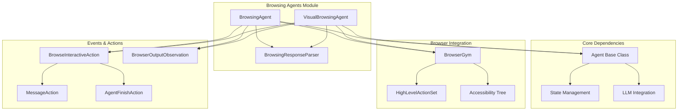
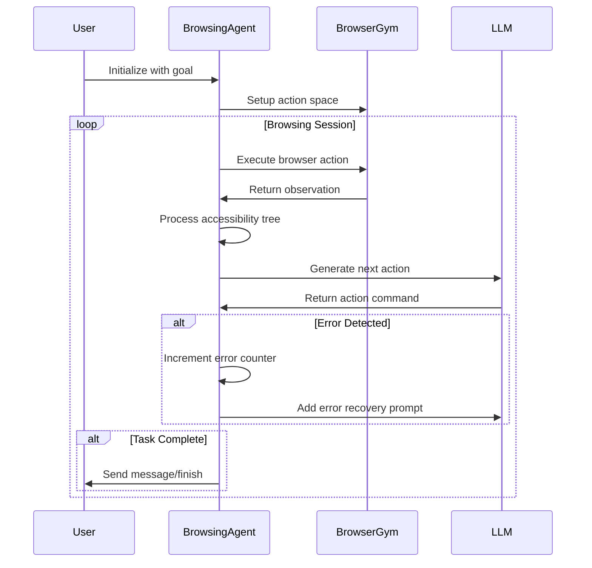
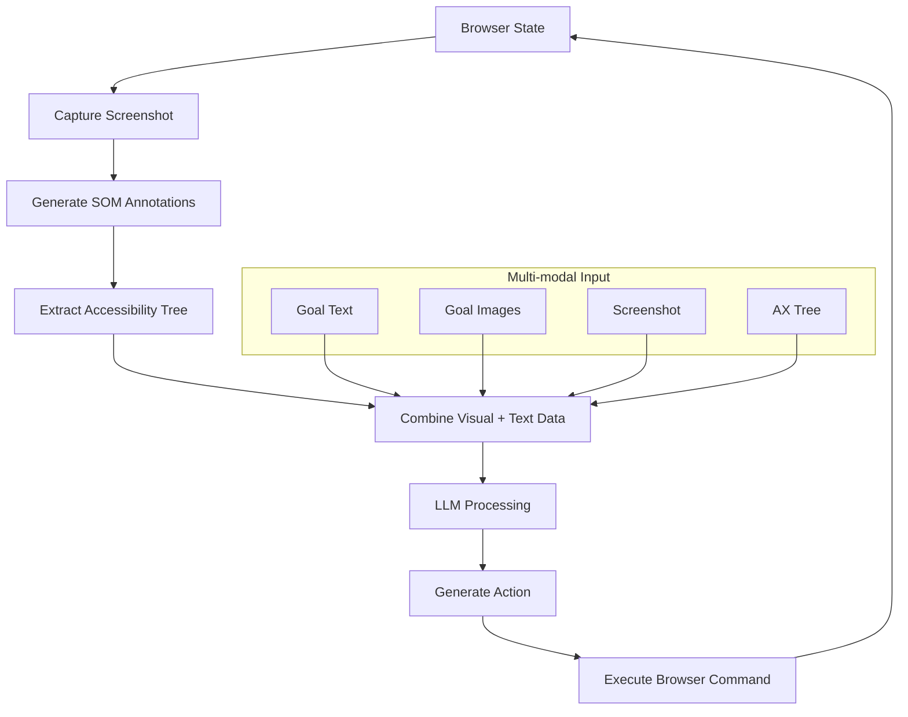
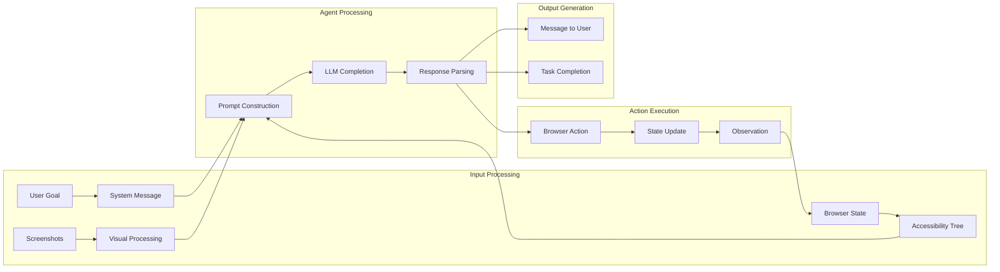

# Browsing Agents Module

The browsing_agents module provides specialized AI agents designed for web browsing and interaction tasks. This module contains two primary agent implementations that enable automated web navigation, content extraction, and user interaction through browser environments.

## Overview

The browsing_agents module is part of the broader [agent_implementations](agent_implementations.md) system and provides web-focused automation capabilities. It leverages BrowserGym for browser interaction and integrates with the [core_agent_system](core_agent_system.md) to provide intelligent web browsing functionality.

### Key Components

- **BrowsingAgent**: Text-based web browsing agent using accessibility trees
- **VisualBrowsingAgent**: Enhanced browsing agent with visual screenshot capabilities

## Architecture



## Component Details

### BrowsingAgent

The `BrowsingAgent` is a text-based web browsing agent that interacts with web pages using accessibility trees and high-level browser actions.

#### Key Features

- **Accessibility Tree Navigation**: Uses flattened accessibility trees for page understanding
- **Configurable Action Space**: Supports chat, bid (browser element identification), and navigation actions
- **Error Recovery**: Implements error accumulation and recovery mechanisms
- **Evaluation Mode Support**: Special handling for benchmark evaluations (WebArena, MiniWoB)

#### Configuration Options

```python
# Environment variables affecting behavior
USE_NAV = True/False          # Enable/disable navigation actions
USE_CONCISE_ANSWER = True/False  # Return concise answers for benchmarks
```

#### Action Flow



### VisualBrowsingAgent

The `VisualBrowsingAgent` extends browsing capabilities with visual screenshot processing, enabling more sophisticated web interaction through both textual and visual understanding.

#### Enhanced Features

- **Screenshot Integration**: Processes webpage screenshots with Set-of-Marks (SOM) annotations
- **Multi-modal Input**: Handles both text and image inputs for goal specification
- **Tab Management**: Advanced tab handling and navigation
- **Visual Element Detection**: Enhanced element identification through visual cues

#### Visual Processing Pipeline



## Integration Points

### Core Agent System Integration

Both browsing agents inherit from the base [Agent](core_agent_system.md) class and integrate with:

- **State Management**: Uses [TrafficControlState](state_management.md) for session state
- **Action Processing**: Leverages [ActionParser](action_processing.md) for command interpretation
- **LLM Integration**: Connects to [LLM services](llm_integration.md) for decision making

### Event System Integration

The agents interact with the [events_and_actions](events_and_actions.md) system through:

- **BrowseInteractiveAction**: Primary action type for browser commands
- **BrowserOutputObservation**: Receives browser state and feedback
- **MessageAction**: Communicates with users
- **AgentFinishAction**: Signals task completion

### Runtime Integration

Browsing agents operate within the [runtime_system](runtime_system.md) environment:

- **Plugin Requirements**: Minimal sandbox plugin requirements
- **Browser Environment**: Requires browser runtime capabilities
- **Resource Management**: Handles browser process lifecycle

## Data Flow



## Configuration and Usage

### Basic Configuration

```python
from openhands.agenthub.browsing_agent import BrowsingAgent
from openhands.core.config import AgentConfig
from openhands.llm.llm_registry import LLMRegistry

# Initialize browsing agent
config = AgentConfig()
llm_registry = LLMRegistry()
agent = BrowsingAgent(config, llm_registry)

# For visual browsing
from openhands.agenthub.visualbrowsing_agent import VisualBrowsingAgent
visual_agent = VisualBrowsingAgent(config, llm_registry)
```

### Action Space Configuration

The agents support configurable action spaces:

- **chat**: Communication with users
- **bid**: Browser element identification and interaction
- **nav**: Navigation actions (URL changes, back/forward)
- **tab**: Tab management (VisualBrowsingAgent only)
- **infeas**: Infeasibility reporting (VisualBrowsingAgent only)

## Error Handling and Recovery

Both agents implement robust error handling:

### Error Accumulation
- Track consecutive errors
- Implement error recovery prompts
- Fail gracefully after threshold (5 errors)

### Error Types
- Browser action failures
- Accessibility tree processing errors
- Timeout handling
- Element interaction failures

## Performance Considerations

### BrowsingAgent Optimizations
- Lightweight text-based processing
- Efficient accessibility tree parsing
- Minimal memory footprint

### VisualBrowsingAgent Considerations
- Image processing overhead
- Screenshot capture latency
- Multi-modal LLM requirements
- Higher memory usage

## Evaluation and Benchmarking

The module supports specialized evaluation modes:

### Benchmark Support
- **WebArena**: Web-based task evaluation
- **MiniWoB++**: Mini web-based tasks
- **VisualWebArena**: Visual web task evaluation

### Evaluation Features
- Concise answer mode
- Navigation action control
- Initial state handling
- Performance metrics collection

## Dependencies

### External Dependencies
- **BrowserGym**: Core browser interaction framework
- **Playwright**: Browser automation engine

### Internal Dependencies
- [core_agent_system](core_agent_system.md): Base agent functionality
- [events_and_actions](events_and_actions.md): Event handling system
- [llm_integration](llm_integration.md): Language model services
- [runtime_system](runtime_system.md): Execution environment

## Future Enhancements

### Planned Improvements
- Enhanced visual understanding capabilities
- Multi-page task coordination
- Advanced error recovery strategies
- Performance optimization for large-scale deployments

### Integration Opportunities
- [security_system](security_system.md): Web security analysis
- [microagent_system](microagent_system.md): Specialized web task agents
- [storage_system](storage_system.md): Session and interaction persistence

## Related Documentation

- [agent_implementations](agent_implementations.md): Overview of all agent types
- [core_agent_system](core_agent_system.md): Base agent architecture
- [events_and_actions](events_and_actions.md): Event system details
- [llm_integration](llm_integration.md): Language model integration
- [runtime_system](runtime_system.md): Execution environment