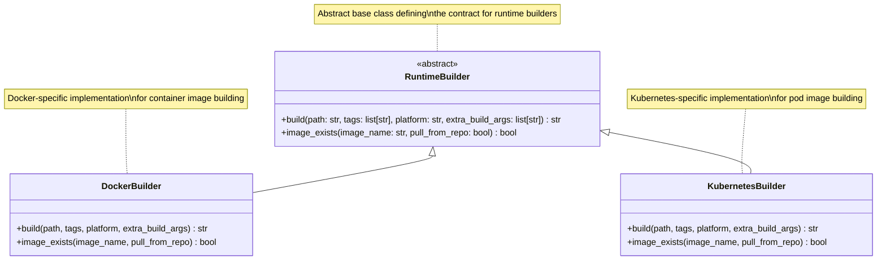
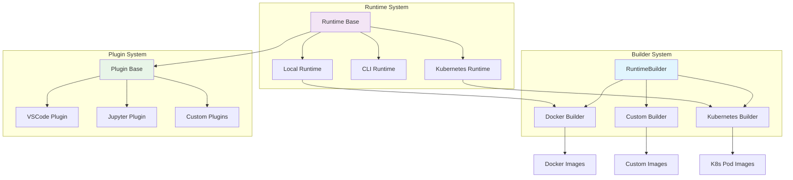
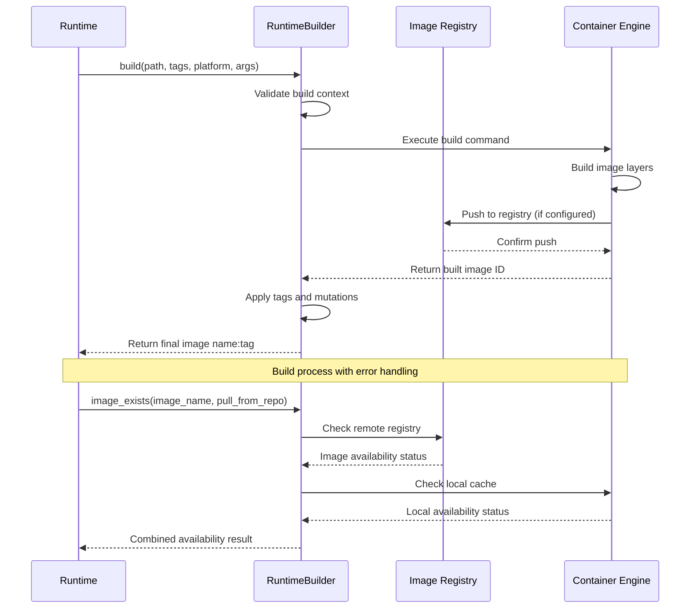
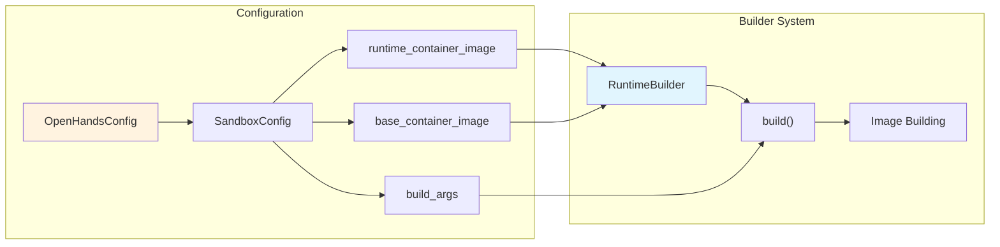
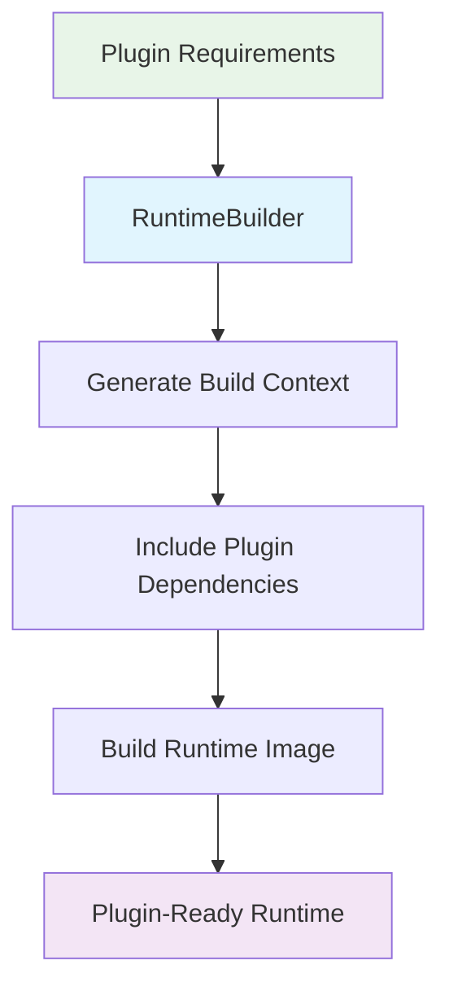

# Builder System Documentation

## Overview

The Builder System is a critical component of the OpenHands runtime infrastructure that provides an abstract interface for building runtime container images. This module defines the contract for runtime image builders and enables different runtime implementations to create and manage their execution environments.

The builder system serves as the foundation for creating containerized environments where OpenHands agents execute their tasks, ensuring consistent and reproducible runtime environments across different deployment scenarios.

## Core Architecture

### RuntimeBuilder Abstract Base Class

The `RuntimeBuilder` is the central abstraction that defines the interface for all runtime image builders in the OpenHands ecosystem.



### Key Methods

#### build()
- **Purpose**: Builds runtime images from source directories
- **Parameters**:
  - `path`: Build directory containing Dockerfile and context
  - `tags`: List of tags to apply to the built image
  - `platform`: Target platform for multi-architecture builds
  - `extra_build_args`: Additional build arguments
- **Returns**: Final image name:tag for runtime usage
- **Raises**: `AgentRuntimeBuildError` on build failures

#### image_exists()
- **Purpose**: Checks if a runtime image exists locally or remotely
- **Parameters**:
  - `image_name`: Name of the image to check
  - `pull_from_repo`: Whether to pull from remote repository
- **Returns**: Boolean indicating image availability

## Integration with Runtime System

The Builder System integrates closely with the broader runtime infrastructure:



### Runtime Dependencies

The builder system supports various runtime implementations:

- **[Local Runtime](runtime_implementations.md#local-runtime)**: Uses Docker builders for containerized execution
- **[CLI Runtime](runtime_implementations.md#cli-runtime)**: May use builders for isolated environments
- **[Kubernetes Runtime](runtime_implementations.md#kubernetes-runtime)**: Leverages Kubernetes-specific builders

## Build Process Flow



## Error Handling

The builder system implements robust error handling:

### AgentRuntimeBuildError
- Raised when image builds fail
- Contains detailed error information
- Enables runtime recovery strategies

### Common Error Scenarios
1. **Build Context Issues**: Missing Dockerfile, invalid paths
2. **Resource Constraints**: Insufficient memory/disk space
3. **Network Failures**: Registry connectivity issues
4. **Permission Errors**: Docker daemon access, registry authentication

## Configuration Integration

The builder system integrates with the [core configuration system](core_configuration.md):



## Plugin Integration

The builder system works with the [plugin system](plugin_system.md) to create runtime environments with required capabilities:

### Plugin-Aware Building
- Builders can incorporate plugin requirements into images
- Dynamic plugin installation during build process
- Plugin-specific build arguments and configurations

### Build-Time Plugin Setup


## Security Considerations

### Build Security
- Secure build contexts with minimal attack surface
- Validation of build arguments and parameters
- Isolation of build processes from host system

### Image Security
- Base image vulnerability scanning
- Minimal runtime dependencies
- Secure default configurations

## Performance Optimization

### Build Caching
- Layer caching for faster subsequent builds
- Multi-stage build optimization
- Shared base image layers

### Resource Management
- Build resource limits and quotas
- Parallel build capabilities
- Build artifact cleanup

## Extension Points

The builder system provides several extension points:

### Custom Builder Implementation
```python
class CustomRuntimeBuilder(RuntimeBuilder):
    def build(self, path: str, tags: list[str], 
              platform: str | None = None,
              extra_build_args: list[str] | None = None) -> str:
        # Custom build logic
        pass
    
    def image_exists(self, image_name: str, 
                     pull_from_repo: bool = True) -> bool:
        # Custom existence check
        pass
```

### Builder Factory Pattern
- Dynamic builder selection based on runtime type
- Configuration-driven builder instantiation
- Plugin-based builder extensions

## Monitoring and Observability

### Build Metrics
- Build duration and success rates
- Image size and layer optimization
- Resource utilization during builds

### Logging and Debugging
- Detailed build logs and error traces
- Build context inspection capabilities
- Performance profiling for build optimization

## Related Documentation

- **[Runtime System](runtime_system.md)**: Overall runtime architecture
- **[Runtime Implementations](runtime_implementations.md)**: Specific runtime types
- **[Plugin System](plugin_system.md)**: Plugin architecture and integration
- **[Core Configuration](core_configuration.md)**: Configuration management
- **[Security System](security_system.md)**: Security considerations

## Future Enhancements

### Planned Features
- Multi-architecture build support
- Advanced caching strategies
- Build pipeline integration
- Custom registry support

### Extensibility Roadmap
- Builder plugin architecture
- Dynamic build optimization
- Cloud-native build services
- Integration with CI/CD pipelines

The Builder System serves as a foundational component that enables OpenHands to create consistent, secure, and optimized runtime environments across different deployment scenarios while maintaining flexibility for custom implementations and extensions.