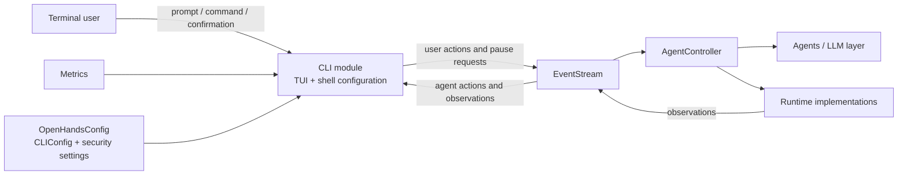
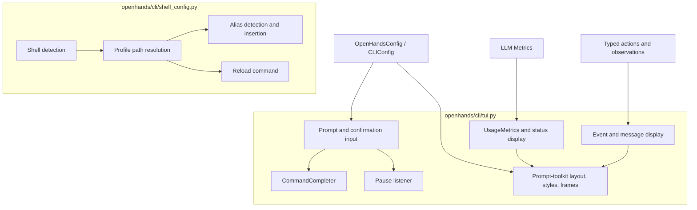
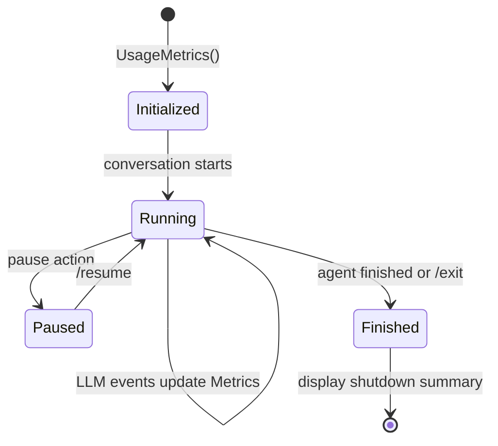
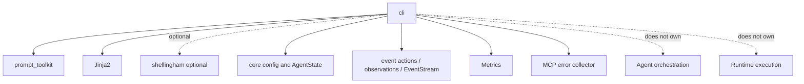

# CLI

## Introduction

The `cli` module is OpenHands’ terminal user interface boundary. It turns the
event stream produced by the agent and runtime into readable terminal output,
collects user prompts and action confirmations, exposes interactive commands,
and provides shell aliases for launching OpenHands conveniently.

The module has two focused parts:

- `openhands/cli/tui.py` implements presentation, input, command completion,
  pause/resume interaction, confirmation prompts, and usage summaries.
- `openhands/cli/shell_config.py` detects the user’s shell and manages the
  `openhands` and `oh` aliases in the appropriate profile file.

The CLI does not own agent orchestration, event persistence, LLM accounting, or
runtime execution. Those responsibilities remain in [Agent Controller](agent_controller.md),
[Event System](event_system.md), [LLM Metrics](llm_layer_metrics.md), and the
[Sandboxed Execution Layer](sandboxed_execution_layer.md).

## Position in the system



The TUI is therefore a bidirectional adapter around the event stream: user
input is converted into actions, while agent/runtime events are rendered as
messages, command output, diffs, tool calls, and state changes. Shell setup is
an independent local convenience layer and does not participate in a
conversation after the process starts.

## Architecture



### Components

| Component | Location | Responsibility |
| --- | --- | --- |
| `CommandCompleter` | `openhands/cli/tui.py` | Completes commands beginning with `/`; hides `/resume` unless the agent is paused. |
| `UsageMetrics` | `openhands/cli/tui.py` | Owns a `Metrics` accumulator and records the session start time. |
| Event display functions | `openhands/cli/tui.py` | Render actions, observations, agent state transitions, errors, MCP calls, task tracking, file reads, and file edits. |
| Prompt functions | `openhands/cli/tui.py` | Read single-line or Ctrl-D-terminated multiline prompts and map terminal cancellation to `/exit`. |
| Confirmation UI | `cli_confirm`, `read_confirmation_input` | Presents risk-aware choices and returns a policy decision such as `yes`, `no`, `always`, or `auto_highrisk`. |
| Pause listener | `start_pause_listener`, `process_agent_pause` | Watches Ctrl-P/Ctrl-C/Ctrl-D and appends a user-originated paused-state action. |
| `ShellConfigManager` | `openhands/cli/shell_config.py` | Detects shell/profile, checks existing aliases, appends shell-specific aliases, and returns a reload command. |
| Alias convenience functions | `openhands/cli/shell_config.py` | Provide stateless wrappers for setup, lookup, and declined-setup state. |

## Event rendering and interaction

The display dispatcher uses the typed event hierarchy from the [Event System](event_system.md).
It preserves the semantics of each event while choosing an appropriate terminal
representation:

| Event category | CLI behavior |
| --- | --- |
| `CmdRunAction` | Shows the thought, then the command unless already confirmed; initializes streaming output after confirmation. |
| `CmdOutputObservation` | Removes known shell/interpreter noise and displays output in a framed panel. |
| `FileEditObservation` | Displays a four-context-line diff using green additions, red removals, and bold metadata. |
| `FileReadObservation` | Displays file content, replacing tabs with spaces. |
| `MCPAction` / `MCPObservation` | Shows tool name, JSON-formatted arguments, and result; startup errors are collected separately. |
| `TaskTrackingAction` / `TaskTrackingObservation` | Shows plan commands, task IDs, statuses, notes, and operation results. |
| `MessageAction` from the agent | Renders escaped basic Markdown with agent styling. |
| `AgentStateChangedObservation` | Prints paused, finished, or waiting-for-input status messages. |
| `ErrorObservation` | Displays an error in a red framed panel. |

`display_event` serializes access through the module-level `print_lock`, which
prevents concurrent event callbacks from interleaving terminal frames. Agent
thoughts are also deduplicated against a rolling five-item `recent_thoughts`
buffer. Basic Markdown rendering escapes HTML before applying only bold and
underline substitutions, preventing event text from being interpreted as
arbitrary prompt-toolkit markup.

```mermaid
sequenceDiagram
    participant Stream as EventStream
    participant TUI as display_event
    participant View as Prompt-toolkit view
    participant User as Terminal user

    Stream->>TUI: Action or Observation
    TUI->>TUI: Acquire print_lock
    TUI->>TUI: Deduplicate thought / classify event
    TUI->>View: Render framed text, diff, tool call, or state message
    View-->>User: Terminal output
    TUI-->>Stream: No mutation of event; presentation only
```

## Input and control flow

```mermaid
flowchart TD
    START[Prompt session] --> MODE{Multiline?}
    MODE -->|No| ONE[Read prompt with command completion]
    MODE -->|Yes| MANY[Read until Ctrl-D]
    ONE --> CANCEL{KeyboardInterrupt / EOF?}
    MANY --> CANCEL
    CANCEL -->|Yes| EXIT[/exit]
    CANCEL -->|No| MESSAGE[Return user message]

    MESSAGE --> COMMAND{Starts with /?}
    COMMAND -->|Yes| DISPATCH[CLI command handler outside this module]
    COMMAND -->|No| ACTION[Create user message action]
    ACTION --> STREAM[Append to EventStream]

    AGENT[Agent running] --> KEY[Ctrl-P / Ctrl-C / Ctrl-D]
    KEY --> PAUSED[Append ChangeAgentStateAction(PAUSED)]
    PAUSED --> STREAM
    DISPATCH --> RESUME[/resume when paused]
```

`create_prompt_session` honors `config.cli.vi_mode`. For multiline input, the
normal completer is disabled and a local Ctrl-D binding submits the buffer.
`read_prompt_input` deliberately converts terminal interrupts and EOF into the
`/exit` command so callers receive a uniform shutdown signal.

### Command completion

`COMMANDS` defines the built-in command vocabulary:

`/exit`, `/help`, `/init`, `/status`, `/new`, `/settings`, `/resume`, and `/mcp`.

`CommandCompleter` only yields completions when the text before the cursor,
after leading whitespace is removed, starts with `/`. Completion replaces the
entire command prefix and includes the human-readable description as metadata.
The paused-state check is dynamic: `/resume` is offered only while the agent is
paused.

### Confirmation and security

`read_confirmation_input` delegates the blocking prompt-toolkit application to
`asyncio.to_thread`, allowing the surrounding async loop to remain responsive.
High-risk actions use a dedicated red `HIGH RISK` frame and omit the ordinary
low/medium auto-confirm option. Arrow keys always navigate; `j` and `k` also
navigate when vi mode is enabled. Enter returns the selected index, which is
mapped to a policy string for the caller.

The UI is only the interaction surface. The actual risk classification and
security policy are supplied by the action/security layers described in
[Security Analyzers](security_analyzers.md) and [Core Configuration](core_configuration.md).

## Usage metrics and lifecycle

`UsageMetrics` starts a wall-clock timer at construction and owns a `Metrics`
instance. `display_usage_metrics` reports accumulated cost, prompt tokens,
cache reads, cache writes, completion tokens, and total prompt-plus-completion
tokens. `display_status` adds conversation ID and uptime; shutdown also reports
the duration before the conversation closes.



The metrics object is a view of the LLM layer’s accounting rather than a second
accounting system; see [LLM Layer Metrics](llm_layer_metrics.md) for token and
cost semantics.

## Shell configuration management

`ShellConfigManager` defaults aliases to:

```text
uvx --python 3.12 --from openhands-ai openhands
```

It supports Bash, Zsh, Fish, and PowerShell templates. Shellingham is used when
available; detection failures are intentionally non-fatal. Profile resolution
first returns an existing candidate, then the first conventional candidate,
with platform fallbacks to PowerShell on Windows and Bash on Unix-like systems.

```mermaid
flowchart LR
    INIT[ShellConfigManager(command)] --> DETECT[detect_shell]
    DETECT --> RESOLVE[get_shell_config_path]
    RESOLVE --> EXISTS{Profile exists?}
    EXISTS -->|No| CREATE[Create parent directories as needed]
    EXISTS -->|Yes| TYPE[get_shell_type_from_path]
    CREATE --> TYPE
    TYPE --> ALREADY{OpenHands alias/function present?}
    ALREADY -->|Yes| DONE[Return success]
    ALREADY -->|No| TEMPLATE[Render shell-specific alias template]
    TEMPLATE --> APPEND[Append to profile]
    APPEND --> RELOAD[get_reload_command]
```

Alias installation is idempotent at the module’s detection level: if either
recognized OpenHands alias/function is found, `add_aliases` returns success
without appending another block. It does not remove or rewrite existing aliases.
The profile write may fail due to permissions or filesystem errors; the method
prints the error and returns `False`.

The setup-declined marker is independent of shell profiles:
`~/.openhands/.cli_alias_setup_declined`. `alias_setup_declined` checks for this
file, while `mark_alias_setup_declined` creates the directory and touches the
marker. These helpers allow a higher-level CLI bootstrap flow to avoid asking
again without coupling that policy to profile editing.

## Dependencies and boundaries



Important boundaries are:

- Event schemas and stream behavior belong to [Event System](event_system.md).
- CLI flags and vi-mode configuration belong to [Core Configuration](core_configuration.md).
- Runtime selection and command execution belong to [Sandboxed Execution Layer](sandboxed_execution_layer.md).
- Agent state transitions and pause semantics are coordinated by [Agent Controller](agent_controller.md).
- Frontend event/state models are documented under the user-facing client module;
  the CLI renders the Python event stream locally and is not the web frontend.

## Operational notes and extension points

- Add a slash command by extending `COMMANDS` and implementing dispatch in the
  higher-level CLI loop; `CommandCompleter` will expose it automatically.
- Add a new event presentation by extending `display_event` and introducing a
  focused renderer. Keep rendering side-effect-free except for terminal output.
- Preserve `print_lock` around concurrent event display and keep thought
  deduplication bounded.
- New shells require a template, profile candidates, alias-detection regexes,
  path classification, and reload command.
- Changes to confirmation choices must keep the returned mapping synchronized
  with the displayed list and should preserve the special treatment of high-risk
  actions.

