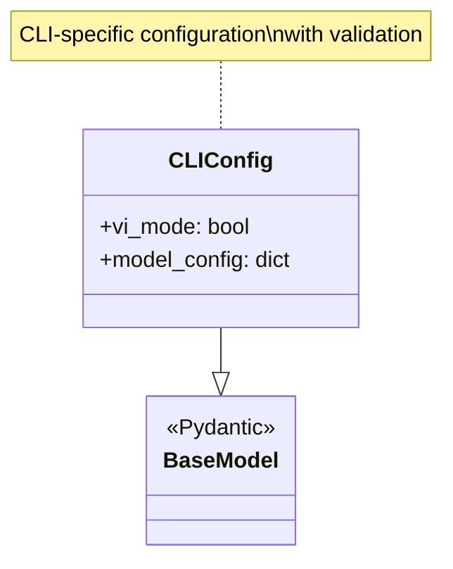
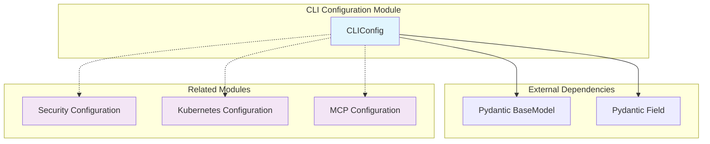
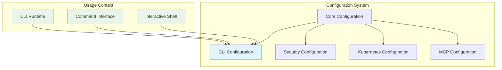
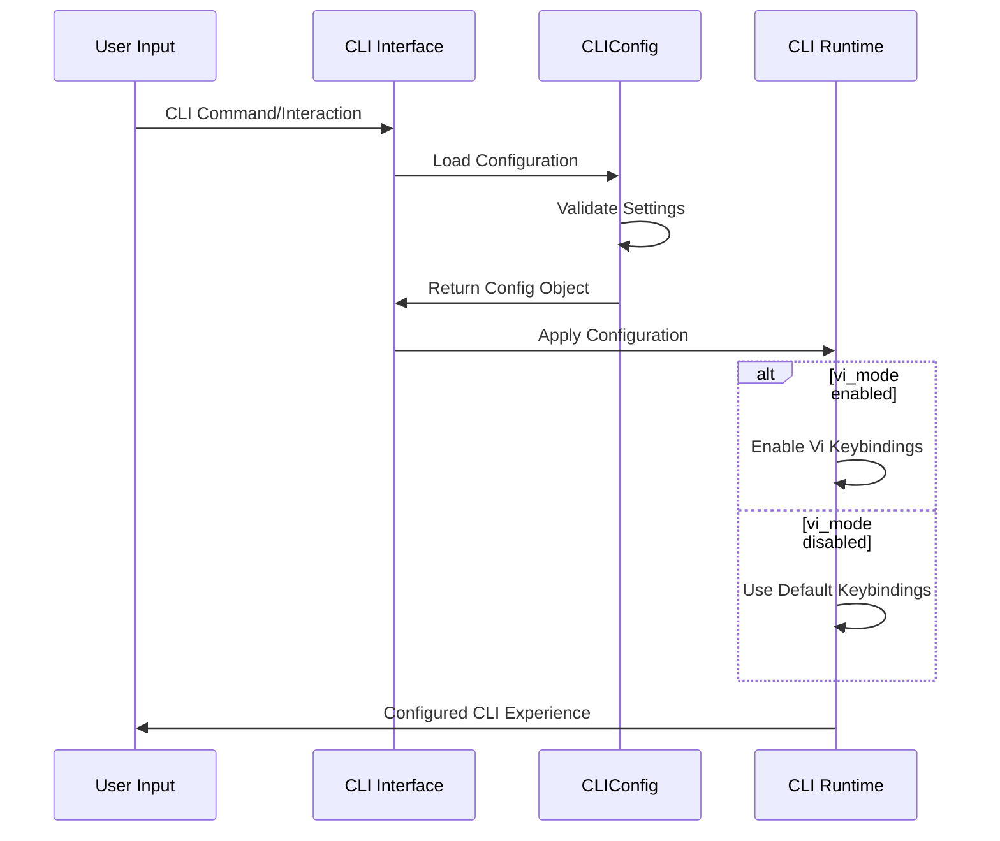
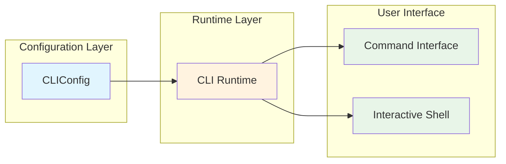
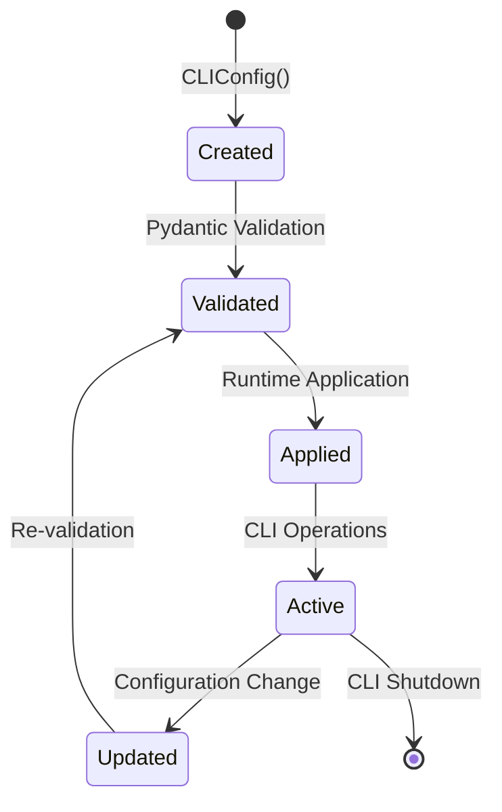

# CLI Configuration Module

The CLI Configuration module provides configuration management specifically for command-line interface settings within the OpenHands system. This module is part of the broader [core_configuration](core_configuration.md) system and handles CLI-specific behavioral settings.

## Overview

The `cli_configuration` module contains a single core component that manages CLI-specific settings, particularly editor modes and interface behaviors. It leverages Pydantic for robust configuration validation and type safety.

## Architecture

### Core Components



### Module Structure



## Core Component Details

### CLIConfig

The `CLIConfig` class is a Pydantic model that manages CLI-specific configuration settings.

**Key Features:**
- **Vi Mode Support**: Configurable vi-style editing mode for CLI interactions
- **Validation**: Built-in Pydantic validation with strict field control
- **Type Safety**: Strongly typed configuration fields
- **Immutability**: Extra fields are forbidden to prevent configuration drift

**Configuration Fields:**
- `vi_mode` (bool): Enables/disables vi-style editing mode in CLI interfaces (default: False)

**Model Configuration:**
- `extra='forbid'`: Prevents addition of undefined configuration fields, ensuring strict configuration schema adherence

## Integration Patterns

### Configuration Hierarchy



### Data Flow



## Usage Examples

### Basic Configuration

```python
from openhands.core.config.cli_config import CLIConfig

# Default configuration
config = CLIConfig()
print(config.vi_mode)  # False

# Enable vi mode
vi_config = CLIConfig(vi_mode=True)
print(vi_config.vi_mode)  # True
```

### Configuration Validation

```python
# Valid configuration
try:
    config = CLIConfig(vi_mode=True)
    print("Configuration valid")
except ValueError as e:
    print(f"Configuration error: {e}")

# Invalid configuration (extra fields forbidden)
try:
    config = CLIConfig(vi_mode=True, invalid_field="value")
except ValueError as e:
    print(f"Validation error: {e}")
```

## Integration with Other Modules

### CLI Runtime Integration

The CLI configuration directly influences the behavior of CLI runtime components:



### Related Configuration Modules

- **[Security Configuration](security_configuration.md)**: Handles security-related settings
- **[Kubernetes Configuration](kubernetes_configuration.md)**: Manages Kubernetes runtime settings
- **[MCP Configuration](mcp_configuration.md)**: Configures Model Context Protocol settings

## Configuration Lifecycle



## Best Practices

### Configuration Management
1. **Use Default Values**: Rely on sensible defaults for most use cases
2. **Validate Early**: Leverage Pydantic validation to catch configuration errors early
3. **Immutable Configuration**: Avoid modifying configuration objects after creation
4. **Type Safety**: Always use type hints and Pydantic fields

### Error Handling
```python
from pydantic import ValidationError

try:
    config = CLIConfig(vi_mode="invalid")  # Should be boolean
except ValidationError as e:
    print(f"Configuration validation failed: {e}")
    # Handle configuration error appropriately
```

## Extension Points

While the current CLI configuration is minimal, it can be extended for additional CLI features:

```python
# Potential extensions (not implemented)
class ExtendedCLIConfig(CLIConfig):
    color_scheme: str = Field(default="default")
    auto_complete: bool = Field(default=True)
    history_size: int = Field(default=1000, ge=0)
```

## Dependencies

### External Dependencies
- **Pydantic**: Configuration validation and serialization
- **Python Standard Library**: Type hints and basic functionality

### Internal Dependencies
- Part of the broader OpenHands configuration system
- Integrates with [runtime_system](runtime_system.md) for CLI runtime behavior

## Summary

The CLI Configuration module provides a focused, type-safe approach to managing CLI-specific settings within the OpenHands system. Its simple design prioritizes reliability and extensibility while maintaining strict validation standards. The module serves as a foundational component for CLI behavior customization and integrates seamlessly with the broader configuration management system.