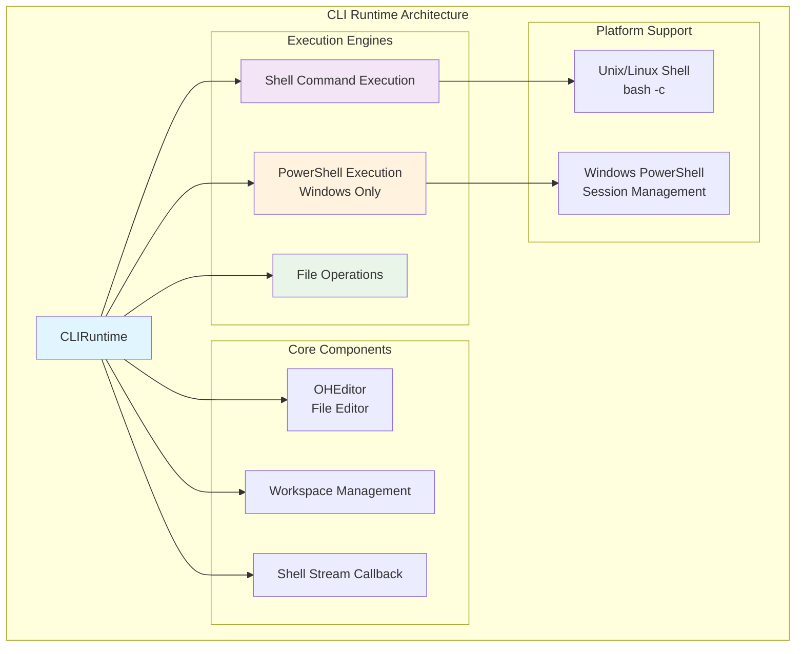
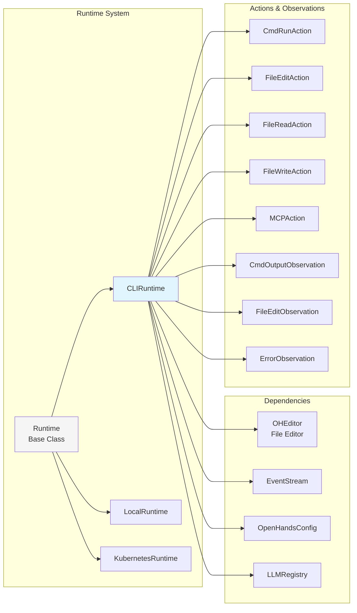
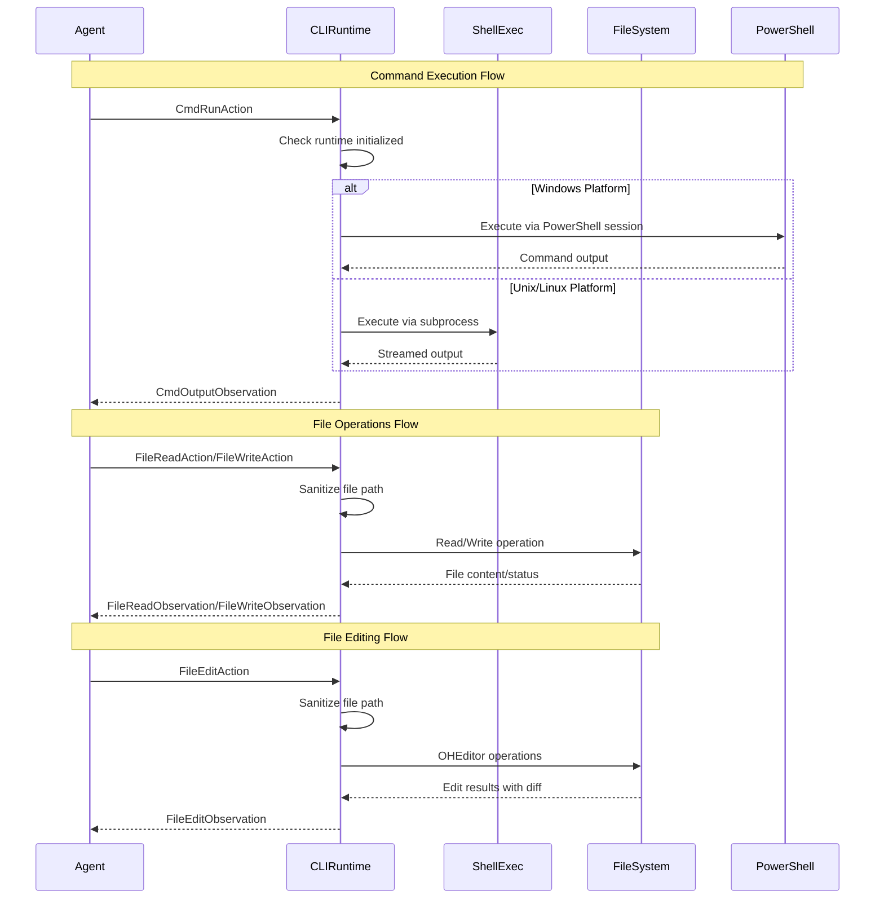
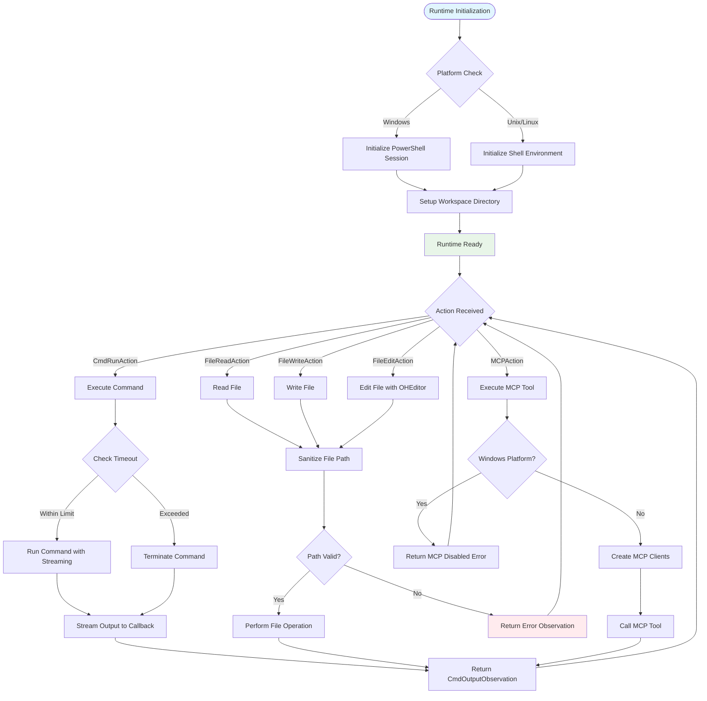

# CLI Runtime Module

## Overview

The CLI Runtime module provides a local execution environment for OpenHands agents that runs commands directly on the host system without sandboxing. This runtime implementation executes shell commands using subprocess, performs file operations through Python's standard library, and provides cross-platform support including specialized Windows PowerShell integration.

**⚠️ Security Warning**: This runtime executes commands directly on the local system without sandboxing. Use with extreme caution in untrusted environments.

## Core Architecture



## Component Relationships



## Data Flow Architecture



## Key Features

### 1. Cross-Platform Command Execution
- **Unix/Linux**: Uses `bash -c` with subprocess for shell command execution
- **Windows**: Integrates with PowerShell sessions for native Windows command support
- **Streaming Output**: Real-time command output streaming with callback support
- **Timeout Management**: Configurable command timeouts with graceful termination

### 2. Workspace Management
- **Isolated Workspace**: Creates temporary or uses configured workspace directories
- **Path Sanitization**: Enforces workspace boundaries to prevent path traversal attacks
- **File Operations**: Direct file system access within workspace constraints
- **Cross-Platform Paths**: Handles both Unix and Windows path conventions

### 3. File System Operations
- **Direct File Access**: Uses Python's standard library for file operations
- **Binary File Detection**: Prevents reading/editing of binary files
- **OHEditor Integration**: Advanced file editing capabilities with diff generation
- **Recursive Copy Operations**: Support for copying files and directories

### 4. Security Features
- **Workspace Isolation**: Restricts file operations to designated workspace
- **Path Validation**: Prevents access outside workspace boundaries
- **Binary File Protection**: Blocks operations on binary files
- **Permission Checks**: Validates file access permissions

## Process Flow



## Integration Points

### Runtime System Integration
The CLI Runtime integrates with the broader [runtime system](runtime_system.md) as a concrete implementation of the base Runtime class:

- **Base Runtime**: Inherits core runtime functionality and interfaces
- **Runtime Builder**: Can be instantiated through the runtime builder system
- **Plugin System**: Supports runtime plugins for extended functionality

### Event System Integration
Integrates with the [events and actions](events_and_actions.md) system:

- **Action Processing**: Handles CmdRunAction, FileEditAction, FileReadAction, FileWriteAction, MCPAction
- **Observation Generation**: Produces CmdOutputObservation, FileEditObservation, FileReadObservation, FileWriteObservation, ErrorObservation
- **Event Streaming**: Supports real-time command output streaming

### Agent System Integration
Works with the [core agent system](core_agent_system.md):

- **Agent Communication**: Receives actions from agents and returns observations
- **State Management**: Maintains runtime state and workspace information
- **Configuration**: Uses OpenHandsConfig for runtime configuration

## Configuration

### Basic Configuration
```python
from openhands.core.config import OpenHandsConfig
from openhands.runtime.impl.cli.cli_runtime import CLIRuntime

config = OpenHandsConfig(
    workspace_base="/path/to/workspace",  # Optional: Use specific workspace
    sandbox=SandboxConfig(
        timeout=30  # Command timeout in seconds
    )
)

runtime = CLIRuntime(
    config=config,
    event_stream=event_stream,
    llm_registry=llm_registry,
    sid="session_id"
)
```

### Environment Variables
```python
# Set environment variables for the runtime session
runtime.add_env_vars({
    "CUSTOM_VAR": "value",
    "API_KEY": SecretStr("secret_value")
})
```

### MCP Configuration
```python
# MCP (Model Context Protocol) configuration
# Note: MCP is disabled on Windows
mcp_config = runtime.get_mcp_config(
    extra_stdio_servers=[
        MCPStdioServerConfig(
            name="custom_server",
            command=["python", "server.py"]
        )
    ]
)
```

## Platform-Specific Features

### Windows Support
- **PowerShell Integration**: Native PowerShell session management
- **Path Handling**: Windows-specific path resolution and validation
- **Error Handling**: Windows-specific error messages and handling
- **MCP Limitation**: MCP functionality is disabled on Windows

### Unix/Linux Support
- **Bash Execution**: Uses `bash -c` for command execution
- **Process Groups**: Proper process group management for signal handling
- **MCP Support**: Full MCP (Model Context Protocol) support
- **Signal Handling**: SIGTERM/SIGKILL for process termination

## Security Considerations

### Workspace Isolation
- All file operations are restricted to the designated workspace directory
- Path traversal attacks are prevented through path sanitization
- Absolute paths outside workspace are rejected

### Command Execution
- No sandboxing - commands execute directly on the host system
- Process timeout management to prevent runaway processes
- Proper signal handling for process termination

### File System Access
- Binary file detection prevents corruption
- Permission validation before file operations
- Workspace boundary enforcement

## Error Handling

### Common Error Scenarios
- **Runtime Not Initialized**: Operations attempted before runtime setup
- **Path Traversal**: Attempts to access files outside workspace
- **Binary File Access**: Attempts to read/edit binary files
- **Command Timeout**: Long-running commands exceeding timeout limits
- **Permission Errors**: Insufficient permissions for file operations

### Error Recovery
- Graceful process termination on timeout
- Detailed error messages with context
- Fallback mechanisms for platform-specific operations

## Performance Characteristics

### Command Execution
- **Streaming Output**: Real-time output streaming reduces memory usage
- **Process Management**: Efficient subprocess handling with proper cleanup
- **Timeout Handling**: Prevents resource exhaustion from runaway processes

### File Operations
- **Direct Access**: No overhead from containerization or virtualization
- **Efficient Copying**: Optimized file and directory copying operations
- **Memory Management**: Streaming operations for large files

## Limitations

### Functional Limitations
- **No Browser Support**: Browser actions return error observations
- **No IPython Support**: Jupyter cell execution is not implemented
- **No Interactive Input**: Cannot send input to running processes
- **Windows MCP**: MCP functionality is disabled on Windows

### Security Limitations
- **No Sandboxing**: Commands execute directly on host system
- **Host System Access**: Full access to host system within workspace
- **Process Privileges**: Inherits privileges of the parent process

## Usage Examples

### Basic Command Execution
```python
from openhands.events.action import CmdRunAction

# Execute a shell command
action = CmdRunAction(command="ls -la", timeout=10)
observation = runtime.run(action)
print(observation.content)  # Command output
print(observation.exit_code)  # Exit code
```

### File Operations
```python
from openhands.events.action import FileReadAction, FileWriteAction

# Read a file
read_action = FileReadAction(path="example.txt")
read_obs = runtime.read(read_action)
print(read_obs.content)

# Write a file
write_action = FileWriteAction(path="output.txt", content="Hello World")
write_obs = runtime.write(write_action)
```

### File Editing
```python
from openhands.events.action import FileEditAction

# Edit a file using OHEditor
edit_action = FileEditAction(
    path="script.py",
    command="str_replace",
    old_str="old_code",
    new_str="new_code"
)
edit_obs = runtime.edit(edit_action)
print(edit_obs.diff)  # Shows the diff
```

### Shell Output Streaming
```python
def output_callback(line: str):
    print(f"Command output: {line.strip()}")

# Subscribe to shell output streaming
runtime.subscribe_to_shell_stream(output_callback)

# Now all command output will be streamed to the callback
action = CmdRunAction(command="long_running_command")
runtime.run(action)
```

## Related Documentation

- [Runtime System](runtime_system.md) - Overall runtime architecture and base classes
- [Local Runtime](local_runtime.md) - Docker-based local runtime implementation
- [Kubernetes Runtime](kubernetes_runtime.md) - Kubernetes-based runtime implementation
- [Events and Actions](events_and_actions.md) - Action and observation system
- [Core Agent System](core_agent_system.md) - Agent architecture and communication
- [Core Configuration](core_configuration.md) - Configuration system and options