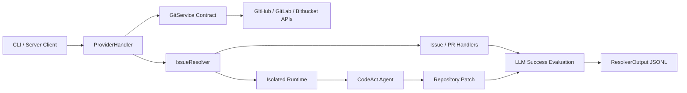
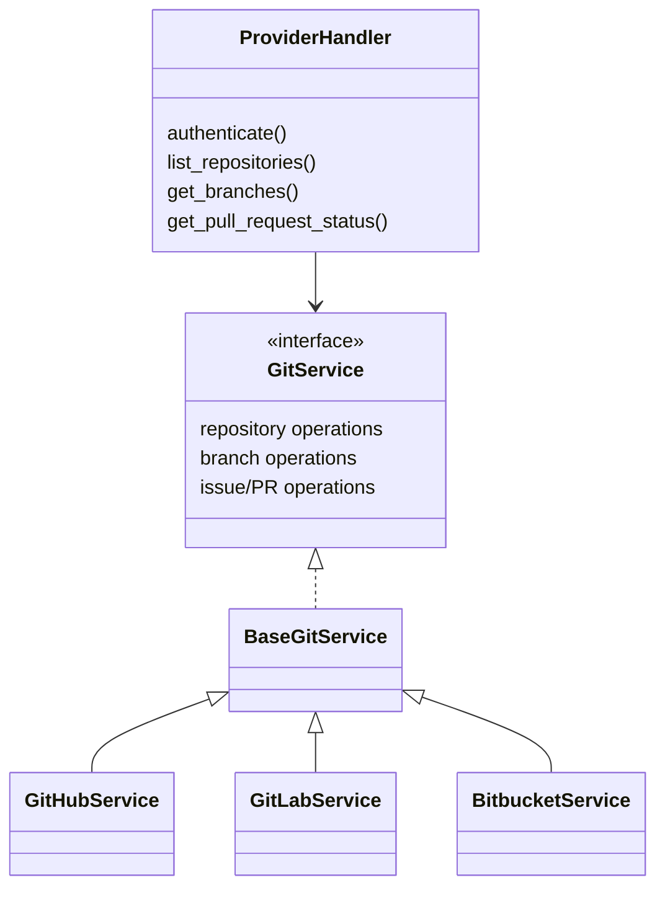

# Code Host Automation

The `code_host_automation` module automates repository-based issue and pull/merge-request workflows across GitHub, GitLab, and Bitbucket. It combines provider-neutral authentication and repository APIs with an issue resolver that runs an OpenHands agent, evaluates the resulting patch, and records the outcome.

## Architecture

Provider integrations isolate vendor-specific API behavior behind shared contracts and normalized models:

The resolver lifecycle is:

1. Identify and authenticate with the code host.
2. Load and normalize the issue or pull/merge request.
3. Clone the repository and prepare an isolated runtime.
4. Run a CodeAct agent against the task.
5. Collect the staged patch and agent history.
6. Use an LLM-backed evaluator to assess success.
7. Append a machine-readable result to `output.jsonl`.

## Core component documentation

- [Git provider integrations](git_provider_integrations.md) — provider authentication, `ProviderHandler`, `GitService`, provider implementations, normalized models, and microagent discovery.
- [Issue Resolver](issue_resolver.md) — resolver orchestration, provider handlers, runtime execution, patch collection, evaluation, and result persistence.

The issue resolver also references these supporting components:

- [Agent controller](agent_controller.md)
- [Runtime implementations](runtime_implementations.md)
- [LLM clients](llm_layer_clients.md)
- [Event system](event_system.md)