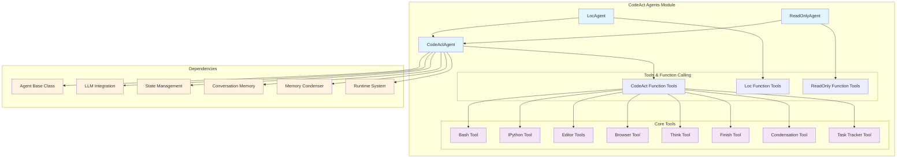
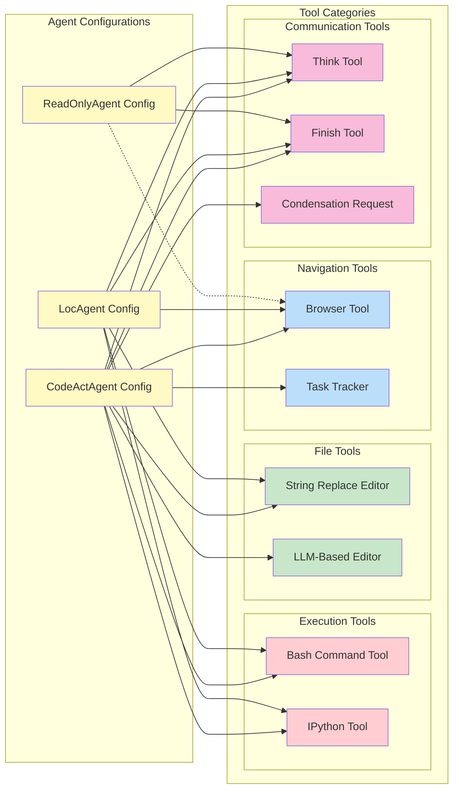
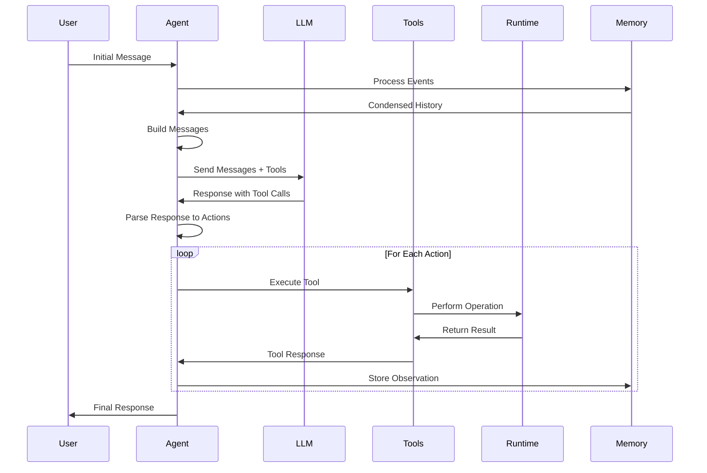
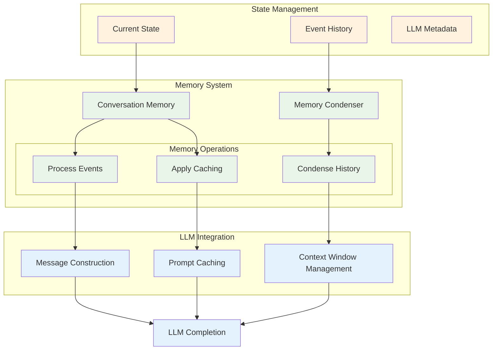
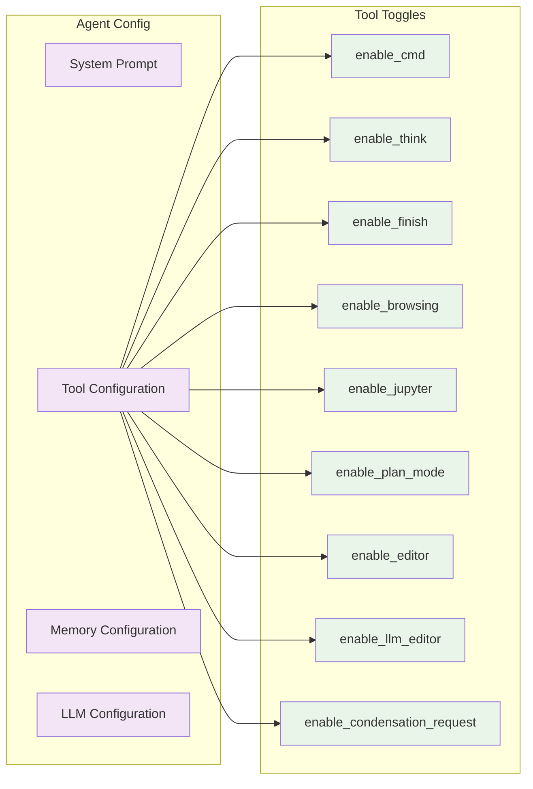
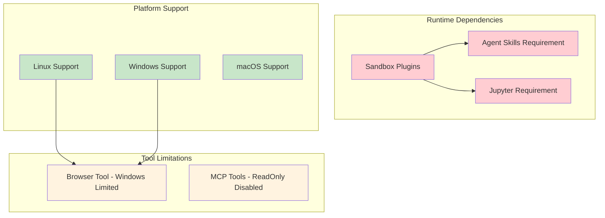
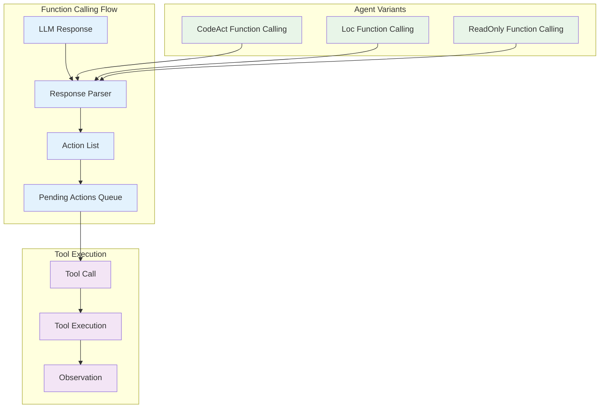

# CodeAct Agents Module

The CodeAct Agents module implements specialized AI agents that consolidate actions into a unified code action space, following the CodeAct paradigm for both simplicity and performance. This module provides three distinct agent implementations: CodeActAgent (the core implementation), LocAgent (location-aware variant), and ReadOnlyAgent (safe exploration variant).

## Architecture Overview



## Core Components

### CodeActAgent

The primary agent implementation that consolidates LLM actions into a unified code action space.

**Key Features:**
- **Unified Action Space**: Combines conversation and code execution into a single interface
- **Multi-Tool Support**: Integrates bash commands, Python execution, file editing, and web browsing
- **Memory Management**: Uses conversation memory and condensation for efficient context handling
- **Function Calling**: Supports structured tool invocation through LLM function calling

**Core Capabilities:**
1. **Converse**: Natural language communication with users
2. **CodeAct**: Task execution through code (bash commands and Python)
3. **File Operations**: Reading, editing, and managing files
4. **Web Browsing**: Interactive web navigation and content extraction
5. **Task Management**: Planning and tracking task progress

### LocAgent

A specialized variant of CodeActAgent with location-aware capabilities.

**Specializations:**
- Inherits all CodeActAgent functionality
- Uses custom function calling implementation for location-specific operations
- Optimized for tasks requiring spatial or location-based reasoning

### ReadOnlyAgent

A safety-focused variant that restricts operations to read-only tools.

**Safety Features:**
- **Read-Only Operations**: Only allows non-destructive operations
- **Safe Exploration**: Ideal for codebase analysis without modification risk
- **Restricted Tool Set**: Limited to grep, glob, view, think, finish, and web_read tools
- **MCP Tool Restriction**: Explicitly disables MCP tools for additional safety

## Tool System Architecture



## Agent Lifecycle and Processing Flow



## Memory and Context Management



## Configuration and Customization

### Agent Configuration Options



## Integration Points

### Dependencies on Other Modules

- **[core_agent_system](core_agent_system.md)**: Base Agent class and state management
- **[llm_integration](llm_integration.md)**: LLM communication and routing
- **[events_and_actions](events_and_actions.md)**: Action and observation handling
- **[runtime_system](runtime_system.md)**: Code execution environment
- **Memory System**: Conversation memory and condensation capabilities

### Runtime Requirements



## Usage Patterns

### CodeActAgent Usage
```python
# Standard usage for general-purpose tasks
agent = CodeActAgent(config, llm_registry)
action = agent.step(state)
```

### LocAgent Usage
```python
# For location-aware tasks
agent = LocAgent(config, llm_registry)
action = agent.step(state)
```

### ReadOnlyAgent Usage
```python
# For safe codebase exploration
agent = ReadOnlyAgent(config, llm_registry)
action = agent.step(state)  # Only read-only operations
```

## Function Calling Architecture



## Error Handling and Safety

### Safety Mechanisms
- **ReadOnlyAgent**: Prevents destructive operations
- **Tool Validation**: Checks tool availability and compatibility
- **Platform Checks**: Validates tool support on current platform
- **MCP Tool Control**: Selective enabling/disabling of external tools

### Error Recovery
- **Pending Actions Queue**: Maintains action continuity across errors
- **State Validation**: Ensures valid conversation state
- **Memory Condensation**: Handles context overflow gracefully

## Performance Considerations

### Memory Optimization
- **Event Condensation**: Reduces memory footprint of long conversations
- **Message Caching**: Optimizes repeated LLM calls
- **Tool Description Optimization**: Adjusts tool descriptions based on LLM model

### Execution Efficiency
- **Pending Actions**: Batches multiple actions for efficient execution
- **Tool Selection**: Dynamic tool loading based on configuration
- **Context Management**: Intelligent context window utilization

## Future Extensions

The CodeAct Agents module is designed for extensibility:

1. **New Agent Types**: Easy addition of specialized agent variants
2. **Tool Integration**: Modular tool system for new capabilities
3. **Memory Strategies**: Pluggable memory and condensation approaches
4. **Platform Support**: Expandable runtime environment support

This module serves as the foundation for intelligent code-aware AI agents that can understand, navigate, and interact with software development environments while maintaining safety and efficiency.