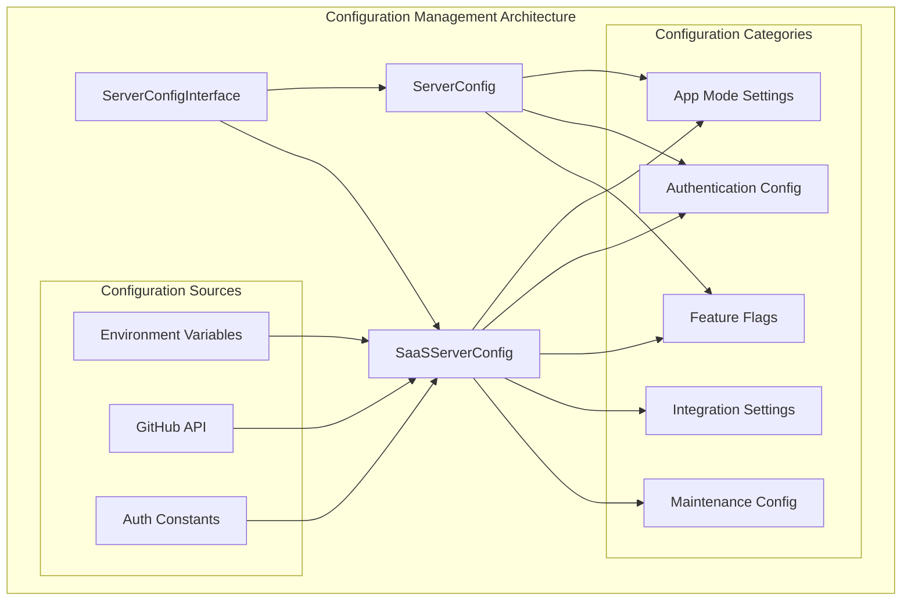
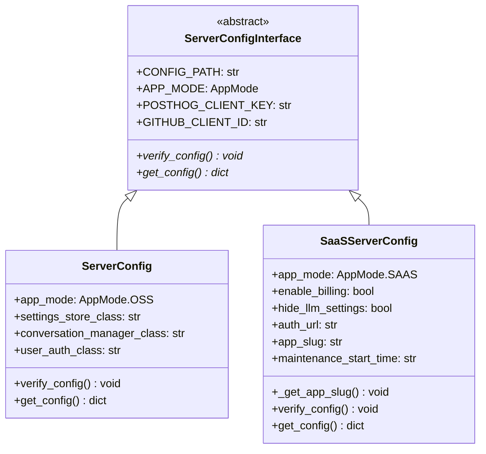
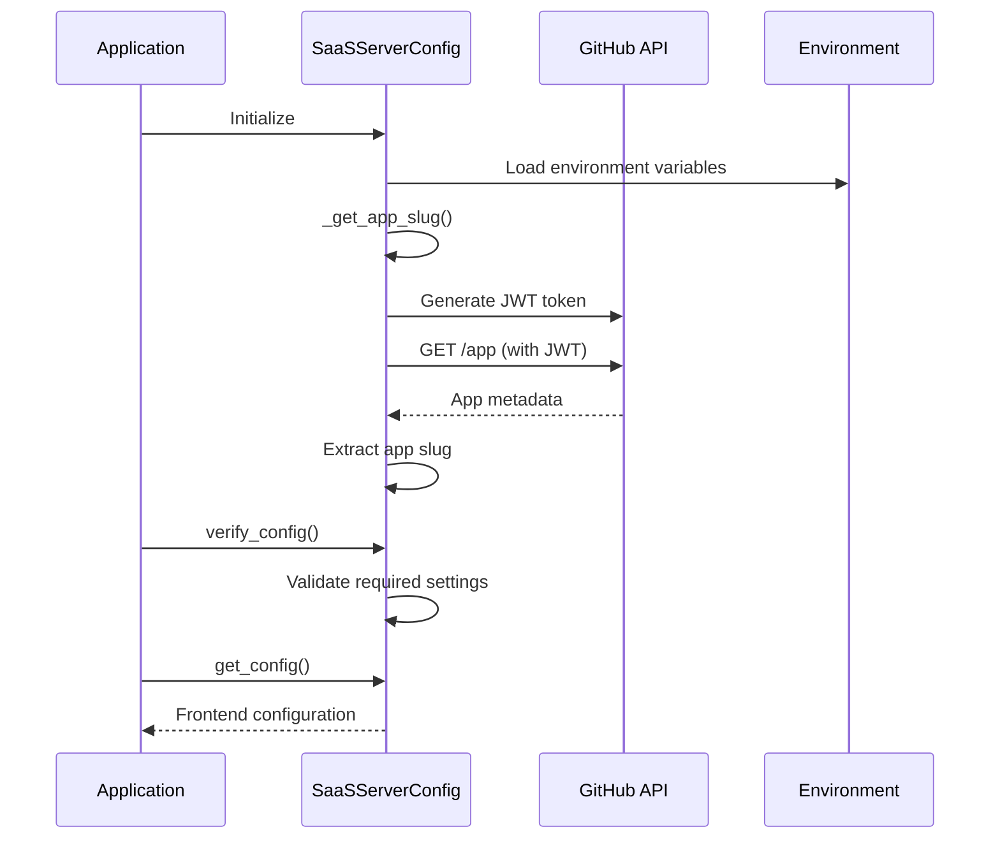
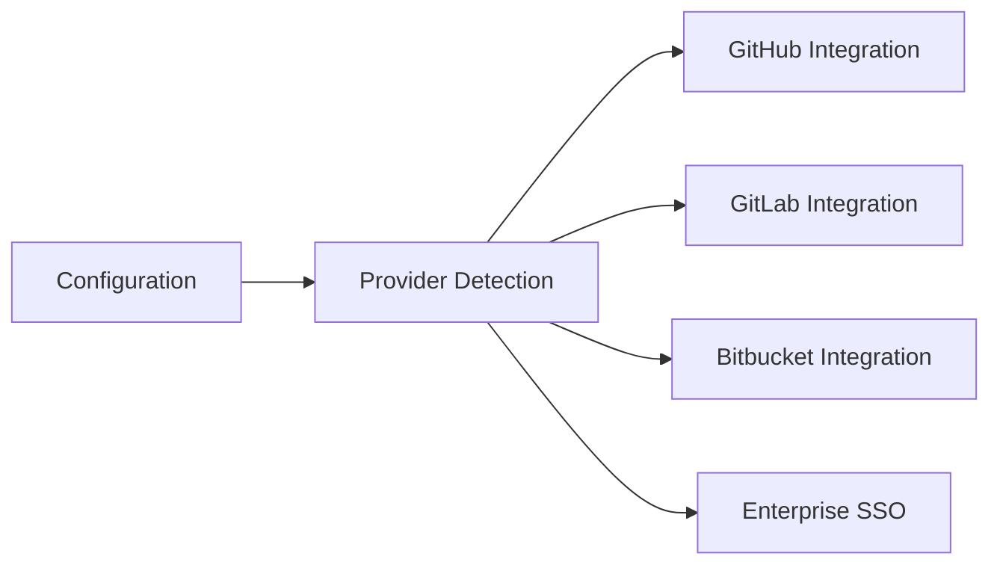
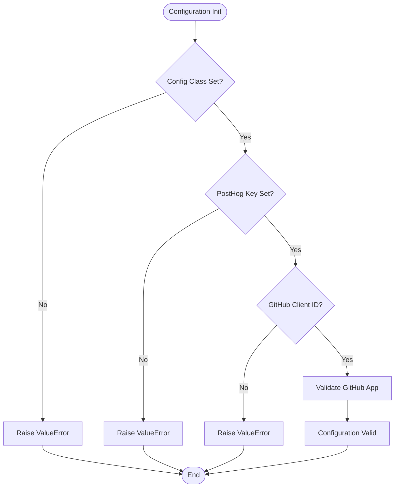

# Configuration Management Module

The configuration_management module provides a centralized system for managing server configuration across different deployment modes (OSS and SaaS) in the OpenHands platform. It handles environment-specific settings, feature flags, authentication providers, and integration configurations.

## Architecture Overview



## Core Components

### ServerConfigInterface
Abstract base class defining the configuration contract for all server configurations.

**Key Responsibilities:**
- Defines configuration verification interface
- Establishes frontend configuration contract
- Provides type safety for configuration attributes

**Abstract Methods:**
- `verify_config()`: Validates configuration settings
- `get_config()`: Returns frontend-compatible configuration dictionary

### SaaSServerConfig
Enterprise-grade configuration implementation for SaaS deployments with advanced features and integrations.

**Key Features:**
- GitHub App integration with automatic slug retrieval
- JWT token signing and webhook signature verification
- Multi-provider authentication support
- Maintenance window management
- Enterprise feature flags
- Specialized storage and authentication classes

## Configuration Hierarchy



## Configuration Flow



## Environment Variables

### Core Configuration
- `OPENHANDS_CONFIG_CLS`: Configuration class path
- `POSTHOG_CLIENT_KEY`: Analytics client key
- `AUTH_URL`: Authentication service URL

### Feature Flags
- `ENABLE_BILLING`: Enable billing features
- `HIDE_LLM_SETTINGS`: Hide LLM configuration UI
- `ENABLE_JIRA`: Enable Jira integration
- `ENABLE_JIRA_DC`: Enable Jira Data Center
- `ENABLE_LINEAR`: Enable Linear integration

### Authentication Providers
- `GITHUB_APP_CLIENT_ID`: GitHub OAuth client ID
- `GITHUB_APP_PRIVATE_KEY`: GitHub App private key
- `GITHUB_APP_WEBHOOK_SECRET`: GitHub webhook secret
- `GITLAB_APP_CLIENT_ID`: GitLab OAuth client ID
- `BITBUCKET_APP_CLIENT_ID`: Bitbucket OAuth client ID
- `ENABLE_ENTERPRISE_SSO`: Enable enterprise SSO

### Maintenance
- `MAINTENANCE_START_TIME`: Scheduled maintenance timestamp

## Integration Points

### Storage System Integration
The configuration management module integrates with the [storage_system](storage_system.md) by specifying storage implementation classes:

```python
# SaaS-specific storage implementations
settings_store_class: str = 'storage.saas_settings_store.SaasSettingsStore'
secret_store_class: str = 'storage.saas_secrets_store.SaasSecretsStore'
conversation_store_class: str = 'storage.saas_conversation_store.SaasConversationStore'
```

### Authentication System Integration
Works closely with the [authentication_system](authentication_system.md) to configure user authentication:

```python
user_auth_class: str = 'server.auth.saas_user_auth.SaasUserAuth'
```

### Git Integrations
Configures supported Git providers from [git_integrations](git_integrations.md):



## Security Features

### JWT Token Management
```python
def sign_token(payload: dict[str, object], jwt_secret: str, algorithm='HS256') -> str:
    """Signs a JWT token with configurable algorithm support."""
```

### Webhook Signature Verification
```python
def verify_signature(payload: bytes, signature: str):
    """Verifies GitHub webhook signatures using HMAC-SHA256."""
```

### Security Considerations
- JWT tokens use RS256 algorithm for GitHub App authentication
- Webhook signatures verified using HMAC-SHA256
- Clock skew tolerance (60 seconds) for JWT timestamps
- Secure comparison using `hmac.compare_digest()`

## Configuration Validation



## Frontend Configuration

The module provides a structured configuration object for frontend consumption:

```json
{
  "APP_MODE": "saas",
  "APP_SLUG": "openhands-app",
  "GITHUB_CLIENT_ID": "client_id",
  "POSTHOG_CLIENT_KEY": "analytics_key",
  "FEATURE_FLAGS": {
    "ENABLE_BILLING": true,
    "HIDE_LLM_SETTINGS": false,
    "ENABLE_JIRA": true,
    "ENABLE_JIRA_DC": false,
    "ENABLE_LINEAR": true
  },
  "PROVIDERS_CONFIGURED": ["github", "gitlab", "enterprise_sso"],
  "MAINTENANCE": {
    "startTime": "2025-07-29T14:18:01.219616-04:00"
  },
  "AUTH_URL": "https://auth.example.com"
}
```

## Error Handling

### Configuration Errors
- Missing required environment variables
- Invalid GitHub App credentials
- Failed GitHub API requests
- Missing app slug in API response

### Runtime Errors
- JWT token generation failures
- Webhook signature verification failures
- Network connectivity issues with GitHub API

## Best Practices

### Environment Management
1. Use environment-specific configuration files
2. Validate all required variables at startup
3. Implement graceful degradation for optional features
4. Use secure defaults for sensitive settings

### Security
1. Rotate GitHub App private keys regularly
2. Validate webhook signatures for all incoming requests
3. Use appropriate JWT expiration times
4. Implement proper error handling without exposing secrets

### Monitoring
1. Log configuration validation results
2. Monitor GitHub API rate limits
3. Track feature flag usage
4. Alert on configuration validation failures

## Related Modules

- **[authentication_system](authentication_system.md)**: User authentication configuration
- **[storage_system](storage_system.md)**: Storage backend configuration
- **[git_integrations](git_integrations.md)**: Git provider integration settings
- **[server_and_api](server_and_api.md)**: Server infrastructure configuration
- **[enterprise_integrations](enterprise_integrations.md)**: Enterprise platform integrations