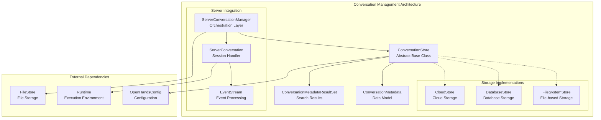
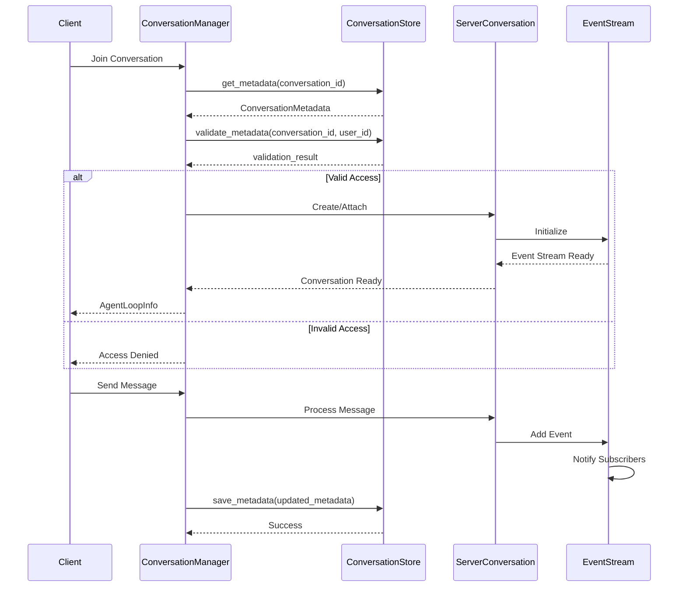
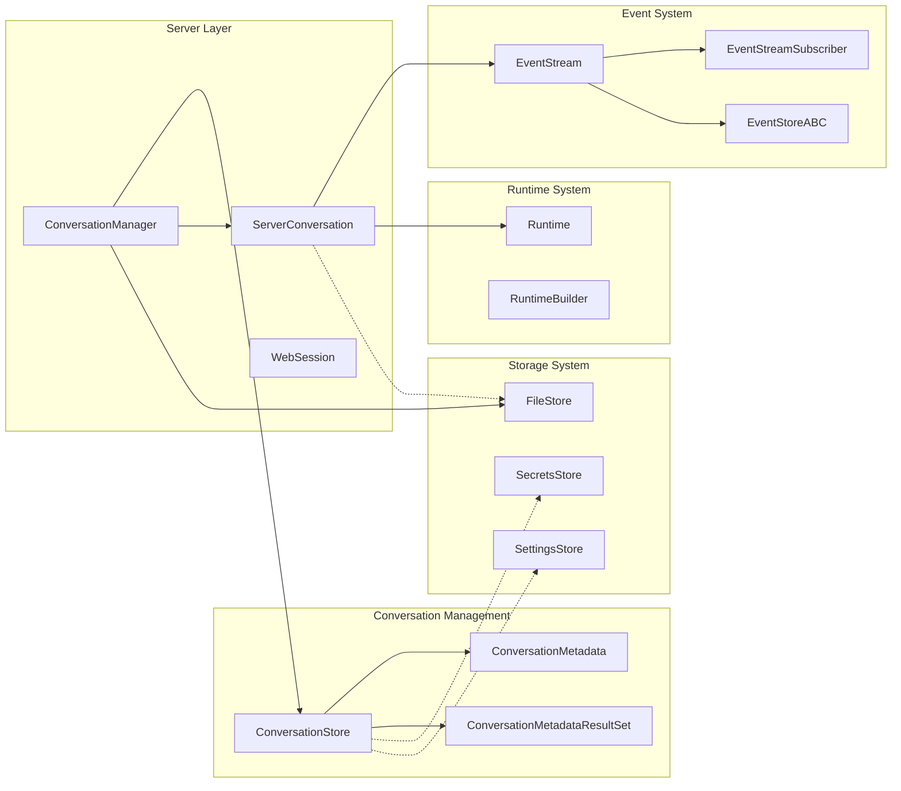

# Conversation Management Module

The conversation_management module is a critical component of OpenHands' storage system that provides persistent storage and management capabilities for conversation metadata. This module serves as the foundation for tracking conversation state, user associations, and conversation lifecycle management across the entire OpenHands platform.

## Overview

The conversation_management module implements an abstract storage layer for conversation metadata, enabling OpenHands to maintain conversation history, user associations, and conversation-specific settings. It provides a pluggable architecture that allows different storage backends while maintaining a consistent interface for conversation operations.

## Architecture



## Core Components

### ConversationStore

The `ConversationStore` is an abstract base class that defines the interface for conversation metadata persistence. It provides a pluggable architecture allowing applications to customize storage backends.

**Key Features:**
- Abstract interface for conversation metadata operations
- User validation and access control
- Parallel metadata retrieval capabilities
- Extensible design for custom implementations

**Core Methods:**
- `save_metadata()`: Store conversation metadata
- `get_metadata()`: Retrieve conversation metadata
- `delete_metadata()`: Remove conversation metadata
- `search()`: Query conversations with pagination
- `validate_metadata()`: Verify user access permissions

### ConversationMetadata

The `ConversationMetadata` data model represents the complete metadata for a conversation, including user associations, repository information, and usage metrics.

**Key Attributes:**
- `conversation_id`: Unique conversation identifier
- `user_id`: Associated user identifier
- `selected_repository`: Repository context
- `git_provider`: Git service provider
- `title`: Human-readable conversation title
- `trigger`: Conversation initiation source
- `llm_model`: Language model used
- Cost and token tracking metrics

### ConversationMetadataResultSet

A container for paginated search results that includes conversation metadata and pagination information.

## Data Flow



## Integration Points

### Server Integration

The conversation_management module integrates closely with the [server_and_api](server_and_api.md) module through:

- **ConversationManager**: Orchestrates conversation lifecycle and integrates with ConversationStore
- **ServerConversation**: Manages individual conversation sessions and event streams
- **Session Management**: Handles user sessions and conversation attachments

### Event System Integration

Integration with the [events_and_actions](events_and_actions.md) module provides:

- **EventStream**: Real-time event processing and distribution
- **Event Storage**: Persistent event history through EventStore
- **Subscriber Management**: Event notification system for conversation updates

### Storage System Integration

As part of the broader [storage_system](storage_system.md), it coordinates with:

- **FileStore**: File-based storage operations
- **SecretsStore**: Secure credential management
- **SettingsStore**: User preference storage

## Component Relationships



## Usage Patterns

### Basic Conversation Operations

```python
# Get conversation store instance
store = await ConversationStore.get_instance(config, user_id)

# Create new conversation metadata
metadata = ConversationMetadata(
    conversation_id="conv_123",
    user_id="user_456",
    title="Code Review Task",
    selected_repository="owner/repo",
    git_provider=ProviderType.GITHUB
)

# Save metadata
await store.save_metadata(metadata)

# Retrieve metadata
retrieved = await store.get_metadata("conv_123")

# Validate user access
is_valid = await store.validate_metadata("conv_123", "user_456")

# Search conversations
results = await store.search(limit=10)
```

### Conversation Lifecycle Management

```python
# Through ConversationManager
conversation_manager = ConversationManager.get_instance(...)

# Join conversation
agent_loop_info = await conversation_manager.join_conversation(
    sid="session_123",
    connection_id="conn_456",
    settings=settings,
    user_id="user_789"
)

# Start agent loop
await conversation_manager.maybe_start_agent_loop(
    sid="session_123",
    settings=settings,
    user_id="user_789",
    initial_user_msg=message
)

# Send events to conversation
await conversation_manager.send_event_to_conversation(
    sid="session_123",
    data=event_data
)
```

## Configuration and Extensibility

### Custom Store Implementation

Applications can provide custom ConversationStore implementations:

```python
class CustomConversationStore(ConversationStore):
    async def save_metadata(self, metadata: ConversationMetadata) -> None:
        # Custom storage logic
        pass
    
    async def get_metadata(self, conversation_id: str) -> ConversationMetadata:
        # Custom retrieval logic
        pass
    
    # Implement other abstract methods...
    
    @classmethod
    async def get_instance(cls, config: OpenHandsConfig, user_id: str | None) -> ConversationStore:
        return cls(config, user_id)
```

### Configuration Integration

The module integrates with OpenHands configuration system:

```python
# In server configuration
server_config.conversation_store_class = "myapp.storage.CustomConversationStore"
```

## Security Considerations

### Access Control

- **User Validation**: `validate_metadata()` ensures users can only access their own conversations
- **Session Security**: Integration with authentication system through user_id validation
- **Data Isolation**: Conversation metadata is isolated by user context

### Data Protection

- **Secret Management**: Integration with SecretsStore for sensitive data
- **Event Stream Security**: Secure event processing with secret replacement
- **Audit Trail**: Complete conversation history through EventStream

## Performance Characteristics

### Scalability Features

- **Parallel Operations**: `get_all_metadata()` supports concurrent metadata retrieval
- **Pagination**: Search operations support efficient pagination
- **Caching**: EventStream implements page-based caching for performance
- **Async Operations**: Full async/await support for non-blocking operations

### Optimization Strategies

- **Lazy Loading**: Metadata loaded on-demand
- **Batch Operations**: Support for bulk metadata operations
- **Connection Pooling**: Efficient resource management through abstract interface
- **Event Batching**: EventStream batches events for efficient processing

## Error Handling

### Exception Management

- **Validation Errors**: Proper handling of invalid conversation access
- **Storage Errors**: Graceful degradation for storage failures
- **Connection Errors**: Robust error handling for network issues
- **Resource Cleanup**: Proper cleanup of resources and connections

### Monitoring and Logging

- **Operation Logging**: Comprehensive logging of conversation operations
- **Performance Metrics**: Integration with monitoring systems
- **Error Tracking**: Detailed error reporting and tracking
- **Usage Analytics**: Conversation usage and performance analytics

## Future Considerations

### Planned Enhancements

- **Multi-tenant Support**: Enhanced isolation for enterprise deployments
- **Advanced Search**: Full-text search capabilities for conversation content
- **Backup and Recovery**: Automated backup and disaster recovery features
- **Performance Optimization**: Advanced caching and indexing strategies

### Extension Points

- **Custom Metadata Fields**: Support for application-specific metadata
- **Event Hooks**: Pluggable event handlers for conversation lifecycle
- **Storage Adapters**: Additional storage backend implementations
- **Analytics Integration**: Enhanced analytics and reporting capabilities

## Related Documentation

- [server_and_api](server_and_api.md) - Server orchestration and API management
- [events_and_actions](events_and_actions.md) - Event system and action processing
- [storage_system](storage_system.md) - Complete storage architecture
- [user_data_management](user_data_management.md) - User-specific data handling
- [file_storage_infrastructure](file_storage_infrastructure.md) - File storage operations