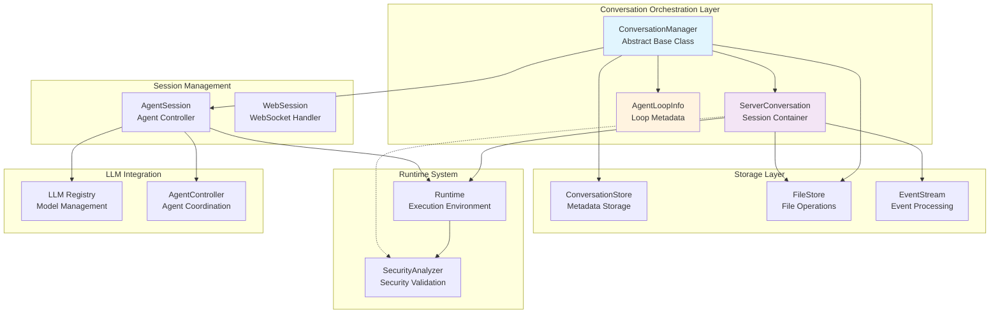
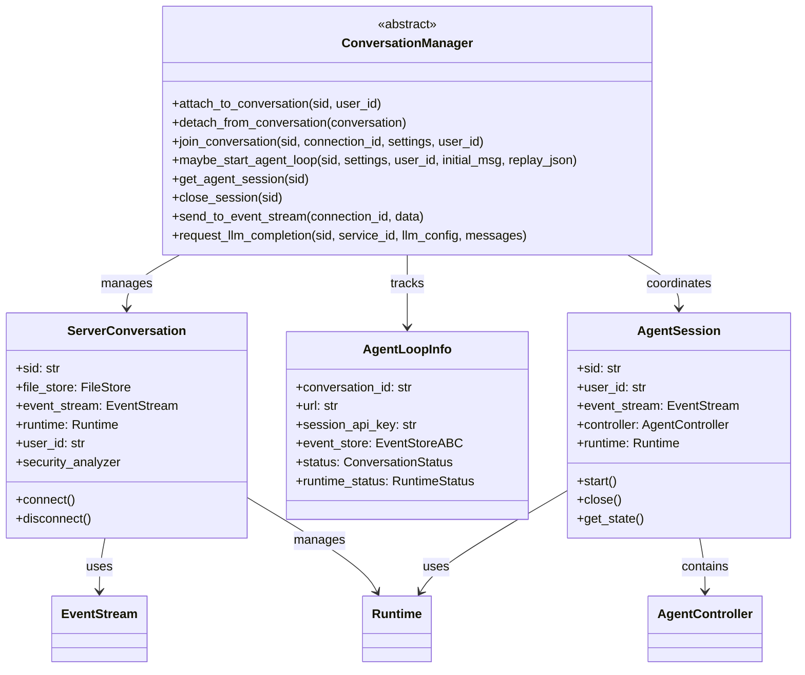
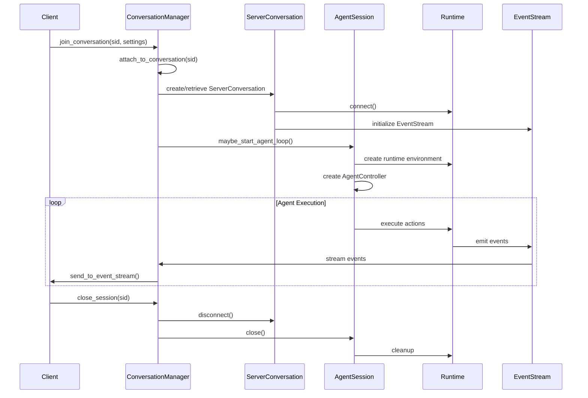
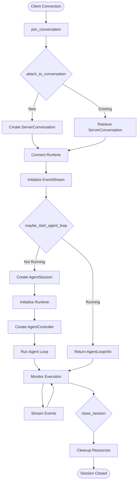
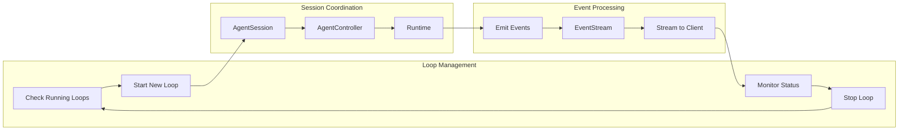

# Conversation Orchestration Module

The conversation orchestration module is the central coordination layer in OpenHands that manages the lifecycle of conversations between users and AI agents. It provides an abstraction layer for managing conversation state, session handling, and agent loop coordination across different deployment scenarios.

## Core Components

### ConversationManager
The `ConversationManager` is an abstract base class that defines the interface for managing conversations in OpenHands. It serves as an extension point that allows applications to customize conversation management behavior without modifying core OpenHands code.

**Key Responsibilities:**
- Managing conversation lifecycle (creation, attachment, detachment, cleanup)
- Coordinating agent loop execution and monitoring
- Handling WebSocket connections and event streaming
- Managing session state and user authentication
- Providing LLM completion services for conversations

**Extension Point Design:**
Applications can provide custom implementations by:
1. Creating a class that inherits from `ConversationManager`
2. Implementing all required abstract methods
3. Setting `server_config.conversation_manager_class` to the fully qualified class name

### ServerConversation
The `ServerConversation` class represents an active conversation session on the server side. It encapsulates the runtime environment, event stream, and file storage for a specific conversation.

**Key Features:**
- Runtime management and connection handling
- Event stream coordination
- File storage integration
- Security analyzer access through runtime
- Support for both new and existing conversation attachment

### AgentLoopInfo
The `AgentLoopInfo` data class provides metadata about active agent loops, including their location, status, and associated resources.

**Information Tracked:**
- Conversation ID and URL location
- Session API key for authentication
- Event store reference
- Conversation and runtime status

## Architecture Overview



## Component Relationships



## Data Flow Architecture



## Process Flow Diagrams

### Conversation Lifecycle Management



### Agent Loop Coordination



## Integration Points

### Storage System Integration
The conversation orchestration module integrates with the [storage_system](storage_system.md) through:
- **ConversationStore**: For persisting conversation metadata and state
- **FileStore**: For managing conversation-related files and artifacts
- **EventStream**: For storing and retrieving conversation events

### Session Management Integration
Coordinates with [session_management](session_management.md) components:
- **AgentSession**: Manages individual agent execution sessions
- **WebSession**: Handles WebSocket connections and client communication

### Runtime System Integration
Interfaces with the [runtime_system](runtime_system.md) for:
- **Runtime**: Providing execution environments for agents
- **SecurityAnalyzer**: Ensuring secure code execution
- **Plugin System**: Managing runtime extensions

### LLM Integration
Connects to [llm_integration](llm_integration.md) for:
- **LLM Registry**: Managing language model configurations
- **Completion Services**: Providing LLM services for conversations

## Configuration and Extension

### Custom ConversationManager Implementation
```python
class CustomConversationManager(ConversationManager):
    async def attach_to_conversation(self, sid: str, user_id: str | None = None):
        # Custom conversation attachment logic
        pass
    
    async def maybe_start_agent_loop(self, sid: str, settings: Settings, ...):
        # Custom agent loop management
        pass
    
    @classmethod
    def get_instance(cls, sio, config, file_store, server_config, monitoring_listener):
        return cls(sio, config, file_store, server_config, monitoring_listener)
```

### Server Configuration
```python
# In server configuration
server_config.conversation_manager_class = "myapp.CustomConversationManager"
```

## Status Management

### Conversation Status States
- **STARTING**: Conversation is initializing
- **RUNNING**: Agent is active and processing
- **STOPPED**: Conversation is paused/idle
- **ARCHIVED**: Conversation is permanently closed
- **ERROR**: System error occurred

### Runtime Status Tracking
- **READY**: Runtime is operational
- **BUILDING_RUNTIME**: Runtime is being constructed
- **ERROR_***: Various error conditions
- **SETTING_UP_***: Initialization phases

## Security Considerations

The conversation orchestration module implements several security measures:

1. **User Authentication**: Validates user identity for conversation access
2. **Session Isolation**: Ensures conversations are properly isolated
3. **Security Analysis**: Integrates with the security system for code validation
4. **Resource Management**: Prevents resource exhaustion through proper cleanup

## Error Handling and Recovery

### Connection Management
- Automatic reconnection for dropped connections
- Graceful degradation when services are unavailable
- Proper cleanup of orphaned sessions

### State Recovery
- Conversation state restoration from persistent storage
- Event stream replay capabilities
- Runtime reconnection and state synchronization

## Monitoring and Observability

The module provides comprehensive monitoring through:
- **AgentLoopInfo**: Real-time status of active conversations
- **Event Streaming**: Complete audit trail of conversation activities
- **Status Callbacks**: Integration with monitoring systems
- **Performance Metrics**: Resource usage and execution timing

## Related Modules

- [session_management](session_management.md): WebSocket and agent session handling
- [storage_system](storage_system.md): Persistent storage for conversations
- [runtime_system](runtime_system.md): Agent execution environments
- [llm_integration](llm_integration.md): Language model services
- [events_and_actions](events_and_actions.md): Event processing foundation
- [core_agent_system](core_agent_system.md): Agent control and coordination