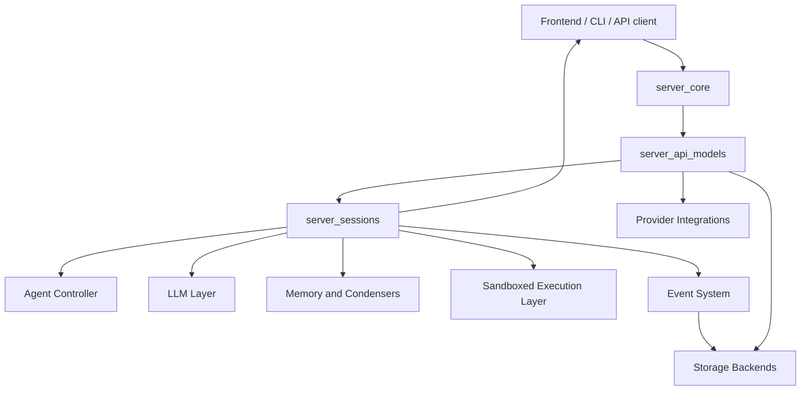
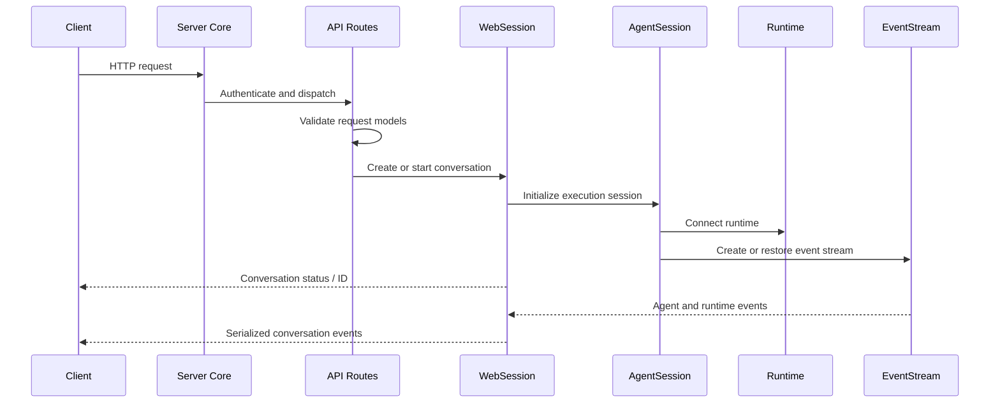
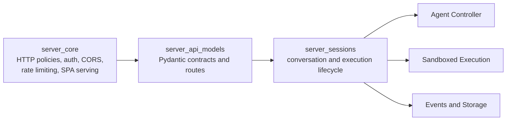

# Conversation Service Tier

The `conversation_service_tier` module provides the HTTP and session-management layer for OpenHands conversations. It exposes authenticated API routes, validates request and response data, manages conversation lifecycle, coordinates agent sessions and runtimes, and streams conversation events to clients.

It assembles lower-level components rather than implementing agent reasoning, LLM calls, event persistence, or sandbox backends.

## Architecture

### Request and conversation lifecycle

### Module boundaries

## Main responsibilities

- `server_core` supplies cross-cutting HTTP infrastructure, authentication extension points, CORS and cache policies, rate limiting, SPA fallback serving, and server configuration contracts.
- `server_sessions` owns the lifecycle of a conversation identified by `sid`, including web sessions, agent sessions, runtime and memory initialization, controller restoration, event delivery, shutdown, and LLM statistics.
- `server_api_models` defines validated API contracts and conversation-management endpoints for creating, starting, stopping, updating, searching, deleting, and enriching conversations. It also handles settings, secrets, file uploads, provider validation, and experiment configuration.

## Core component documentation

- [Server Core](server_core.md)
- [Server Sessions](server_sessions.md)
- [Server API Models](server_api_models.md)

The service tier integrates with the broader platform through:

- [Agent Controller](agent_controller.md)
- [LLM Layer](llm_layer.md)
- [Memory and Condensers](memory_and_condensers.md)
- [Sandboxed Execution Layer](sandboxed_execution_layer.md)
- [Event System](event_system.md)
- [Storage Backends](storage_backends.md)