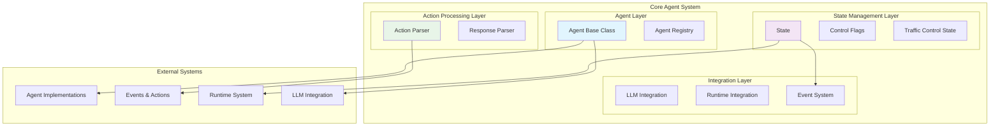
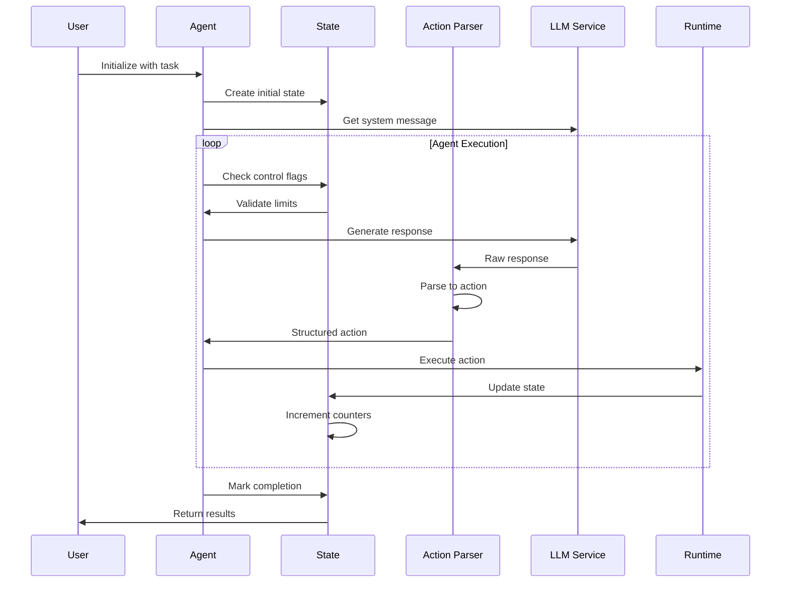

# Core Agent System

## Overview

The Core Agent System is the foundational module of OpenHands that provides the essential infrastructure for agent-based task execution. It serves as the central orchestration layer that manages agent lifecycle, state transitions, action parsing, and control flow mechanisms. This system enables autonomous agents to interact with various environments while maintaining proper state management and execution control.

## Purpose

The Core Agent System is designed to:

- **Agent Management**: Provide a unified interface for different agent implementations through the abstract Agent base class
- **State Management**: Maintain comprehensive execution state including iteration tracking, budget control, and conversation history
- **Action Processing**: Parse and validate agent responses into executable actions through sophisticated parsing mechanisms
- **Control Flow**: Implement traffic control and execution limits to ensure safe and bounded agent operations
- **Integration Foundation**: Serve as the integration point for LLM services, runtime environments, and other system components

## Architecture Overview

The Core Agent System follows a layered architecture with clear separation of concerns:

## Core Components

The Core Agent System is organized into three main sub-modules, each handling specific aspects of agent operation:

### 1. Agent Management
The agent management sub-module provides the foundational infrastructure for agent lifecycle and registration. It defines the abstract Agent base class that serves as the template for all agent implementations, manages agent discovery through a centralized registry, and handles integration with LLM services and tool systems.

**Key Features:**
- Abstract agent interface with standardized lifecycle methods
- Centralized agent registry for dynamic agent discovery
- Integrated LLM and prompt management
- MCP (Model Context Protocol) tool support

For detailed information, see [Agent Management](agent_management.md).

### 2. State Management
The state management sub-module maintains comprehensive execution state throughout agent operations. It tracks conversation history, manages control flags for iteration and budget limits, handles state persistence across sessions, and supports complex multi-agent delegation scenarios.

**Key Features:**
- Comprehensive state tracking with event history
- Sophisticated control flag system for execution limits
- Persistent state with save/restore capabilities
- Multi-agent delegation support with metrics tracking

For detailed information, see [State Management](state_management.md).

### 3. Action Processing
The action processing sub-module converts raw LLM responses into structured, executable actions. It implements a flexible parsing system that can handle multiple response formats, validates action parameters, and provides comprehensive error handling for malformed responses.

**Key Features:**
- Modular parser chain architecture
- Comprehensive response validation
- Extensible action type support
- Robust error handling and recovery

For detailed information, see [Action Processing](action_processing.md).

## System Integration

The Core Agent System integrates with several other modules to provide complete functionality:

### Agent Implementations Integration
- **Purpose**: Provides concrete agent implementations (CodeAct, Browsing, etc.)
- **Integration**: Through the Agent base class and registry system
- **Reference**: [Agent Implementations](agent_implementations.md)

### Events and Actions Integration
- **Purpose**: Defines the event system and action types
- **Integration**: Through action parsing and state management
- **Reference**: [Events and Actions](events_and_actions.md)

### LLM Integration
- **Purpose**: Provides language model services
- **Integration**: Through agent LLM configuration and prompt management
- **Reference**: [LLM Integration](llm_integration.md)

### Runtime System Integration
- **Purpose**: Provides execution environments
- **Integration**: Through state management and action execution
- **Reference**: [Runtime System](runtime_system.md)

## Data Flow

## Configuration and Customization

### Agent Configuration
- **Config Model**: Each agent type can define its own configuration model
- **LLM Integration**: Configurable LLM settings per agent
- **Tool Management**: Support for custom tool sets and MCP integration

### State Configuration
- **Control Limits**: Configurable iteration and budget limits
- **Persistence**: Customizable state storage and restoration
- **Metrics**: Comprehensive tracking of agent performance

### Parser Configuration
- **Parser Chains**: Configurable action parser sequences
- **Error Handling**: Customizable error reporting and recovery
- **Validation Rules**: Extensible action validation framework

## Error Handling and Recovery

The Core Agent System implements comprehensive error handling:

### Agent Errors
- **Registration Errors**: Proper handling of duplicate or missing agent registrations
- **Initialization Errors**: Graceful handling of agent setup failures
- **Execution Errors**: State preservation during agent execution failures

### State Errors
- **Persistence Errors**: Robust state save/restore with fallback mechanisms
- **Limit Violations**: Clear error reporting when limits are exceeded
- **Corruption Recovery**: State validation and recovery mechanisms

### Parsing Errors
- **Format Errors**: Detailed error reporting for malformed responses
- **Validation Errors**: Clear feedback on action validation failures
- **Recovery Strategies**: Fallback parsing mechanisms

## Performance Considerations

### State Management
- **Lazy Loading**: Event history loaded on demand through view system
- **Checksum Caching**: Efficient view caching with history change detection
- **Selective Persistence**: Only essential state data is persisted

### Action Processing
- **Parser Optimization**: Efficient parser chain execution
- **Response Caching**: Avoid redundant parsing operations
- **Memory Management**: Proper cleanup of parsing artifacts

### Control Flow
- **Efficient Limits**: O(1) limit checking operations
- **State Transitions**: Minimal overhead for state updates
- **Metric Tracking**: Efficient performance metric collection

## Security Considerations

### Agent Security
- **Sandboxing**: Integration with secure runtime environments
- **Tool Restrictions**: Configurable tool access controls
- **Resource Limits**: Comprehensive resource usage controls

### State Security
- **Data Isolation**: Proper session and user data separation
- **Secure Persistence**: Encrypted state storage capabilities
- **Access Controls**: User-based state access restrictions

### Action Security
- **Validation**: Comprehensive action validation before execution
- **Sanitization**: Input sanitization in action parsing
- **Audit Trail**: Complete action execution logging

## Future Enhancements

### Planned Features
- **Enhanced Multi-Agent**: Improved delegation and coordination mechanisms
- **Advanced Control**: More sophisticated limit and control mechanisms
- **Performance Optimization**: Further optimization of state and parsing operations
- **Security Hardening**: Enhanced security features and audit capabilities

### Extension Points
- **Custom Agents**: Framework for developing custom agent types
- **Custom Parsers**: Easy integration of new action parsers
- **Custom Controls**: Extensible control flag implementations
- **Custom State**: Support for domain-specific state extensions

## Related Documentation

### Sub-Module Documentation
- [Agent Management](agent_management.md) - Agent lifecycle and registration system
- [State Management](state_management.md) - Execution state and control mechanisms
- [Action Processing](action_processing.md) - Response parsing and action validation

### System Integration Documentation
- [Agent Implementations](agent_implementations.md) - Concrete agent implementations
- [Events and Actions](events_and_actions.md) - Event system and action types
- [LLM Integration](llm_integration.md) - Language model integration
- [Runtime System](runtime_system.md) - Execution environments
- [Storage System](storage_system.md) - Data persistence and storage
- [Security System](security_system.md) - Security analysis and controls