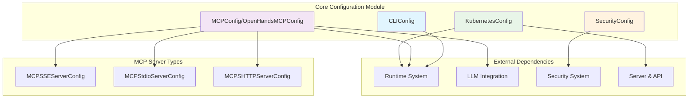
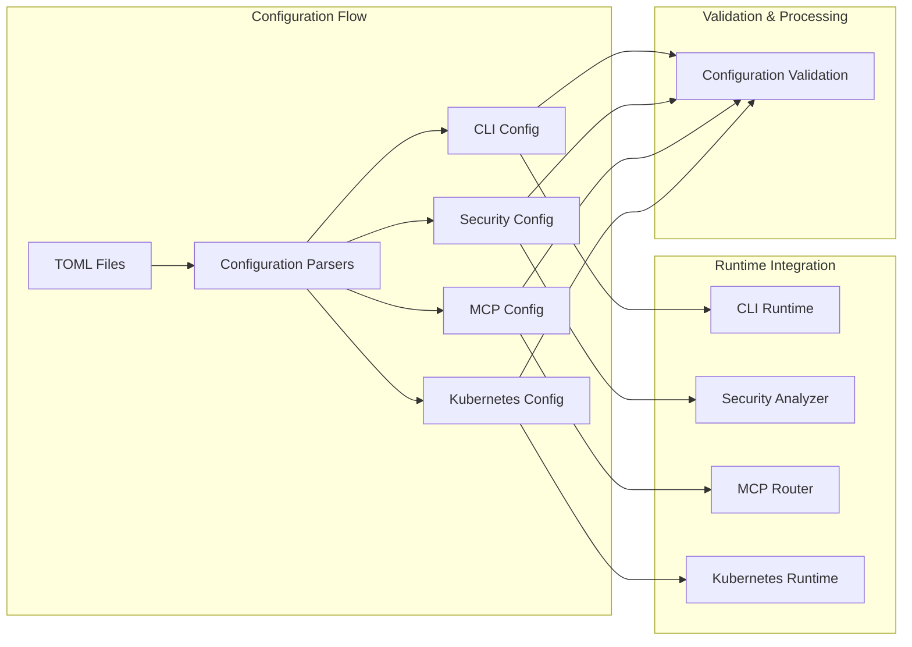
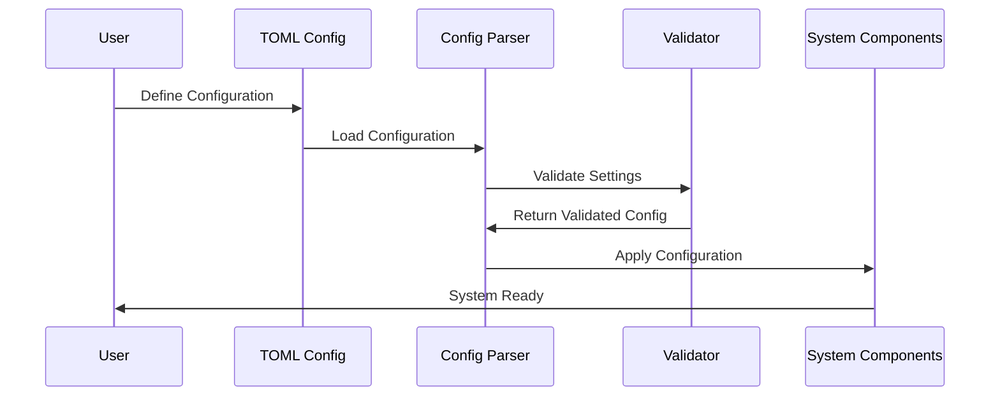

# Core Configuration Module

## Overview

The `core_configuration` module provides essential configuration management for the OpenHands system, handling various aspects of system setup including CLI settings, security configurations, MCP (Message Control Protocol) server management, and Kubernetes deployment parameters. This module serves as the foundation for configuring different operational modes and integrations within the OpenHands ecosystem.

## Purpose

This module centralizes configuration management for:
- **CLI Interface Settings**: Terminal and command-line interface preferences
- **Security Configuration**: Security policies, analyzers, and confirmation modes
- **MCP Server Management**: Configuration for various MCP server types and protocols
- **Kubernetes Deployment**: Container orchestration and resource management settings

## Architecture Overview

The core configuration module is structured around four main configuration domains, each handling specific aspects of system configuration:



## Component Relationships



## Sub-modules

### CLI Configuration
**Documentation**: [cli_configuration.md](cli_configuration.md)

Manages command-line interface settings and terminal preferences. This lightweight configuration handles user interface modes and CLI-specific behaviors, providing essential settings for terminal-based interactions with the OpenHands system.

**Core Components**: `CLIConfig`
**Integration**: Primarily used by CLI runtime components and terminal interfaces

### Security Configuration  
**Documentation**: [security_configuration.md](security_configuration.md)

Handles security-related settings including confirmation modes and security analyzer selection. This configuration module integrates with the [security_system.md](security_system.md) module to provide comprehensive security management across the OpenHands platform.

**Core Components**: `SecurityConfig`
**Integration**: Works with security analyzers, confirmation systems, and policy enforcement

### MCP Configuration
**Documentation**: [mcp_configuration.md](mcp_configuration.md)

Manages Message Control Protocol server configurations supporting multiple server types and communication protocols. This is the most sophisticated configuration component, handling various server types, protocol management, and integration scenarios including search engine services.

**Core Components**: `OpenHandsMCPConfig`, `MCPConfig`, `MCPSSEServerConfig`, `MCPStdioServerConfig`, `MCPSHTTPServerConfig`
**Integration**: Connects with [llm_integration.md](llm_integration.md), [runtime_system.md](runtime_system.md), and external service providers

### Kubernetes Configuration
**Documentation**: [kubernetes_configuration.md](kubernetes_configuration.md)

Provides comprehensive Kubernetes deployment configuration including resource management, networking, and security settings. This configuration module integrates closely with the [runtime_system.md](runtime_system.md) for container orchestration and the [server_and_api.md](server_and_api.md) for service deployment.

**Core Components**: `KubernetesConfig`
**Integration**: Essential for Kubernetes runtime implementations, ingress management, and resource allocation

## Integration Points

The core configuration module integrates with several other system modules:

- **[runtime_system.md](runtime_system.md)**: Provides configuration for runtime implementations
- **[security_system.md](security_system.md)**: Supplies security analyzer and policy settings
- **[llm_integration.md](llm_integration.md)**: MCP servers can integrate with LLM services
- **[server_and_api.md](server_and_api.md)**: Server configuration affects API behavior
- **[storage_system.md](storage_system.md)**: Configuration persistence and retrieval

## Configuration Flow



## Usage Patterns

### Basic Configuration Loading
```python
# CLI Configuration
cli_config = CLIConfig(vi_mode=True)

# Security Configuration
security_config = SecurityConfig(
    confirmation_mode=True,
    security_analyzer="llm_analyzer"
)

# MCP Configuration with multiple server types
mcp_config = MCPConfig(
    sse_servers=[MCPSSEServerConfig(url="https://api.example.com")],
    stdio_servers=[MCPStdioServerConfig(name="tavily", command="npx")]
)
```

### TOML-based Configuration
```toml
[security]
confirmation_mode = true
security_analyzer = "invariant_analyzer"

[mcp]
sse_servers = ["https://api.example.com"]

[kubernetes]
namespace = "openhands"
resource_memory_limit = "4Gi"
```

## Error Handling and Validation

All configuration components implement robust validation:
- **Pydantic Models**: Type safety and automatic validation
- **Custom Validators**: Domain-specific validation logic
- **Error Propagation**: Clear error messages for configuration issues
- **TOML Integration**: Structured configuration file support

## Best Practices

1. **Configuration Isolation**: Each configuration type handles its specific domain
2. **Validation First**: All configurations are validated before use
3. **Extensibility**: New configuration types can be easily added
4. **Integration Ready**: Configurations are designed for system-wide integration
5. **Error Clarity**: Validation errors provide clear guidance for fixes

This module forms the backbone of OpenHands system configuration, ensuring that all components receive properly validated and structured configuration data for optimal operation.