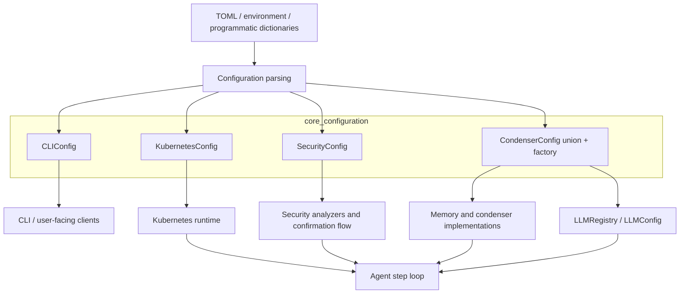
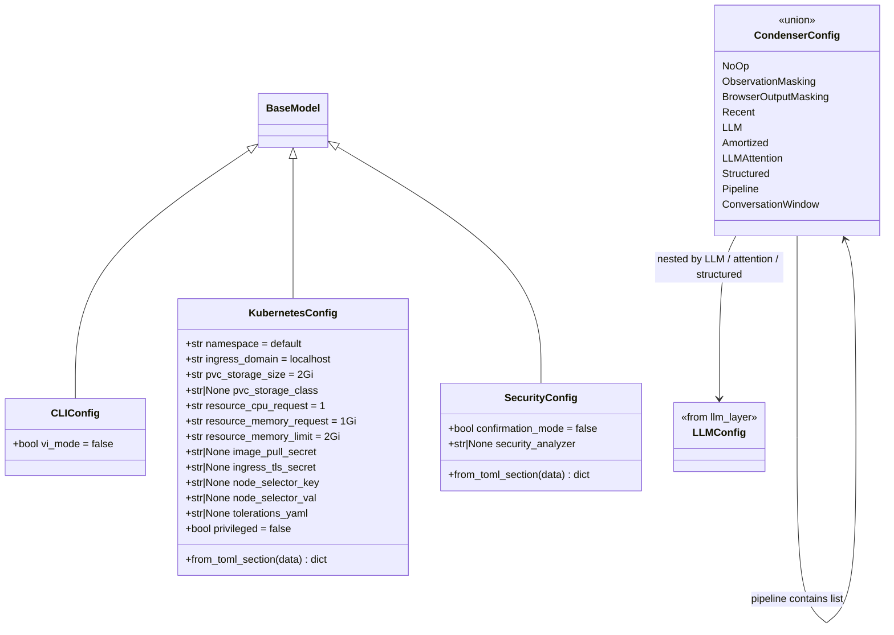
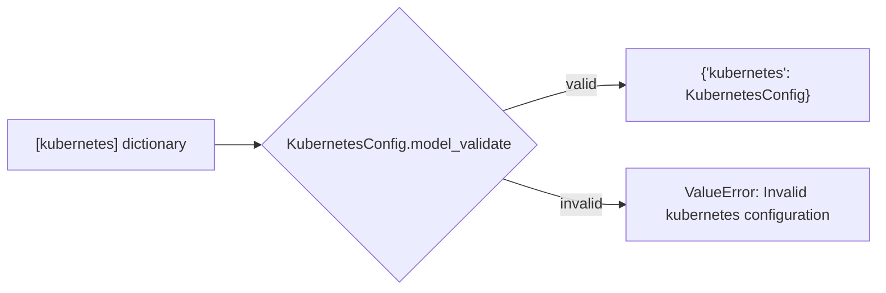
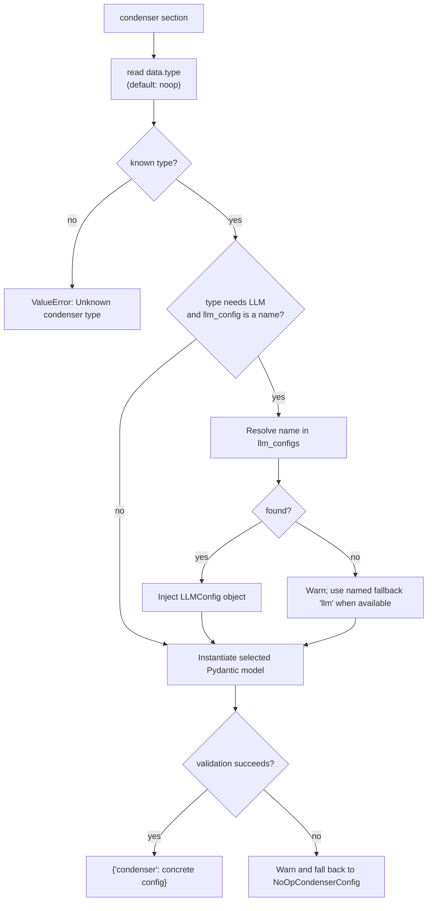
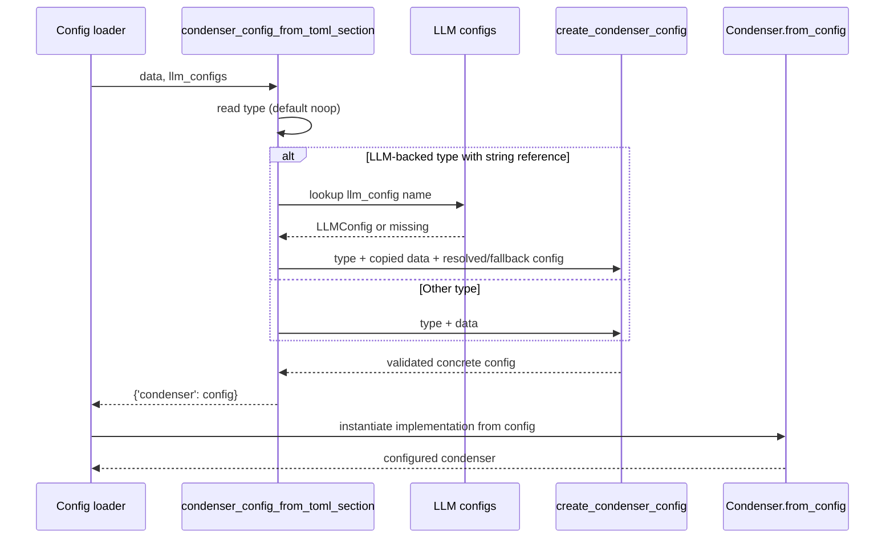
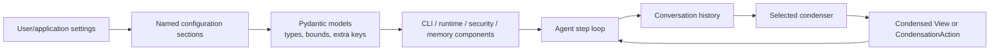

# Core Configuration

## Introduction

The `core_configuration` module defines validated, typed configuration models for
runtime-facing CLI behavior, Kubernetes deployment, security controls, and conversation
history condensation. It is a configuration boundary between TOML/environment-derived
dictionaries and the rest of OpenHands: Pydantic validates values, rejects unknown keys,
and normalizes the condenser union into one concrete configuration object.

The module does not execute runtimes, security analyzers, or condensers. Those consumers
are documented in [the sandboxed execution layer](sandboxed_execution_layer.md),
[security analyzers](security_analyzers.md), and [the condenser framework](memory_and_condensers_condenser_framework.md).

## Position in the system


```mermaid
graph TB
    SOURCES["TOML / environment / programmatic dictionaries"] --> PARSE["Configuration parsing"]

    subgraph CFG["core_configuration"]
        CLI["CLIConfig"]
        K8S["KubernetesConfig"]
        SEC["SecurityConfig"]
        COND["CondenserConfig union + factory"]
    end

    PARSE --> CLI
    PARSE --> K8S
    PARSE --> SEC
    PARSE --> COND

    CLI --> CLIENTS["CLI / user-facing clients"]
    K8S --> RUNTIME["Kubernetes runtime"]
    SEC --> SAFETY["Security analyzers and confirmation flow"]
    COND --> MEMORY["Memory and condenser implementations"]
    COND --> LLM["LLMRegistry / LLMConfig"]

    MEMORY --> AGENT["Agent step loop"]
    RUNTIME --> AGENT
    SAFETY --> AGENT
    LLM --> AGENT
```

### Configuration responsibilities

| Configuration | Main purpose | Primary consumers |
| --- | --- | --- |
| `CLIConfig` | CLI interaction preferences such as vi editing mode | CLI client |
| `KubernetesConfig` | Namespace, ingress, storage, resources, scheduling, and privilege settings | Kubernetes runtime and runtime builders |
| `SecurityConfig` | Confirmation mode and selected security analyzer | Agent/controller safety path |
| `CondenserConfig` variants | Select and parameterize conversation-history condensation | [Memory and condensers](memory_and_condensers.md) |

The models explicitly configure undeclared-field rejection with `extra='forbid'` (the
browser-output model relies on Pydantic's default handling in the supplied implementation).
Where enabled, this makes misspelled or stale configuration keys fail validation instead
of being silently ignored.

## Architecture and relationships


```mermaid
classDiagram
    class BaseModel
    class CLIConfig {
        +bool vi_mode = false
    }
    class KubernetesConfig {
        +str namespace = default
        +str ingress_domain = localhost
        +str pvc_storage_size = 2Gi
        +str|None pvc_storage_class
        +str resource_cpu_request = 1
        +str resource_memory_request = 1Gi
        +str resource_memory_limit = 2Gi
        +str|None image_pull_secret
        +str|None ingress_tls_secret
        +str|None node_selector_key
        +str|None node_selector_val
        +str|None tolerations_yaml
        +bool privileged = false
        +from_toml_section(data) dict
    }
    class SecurityConfig {
        +bool confirmation_mode = false
        +str|None security_analyzer
        +from_toml_section(data) dict
    }
    class CondenserConfig {
        <<union>>
        NoOp
        ObservationMasking
        BrowserOutputMasking
        Recent
        LLM
        Amortized
        LLMAttention
        Structured
        Pipeline
        ConversationWindow
    }
    class LLMConfig {
        <<from llm_layer>>
    }

    BaseModel <|-- CLIConfig
    BaseModel <|-- KubernetesConfig
    BaseModel <|-- SecurityConfig
    CondenserConfig --> LLMConfig : nested by LLM / attention / structured
    CondenserConfig --> CondenserConfig : pipeline contains list
```

The condenser classes are configuration-only counterparts to runtime implementations.
The implementation relationships and condensation semantics are described in
[structural condensers](memory_and_condensers_structural_condensers.md),
[masking condensers](memory_and_condensers_masking_condensers.md), and
[LLM condensers](memory_and_condensers_llm_condensers.md).

## `CLIConfig`

`CLIConfig` contains the CLI-only `vi_mode` flag:

```python
CLIConfig(vi_mode=False)
```

It is a deliberately small `BaseModel` with `extra='forbid'`. `vi_mode=True` changes the
CLI input/editor behavior; it has no effect on agent reasoning, runtime provisioning, or
conversation memory.

## `KubernetesConfig`

`KubernetesConfig` describes the infrastructure parameters required to create OpenHands
runtime resources in Kubernetes.

| Field | Default | Meaning |
| --- | --- | --- |
| `namespace` | `default` | Kubernetes namespace for OpenHands resources |
| `ingress_domain` | `localhost` | Domain used by ingress resources |
| `pvc_storage_size` | `2Gi` | Persistent-volume claim size |
| `pvc_storage_class` | `None` | Optional storage class |
| `resource_cpu_request` | `1` | Pod CPU request, represented as a Kubernetes quantity string |
| `resource_memory_request` | `1Gi` | Pod memory request |
| `resource_memory_limit` | `2Gi` | Pod memory limit |
| `image_pull_secret` | `None` | Optional private-registry pull secret |
| `ingress_tls_secret` | `None` | Optional ingress TLS secret |
| `node_selector_key` / `node_selector_val` | `None` | Optional node-selection pair |
| `tolerations_yaml` | `None` | Optional YAML toleration definition |
| `privileged` | `False` | Enables privileged sandbox mode, needed for Docker-in-Docker scenarios |

The model validates the shape and types of these values but leaves Kubernetes quantity
and YAML interpretation to the runtime/deployment layer. See
[orchestrated runtimes](runtime_implementations_orchestrated.md) and
[Kubernetes runtime](runtime_implementations_orchestrated_kubernetes_runtime.md).

### TOML conversion

`KubernetesConfig.from_toml_section(data)` validates a dictionary representing the
`[kubernetes]` section and returns a mapping shaped as `{'kubernetes': config}`. This
mapping convention allows the configuration loader to merge named sections consistently.
Pydantic `ValidationError` is converted to a `ValueError` with the context
`Invalid kubernetes configuration`.


```mermaid
flowchart LR
    T["[kubernetes] dictionary"] --> V{"KubernetesConfig.model_validate"}
    V -->|valid| M["{'kubernetes': KubernetesConfig}"]
    V -->|invalid| E["ValueError: Invalid kubernetes configuration"]
```

## `SecurityConfig`

`SecurityConfig` exposes two controls:

- `confirmation_mode` (`False` by default): whether actions require confirmation.
- `security_analyzer` (`None` by default): the analyzer name selected by the host system.

The model only stores and validates the selection. Analyzer behavior is implemented by
the security layer; see [security analyzers](security_analyzers.md). Its
`from_toml_section` method follows the same `{'security': config}` mapping convention as
Kubernetes configuration and wraps validation failures as
`ValueError('Invalid security configuration: ...')`.

## Condenser configuration model

`CondenserConfig` is a union selected by the `type` field. Every concrete model has a
literal type discriminator. Most concrete models explicitly reject extra fields. The
supported types are:

| `type` | Configuration model | Important options |
| --- | --- | --- |
| `noop` | `NoOpCondenserConfig` | No options; passes history through |
| `observation_masking` | `ObservationMaskingCondenserConfig` | `attention_window` (default `100`, minimum `1`) |
| `browser_output_masking` | `BrowserOutputCondenserConfig` | `attention_window` (default `1`) |
| `recent` | `RecentEventsCondenserConfig` | `keep_first` (default `1`), `max_events` (default `100`) |
| `llm` | `LLMSummarizingCondenserConfig` | `llm_config`, `keep_first`, `max_size`, `max_event_length` |
| `amortized` | `AmortizedForgettingCondenserConfig` | `keep_first`, `max_size` |
| `llm_attention` | `LLMAttentionCondenserConfig` | `llm_config`, `keep_first`, `max_size` |
| `structured` | `StructuredSummaryCondenserConfig` | `llm_config`, `keep_first`, `max_size`, `max_event_length` |
| `pipeline` | `CondenserPipelineConfig` | `condensers: list[CondenserConfig]` |
| `conversation_window` | `ConversationWindowCondenserConfig` | No options; not supported by TOML or environment strategies |

The `keep_first` defaults preserve the initial task/system context. Size fields use
minimum constraints (`max_size >= 2`, `max_events >= 1`, and non-negative `keep_first`)
to prevent unusable windows. LLM-backed variants embed `LLMConfig`, linking this module
to the [LLM layer](llm_layer.md).

### Factory and nested configuration

`create_condenser_config(condenser_type, data)` maps a known type string to its model
class and instantiates it. Unknown types raise `ValueError`; field errors are also
re-raised as a descriptive `ValueError` naming the condenser type.


```mermaid
flowchart TD
    D["condenser section"] --> TYPE["read data.type<br/>(default: noop)"]
    TYPE --> MAP{"known type?"}
    MAP -->|no| ERR["ValueError: Unknown condenser type"]
    MAP -->|yes| LLMREF{"type needs LLM<br/>and llm_config is a name?"}
    LLMREF -->|yes| LOOKUP["Resolve name in llm_configs"]
    LOOKUP --> FOUND{"found?"}
    FOUND -->|yes| INJECT["Inject LLMConfig object"]
    FOUND -->|no| FALLBACK["Warn; use named fallback 'llm' when available"]
    LLMREF -->|no| BUILD["Instantiate selected Pydantic model"]
    INJECT --> BUILD
    FALLBACK --> BUILD
    BUILD --> VALID{"validation succeeds?"}
    VALID -->|yes| OUT["{'condenser': concrete config}"]
    VALID -->|no| NOOP["Warn and fall back to NoOpCondenserConfig"]
```

`condenser_config_from_toml_section(data, llm_configs=None)` is the public section parser
and is aliased as `from_toml_section` for backward compatibility. For `llm` and
`llm_attention`, a string `llm_config` is treated as a reference to a named entry in
`llm_configs`. If the name is missing, the parser logs a warning and attempts the
fallback entry named `llm`. Any final validation or type error causes a warning and a
safe `NoOpCondenserConfig` result rather than propagating the error.

The parser copies the input dictionary before replacing an LLM name, so resolution does
not mutate the caller's TOML-derived data.

### Condenser selection sequence


```mermaid
sequenceDiagram
    participant Loader as Config loader
    participant Parser as condenser_config_from_toml_section
    participant Registry as LLM configs
    participant Factory as create_condenser_config
    participant Consumer as Condenser.from_config

    Loader->>Parser: data, llm_configs
    Parser->>Parser: read type (default noop)
    alt LLM-backed type with string reference
        Parser->>Registry: lookup llm_config name
        Registry-->>Parser: LLMConfig or missing
        Parser->>Factory: type + copied data + resolved/fallback config
    else Other type
        Parser->>Factory: type + data
    end
    Factory-->>Parser: validated concrete config
    Parser-->>Loader: {'condenser': config}
    Loader->>Consumer: instantiate implementation from config
    Consumer-->>Loader: configured condenser
```

## End-to-end processing flow


```mermaid
flowchart LR
    INPUT["User/application settings"] --> SECTIONS["Named configuration sections"]
    SECTIONS --> VALIDATE["Pydantic models<br/>types, bounds, extra keys"]
    VALIDATE --> COMPONENTS["CLI / runtime / security / memory components"]
    COMPONENTS --> LOOP["Agent step loop"]
    LOOP --> HISTORY["Conversation history"]
    HISTORY --> CONDENSE["Selected condenser"]
    CONDENSE --> VIEW["Condensed View or CondensationAction"]
    VIEW --> LOOP
```

The important distinction is that this module chooses and parameterizes a condenser; it
does not perform condensation. A selected implementation consumes the resulting config,
and the framework determines whether a step returns a shorter `View` or emits a durable
condensation event. See [conversation memory](memory_and_condensers_conversation_memory.md)
for how views become LLM messages.

## Operational and maintenance notes

- Add a new condenser type in three places: its Pydantic config model, the
  `CondenserConfig` union, and the `condenser_classes` mapping in
  `create_condenser_config`.
- Preserve the literal `type` value as the stable configuration/API discriminator.
- Keep `extra='forbid'` unless forward-compatible unknown-key behavior is deliberately
  required; loosening it can hide deployment mistakes.
- Keep TOML parsing behavior compatible with the existing section mapping shape and the
  `from_toml_section` alias.
- LLM-backed condenser options must remain compatible with `LLMConfig`; consult the
  [LLM registry](llm_layer_registry.md) and [LLM clients](llm_layer_clients.md) before
  changing nested model settings.
- Treat `privileged=True` and security confirmation settings as deployment-sensitive
  controls, not cosmetic configuration.

## Source index

| Source | Components |
| --- | --- |
| `openhands/core/config/cli_config.py` | `CLIConfig` |
| `openhands/core/config/kubernetes_config.py` | `KubernetesConfig` |
| `openhands/core/config/security_config.py` | `SecurityConfig` |
| `openhands/core/config/condenser_config.py` | All condenser configuration models, `CondenserConfig`, `condenser_config_from_toml_section`, `create_condenser_config` |
