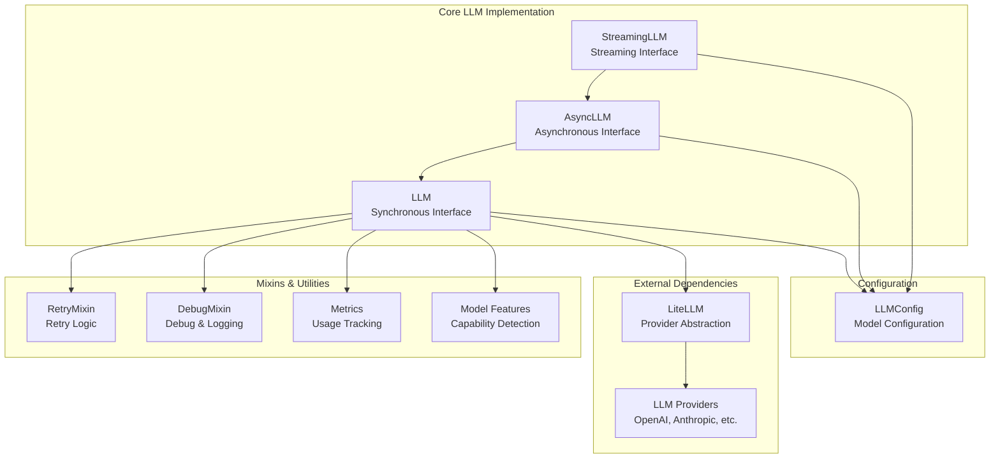
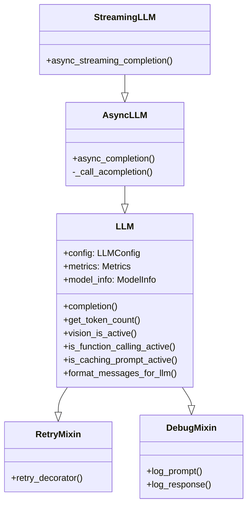
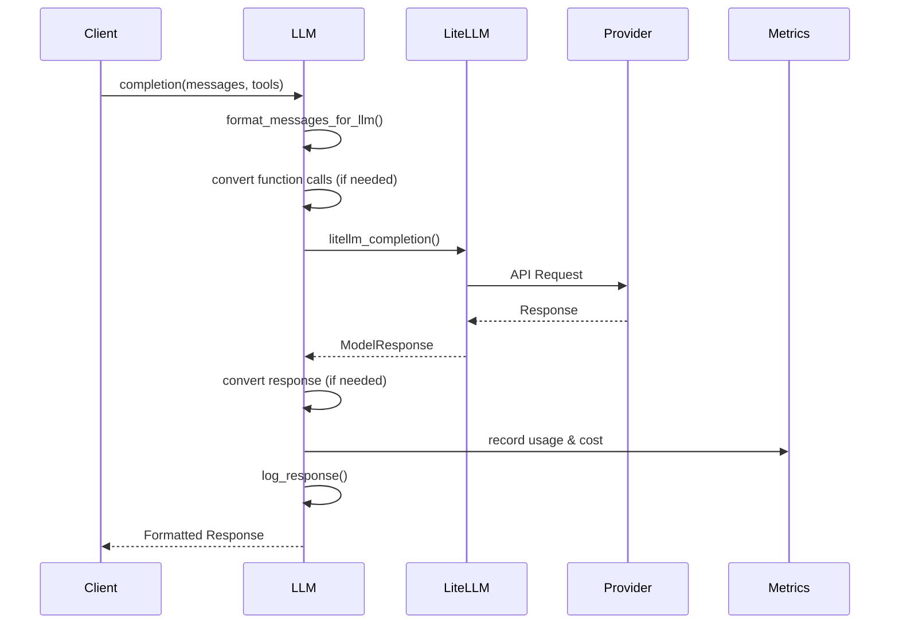
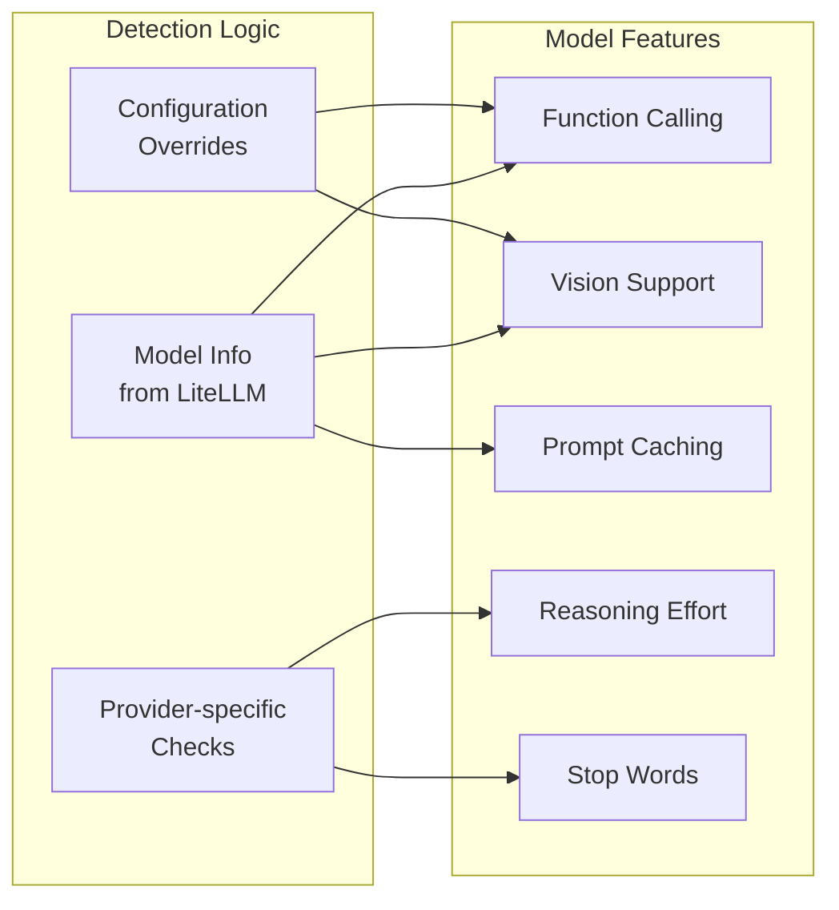
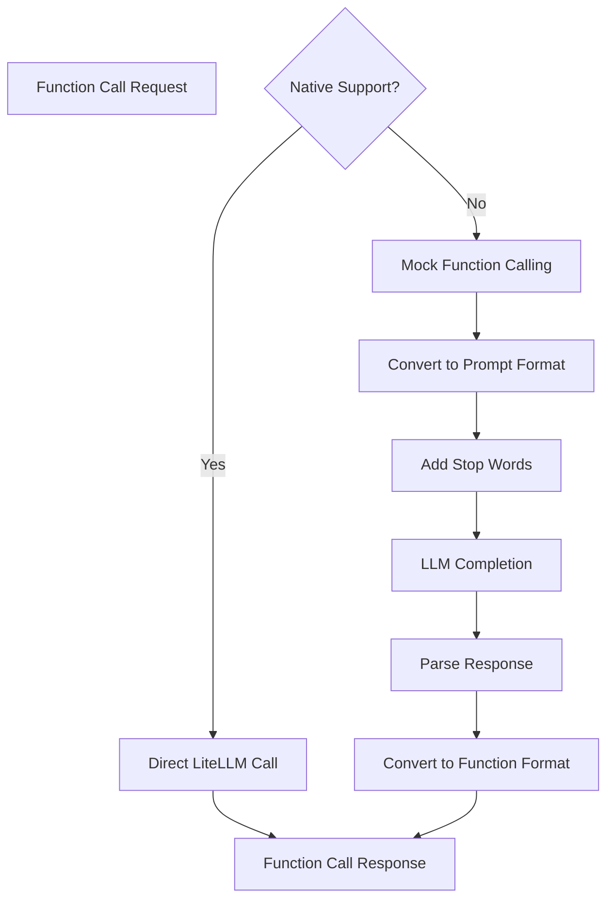
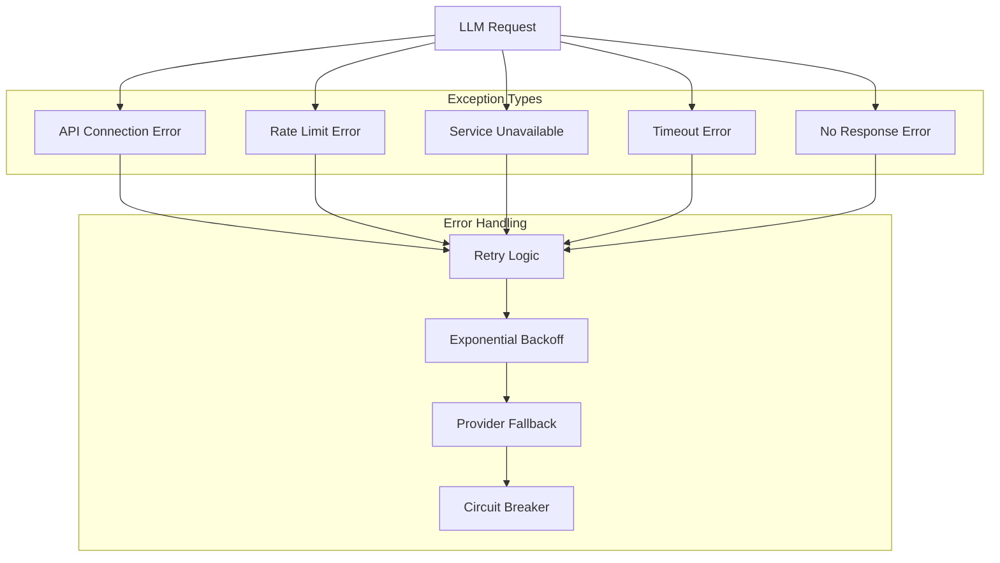

# Core LLM Implementation

The core LLM implementation module provides the foundational language model integration layer for OpenHands, offering synchronous, asynchronous, and streaming interfaces to various LLM providers through a unified API built on top of LiteLLM.

## Overview

This module implements three primary LLM classes that form the backbone of OpenHands' language model interactions:

- **LLM**: Synchronous language model interface with comprehensive feature support
- **AsyncLLM**: Asynchronous variant for non-blocking operations
- **StreamingLLM**: Real-time streaming interface for continuous response generation

The implementation abstracts away provider-specific details while maintaining full access to advanced features like function calling, vision capabilities, prompt caching, and cost tracking.

## Architecture



## Component Relationships



## Core Components

### LLM Class

The base synchronous LLM class provides the primary interface for language model interactions.

**Key Features:**
- **Provider Abstraction**: Unified interface across multiple LLM providers
- **Function Calling**: Native and mock function calling support
- **Vision Capabilities**: Multi-modal input processing
- **Prompt Caching**: Intelligent caching for repeated prompts
- **Cost Tracking**: Comprehensive usage and cost monitoring
- **Token Management**: Accurate token counting and context window handling
- **Retry Logic**: Robust error handling with exponential backoff

**Configuration Integration:**
- Integrates with [core_configuration](core_configuration.md) for model settings
- Supports dynamic configuration through LLMConfig
- Handles provider-specific parameters and authentication

### AsyncLLM Class

Extends the base LLM class with asynchronous capabilities for non-blocking operations.

**Key Features:**
- **Non-blocking Operations**: Async/await pattern support
- **Cancellation Support**: Graceful request cancellation
- **Concurrent Processing**: Multiple simultaneous requests
- **Resource Management**: Proper cleanup and error handling

### StreamingLLM Class

Provides real-time streaming capabilities for continuous response generation.

**Key Features:**
- **Real-time Streaming**: Chunk-by-chunk response processing
- **Cancellation Handling**: Mid-stream request cancellation
- **Progressive Updates**: Incremental response building
- **Resource Efficiency**: Memory-efficient streaming processing

## Data Flow



## Feature Detection and Capabilities

The module includes sophisticated feature detection for different model capabilities:



## Function Calling Implementation

The module supports both native and mock function calling:



## Integration Points

### With Core Agent System
- Provides LLM services to [core_agent_system](core_agent_system.md) components
- Handles agent message formatting and response processing
- Supports tool/function calling for agent actions

### With Router System
- Base classes extended by [router_system](router_system.md) components
- Provides foundation for load balancing and failover
- Maintains consistent interface across routing strategies

### With Utility Mixins
- Integrates [utility_mixins](utility_mixins.md) for enhanced functionality
- Retry logic for robust error handling
- Debug capabilities for development and troubleshooting

### With Events and Actions
- Processes messages from [events_and_actions](events_and_actions.md) system
- Formats action requests for LLM consumption
- Converts LLM responses back to system events

## Error Handling and Resilience



## Performance and Monitoring

### Metrics Collection
- **Token Usage**: Input/output token tracking
- **Cost Monitoring**: Real-time cost calculation and accumulation
- **Latency Tracking**: Response time measurement
- **Cache Performance**: Hit/miss ratios for prompt caching
- **Error Rates**: Failure tracking and analysis

### Optimization Features
- **Prompt Caching**: Reduces redundant processing
- **Token Counting**: Accurate context window management
- **Connection Pooling**: Efficient HTTP connection reuse
- **Request Batching**: Where supported by providers

## Configuration and Customization

The module supports extensive configuration through LLMConfig:

- **Model Selection**: Support for 100+ models across providers
- **Authentication**: API key and credential management
- **Performance Tuning**: Temperature, top-p, max tokens
- **Feature Toggles**: Enable/disable specific capabilities
- **Cost Controls**: Budget limits and usage monitoring
- **Debug Options**: Logging and completion recording

## Security Considerations

- **API Key Protection**: Secure credential handling
- **Request Sanitization**: Input validation and cleaning
- **Response Filtering**: Output safety checks
- **Rate Limiting**: Built-in request throttling
- **Audit Logging**: Comprehensive request/response logging

## Usage Examples

### Basic Synchronous Usage
```python
from openhands.llm.llm import LLM
from openhands.core.config import LLMConfig

config = LLMConfig(model="gpt-4", temperature=0.7)
llm = LLM(config=config, service_id="main")

response = llm.completion(messages=[
    {"role": "user", "content": "Hello, world!"}
])
```

### Asynchronous Usage
```python
from openhands.llm.async_llm import AsyncLLM

async_llm = AsyncLLM(config=config, service_id="async")
response = await async_llm.async_completion(messages=messages)
```

### Streaming Usage
```python
from openhands.llm.streaming_llm import StreamingLLM

streaming_llm = StreamingLLM(config=config, service_id="stream")
async for chunk in streaming_llm.async_streaming_completion(messages=messages):
    print(chunk['choices'][0]['delta'].get('content', ''), end='')
```

## Future Enhancements

- **Multi-modal Expansion**: Enhanced vision and audio support
- **Advanced Caching**: Semantic caching and cross-session persistence
- **Performance Optimization**: Request batching and connection pooling
- **Enhanced Monitoring**: Real-time dashboards and alerting
- **Provider Extensions**: Support for emerging LLM providers