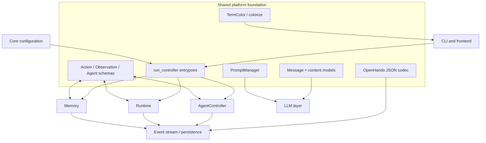
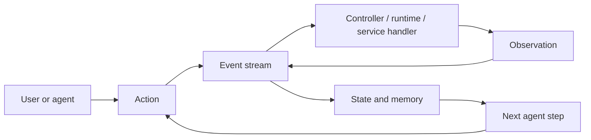
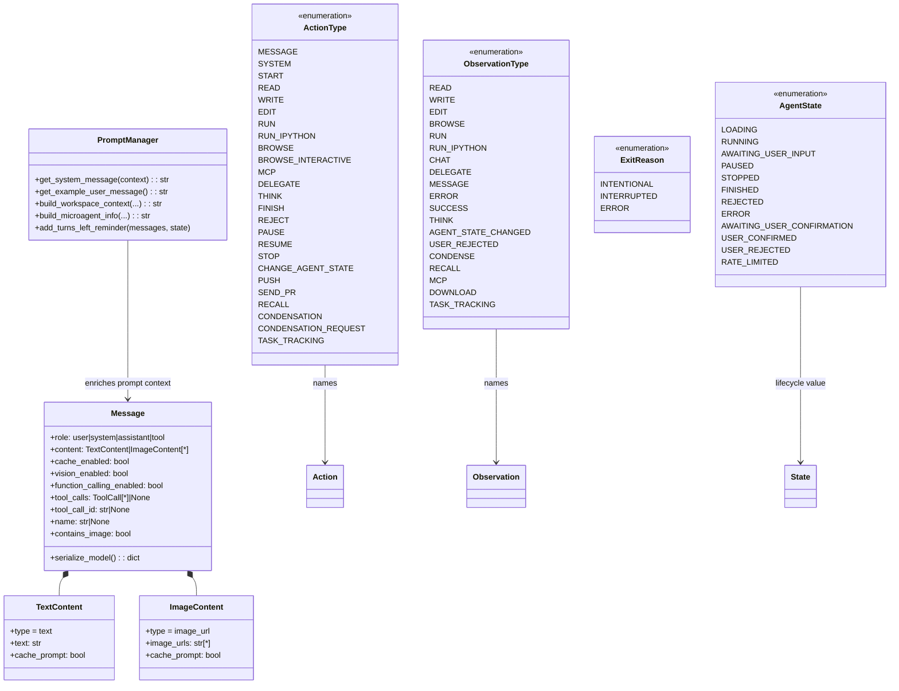
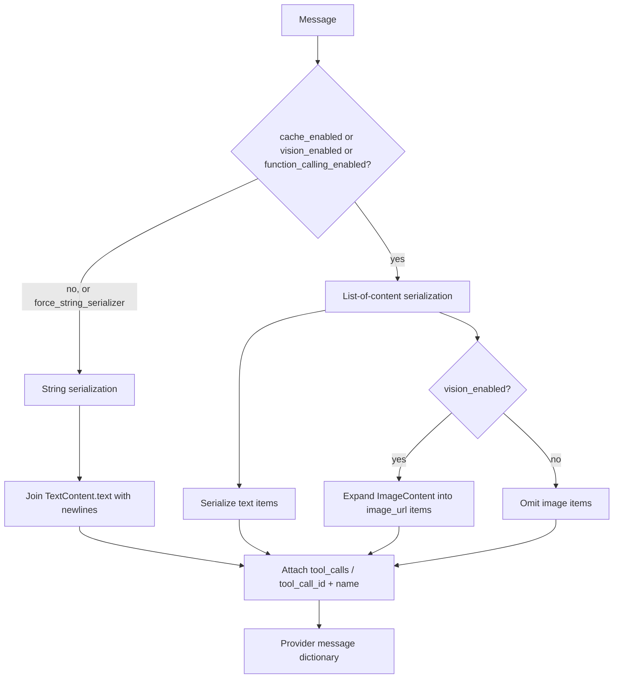
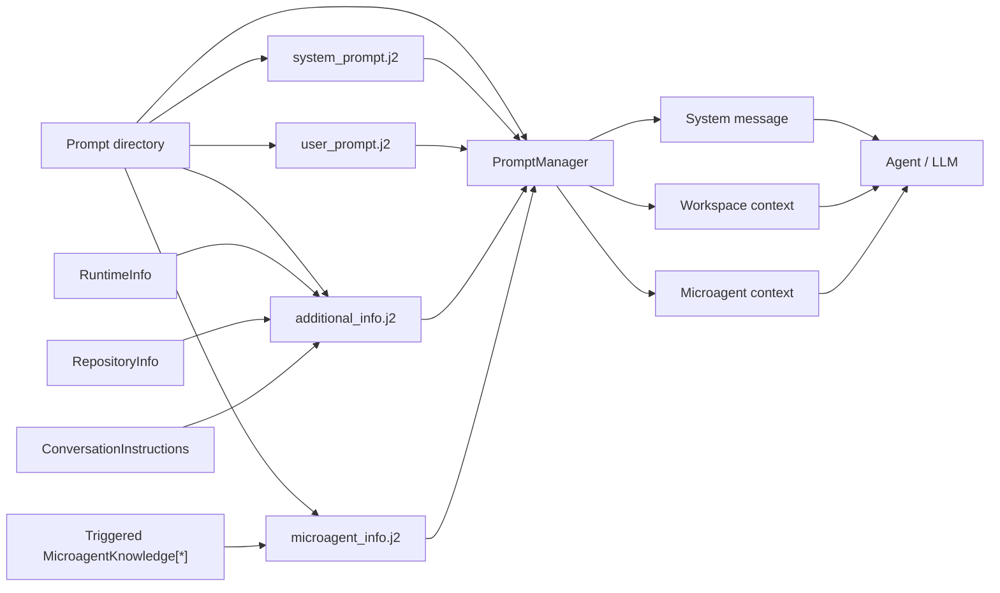
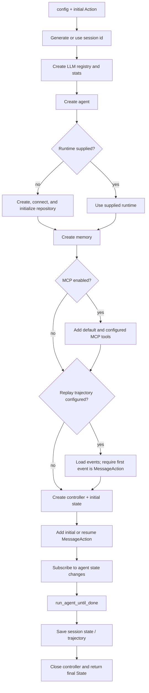
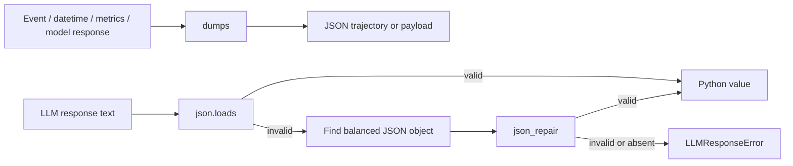

# Core Schema and Runtime Support

## Introduction

The `core_schema_and_runtime_support` module is the shared contract layer for OpenHands.
It defines the vocabulary exchanged between agents, controllers, runtimes, event
handlers, LLM clients, and user interfaces, and provides the small set of utilities
used to start a conversation, build prompts, serialize stateful objects, and render
terminal output.

The module is intentionally not an agent implementation, runtime implementation, or
event store. Its types are consumed by those subsystems. See [agent reasoning
core](agent_reasoning_core.md) for the decision loop, [sandboxed execution
layer](sandboxed_execution_layer.md) for action execution, the event-stream boundary
described in [agent reasoning core](agent_reasoning_core.md), and [core configuration](core_configuration.md) for validated
configuration models.

## Position in the system



The central design is a typed action/observation protocol:



An `Action` expresses an intended operation; an `Observation` reports content, a
result, or a state transition. The two enums deliberately overlap for operations such
as `read`, `write`, `run`, and `delegate`, while observations additionally represent
results and failures.

## Module contents

| Component | Responsibility | Main consumers |
| --- | --- | --- |
| `ActionType` | Canonical names for user, agent, control, execution, browser, MCP, and memory actions | Agents, controller, event/action classes, frontend |
| `ObservationType` | Canonical names for execution results, errors, state changes, recall, and condensation | Runtime, memory, controller, frontend |
| `AgentState` | Lifecycle and interaction states of an agent | Controller, sessions, UI |
| `ExitReason` | Coarse reason a controller/session exits | Controller and service lifecycle code |
| `ContentType`, `Content`, `TextContent`, `ImageContent`, `Message` | Provider-facing LLM message representation and serialization | Agents, memory, LLM clients |
| `run_controller`, `FakeUserResponseFunc` | Headless application bootstrap and controller lifecycle | CLI, automation, replay workflows |
| `OpenHandsJSONEncoder`, `dumps`, `loads` | JSON encoding for OpenHands and provider-specific objects; tolerant response parsing | Trajectory persistence, event serialization, LLM response handling |
| `PromptManager` and context dataclasses | Jinja prompt loading/rendering and runtime/workspace context assembly | Agents and memory |
| `TermColor`, `colorize` | Named terminal colors | CLI and diagnostics |

## Architecture and component relationships



### Schema contract

All enum classes inherit from `str, Enum` except `ExitReason`, which is a plain
`Enum`. The string-backed types can therefore be used naturally in serialized event
payloads and API discriminators. Their values are the wire-level identifiers; callers
should use the enum values rather than inventing new strings.

`ActionType` covers five broad categories:

- Conversation and control: `message`, `system`, `start`, `think`, `finish`, `reject`,
  `pause`, `resume`, `stop`, and `change_agent_state`.
- Workspace execution: `read`, `write`, `edit`, `run`, and `run_ipython`.
- External tools: `browse`, `browse_interactive`, and `call_tool_mcp`.
- Collaboration and integration: `delegate`, `push`, and `send_pr`.
- Context and task management: `recall`, `condensation`, `condensation_request`, and
  `task_tracking`.

`ObservationType` mirrors operations where useful and adds result-oriented values:
`success`, `error`, `null`, `user_rejected`, `agent_state_changed`, `condense`,
`recall`, `mcp`, and `download`. This lets downstream consumers render or route an
observation without inspecting the concrete observation class first.

`AgentState` is the lifecycle vocabulary used by the controller. The important
transitions are loading into running, running into awaiting user input or confirmation,
and then into paused, stopped, finished, rejected, error, or rate-limited states. The
schema does not itself enforce legal transitions; transition policy belongs to the
[agent controller](agent_controller.md) and session layer.

## LLM message model

`Message` is the provider-facing representation of one LLM message. It supports the
four provider roles (`user`, `system`, `assistant`, and `tool`), text and image content,
prompt caching, vision, and native tool calls.



`TextContent` serializes to `{type: "text", text: ...}` and optionally adds
`cache_control: {type: "ephemeral"}`. `ImageContent` expands every URL into its own
`image_url` content item; when caching is enabled, only the final image receives the
cache-control marker.

The default serializer chooses the list form when caching, vision, or function calling
is enabled. Otherwise it joins text items into a single string for providers that do
not accept a content list. `force_string_serializer` overrides that choice. Tool calls
are copied into the provider shape `{id, type: "function", function: {name,
arguments}}`; a tool response requires both `tool_call_id` and `name`.

This compatibility behavior is important at the [LLM layer](llm_layer.md): it allows
one internal message model to serve providers with different content and tool-calling
capabilities.

## Prompt management

`PromptManager` loads four Jinja templates from a configured directory:
`system_prompt.j2`, `user_prompt.j2`, `additional_info.j2`, and `microagent_info.j2`.
Missing templates are converted into a `FileNotFoundError` naming the expected path.



The context dataclasses keep prompt inputs explicit:

- `RuntimeInfo` carries the date, available hosts, additional instructions, secret
  descriptions, and working directory.
- `RepositoryInfo` carries repository, directory, and branch information.
- `ConversationInstructions` carries persistent task-specific instructions, such as
  resolver or Slack context.

`get_system_message` renders and then passes the result through the agent prompt
refinement hook. `build_workspace_context` combines repository, runtime, repository
instructions, and conversation instructions. `build_microagent_info` renders the
microagents triggered for the current context. `add_turns_left_reminder` mutates the
latest user text message by appending the remaining iteration count and the expected
`<finish></finish>` marker.

## Runtime bootstrap and controller lifecycle

`run_controller` is the headless/application entrypoint in `core/main.py`. It wires
together configuration, LLM registry, agent, runtime, memory, MCP tools, controller,
event subscription, optional replay, persistence, and trajectory output.



The event callback automatically responds when the agent enters
`AWAITING_USER_INPUT`. It uses `/exit`, reads interactive input, or calls the supplied
`FakeUserResponseFunc`. `auto_continue_response` is the default automation response:
it asks the agent to continue, never request human input, and finish when done.

The loop ends on `FINISHED`, `REJECTED`, `ERROR`, `PAUSED`, or `STOPPED`. If a file store
is configured, the final state is saved. If a trajectory path is configured, the
controller history is encoded as JSON, optionally including screenshots. Replay mode
requires a `NullAction` at entry and extracts the first `MessageAction` as the initial
task; a user-supplied task is rejected in that mode.

## JSON serialization and tolerant loading

`OpenHandsJSONEncoder` extends the standard encoder for objects common in OpenHands
trajectories and diagnostics:

| Object | Encoding |
| --- | --- |
| `datetime` | ISO-8601 string |
| `Event` | `event_to_dict(event)` |
| `Metrics` | `metrics.get()` |
| LiteLLM `ModelResponse` | `model_dump()` |
| `CmdOutputMetadata` | `model_dump()` |

`dumps` reuses a module-level encoder when no keyword arguments are provided and uses
`OpenHandsJSONEncoder` by default otherwise. `loads` first attempts normal JSON
decoding. When an LLM response is malformed, it scans for a balanced object, repairs
that object with `json_repair`, and retries. If no valid object can be recovered, it
raises `LLMResponseError`, which gives callers a domain-specific failure rather than a
raw JSON parsing exception.



## Terminal presentation

`TermColor` names the supported semantic colors: warning (yellow), success (green),
error (red), info (blue), and grey (dark grey). `colorize` delegates to `termcolor`
and accepts a `TermColor`, defaulting to warning. This is presentation-only and has no
effect on event values, state transitions, or persisted JSON.

## End-to-end interaction example

```mermaid
sequenceDiagram
    participant Client as CLI / service client
    participant Main as run_controller
    participant Controller as AgentController
    participant Agent as Agent
    participant LLM as LLM layer
    participant Stream as EventStream
    participant Runtime as Runtime
    participant Memory as Memory

    Client->>Main: initial MessageAction
    Main->>Main: create registry, agent, runtime, memory
    Main->>Stream: publish initial action
    Stream->>Memory: observe event / update context
    Stream->>Controller: observe event
    Controller->>Agent: step(State)
    Agent->>Memory: request relevant view
    Agent->>LLM: completion(Message[*])
    LLM-->>Agent: response / tool call
    Agent-->>Controller: Action
    Controller->>Stream: publish Action
    Stream->>Runtime: execute runtime action
    Runtime-->>Stream: Observation
    Stream-->>Controller: observation
    Controller->>Agent: next step or terminal state
    Main->>Main: save state / trajectory; close controller
    Main-->>Client: final State
```

The schema module participates in every arrow but owns only the contracts and support
operations: concrete event classes, controller policy, runtime behavior, memory
retrieval, and provider-specific execution remain in their respective modules.

## Extension and maintenance guidance

When adding a new operation, update the relevant `ActionType` and/or `ObservationType`
first, then add the concrete event/action/observation and its serializers and frontend
mapping. If the operation changes lifecycle behavior, update the controller state
handling and UI state mapping as well. For new LLM payload forms, prefer extending
`Content` subclasses or `Message` serialization so provider differences remain behind
one boundary. For new prompt context, add a typed dataclass or an explicit template
context field rather than embedding unstructured values in agent code.

Related implementation areas:

- [Agent reasoning core](agent_reasoning_core.md) — event-stream orchestration around these contracts.
- [Agent controller](agent_controller.md) — lifecycle transitions and action policy.
- [LLM clients](llm_layer_clients.md) — provider calls consuming `Message`.
- [Memory and condensers](memory_and_condensers.md) — history views and prompt context.
- [Sandboxed execution layer](sandboxed_execution_layer.md) — runtime handling of actions.
