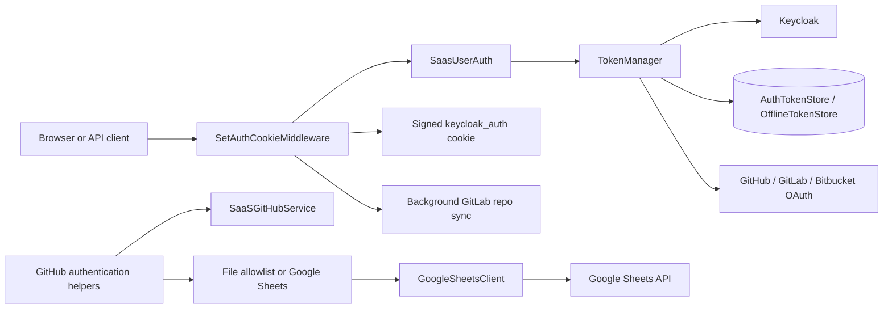
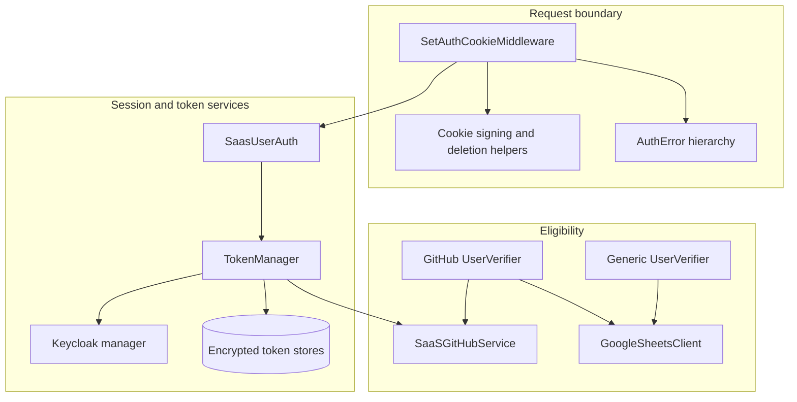
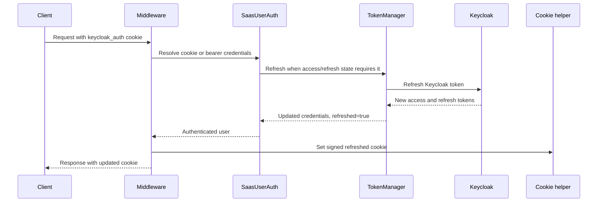
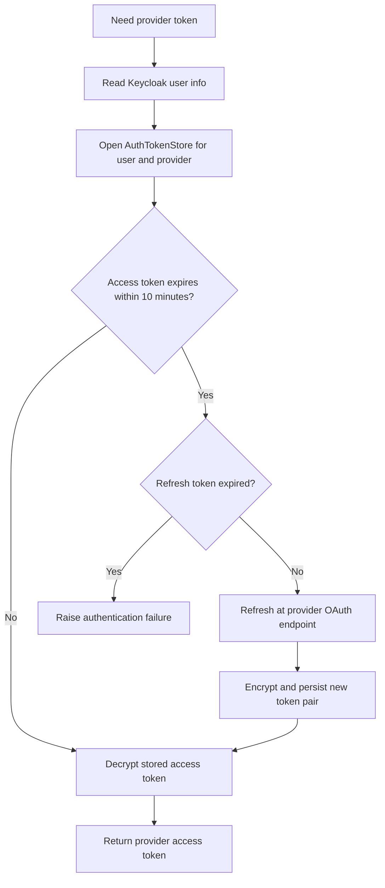
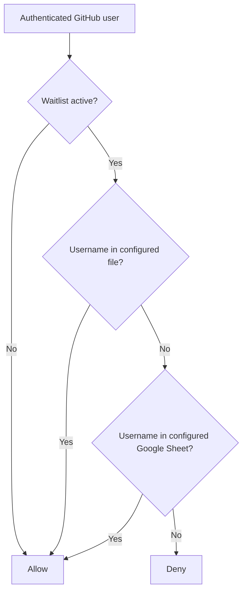

# Enterprise Authentication

## Purpose

The `enterprise_auth` module provides the hosted SaaS authentication boundary for OpenHands. It manages Keycloak sessions, OAuth credentials for connected identity providers, GitHub allowlisting, Google Sheets-backed user eligibility, secure authentication cookies, terms-of-service enforcement, and post-refresh integration work.

The module is used by the SaaS server and is consumed indirectly by API routes, session authentication, provider integrations, and middleware. It is not a standalone identity provider; Keycloak, external OAuth providers, persistent token stores, and the GitHub integration remain the systems of record.

## Architecture overview

### Component relationships

## Sub-modules

- [Token lifecycle](enterprise_auth_token_lifecycle.md) — `TokenManager`, encryption, Keycloak exchange/refresh, provider-token retrieval, offline tokens, and GitHub App installation tokens.
- [Allowlist verification](enterprise_auth_allowlist_verification.md) — file- and Google Sheets-backed eligibility checks, GitHub user authentication, and the 15-second Sheets cache.
- [Request authentication enforcement](enterprise_auth_request_enforcement.md) — request-path selection, credentials/TOS checks, cookie refresh, error responses, and GitLab synchronization.

## End-to-end flows

### Login/session refresh

### Provider-token lookup

### Allowlist evaluation

## Security and operational notes

- OAuth access and refresh tokens are encrypted with Fernet using a key derived from the configured JWT secret before persistence.
- The browser cookie is an HTTP-only, signed JWT containing Keycloak credentials and the TOS state. Production requests use the secure cookie flag; localhost is treated specially for development.
- Access-token refresh is intentionally proactive: a token is considered expired ten minutes before its provider-reported expiry.
- Keycloak connection failures are retried twice in the token manager; user-session refresh has its own retry policy in `SaasUserAuth`.
- The middleware excludes public/configuration and selected billing/auth callback paths from normal attachment checks, while MCP paths are protected.
- Invalid authentication errors remove the `keycloak_auth` cookie and attempt Keycloak logout.
- Waitlist configuration is read at verifier initialization. Changes to the file or environment generally require process reinitialization, whereas Google Sheets contents are re-read after the short cache expires.
- Provider refresh failures can invalidate stored provider credentials; callers may surface the failure as a general authentication error and require login again.

## Configuration inputs

| Input | Role |
|---|---|
| `GITHUB_USER_LIST_FILE` | Optional newline-delimited GitHub username allowlist |
| `GITHUB_USERS_SHEET_ID` | Optional Google Sheets allowlist source |
| `DISABLE_WAITLIST=true` | Disables the allowlist gate |
| JWT secret configuration | Derives token encryption and signs the auth cookie |
| Keycloak configuration | Selects internal/external Keycloak endpoints and realm |
| GitHub/GitLab/Bitbucket OAuth client credentials | Refreshes connected provider tokens |
| Google application default credentials | Authorizes read-only Sheets access |

## Related modules

- [Conversation service tier](conversation_service_tier.md) — owns server sessions and API request handling that consume authentication state.
- [Hosted SaaS overlay](hosted_saas_overlay.md) — contains the surrounding SaaS routes, configuration, integrations, and storage models.
- [Code host automation](code_host_automation.md) — consumes provider credentials and Git service abstractions.
- [User-facing clients](user_facing_clients.md) — sends browser/API credentials and receives authentication/error responses.

## Maintenance guidance

When changing authentication behavior, inspect the relevant sub-module first, then verify the contract with `SaasUserAuth`, cookie helpers, Keycloak manager functions, token-store implementations, and the affected provider service. In particular, preserve token encryption, refresh expiration semantics, cookie invalidation behavior, and the distinction between browser-cookie TOS enforcement and bearer/MCP requests.
