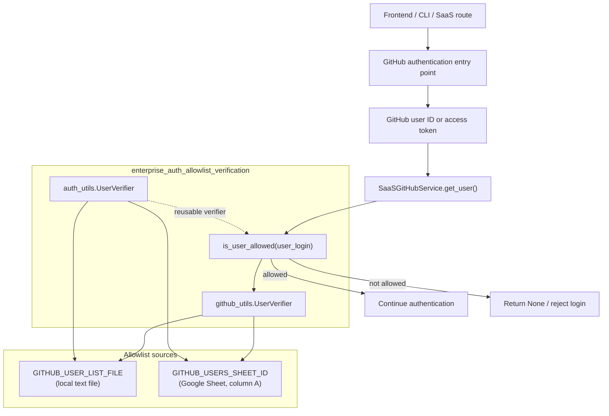
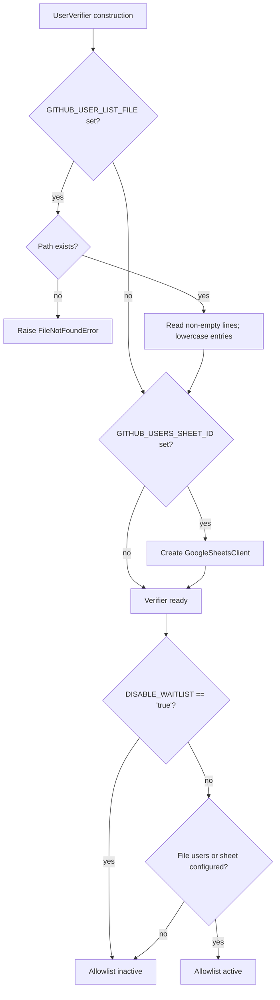
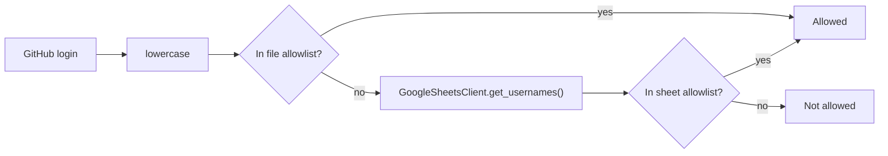
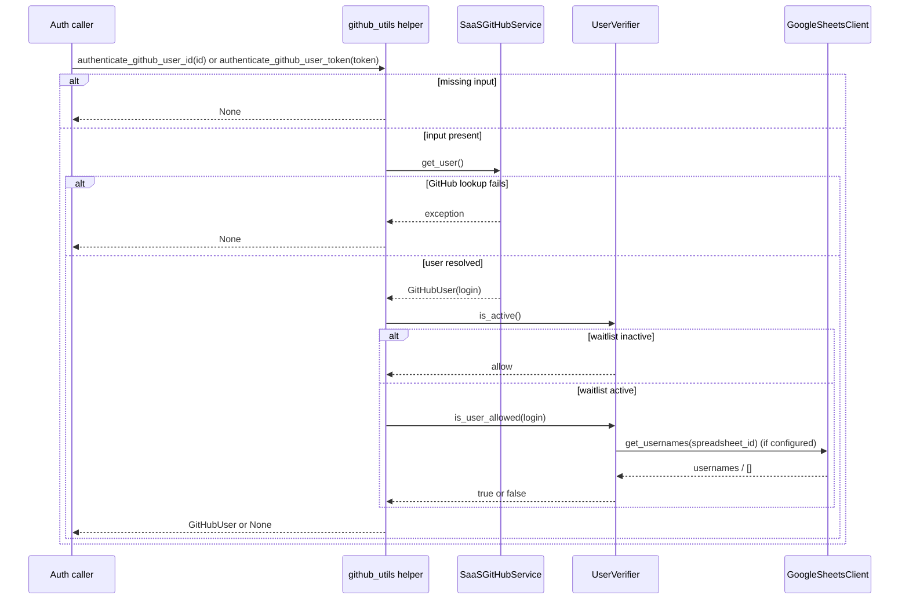
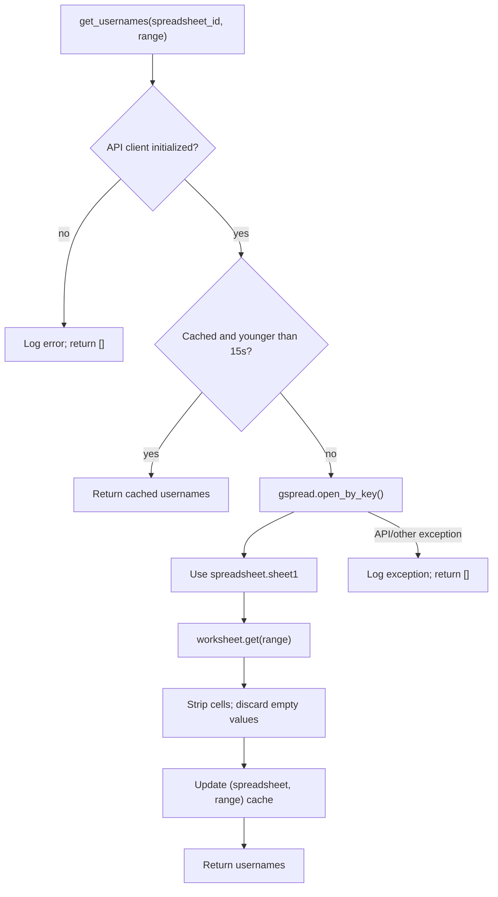
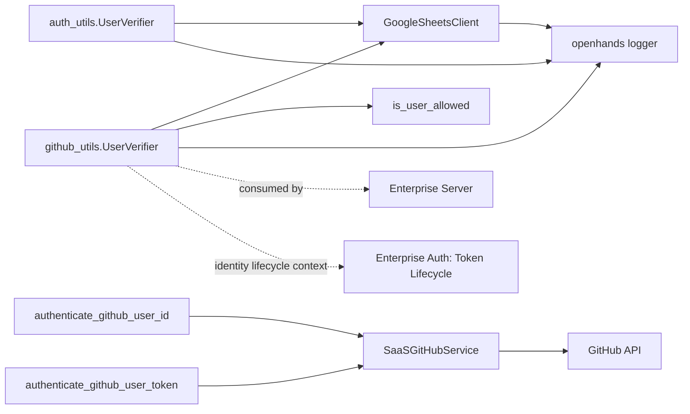

# Enterprise Auth: Allowlist Verification

The `enterprise_auth_allowlist_verification` module restricts GitHub-backed enterprise
access to an operator-managed set of usernames. The allowlist can be supplied by a
local text file, a Google Sheet, or both. Checks are case-insensitive and succeed when
the username appears in either source.

The module sits between GitHub identity acquisition and the rest of the hosted SaaS
authentication flow. Token exchange and token persistence are documented in
[Enterprise Auth: Token Lifecycle](enterprise_auth_token_lifecycle.md); request/cookie
enforcement is documented in [Enterprise Auth: Request Enforcement](enterprise_auth_request_enforcement.md).
The GitHub API service used for identity lookup belongs to
[Enterprise Integrations](enterprise_integrations.md), while shared logging belongs to
[Logging](logging.md).

## Position in the system

The module does not validate GitHub credentials itself. `github_utils` first asks
`SaaSGitHubService` to resolve a GitHub user, then applies the allowlist to the
returned `user.login`. This ordering ensures that a username is accepted only after
GitHub has validated the supplied identity or token.

## Components

| Component | Location | Responsibility |
| --- | --- | --- |
| `UserVerifier` | `enterprise/server/auth/auth_utils.py` | Loads configured allowlist sources and exposes `is_active()` and `is_user_allowed()`. |
| `UserVerifier` | `enterprise/server/auth/github_utils.py` | GitHub-authentication-local copy of the verifier, plus the module singleton used by the GitHub helpers. |
| `is_user_allowed()` | `github_utils.py` | Applies the active-waitlist policy to a resolved GitHub login. |
| `authenticate_github_user_id()` | `github_utils.py` | Resolves a GitHub user from an authenticated provider/user identifier and applies the gate. |
| `authenticate_github_user_token()` | `github_utils.py` | Resolves a GitHub user from an OAuth access token and applies the gate. |
| `GoogleSheetsClient` | `enterprise/server/auth/sheets_client.py` | Reads usernames from Google Sheets using application-default credentials and a 15-second in-memory cache. |

The two `UserVerifier` classes are separate definitions rather than a shared base
class. They currently have equivalent policy behavior, but changes must be kept in
sync unless the implementations are consolidated. Each module also creates a module-
level `user_verifier` at import time.

## Allowlist configuration and policy

### Environment variables

| Variable | Meaning | Effect |
| --- | --- | --- |
| `GITHUB_USER_LIST_FILE` | Path to a newline-delimited username file | The file is loaded once during `UserVerifier` construction. Blank lines are ignored and entries are lowercased. |
| `GITHUB_USERS_SHEET_ID` | Google Spreadsheet ID | Enables Google Sheets lookup through the first worksheet, default range `A:A`. |
| `DISABLE_WAITLIST` | Set to the case-insensitive value `true` to disable enforcement | `is_active()` returns `False`; the GitHub gate allows every successfully authenticated GitHub user. |

The waitlist is active only when enforcement is not disabled and at least one source
was initialized. If neither source is configured, the system is open from the
allowlist perspective. This does not bypass GitHub credential validation.

### Matching semantics

`is_user_allowed(username)` checks the file first. A match returns immediately. If the
file does not match, the verifier fetches the configured sheet usernames and compares
lowercased values. A match in either source is sufficient; a miss in both returns
`False`.

The file contents are a startup snapshot. Updating the file does not affect an already
constructed singleton until the process/module is restarted or a new verifier is
created. Google Sheet contents are fetched at check time, subject to the client cache,
so sheet changes normally become visible within 15 seconds per spreadsheet/range.

## GitHub authentication flows

### Authentication by provider/user identifier

`authenticate_github_user_id(auth_user_id)` rejects an empty identifier, constructs
`SaaSGitHubService(user_id=auth_user_id)`, and awaits `get_user()`. If the provider
returns a `GitHubUser`, its `login` is checked. An allowed user object is returned;
otherwise the function returns `None`.

### Authentication by access token

`authenticate_github_user_token(access_token)` rejects an empty token, wraps the token
in Pydantic `SecretStr`, and constructs `SaaSGitHubService(token=...)`. It follows the
same user lookup and allowlist decision as the identifier flow.

The broad exception handlers in both GitHub helper functions convert provider and
allowlist lookup failures into `None` and emit a warning. This gives callers a single
authentication-failure result, but it can make operational diagnosis dependent on
logs. The warning text currently indicates an invalid GitHub token even when another
failure caused the exception.

## Google Sheets client

`GoogleSheetsClient` uses `google.auth.default()` with the read-only Sheets scope and
passes the resulting credentials to `gspread.authorize()`. Application Default
Credentials support workload identity in GCP deployments. If credential or client
initialization fails, `client` remains `None`; subsequent reads return an empty list.

The cache key is `(spreadsheet_id, range_name)`. It is process-local and has no
explicit invalidation operation. API errors and unexpected exceptions are fail-closed
for an active allowlist in practice: `get_usernames()` returns `[]`, so a user who is
not present in the file allowlist will not be admitted through the sheet path.

## Dependency and interaction map

Important boundaries are:

- `SaaSGitHubService` owns GitHub API authentication and user retrieval; this module
  owns only the post-resolution allowlist decision.
- `GoogleSheetsClient` owns credentials, API access, normalization, and caching; the
  verifier owns source selection and policy.
- Authentication middleware and routes decide when these helpers are invoked. Their
  request-level behavior is documented in [Enterprise Auth: Request Enforcement](enterprise_auth_request_enforcement.md)
  and [Enterprise Server](enterprise_server.md).

## Operational and security considerations

- Treat `GITHUB_USER_LIST_FILE` as sensitive access-control configuration. File access
  and deployment volume permissions determine who can change admission policy.
- Grant the workload identity only read access to the configured spreadsheet and keep
  the spreadsheet ID in deployment configuration rather than source code.
- A missing file is a startup error, while a file read exception after existence was
  confirmed is logged and leaves the file source unset. Validate configuration during
  deployment so an unexpected empty source does not silently make the waitlist
  inactive.
- `DISABLE_WAITLIST=true` is a deliberate bypass. Protect the environment/configuration
  path that can set it and monitor its effective value.
- Usernames are logged during checks. Avoid enabling overly verbose logs in environments
  where GitHub identities are confidential.
- The sheet cache improves latency and limits API calls, but creates up to a 15-second
  propagation delay for allowlist removals. For immediate revocation, restart the
  process or add an explicit cache invalidation mechanism.
- The helper returns `None` for missing credentials, invalid GitHub responses, and
  allowlist rejection. Callers should preserve that distinction at the user-facing
  layer only if they have a safe way to avoid leaking authentication details.

## Extension guidance

To add another allowlist source, keep source loading and normalization inside a source
client or verifier helper, define its failure behavior explicitly, and preserve the
current OR semantics unless policy requirements change. If the two `UserVerifier`
implementations continue to evolve together, extracting a shared verifier would reduce
behavior drift; such a refactor should preserve the module-level singleton contracts.

When modifying GitHub authentication, test both helper entry points, empty inputs,
case-insensitive matches, inactive enforcement, file-only configuration, sheet-only
configuration, and provider/API failures. For sheet behavior, test cache hits,
expiration after 15 seconds, API errors, and an uninitialized Google client.
