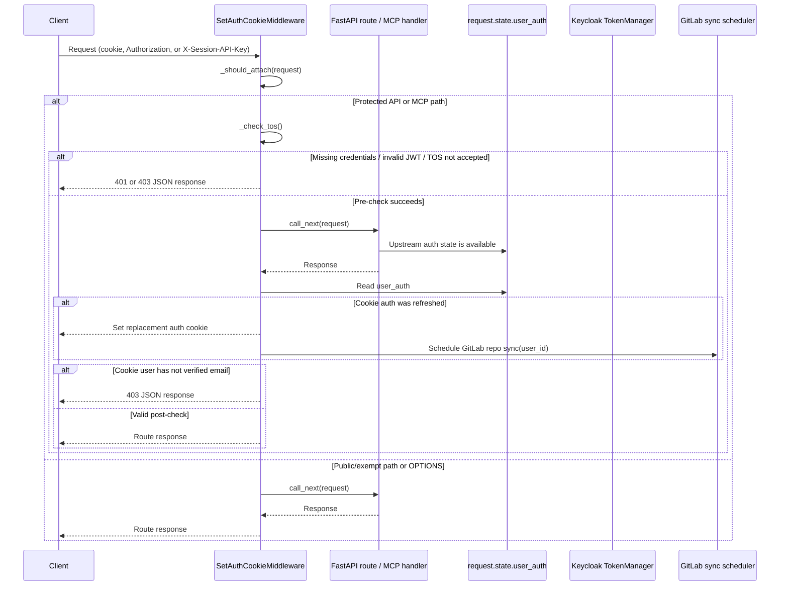
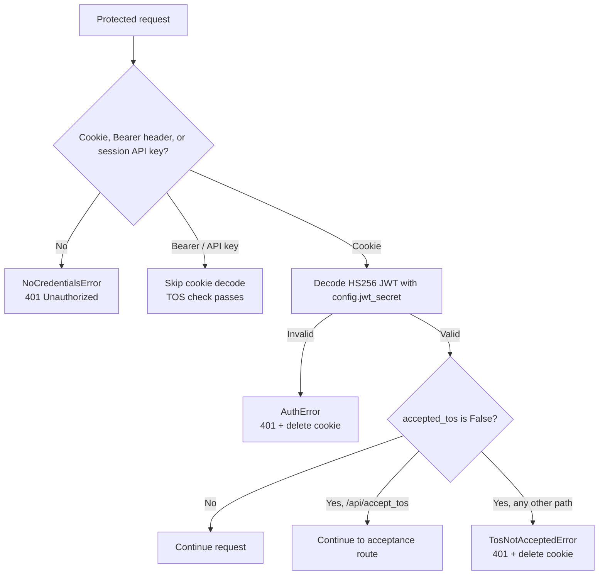
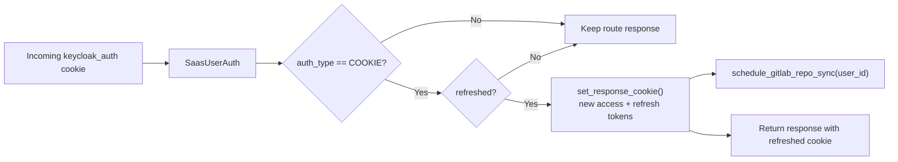
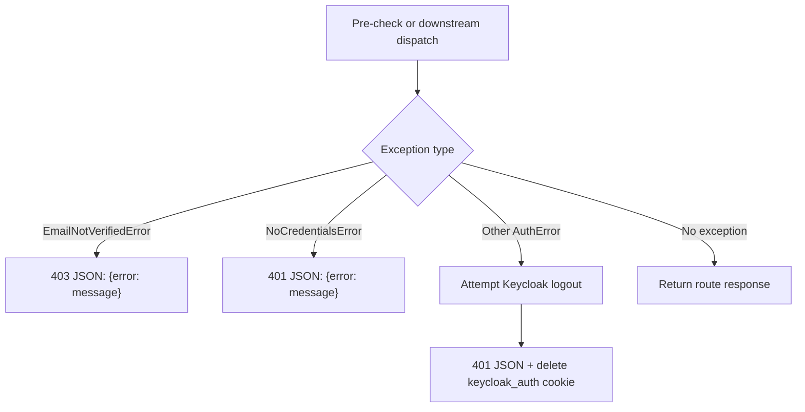
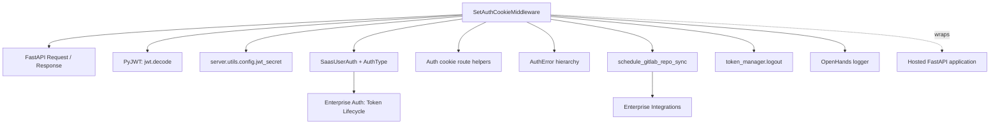

# Enterprise Auth: Request Enforcement

The `enterprise_auth_request_enforcement` module contains
`SetAuthCookieMiddleware`, an ASGI-compatible middleware for the hosted SaaS server.
It enforces authentication-related request policies at the API/MCP boundary, keeps
the browser's Keycloak cookie synchronized after token refresh, schedules GitLab
repository synchronization after re-authentication, and converts authentication
failures into consistent HTTP responses.

This middleware is the final request-facing part of the enterprise authentication
pipeline. Keycloak token exchange, validation, refresh, logout, and encrypted token
storage are described in [Enterprise Auth: Token Lifecycle](enterprise_auth_token_lifecycle.md).
GitHub allowlist decisions are described in
[Enterprise Auth: Allowlist Verification](enterprise_auth_allowlist_verification.md).
The general server middleware and authentication extension points are described in
[Server Core](server_core.md), while the surrounding hosted service is described in
[Enterprise Server](enterprise_server.md).

## Position in the system

```mermaid
flowchart LR
    Client["Browser / CLI / MCP client"] --> Request["HTTP request"]

    subgraph Boundary["enterprise_auth_request_enforcement"]
        Gate["SetAuthCookieMiddleware"]
        Tos["Credential + TOS checks"]
        Refresh["Cookie refresh"]
        Errors["Auth error responses"]
    end

    Request --> Gate
    Gate --> Tos
    Gate --> Route["FastAPI route / MCP handler"]
    Route --> Gate
    Gate --> Refresh
    Gate --> Errors
    Refresh --> Client
    Errors --> Client

    Gate -. request.state.user_auth .-> Auth["SaasUserAuth / get_user_auth"]
    Gate -. token logout .-> TM["TokenManager"]
    Gate -. background sync .-> GitLab["GitLab repository sync"]
    Gate -. cookie attributes .-> Cookie["Auth route cookie helpers"]
```

The middleware does not authenticate a user from scratch. An upstream authentication
component populates `request.state.user_auth`; this module consumes that state after
the route has run. It also performs a lightweight pre-route check for credentials and
the terms-of-service (TOS) claim.

## Component responsibilities

| Component | Location | Responsibility |
| --- | --- | --- |
| `SetAuthCookieMiddleware` | `enterprise/server/middleware.py` | Coordinates pre-request checks, downstream dispatch, refreshed-cookie attachment, email verification enforcement, and error translation. |
| `_should_attach()` | Same module | Identifies protected API and MCP paths and excludes public API endpoints and `OPTIONS`. |
| `_check_tos()` | Same module | Requires a cookie, bearer token, or session API key; validates the cookie JWT and enforces the `accepted_tos` claim. |
| `_get_user_auth()` | Same module | Reads the upstream `SaasUserAuth` object from `request.state.user_auth`. |
| `_logout()` | Same module | Logs the user out of Keycloak when an authentication error includes a refresh token. |
| `SaasUserAuth` | `server/auth/saas_user_auth.py` | Supplies authentication type, tokens, refresh state, TOS state, email-verification state, and user ID. |
| `token_manager` | `server/auth/saas_user_auth.py` / enterprise auth lifecycle | Performs Keycloak logout using a refresh token. |
| Cookie helpers | `server/routes/auth.py` | Determine cookie domain/same-site policy and set the replacement access/refresh cookies. |

`SetAuthCookieMiddleware` is deliberately narrow: it does not own identity lookup,
token refresh, provider allowlists, route authorization, or persistent session state.
Those concerns remain in the authentication and server modules linked above.

## Request lifecycle

For protected paths, the lifecycle has two distinct authentication stages. Before
dispatch, `_check_tos()` verifies that some credential is present and validates the
TOS marker when a Keycloak cookie is used. After dispatch, the middleware examines the
resolved `SaasUserAuth` state, refreshes the cookie if necessary, and applies the
email-verification rule.



The original presence of the `keycloak_auth` cookie is captured before dispatch. If
there was no such cookie, a later `user_auth.refreshed` state does not cause this
middleware to attach a cookie. Likewise, a non-cookie authentication type never gets
a browser cookie written.

## Protected-path policy

`_should_attach()` returns `False` for every `OPTIONS` request. For other methods it
returns `True` for all paths beginning with `/mcp` and for `/api` paths except the
explicit public or callback endpoints below:

| Excluded path | Reason implied by routing purpose |
| --- | --- |
| `/api/options/config` | Frontend/server option discovery |
| `/api/keycloak/callback` | Authentication callback |
| `/api/billing/success` | Billing redirect completion |
| `/api/billing/cancel` | Billing redirect cancellation |
| `/api/billing/customer-setup-success` | Billing setup redirect completion |
| `/api/billing/stripe-webhook` | Stripe-to-server webhook |

The method name reflects the original cookie concern, but the predicate governs both
credential/TOS checks and the later email-verification check. A new protected route
should therefore be reviewed against this list. A route outside `/api` and `/mcp` is
not protected by this middleware unless the path policy is extended.

## Credential and TOS enforcement

`_check_tos()` accepts any one of three credential signals:

* `keycloak_auth` request cookie;
* an `Authorization` header beginning with `Bearer `; or
* an `X-Session-API-Key` header.

The bearer token and session API key are presence checks in this middleware. Their
cryptographic or session validation is delegated to the upstream authentication flow.
When a cookie is present, the middleware decodes it with the configured
`config.jwt_secret` and the `HS256` algorithm. An invalid signature or any other JWT
decoding failure becomes `AuthError("Invalid authentication token")`.

The cookie's `accepted_tos` claim is enforced only when it is explicitly `False`.
That compatibility behavior distinguishes existing sessions with no claim (`None`)
from sessions that have actively declined the TOS. A user with `accepted_tos=False`
is rejected everywhere except `/api/accept_tos`, with `TosNotAcceptedError`. Requests
authenticated only by a bearer token or session API key set `accepted_tos=True` for
this check and therefore are not blocked by the cookie TOS gate.



## Cookie refresh and GitLab synchronization

After `call_next()` returns, the middleware refreshes the browser cookie only when all
of the following are true:

1. The incoming request had a `keycloak_auth` cookie.
2. `request.state.user_auth` exists and has `AuthType.COOKIE`.
3. `user_auth.refreshed` is true.

The replacement cookie receives the refreshed access token, refresh token, and
`accepted_tos` value. It is marked insecure only when the request hostname is exactly
`localhost`; all other hosts receive `secure=True`. Domain and SameSite attributes are
delegated to `get_cookie_domain()` and `get_cookie_samesite()`.

Immediately after setting the cookie, `schedule_gitlab_repo_sync(await
user_auth.get_user_id())` starts the GitLab synchronization work. This is a background
side effect of token re-authentication; it is not required for the route response to
be returned. The scheduler and GitLab integration behavior belong to the enterprise
integration/auth services and are not reimplemented here.



## Email-verification policy

For protected requests, after the route has run, an unverified cookie-authenticated
user is rejected unless the request is one of these paths:

* `/api/email...` (any path with this prefix);
* `/api/settings`;
* `/api/logout`; or
* `/api/authenticate`.

The exception list allows a user to verify/update email state, change settings, log
out, or complete authentication. The middleware raises `EmailNotVerifiedError`, then
returns status `403` and a JSON body containing the exception text or its class name.
The check is performed after downstream execution, so route side effects may already
have occurred before the response is replaced.

## Error handling and response contract



`NoCredentialsError` is logged at info level and produces `401 Unauthorized` without
special logout handling. `EmailNotVerifiedError` produces `403 Forbidden`. Other
`AuthError` instances are logged with exception information, trigger a best-effort
Keycloak logout, and produce `401 Unauthorized`. When the request carried a
`keycloak_auth` cookie, the error response deletes that cookie using the configured
domain and SameSite settings.

Logout failures are intentionally swallowed after debug logging so they do not hide
the original authentication failure. The same principle applies to errors raised by
the logout attempt itself.

## Dependencies and operational considerations



Important deployment assumptions are:

* `config.jwt_secret` must match the secret used to sign the `keycloak_auth` cookie.
* Cookie refresh depends on the upstream authentication layer setting
  `request.state.user_auth` and its `refreshed` flag correctly.
* `secure=False` is intentionally limited to `localhost`; local development using a
  different hostname may need cookie configuration changes elsewhere.
* The middleware logs the raw cookie value at debug level (`request_with_cookie`).
  Production logging configuration should ensure authentication cookies are not
  exposed in accessible logs.
* The middleware is state-light and performs no durable persistence, but refresh and
  GitLab synchronization introduce external-service dependencies on relevant requests.

## Extension guidance

When adding a protected endpoint, verify that its path is covered by `_should_attach()`
and that its authentication requirements are compatible with the cookie, bearer, and
session-key distinction. When adding a public callback or webhook, add an explicit
path exemption and review its trust boundary separately. Changes to TOS semantics
should account for the current `False`-only compatibility rule and the special
`/api/accept_tos` route. Changes to token refresh or logout should be made in
[Enterprise Auth: Token Lifecycle](enterprise_auth_token_lifecycle.md), keeping this
middleware focused on request orchestration and HTTP behavior.
