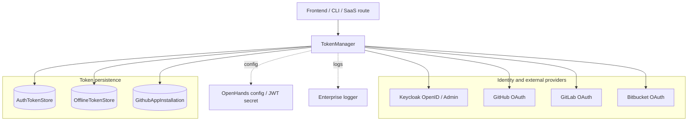
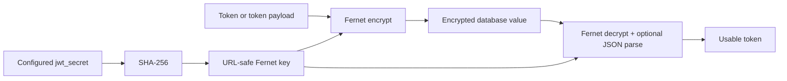
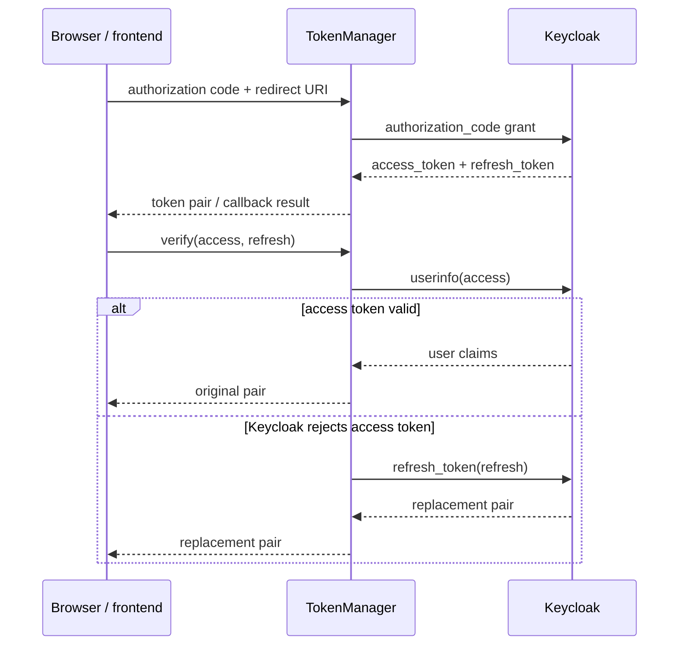
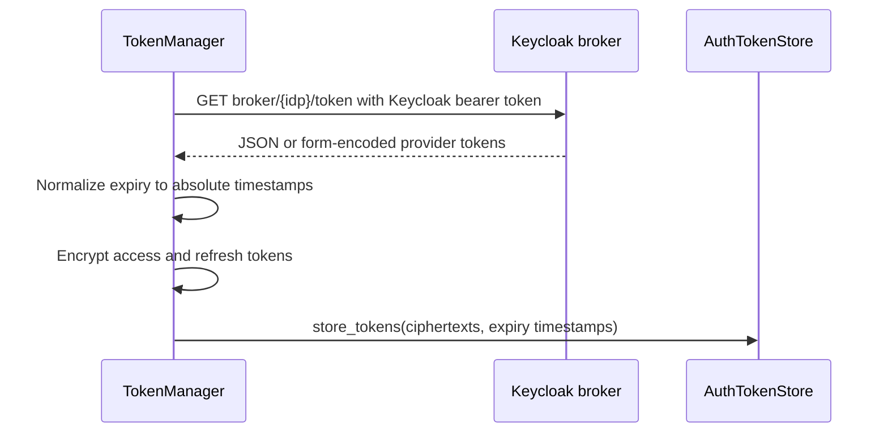
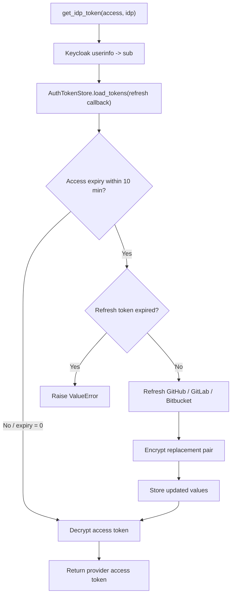
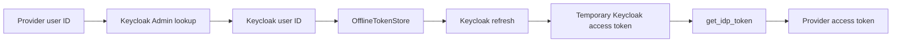
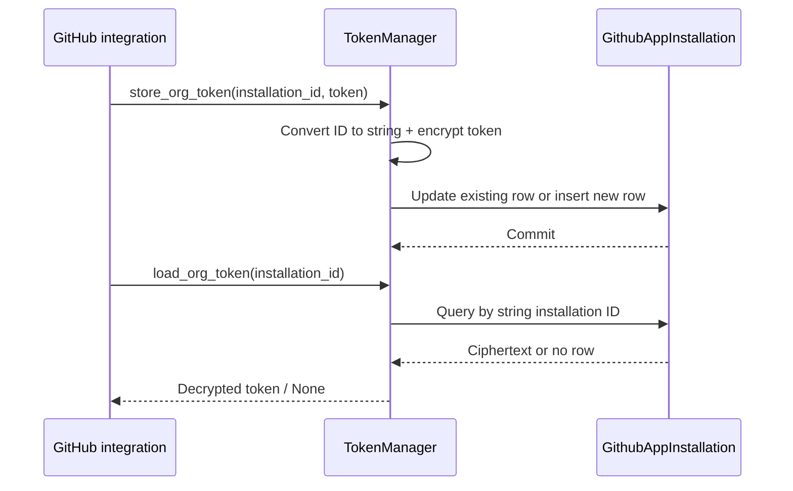

# Enterprise Auth: Token Lifecycle

The `enterprise_auth_token_lifecycle` module is the credential lifecycle service for
hosted OpenHands. `TokenManager` exchanges Keycloak authorization codes, validates and
refreshes Keycloak sessions, retrieves delegated GitHub/GitLab/Bitbucket credentials,
encrypts tokens before persistence, and supports offline-token and GitHub App
installation-token operations.

It is one part of the broader enterprise authentication boundary. Request identity and
allowlist checks are described in [Enterprise Auth Allowlist Verification](enterprise_auth_allowlist_verification.md)
and cookie/request enforcement in [Enterprise Auth Request Enforcement](enterprise_auth_request_enforcement.md).
The service is consumed by the hosted control plane described in
[Enterprise Server](enterprise_server.md), while client-facing authentication calls are
described in [Frontend API Services: Authentication](frontend_api_services_authentication.md).

## Position in the system

`TokenManager` is an orchestration and protection layer, not an identity database. It
delegates identity assertions and Keycloak sessions to Keycloak, provider-specific
refresh semantics to each provider OAuth endpoint, and durable storage to the token
stores. Provider managers and routes should request a usable token through this
service instead of reading encrypted values directly. Provider-facing behavior belongs
to [Enterprise Integrations](enterprise_integrations.md); persistence models belong to
[Enterprise Storage](enterprise_storage.md).

## Responsibilities and boundaries

| Capability | `TokenManager` behavior | External boundary |
| --- | --- | --- |
| Keycloak login | Exchanges an authorization code for access and refresh tokens. | Keycloak OpenID client |
| Keycloak session validation | Calls userinfo; on `KeycloakAuthenticationError`, refreshes the session. | Keycloak OpenID client |
| User lookup | Finds Keycloak users by provider ID or email and reads user attributes. | Keycloak Admin client |
| Delegated provider tokens | Reads provider tokens from Keycloak’s broker endpoint and normalizes expiry timestamps. | Keycloak broker endpoint |
| Provider token storage | Encrypts access/refresh tokens and stores them by Keycloak user and `ProviderType`. | `AuthTokenStore` |
| Provider token retrieval | Loads stored values, refreshes near-expiry access tokens, decrypts the result. | `AuthTokenStore` + provider OAuth APIs |
| Offline sessions | Encrypts an offline refresh token payload and validates/introspects it through Keycloak. | `OfflineTokenStore` + Keycloak |
| GitHub App credentials | Encrypts installation tokens in a relational model and loads them on demand. | `GithubAppInstallation` |
| Logout | Sends a refresh token to Keycloak logout. | Keycloak OpenID client |

The implementation supports `external=False` and `external=True`. The flag selects the
internal or external Keycloak client and broker base URL; it is carried by each
`TokenManager` instance and must match the realm/environment from which the token came.

## Component design

### `TokenManager`

The constructor loads the configured JWT secret and creates four closures from
`create_encryption_utility`: payload encrypt/decrypt and text encrypt/decrypt. The
secret is hashed with SHA-256 and converted to a Fernet key, so the same configured
secret deterministically establishes the encryption key for the process.

The class combines asynchronous network and token-store operations with two synchronous
GitHub App installation methods. Async methods are intended for request and background
handlers; `store_org_token()` and `load_org_token()` use `session_maker()` directly.

### Encryption utility

`create_encryption_utility(secret_key)` returns closure functions rather than a class.
Text values are encrypted with Fernet; dictionaries are JSON-serialized before
encryption and JSON-deserialized after decryption. Stored provider access and refresh
tokens are encrypted independently. Offline credentials are stored as an encrypted
payload containing `{"refresh_token": ...}`. GitHub App installation tokens are also
encrypted before being written.

Operationally, this means a database row does not contain a provider token in plaintext,
but availability of the configured JWT secret is required to read existing credentials.
Key rotation therefore needs a migration/re-encryption strategy outside this module.

## Token lifecycle

### Authorization-code exchange and Keycloak validation

`get_keycloak_tokens(code, redirect_uri)` calls Keycloak with the authorization-code
grant and returns `(access_token, refresh_token)`. Missing either field or any exception
produces `(None, None)` and is logged. `get_user_info()` calls the Keycloak userinfo
endpoint and returns an empty dictionary when passed a falsey access token.

`verify_keycloak_token()` first validates the access token through userinfo. A
`KeycloakAuthenticationError` triggers a refresh-token grant and returns the replacement
pair; other exceptions are not converted by this method.

### Importing and storing delegated provider tokens

`store_idp_tokens()` obtains a provider token pair from the Keycloak broker endpoint
`/realms/{realm}/broker/{idp}/token`, using the Keycloak access token as a bearer
credential. The response may be JSON or URL-encoded. The implementation accepts both,
normalizes `expires_in` and either `refresh_token_expires_in` or `refresh_expires_in`,
and converts relative durations into Unix expiration timestamps.

If the identity provider does not support the broker operation, the method treats the
empty response as “nothing to store.” Otherwise `_store_idp_tokens()` encrypts both
tokens and persists them under `(keycloak_user_id, identity_provider)` in
`AuthTokenStore`.

Keycloak connection failures are retried once by tenacity on methods decorated with
`retry(...)`. The retry callback logs the attempt number; authentication failures and
HTTP errors are not generally retried by these decorators.

### Provider token retrieval and refresh

`get_idp_token(access_token, idp)` first obtains the Keycloak subject (`sub`) and uses it
to locate the provider-specific `AuthTokenStore`. The store receives
`_check_expiration_and_refresh` as its loader callback. A valid stored access token is
decrypted and returned. The log only includes the first five characters of the token;
callers should still avoid logging returned values.

Access tokens are considered stale ten minutes before their recorded expiry. An expiry
of `0` means “no known expiry” and does not trigger refresh. If the access token is
stale and the refresh token is also expired, the operation fails with `ValueError`. If
refresh is possible, the refresh token is decrypted, the provider-specific endpoint is
called, the replacement pair is encrypted, and the store callback returns updated
values and timestamps.

Provider refresh contracts are implemented as follows:

| Provider | Endpoint | Request form |
| --- | --- | --- |
| GitHub | `https://github.com/login/oauth/access_token` | Client ID, client secret, refresh token, `grant_type=refresh_token`; response is parsed as form data. |
| GitLab | `https://gitlab.com/oauth/token` | Client ID, client secret, refresh token, `grant_type=refresh_token`; response is parsed as JSON. |
| Bitbucket | `https://bitbucket.org/site/oauth2/access_token` | Basic authentication using client credentials and a form-encoded refresh request; response is JSON. |

`_parse_refresh_response()` requires both new access and refresh tokens. Missing values,
non-success HTTP responses, unsupported provider types, or malformed responses fail the
operation rather than returning a partial credential.

## Offline-token and user-lookup flows

Offline tokens are Keycloak refresh credentials persisted through `OfflineTokenStore`.
`store_offline_token()` wraps the refresh token in an encrypted JSON payload. Loading
decrypts the payload and returns the embedded refresh token.

Validation calls Keycloak’s refresh-token operation. Activity checks call Keycloak
introspection and require an `active` result. Both methods return `False` for missing or
invalid credentials. `get_idp_token_from_offline_token()` exchanges the offline token
for a Keycloak access token and then follows the normal provider-token retrieval path.

The reverse lookup methods search Keycloak using provider-specific attributes or email.
They return the first matching user ID, or `None` when no user exists. The provider-ID
path then loads that user’s offline token; a missing offline token returns `None`.

## GitHub App installation tokens

`store_org_token(installation_id, installation_token)` converts the installation ID to
a string, finds an existing `GithubAppInstallation` row using SQLAlchemy `type_coerce`,
and updates or inserts the encrypted token. `load_org_token()` performs the same lookup,
returning the decrypted token or `None`.

This path is synchronous and uses the shared SQLAlchemy `session_maker`; callers should
avoid invoking it on an event loop when the database operation may block.

## Error handling and operational behavior

* Keycloak connection failures are retried up to two total attempts on the decorated
  lifecycle methods, with an informational log before the retry.
* Missing token fields are treated as explicit failures or empty results depending on
  the operation: login returns `(None, None)`, broker import returns no stored value,
  and refresh raises `ValueError`.
* Provider HTTP failures are raised after logging useful endpoint/status context. The
  implementation does not expose decrypted token values in these error messages.
* `refresh()` preserves Keycloak errors. When possible it decodes the refresh-token JWT
  without signature verification for diagnostics; a non-JWT value is logged separately.
  This diagnostic behavior should be reviewed carefully because refresh-token payloads
  can contain sensitive claims.
* `logout()` delegates to Keycloak and re-raises failures after logging.

## Security and maintenance considerations

The JWT secret is the encryption root for all credentials managed here. Protect it with
the same care as the database and rotate it only with a coordinated re-encryption plan.
Use HTTPS for Keycloak and provider calls, keep client secrets in configuration/secrets
management, and treat decrypted return values as secrets. Expiry timestamps are trusted
metadata supplied by provider responses; the ten-minute early-refresh window reduces
the chance of using a token that expires during a downstream request.

Authentication policy, user allowlists, and cookie placement are intentionally outside
this module. See [Enterprise Auth Allowlist Verification](enterprise_auth_allowlist_verification.md)
and [Enterprise Auth Request Enforcement](enterprise_auth_request_enforcement.md) for
those controls. Token consumers should use the established [Enterprise Integrations](enterprise_integrations.md)
and [Enterprise Routes](enterprise_routes.md) boundaries rather than coupling directly
to Keycloak or token-store schemas.
