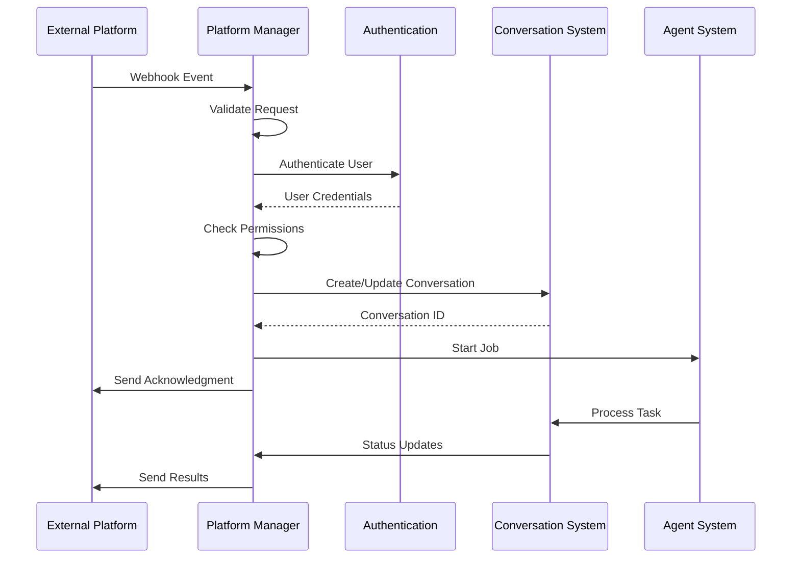

# Enterprise Integrations Module

## Overview

The Enterprise Integrations module provides comprehensive integration capabilities for OpenHands with various enterprise platforms including GitHub, GitLab, Jira, and Slack. This module enables seamless workflow automation, issue tracking, and collaborative development across multiple platforms through a unified interface.

## Architecture Overview

The module follows a manager-based architecture where each platform integration is handled by a dedicated manager class that implements common integration patterns while providing platform-specific functionality.

```mermaid
graph TB
    subgraph "Enterprise Integrations"
        EM[Enterprise Manager Layer]
        
        subgraph "Platform Managers"
            GM[GitHub Manager]
            GLM[GitLab Manager]
            JM[Jira Manager]
            SM[Slack Manager]
        end
        
        subgraph "Shared Components"
            MSG[Message Models]
            JR[Job Results]
            BASE[Base Manager]
        end
        
        subgraph "External Dependencies"
            TM[Token Manager]
            DC[Data Collector]
            CB[Callback Processors]
        end
    end
    
    subgraph "Core System Dependencies"
        AUTH[Authentication System]
        CONV[Conversation Management]
        AGENT[Agent System]
        STORAGE[Storage System]
    end
    
    GM --> BASE
    GLM --> BASE
    JM --> BASE
    SM --> BASE
    
    GM --> TM
    GLM --> TM
    JM --> TM
    SM --> TM
    
    GM --> DC
    GM --> CB
    GLM --> CB
    JM --> CB
    SM --> CB
    
    EM --> AUTH
    EM --> CONV
    EM --> AGENT
    EM --> STORAGE
    
    style EM fill:#e1f5fe
    style GM fill:#f3e5f5
    style GLM fill:#f3e5f5
    style JM fill:#f3e5f5
    style SM fill:#f3e5f5
```

## Core Components

### Platform Integration Managers

The module consists of four primary platform managers, each handling specific integration requirements:

#### 1. GitHub Manager (`enterprise.integrations.github.github_manager.GithubManager`)
- **Purpose**: Manages GitHub App integrations, webhook processing, and repository interactions
- **Key Features**:
  - GitHub App authentication and installation token management
  - Issue and PR comment processing
  - Automated reaction acknowledgments
  - Repository permission validation
  - Solvability analysis integration

#### 2. GitLab Manager (`enterprise.integrations.gitlab.gitlab_manager.GitlabManager`)
- **Purpose**: Handles GitLab webhook events and merge request interactions
- **Key Features**:
  - GitLab API integration
  - Issue and merge request comment handling
  - User permission validation
  - Project-based access control

#### 3. Jira Manager (`enterprise.integrations.jira.jira_manager.JiraManager`)
- **Purpose**: Processes Jira webhook events and manages issue tracking workflows
- **Key Features**:
  - Jira Cloud API integration
  - Issue comment and label-based triggers
  - Workspace-based authentication
  - Repository inference from issue descriptions

#### 4. Slack Manager (`enterprise.integrations.slack.slack_manager.SlackManager`)
- **Purpose**: Manages Slack bot interactions and conversation workflows
- **Key Features**:
  - Slack OAuth integration
  - Interactive repository selection forms
  - Thread-based conversation management
  - User authentication via JWT tokens

### Shared Models and Types

#### Job Result Model (`enterprise.integrations.models.JobResult`)
- **Purpose**: Standardizes job execution results across all platforms
- **Components**:
  - Result status and explanation
  - Platform-agnostic result representation

## Integration Flow

## Sub-modules

This module is organized into several focused sub-modules:

### [Platform Managers](platform_managers.md)
Detailed documentation of individual platform manager implementations, including:
- **GitHub Manager**: GitHub App integration, webhook processing, and repository interactions
- **GitLab Manager**: GitLab API integration and merge request workflows  
- **Jira Manager**: Jira Cloud integration and issue tracking workflows
- **Slack Manager**: Slack bot interactions and conversation management

### [Shared Infrastructure](shared_infrastructure.md)
Common components, models, and utilities shared across all platform integrations, including:
- **Job Result Models**: Standardized result representation across platforms
- **Message Handling**: Common message processing and routing patterns
- **Base Manager Functionality**: Shared integration patterns and utilities

## Dependencies

The Enterprise Integrations module relies on several core system components:

- **[Server and API](server_and_api.md)**: Authentication, session management, and conversation orchestration
- **[Storage System](storage_system.md)**: User data, secrets, and conversation persistence
- **[Core Agent System](core_agent_system.md)**: Agent execution and task processing
- **[Git Integrations](git_integrations.md)**: Repository access and version control operations

## Key Features

### 1. Unified Integration Interface
- Consistent manager-based architecture across all platforms
- Standardized message and job result models
- Common authentication and permission patterns

### 2. Webhook Processing
- Secure webhook validation and signature verification
- Event-driven job triggering based on platform-specific events
- Automatic user permission validation

### 3. Conversation Management
- Seamless integration with OpenHands conversation system
- Platform-specific callback processors for status updates
- Thread and context preservation across interactions

### 4. Authentication & Security
- OAuth integration for user authentication
- Token management and encryption
- Workspace and organization-level access control

### 5. Repository Intelligence
- Automatic repository inference from issue descriptions
- Interactive repository selection for ambiguous cases
- User repository access validation

## Configuration

Each platform manager requires specific configuration:

- **GitHub**: App ID, private key, and installation management
- **GitLab**: OAuth credentials and project access tokens
- **Jira**: Cloud ID, service account credentials, and webhook secrets
- **Slack**: Bot tokens, OAuth configuration, and workspace management

## Error Handling

The module implements comprehensive error handling:

- Authentication failures with user-friendly messages
- Permission validation with appropriate error responses
- Graceful degradation for missing configurations
- Detailed logging for debugging and monitoring

## Future Enhancements

The module is designed for extensibility:

- Additional platform integrations (Linear, Azure DevOps, etc.)
- Enhanced repository intelligence and matching
- Advanced workflow automation capabilities
- Improved analytics and reporting features