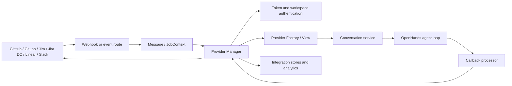
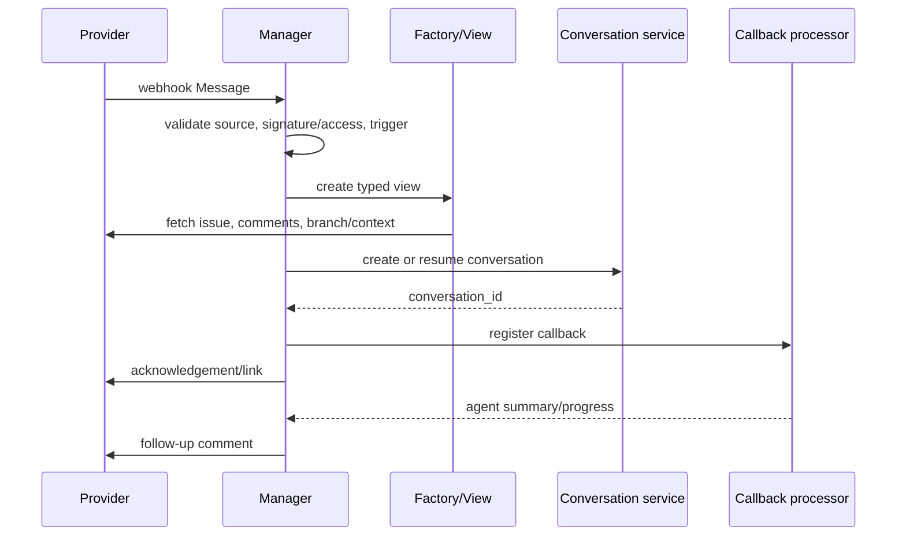
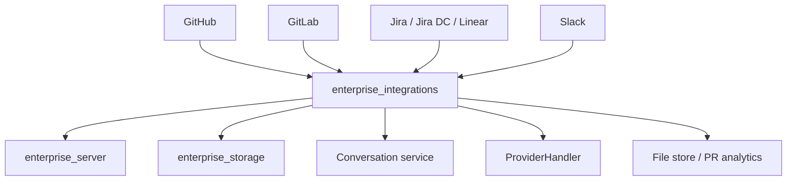

# Enterprise integrations

`enterprise/integrations` connects OpenHands Cloud conversations to external work-tracking and collaboration systems. It receives provider webhooks, authenticates the actor, decides whether an event is actionable, builds a provider-specific view, starts or resumes an OpenHands conversation, and sends an acknowledgement or error back through the provider API.

## Architecture overview

```mermaid
flowchart LR
    EXT[GitHub / GitLab / Jira / Jira DC / Linear / Slack] --> WH[Webhook or event route]
    WH --> MSG[Message / JobContext]
    MSG --> M[Provider Manager]
    M --> AUTH[Token and workspace authentication]
    M --> F[Provider Factory / View]
    F --> CONV[Conversation service]
    CONV --> AGENT[OpenHands agent loop]
    AGENT --> CB[Callback processor]
    CB --> M
    M --> EXT
    M --> DATA[Integration stores and analytics]
```

Managers are the orchestration boundary. Factories classify payloads and create typed views; views load provider context, render Jinja instructions, and create or update conversations. Provider services encapsulate token refresh, repository access, comments, webhooks, and provider-specific API calls. Callback processors (outside this module) return progress and summaries to the originating system.

## Shared contracts and lifecycle

`Message.source` identifies the provider and `Message.message` contains the raw payload or outgoing text. `JobContext` normalizes issue identity, actor, workspace, and issue content for Jira-family and Linear flows. GitHub and GitLab use `ResolverViewInterface` implementations carrying repository, issue/MR, installation, and conversation metadata.

```mermaid
sequenceDiagram
    participant P as Provider
    participant M as Manager
    participant V as Factory/View
    participant C as Conversation service
    participant S as Callback processor
    P->>M: webhook Message
    M->>M: validate source, signature/access, trigger
    M->>V: create typed view
    V->>P: fetch issue, comments, branch/context
    M->>C: create or resume conversation
    C-->>M: conversation_id
    M->>S: register callback
    M->>P: acknowledgement/link
    S-->>M: agent summary/progress
    M->>P: follow-up comment
```

## Submodules

- [GitHub integration](enterprise_integrations_github.md): resolver triggers, PR workflow monitoring, token-aware GitHub service, and interaction collection.
- [GitLab integration](enterprise_integrations_gitlab.md): issue/MR note triggers, access checks, repository persistence, and webhook management.
- [Jira Cloud integration](enterprise_integrations_jira.md): signed webhooks, workspace/user authentication, repository inference, and conversation mapping.
- [Jira Data Center integration](enterprise_integrations_jira_dc.md): the Jira DC variant using its own workspace stores and REST authentication.
- [Linear integration](enterprise_integrations_linear.md): signed GraphQL webhooks, issue enrichment, and conversation lifecycle.
- [Slack integration](enterprise_integrations_slack.md): Slack identity correlation, OAuth fallback, repository selection, and threaded follow-ups.
- [Bitbucket service](enterprise_integrations_bitbucket.md): SaaS token resolution layered over the shared Bitbucket client.
- [Shared models and types](enterprise_integrations_shared.md): normalized messages, job contexts, resolver views, resource/status enums, and workflow records.

## System relationships

The module depends on `enterprise_server` for token/authentication and callback infrastructure, `enterprise_storage` for provider users, workspaces, conversations, webhooks, and PR records, and the shared conversation service for agent execution. It delegates repository access to `ProviderHandler`, which in turn uses the provider services described here.

```mermaid
graph TD
    EI[enterprise_integrations] --> ES[enterprise_server]
    EI --> ST[enterprise_storage]
    EI --> CS[Conversation service]
    EI --> PH[ProviderHandler]
    GH[GitHub] --> EI
    GL[GitLab] --> EI
    JT[Jira / Jira DC / Linear] --> EI
    SL[Slack] --> EI
    EI --> FS[File store / PR analytics]
```

## Operational considerations

- Provider secrets are resolved through `TokenManager`, workspace records, or SaaS user authentication; callers should not persist raw access tokens in payloads.
- Webhook handlers reject inactive or unknown workspaces and suppress service-account recursion where applicable.
- Repository selection is inferred from issue/message text when possible; otherwise the integration asks the user to select or identify a repository.
- Most provider API failures are logged and converted into a user-facing error comment. Background repository/analytics writes are intentionally non-blocking in GitHub and GitLab services.
