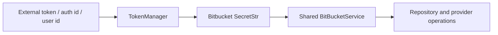

# Bitbucket service

`SaaSBitBucketService` is the SaaS token-aware layer over the shared `BitBucketService`. It accepts a direct external auth token, an external identity, or an OpenHands user ID and resolves the latest Bitbucket token through `TokenManager`.

Unlike GitHub and GitLab, the supplied enterprise component adds no webhook manager or view factory. Its responsibility is credential selection and inheritance of the common Bitbucket API behavior.
