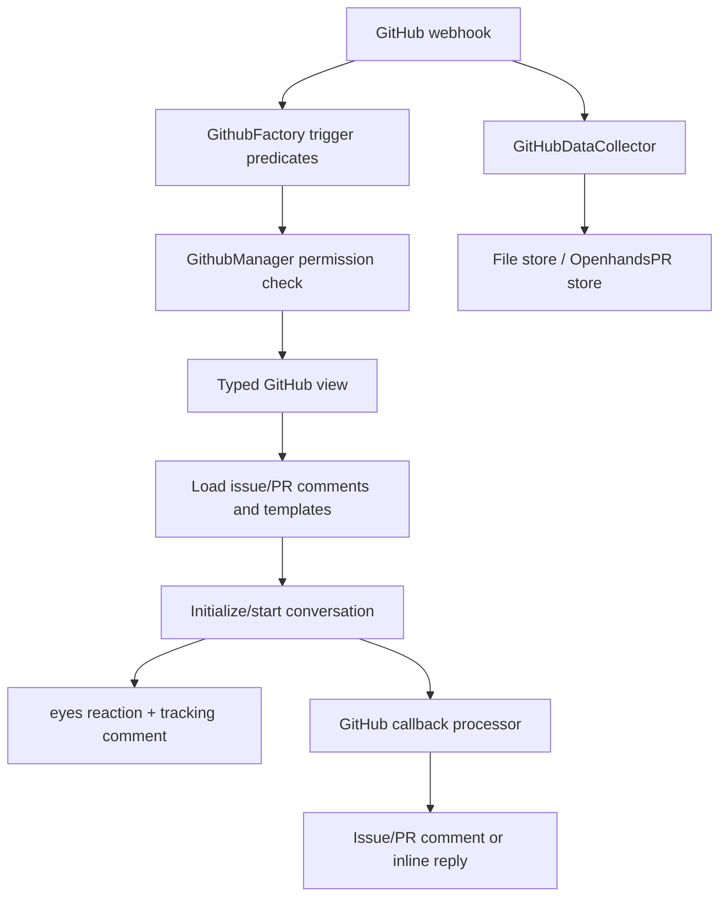

# GitHub integration

The GitHub integration turns labels, issue comments, PR comments, inline review comments, and selected failed workflow events into OpenHands resolver conversations.

## Components

- `GithubManager`: validates GitHub messages, checks write permission, obtains installation/user tokens, acknowledges requests, starts conversations, and posts replies.
- `GithubFactory`: recognizes payload shapes and creates `GithubIssue`, `GithubIssueComment`, `GithubPRComment`, or `GithubInlinePRComment` views.
- `GithubFailingAction`: aggregates workflow failures/merge conflicts and posts an actionable PR comment; proactive starters are gated by a feature flag and per-user setting.
- `SaaSGitHubService`: resolves the latest GitHub token and extends the shared client with PR patches, repository node IDs, and background repository persistence.
- `GitHubDataCollector`: optionally stores issue/PR snapshots and closed/merged PR analytics, including OpenHands activity counts.
- `WorkflowRunStatus`, `WorkflowRun`, and `WorkflowRunGroup`: typed workflow state used by proactive failure handling.

## Trigger and safety behavior

Issue labels use the configured OpenHands label; issue and PR comments require an exact OpenHands mention. Inline comments preserve file and line location. Events from users without `admin` or `write` repository permission are rejected. System-generated suggestion comments are excluded to prevent recursive jobs.

For a new job, the manager obtains the user’s GitHub identity token, initializes resolver metadata, optionally calculates an issue solvability summary, renders resolver templates, registers a callback, and posts a conversation link. Installation tokens are cached in `TokenManager` for subsequent replies.

## Data collection

Collection is controlled by `COLLECT_GITHUB_INTERACTIONS`. The collector uses REST for basic data and GraphQL pagination for commits, PR comments, reviews, and repository metadata. It records merge status and counts commits/comments authored by OpenHands. Installation-token failures or GraphQL errors are logged and do not start retry loops inside the collector.
