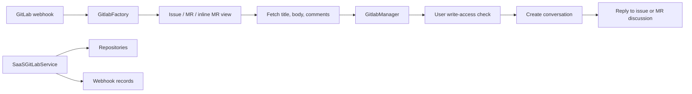

# GitLab integration

GitLab support handles issue labels, issue notes, merge-request notes, and inline merge-request discussions. `GitlabManager` performs source validation, write-access checks, conversation startup, callback registration, and replies through `SaaSGitLabService`.

`GitlabFactory` distinguishes normal notes from confidential notes and uses `change_position` to distinguish inline MR comments. Views render issue/MR templates and preserve branch, discussion, file, and line context. The manager supplies the user’s GitLab token as a provider secret and sends a tracking link after conversation creation.

`SaaSGitLabService` refreshes tokens, lists up to 1,000 membership repositories, identifies personally owned projects, and optionally stores repositories and webhook-registration candidates in the database. It exposes resource existence, existing-hook, admin-access, installation, and write-access checks. Rate limits are represented as `WebhookStatus.RATE_LIMITED`; other failures return invalid status and are logged.
