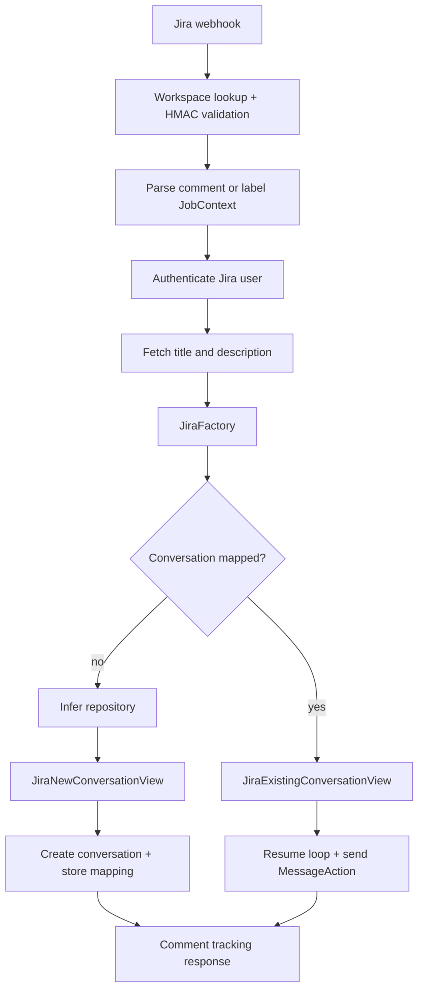

# Jira Cloud integration

Jira Cloud uses signed webhooks to trigger work from `@openhands` comments or the `openhands` label. `JiraManager` authenticates the workspace and user, loads issue details with a service account, infers a repository, and creates or resumes a Jira conversation.

Webhook signatures are SHA-256 HMACs over the request body using the decrypted workspace secret. Inactive/unknown workspaces and service-account events are rejected. New conversations require an inferred repository; ambiguous inference causes a repository-selection comment. Existing conversations reuse stored issue-to-conversation mappings.
