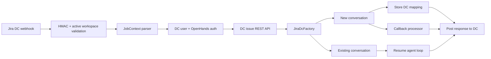

# Jira Data Center integration

Jira Data Center mirrors the Jira Cloud lifecycle while using `JiraDcIntegrationStore`, DC user/workspace records, DC conversation mappings, and the instance REST API.

`JiraDcManager` validates the `x-hub-signature` HMAC, parses comment/label webhooks, authenticates by DC user key or email fallback, retrieves issue details with a bearer service-account key, infers a repository, and posts comments to the instance-specific `/rest/api/2` endpoint. `JiraDcFactory` selects new or existing conversation views and preserves the base API URL for all responses.

The implementation intentionally keeps the Cloud and DC paths separate so workspace identity, authentication fields (`user_key` versus account ID), API URLs, and storage mappings cannot be mixed.
