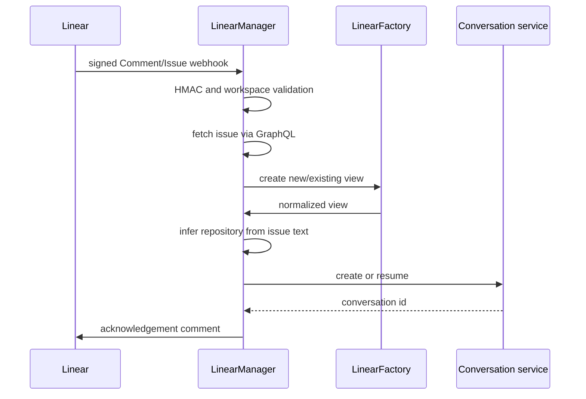

# Linear integration

Linear integration consumes signed GraphQL webhook events for `@openhands` comments and newly added `openhands` labels. `LinearManager` resolves the workspace from the actor URL, authenticates the Linear user, enriches the issue, infers a Git repository, and creates or resumes a conversation.

`LinearManager` uses the service-account API key for issue queries and comments, while the user’s OpenHands authentication supplies provider tokens for repository discovery. Synced GitHub owner/repository metadata is appended to the issue description when available. Ambiguous repository inference produces a selection request. Conversation mappings are stored through `LinearIntegrationStore`.
