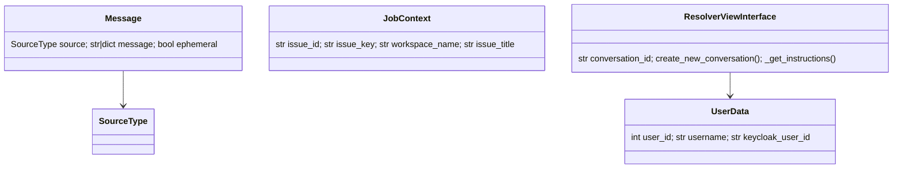

# Shared integration models and types

`models.py` and `types.py` define the contracts used across provider managers and views.

| Type | Role |
|---|---|
| `SourceType` | Supported event sources: GitHub, GitLab, OpenHands, Slack, Jira, Jira DC, and Linear. |
| `Message` | Normalized inbound/outbound envelope with source, text or payload, and ephemeral flag. |
| `JobContext` | Common issue/workspace/actor data for Jira-family and Linear workflows. |
| `UserData` | Provider user ID, username, and mapped Keycloak ID. |
| `ResolverViewInterface` | Shared resolver view metadata and conversation/template operations for GitHub/GitLab-style integrations. |
| `GitLabResourceType` | Group, subgroup, or project used by webhook management. |
| `PRStatus` | Closed or merged PR analytics state. |
| `WorkflowRunStatus` | GitHub workflow completed, pending, or failed state. |
| `GithubResolverJob` / `JobResult` | Result-oriented records for resolver job tracking. |

These contracts allow provider managers to share conversation and callback infrastructure while retaining provider-specific payload parsing, authentication, API semantics, and response formatting.
