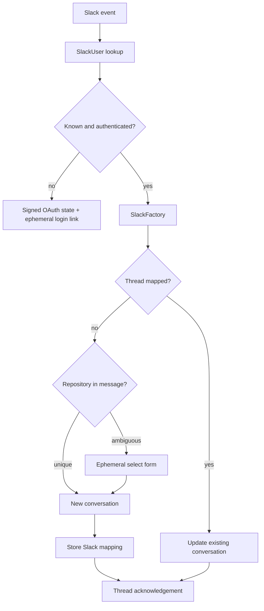

# Slack integration

Slack support starts conversations from bot mentions and continues them in threads. It correlates Slack users to OpenHands users, offers OAuth login for unknown users, infers repositories from text, and uses interactive repository selection when inference is ambiguous.

`SlackManager` posts ephemeral responses for login and repository selection, and normal messages in the originating thread. `SlackNewConversationView` fetches up to `CONTEXT_LIMIT` prior messages, strips the bot mention, and converts history into conversation instructions. `SlackUpdateExistingConversationView` verifies that the Slack user owns the mapped conversation, checks that it still exists, resumes the agent loop, and sends a new `MessageAction`.
